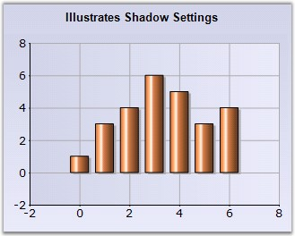

::: {style="DISPLAY: none"}
{#d2h_url_template}{#d2h_package_url style="WIDTH: 0px; DISPLAY: none; HEIGHT: 0px"}
:::

:::: {.d2h_secondary_topic style="PADDING-BOTTOM: 10pt; MARGIN: 0pt; PADDING-LEFT: 0pt; PADDING-RIGHT: 0pt; PADDING-TOP: 0pt"}
#### DisplayShadow {#displayshadow style="tab-stops: 0pt"}

 

Specifies if shadow should be displayed for the series.

 

::: {align="center"}
+-------------------------------------+-----------------------------------------------------------------------------------------------------------------------------------------------------------------------------------------------------------------------------------------------------------------------------------------------------------------------------------------------------------------------------------------------------+
|                                                                                                                                                                                                                                                                                                                                                                                                                                           |
|                                                                                                                                                                                                                                                                                                                                                                                                                                           |
| Details                                                                                                                                                                                                                                                                                                                                                                                                                                   |
+-------------------------------------+-----------------------------------------------------------------------------------------------------------------------------------------------------------------------------------------------------------------------------------------------------------------------------------------------------------------------------------------------------------------------------------------------------+
|                                     |                                                                                                                                                                                                                                                                                                                                                                                                     |
|                                     |                                                                                                                                                                                                                                                                                                                                                                                                     |
| **Possible Values**                 | True, False                                                                                                                                                                                                                                                                                                                                                                                         |
+-------------------------------------+-----------------------------------------------------------------------------------------------------------------------------------------------------------------------------------------------------------------------------------------------------------------------------------------------------------------------------------------------------------------------------------------------------+
|                                     |                                                                                                                                                                                                                                                                                                                                                                                                     |
|                                     |                                                                                                                                                                                                                                                                                                                                                                                                     |
| **Default Value    **               | **False**                                                                                                                                                                                                                                                                                                                                                                                           |
+-------------------------------------+-----------------------------------------------------------------------------------------------------------------------------------------------------------------------------------------------------------------------------------------------------------------------------------------------------------------------------------------------------------------------------------------------------+
|                                     |                                                                                                                                                                                                                                                                                                                                                                                                     |
|                                     |                                                                                                                                                                                                                                                                                                                                                                                                     |
| **2D / 3D Limitations**             | Only 2D                                                                                                                                                                                                                                                                                                                                                                                             |
+-------------------------------------+-----------------------------------------------------------------------------------------------------------------------------------------------------------------------------------------------------------------------------------------------------------------------------------------------------------------------------------------------------------------------------------------------------+
|                                     |                                                                                                                                                                                                                                                                                                                                                                                                     |
|                                     |                                                                                                                                                                                                                                                                                                                                                                                                     |
| **Applies to Chart Element**        | All series and points                                                                                                                                                                                                                                                                                                                                                                               |
+-------------------------------------+-----------------------------------------------------------------------------------------------------------------------------------------------------------------------------------------------------------------------------------------------------------------------------------------------------------------------------------------------------------------------------------------------------+
|                                     |                                                                                                                                                                                                                                                                                                                                                                                                     |
|                                     |                                                                                                                                                                                                                                                                                                                                                                                                     |
| **Applies to Chart Types**          | Area Chart, Bar Chart, Bubble Chart, Column Chart, Stacking Column Chart, Stacking Column100 Chart, Line Chart, Spline Chart, Rotated Spline chart, Stepline Chart, Candle Chart, Kagi Chart, Point and Figure Chart, Renko Chart, Threeline Break Charts, Gantt Chart, Histogram chart, Tornado Chart, Combination Chart, Box and Whisker Chart, Pie Chart, Polar And Radar Chart, Step Area Chart |
+-------------------------------------+-----------------------------------------------------------------------------------------------------------------------------------------------------------------------------------------------------------------------------------------------------------------------------------------------------------------------------------------------------------------------------------------------------+
:::

 

Here is some sample code.

 

Series Wide Setting

 

+----------------------------------------------------------------------------------------------------------------------------------------------------------------------------+
| **[\[C#\]]{style="FONT-FAMILY: 'Courier New'; COLOR: black"}**                                                                                                             |
|                                                                                                                                                                            |
| **[]{style="FONT-FAMILY: 'Courier New'; COLOR: black"}**                                                                                                                   |
|                                                                                                                                                                            |
| [this]{style="FONT-FAMILY: 'Courier New'; COLOR: blue"}[.chartControl1.Series\[0\].Style.DisplayShadow = [true]{style="COLOR: blue"};]{style="FONT-FAMILY: 'Courier New'"} |
|                                                                                                                                                                            |
| []{style="FONT-FAMILY: 'Courier New'"}                                                                                                                                     |
|                                                                                                                                                                            |
| [//To display shadow for specific data points use Styles\[\]]{style="FONT-FAMILY: 'Courier New'; COLOR: green"}                                                            |
|                                                                                                                                                                            |
| [series1.Styles\[0\].DisplayShadow = [true]{style="COLOR: blue"};]{style="FONT-FAMILY: 'Courier New'"}                                                                     |
+----------------------------------------------------------------------------------------------------------------------------------------------------------------------------+

 

+-----------------------------------------------------------------------------------------------------------------------------------------------------------------------+
| **[\[VB.NET\]]{style="FONT-FAMILY: 'Courier New'; COLOR: black"}**                                                                                                    |
|                                                                                                                                                                       |
| **[]{style="FONT-FAMILY: 'Courier New'; COLOR: black"}**                                                                                                              |
|                                                                                                                                                                       |
| [Me.]{style="FONT-FAMILY: 'Courier New'; COLOR: blue"}[chartControl1.Series(0).Style.DisplayShadow =[ True]{style="COLOR: blue"}]{style="FONT-FAMILY: 'Courier New'"} |
|                                                                                                                                                                       |
| []{style="FONT-FAMILY: 'Courier New'; COLOR: blue"}                                                                                                                   |
|                                                                                                                                                                       |
| [\'To display shadow for specific data points use Styles\[\]]{style="FONT-FAMILY: 'Courier New'; COLOR: green"}                                                       |
|                                                                                                                                                                       |
| [series1.Styles(0).DisplayShadow = [True]{style="COLOR: blue"}]{style="FONT-FAMILY: 'Courier New'"}                                                                   |
+-----------------------------------------------------------------------------------------------------------------------------------------------------------------------+

 

{border="0"}

**[]{style="COLOR: black; FONT-SIZE: 8pt"}** 

Figure 111: Line Chart with Shadow Series

**[]{style="COLOR: black; FONT-SIZE: 8pt"}** 

Specific Data Point Setting

**[]{style="COLOR: black; FONT-SIZE: 8pt"}** 

+----------------------------------------------------------------------------------------------------------------------------------------------------------------------------------+
| **[\[C#\]]{style="FONT-FAMILY: 'Courier New'; COLOR: black"}**                                                                                                                   |
|                                                                                                                                                                                  |
| **[]{style="FONT-FAMILY: 'Courier New'; COLOR: black"}**                                                                                                                         |
|                                                                                                                                                                                  |
| [this]{style="FONT-FAMILY: 'Courier New'; COLOR: blue"}[.chartControl1.Series\[0\].Styles\[0\].DisplayShadow = [true]{style="COLOR: blue"};]{style="FONT-FAMILY: 'Courier New'"} |
|                                                                                                                                                                                  |
| [this]{style="FONT-FAMILY: 'Courier New'; COLOR: blue"}[.chartControl1.Series\[0\].Styles\[1\].DisplayShadow = [true]{style="COLOR: blue"};]{style="FONT-FAMILY: 'Courier New'"} |
+----------------------------------------------------------------------------------------------------------------------------------------------------------------------------------+

 

+---------------------------------------------------------------------------------------------------------------------------------------------------------------------------+
| **[\[VB.NET\]]{style="FONT-FAMILY: 'Courier New'; COLOR: black"}**                                                                                                        |
|                                                                                                                                                                           |
| **[]{style="FONT-FAMILY: 'Courier New'; COLOR: black"}**                                                                                                                  |
|                                                                                                                                                                           |
| [Me.]{style="FONT-FAMILY: 'Courier New'; COLOR: blue"}[chartControl1.Series(0).Styles(0).DisplayShadow =[ True]{style="COLOR: blue"}]{style="FONT-FAMILY: 'Courier New'"} |
|                                                                                                                                                                           |
| [Me.]{style="FONT-FAMILY: 'Courier New'; COLOR: blue"}[chartControl1.Series(0).Styles(1).DisplayShadow =[ True]{style="COLOR: blue"}]{style="FONT-FAMILY: 'Courier New'"} |
+---------------------------------------------------------------------------------------------------------------------------------------------------------------------------+

 

**See Also**

 

[Line Charts]{.UGHyperlink}, [Area Chart]{.UGHyperlink}, [Bubble Chart]{.UGHyperlink}, [Column Chart]{.UGHyperlink}, [Stacking Column Chart]{.UGHyperlink}, [Stacking Column100 Chart]{.UGHyperlink}, [Bar Chart]{.UGHyperlink}, [Pie Chart]{.UGHyperlink}, [Candle Chart]{.UGHyperlink}, [Kagi Chart]{.UGHyperlink}, [Point and Figure Chart]{.UGHyperlink}, [Renko Chart]{.UGHyperlink}, [Three line Break Chart]{.UGHyperlink}, [Gantt Chart]{.UGHyperlink}, [Histogram chart]{.UGHyperlink}, [Tornado Chart]{.UGHyperlink}, [Combination Chart]{.UGHyperlink}, [Box and Whisker Chart]{.UGHyperlink}, [Polar And Radar Chart]{.UGHyperlink}, [Step Area Chart]{.UGHyperlink}[]{style="COLOR: black"}

[]{#p87} 

 

[]{#related-topics}
::::
