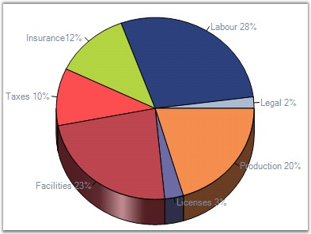
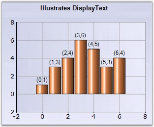

::: {style="DISPLAY: none"}
{#d2h_url_template}{#d2h_package_url style="WIDTH: 0px; DISPLAY: none; HEIGHT: 0px"}
:::

:::: {.d2h_secondary_topic style="PADDING-BOTTOM: 10pt; MARGIN: 0pt; PADDING-LEFT: 0pt; PADDING-RIGHT: 0pt; PADDING-TOP: 0pt"}
#### DisplayText {#displaytext style="tab-stops: 0pt"}

 

Indicates whether a label indicating the data point value should be displayed at the data points.

 

::: {align="center"}
+-------------------------------------+-------------------------------------+
|                                                                           |
|                                                                           |
| Details                                                                   |
+-------------------------------------+-------------------------------------+
|                                     |                                     |
|                                     |                                     |
| **Possible Values**                 | True, False                         |
+-------------------------------------+-------------------------------------+
|                                     |                                     |
|                                     |                                     |
| **Default Value    **               | **False**                           |
+-------------------------------------+-------------------------------------+
|                                     |                                     |
|                                     |                                     |
| **2D / 3D Limitations**             | No                                  |
+-------------------------------------+-------------------------------------+
|                                     |                                     |
|                                     |                                     |
| **Applies to Chart Element**        | All series and points               |
+-------------------------------------+-------------------------------------+
|                                     |                                     |
|                                     |                                     |
| **Applies to Chart Types**          | All Chart types                     |
+-------------------------------------+-------------------------------------+
:::

 

Here is some sample code.

 

Series wide setting

 

+----------------------------------------------------------------------------------------------------------------------------------------------------------------------------------------+
| **[\[C#\]]{style="FONT-FAMILY: 'Courier New'; COLOR: black"}**                                                                                                                         |
|                                                                                                                                                                                        |
| []{style="FONT-FAMILY: 'Courier New'; COLOR: black"}                                                                                                                                   |
|                                                                                                                                                                                        |
| [// Enabling DisplayText]{style="FONT-FAMILY: 'Courier New'; COLOR: green"}                                                                                                            |
|                                                                                                                                                                                        |
| [this]{style="FONT-FAMILY: 'Courier New'; COLOR: blue"}[.chartControl1.Series\[0\].Style.DisplayText = [true]{style="COLOR: blue"};]{style="FONT-FAMILY: 'Courier New'"}               |
|                                                                                                                                                                                        |
| [this]{style="FONT-FAMILY: 'Courier New'; COLOR: blue"}[.chartControl1.Series\[0\].Style.TextColor = [Color]{style="COLOR: teal"}.LightSlateGray;]{style="FONT-FAMILY: 'Courier New'"} |
+----------------------------------------------------------------------------------------------------------------------------------------------------------------------------------------+

 

+-----------------------------------------------------------------------------------------------------------------------------------------------------------------------------------------+
| **[\[VB.NET\]]{style="FONT-FAMILY: 'Courier New'; COLOR: black"}**                                                                                                                      |
|                                                                                                                                                                                         |
| []{style="FONT-FAMILY: 'Courier New'; COLOR: black"}                                                                                                                                    |
|                                                                                                                                                                                         |
| **[ \']{style="FONT-FAMILY: 'Courier New'; COLOR: teal"}[ ]{style="FONT-FAMILY: 'Courier New'; COLOR: black"}**[Enabling DisplayText]{style="FONT-FAMILY: 'Courier New'; COLOR: green"} |
|                                                                                                                                                                                         |
| [Me]{style="FONT-FAMILY: 'Courier New'; COLOR: blue"}[.chartControl1.Series(0).Style.DisplayText = [True]{style="COLOR: blue"}]{style="FONT-FAMILY: 'Courier New'"}                     |
|                                                                                                                                                                                         |
| [Me]{style="FONT-FAMILY: 'Courier New'; COLOR: blue"}[.chartControl1.Series(0).Style.TextColor = [Color]{style="COLOR: teal"}.LightSlateGray]{style="FONT-FAMILY: 'Courier New'"}       |
+-----------------------------------------------------------------------------------------------------------------------------------------------------------------------------------------+

 

{border="0"}

 

Figure 112: DisplayText in Pie Chart

 

{border="0"}

**[]{style="COLOR: red; FONT-SIZE: 8pt"}** 

Figure 113: DisplayText in Column Chart

 

Specific Data Point Setting

 

To specify text for specific points, use the below code.

 

+----------------------------------------------------------------------------------------------------------------------------------------------------------------------------------------------+
| **[\[C#\]]{style="FONT-FAMILY: 'Courier New'; COLOR: black"}**                                                                                                                               |
|                                                                                                                                                                                              |
| []{style="FONT-FAMILY: 'Courier New'; COLOR: black"}                                                                                                                                         |
|                                                                                                                                                                                              |
| [// Enabling DisplayText for the first data point]{style="FONT-FAMILY: 'Courier New'; COLOR: green"}                                                                                         |
|                                                                                                                                                                                              |
| [this]{style="FONT-FAMILY: 'Courier New'; COLOR: blue"}[.chartControl1.Series\[0\].Styles\[0\].DisplayText = [true]{style="COLOR: blue"};]{style="FONT-FAMILY: 'Courier New'"}               |
|                                                                                                                                                                                              |
| [this]{style="FONT-FAMILY: 'Courier New'; COLOR: blue"}[.chartControl1.Series\[0\].Styles\[0\].TextColor = [Color]{style="COLOR: teal"}.LightSlateGray;]{style="FONT-FAMILY: 'Courier New'"} |
+----------------------------------------------------------------------------------------------------------------------------------------------------------------------------------------------+

 

+---------------------------------------------------------------------------------------------------------------------------------------------------------------------------------------+
| **[\[VB.NET\]]{style="FONT-FAMILY: 'Courier New'; COLOR: black"}**                                                                                                                    |
|                                                                                                                                                                                       |
| []{style="FONT-FAMILY: 'Courier New'; COLOR: black"}                                                                                                                                  |
|                                                                                                                                                                                       |
| **[\']{style="FONT-FAMILY: 'Courier New'; COLOR: teal"}**[Enabling DisplayText for the first data point]{style="FONT-FAMILY: 'Courier New'; COLOR: green"}                            |
|                                                                                                                                                                                       |
| [Me]{style="FONT-FAMILY: 'Courier New'; COLOR: blue"}[.chartControl1.Series(0).Styles(0).DisplayText = [True]{style="COLOR: blue"}]{style="FONT-FAMILY: 'Courier New'"}               |
|                                                                                                                                                                                       |
| [Me]{style="FONT-FAMILY: 'Courier New'; COLOR: blue"}[.chartControl1.Series(0).Styles(0).TextColor = [Color]{style="COLOR: teal"}.LightSlateGray]{style="FONT-FAMILY: 'Courier New'"} |
+---------------------------------------------------------------------------------------------------------------------------------------------------------------------------------------+

 

See Also

 

[Chart Types]{.UGHyperlink}[]{.UGHyperlink}

 

[]{#p88} 

[]{#related-topics}
::::
