::: {style="DISPLAY: none"}
{#d2h_url_template}{#d2h_package_url style="WIDTH: 0px; DISPLAY: none; HEIGHT: 0px"}
:::

::::: {#nsbanner .d2h_main_nsbanner style="BORDER-BOTTOM: #999999 1px solid; POSITION: relative; PADDING-BOTTOM: 0px; BACKGROUND-COLOR: transparent; PADDING-LEFT: 0px; PADDING-RIGHT: 0px; DISPLAY: none; BORDER-TOP: #999999 1px solid; PADDING-TOP: 0px; LEFT: 0px"}
:::: {#TitleRow .d2h_main_titlerow style="PADDING-BOTTOM: 4px; BACKGROUND-COLOR: transparent; PADDING-LEFT: 22px; WIDTH: 100%; PADDING-RIGHT: 10px; DISPLAY: none; PADDING-TOP: 4px"}
::: {#ienav .d2h_main_ienav style="DISPLAY: none"}
{#D2HPrevious .D2HPreviousEnabled}  {#D2HNext .D2HNextEnabled}
:::
::::
:::::

::::: {#nstext .d2h_main_nstext style="PADDING-BOTTOM: 10px; BACKGROUND-COLOR: transparent; PADDING-LEFT: 22px; PADDING-RIGHT: 10px; HEIGHT: 100%; OVERFLOW: auto; PADDING-TOP: 5px" hasuserbackground="true" valign="bottom"}
::: {#d2h_breadcrumbs .d2h_breadcrumbs}
[Essential Studio User Guide Documentation](ms-xhelp:///?Id=12457748-09e3-4d74-a240-8e049cedf030){.d2h_breadcrumbsNormal}[ \> ]{.d2h_breadcrumbsLinkSeparator}[Essential Common](ms-xhelp:///?Id=2bfe10b6-fac1-4f91-a173-04db314f10c3){.d2h_breadcrumbsNormal}[ \> ]{.d2h_breadcrumbsLinkSeparator}[Installation and Deployment](ms-xhelp:///?Id=edacfc75-68a5-4518-870d-ce716c583177){.d2h_breadcrumbsNormal}[ \> ]{.d2h_breadcrumbsLinkSeparator}[Deployment](ms-xhelp:///?Id=fea9338f-870c-4078-82ab-0b74e2fcfd00){.d2h_breadcrumbsNormal}
:::

### Distributing Essential Studio Components Using ClickOnce {#distributing-essential-studio-components-using-clickonce style="tab-stops: 0pt"}

Enabling ClickOnce Deployment for Applications that use the Syncfusion Libraries

[                        ]{style="COLOR: #365f92; FONT-SIZE: 9pt"}

[Requirements]{style="FONT-SIZE: 9pt"}

[]{style="FONT-FAMILY: 'Trebuchet MS','sans-serif'; COLOR: #15428b; FONT-SIZE: 9pt"} 

[·      ]{style="FONT-FAMILY: Symbol"}Syncfusion Essential Studio 5.1 or later.

[·      ]{style="FONT-FAMILY: Symbol"}Microsoft Visual Studio 2005 (or later).

[]{style="FONT-FAMILY: 'Trebuchet MS','sans-serif'; COLOR: #15428b; FONT-SIZE: 9pt"} 

This article does not cover the deployment of applications using .NET Framework version 1.1 or 1.0.

[]{style="FONT-FAMILY: 'Trebuchet MS','sans-serif'; COLOR: #15428b; FONT-SIZE: 9pt"} 

Introduction

**[]{style="FONT-FAMILY: 'Trebuchet MS','sans-serif'; COLOR: #15428b; FONT-SIZE: 9pt"}** 

ClickOnce technology enables Windows Forms applications to be deployed with almost the same ease as the Web applications. Though it was introduced in earlier versions of the .NET Framework, ClickOnce support has been greatly enhanced with version 2.0 of the .NET Framework making it almost trivial to deploy an application.

 

The purpose of this article is to walk through the steps needed for the deployment of a Windows Forms application that uses the Syncfusion libraries. These steps are almost similar to the steps we follow for the deployment of an application that does not use the Syncfusion libraries. Therefore this article does not attempt to cover every scenario that applies to such deployment as there are plenty of resources that deal with this already (check the References section for additional information).

 

We picked a fairly complex application, the VSDemo sample that ships with our Essential Tools product to use as a test case. The VSDemo sample uses several Syncfusion libraries (Tools, Edit and Grid) and should be fairly representative of a project that uses the Syncfusion libraries. You do not however, need this project. You can instead pick any other project including your own and follow along. There is nothing listed that is specific to this application.

[]{style="FONT-FAMILY: 'Trebuchet MS','sans-serif'; COLOR: #15428b; FONT-SIZE: 9pt"} 

Configuration

[]{style="FONT-FAMILY: TTFF4A45C8t00; COLOR: #4f82be; FONT-SIZE: 9pt"} 

[·      ]{style="FONT-FAMILY: Symbol"}Open the VSDemo sample in Microsoft Visual Studio.NET 2005. This sample will usually be installed under %userprofile%\\Documents\\Syncfusion\\EssentialStudio\\5.1.0.51\\Windows\\Tools.Windows\\Samples\\2.0\\Featured Samples\\VSDemo. You can take a backup of the original sample for reference.

[·      ]{style="FONT-FAMILY: Symbol"}Open the properties for this project in Visual Studio.NET.

[·      ]{style="FONT-FAMILY: Symbol"}Select the **Publish** page when the project property pages are displayed.

[]{style="FONT-FAMILY: 'Trebuchet MS','sans-serif'; COLOR: #15428b; FONT-SIZE: 9pt"} 

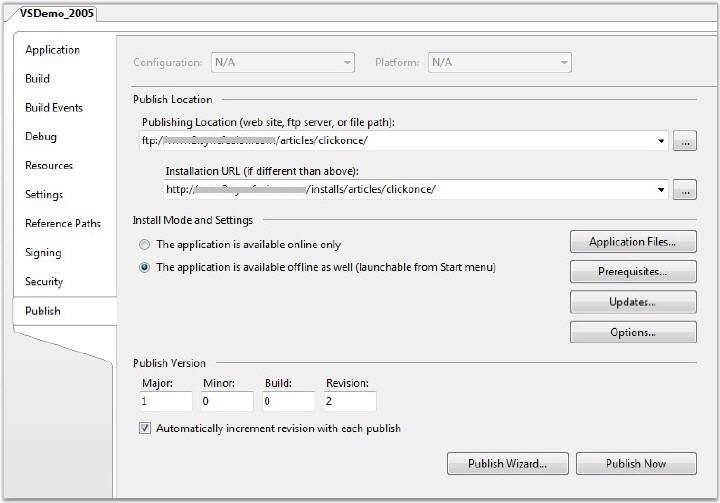{border="0"}

Figure 71: ClickOnce Publish Settings

[]{style="FONT-FAMILY: TTFF439530t00; COLOR: #4f82be; FONT-SIZE: 9pt"} 

There are two important settings that need to be entered on this dialog box -- the **Publishing location** and the **Installation URL**.

 

For our purpose, we have chosen to publish the files using ftp. The location of the FTP server and the path where the files are to be published is entered under **Publishing Location**.

 

If authentication is required to access the Publishing Location (FTP server in this case), click the browse button next to the Publishing Location TextBox and enter authentication details. You will also observe that several additional publishing methods are available including publishing to a site that supports FrontPage server extensions.

 

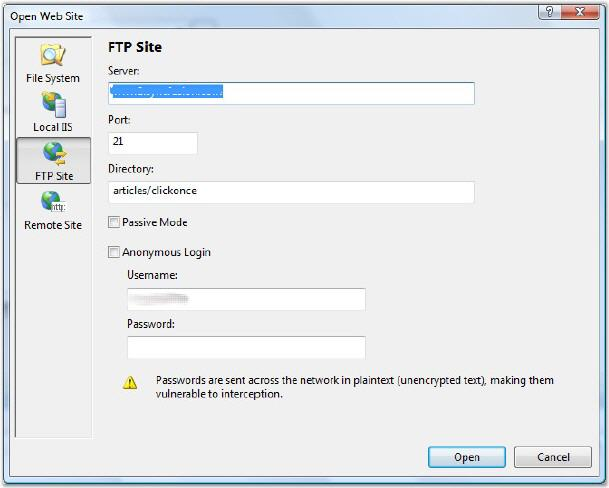{border="0"}

Figure 72: Authentication Information to access the Server where Files are to be Deployed To

[]{style="FONT-FAMILY: 'Trebuchet MS','sans-serif'; COLOR: #15428b; FONT-SIZE: 9pt"} 

The next step is to enter the **Installation URL**. This will be the base URL from where the ClickOnce application will be deployed. This needs to be http/https location or a file system reference. It should of course correspond to the FTP path that we used as the publishing location. The publishing process will create a file named "publish.htm" by default under the root folder of the ftp / http location. This will be the entry point to install the ClickOnce application. For example in our case the final published link will be[ ]{style="FONT-FAMILY: TTFF4B80E0t00; COLOR: black"}[[http://help.syncfusion.com/installs/articles/clickonce/publish.htm]{.UGHyperlink}](http://help.syncfusion.com/installs/articles/clickonce/publish.htm)[.]{style="COLOR: black"}

[]{style="FONT-FAMILY: 'Trebuchet MS','sans-serif'; COLOR: black; FONT-SIZE: 9pt"} 

::: {style="BORDER-BOTTOM: windowtext 1pt solid; BORDER-LEFT: medium none; PADDING-BOTTOM: 1pt; MARGIN-TOP: 9pt; PADDING-LEFT: 0pt; PADDING-RIGHT: 0pt; MARGIN-BOTTOM: 9pt; BORDER-TOP: windowtext 1pt solid; BORDER-RIGHT: medium none; PADDING-TOP: 1pt"}
[{border="0"}]{style="COLOR: black"}Note: Users after 7.2.0.39 have to include a file called licensecontext.slf for deployment through web, though your application is a Windows Forms application. You can generate this file with the help of the following image. Please ensure this file is included in your files list before deployment. This file changes for each version. So, please ensure that the old file is replaced in your future version upgrades.
:::

[]{style="FONT-FAMILY: 'Trebuchet MS','sans-serif'; COLOR: #15428b; FONT-SIZE: 9pt"} 

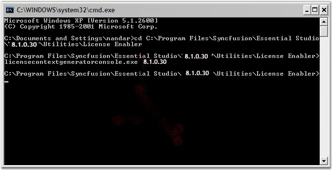{border="0"}

[]{style="FONT-FAMILY: 'Trebuchet MS','sans-serif'; COLOR: #15428b; FONT-SIZE: 9pt"} 

Verify Dependencies

**[]{style="FONT-FAMILY: 'Trebuchet MS','sans-serif'; COLOR: #15428b; FONT-SIZE: 9pt"}** 

The next step is to verify that the ClickOnce runtime has all the information it needs on the files that need to be deployed. As part of the publishing process ClickOnce will copy all assemblies and any additional files that the application requires to the remote site.

[]{style="FONT-FAMILY: TTFF4B80E0t00; COLOR: black; FONT-SIZE: 9pt"} 

[·      ]{style="FONT-FAMILY: Symbol"}Assemblies -- It is very critical that the ClickOnce runtime has a complete understanding of all non-system assemblies that are needed. Normally, this is not a problem and the ClickOnce system is able to obtain this information from the references list in Visual Studio .NET.

 

[o  ]{style="FONT-FAMILY: 'Courier New'"}**However, there is one Syncfusion specific gotcha here to watch out for**. Many projects that use the Syncfusion assemblies may not have a direct reference to **Syncfusion.Core.dll**. However, this assembly is needed at runtime and the ClickOnce deployment will fail if this assembly is not copied over for deployment. If you look at your reference list and you do not see Syncfusion.Core. You need to browse and add Syncfusion.Core as a reference (installed under \$drive:\\Program Files\\Syncfusion\\Essential Studio\\\$version\\precompiledassemblies\\ \$version \\2.0).

 

[o  ]{style="FONT-FAMILY: 'Courier New'"}No additional steps are needed if **CopyLocal** property is set to ***True***. If this property for the referenced assemblies is set to false, click the **Application Files** button and change the \"Publish Status\" for each of the Syncfusion assemblies (and any non-system assemblies that are referenced in a similar manner) to be \"Include\" from the automatically selected pre-requisite setting. If you do not make this change and any of the assemblies are marked as pre-requisites the ClickOnce runtime will complain that the assembly, so referenced, needs to be in the GAC for the application to start.

 

[·      ]{style="FONT-FAMILY: Symbol"}**Additional content** -- Any additional files that your application needs, such as image files, SQL databases and so on, should be made known to the ClickOnce publishing system. The easiest way to do this for additional content files is to mark them as Content (Build Action set to Content).

[]{style="FONT-FAMILY: 'Trebuchet MS','sans-serif'; COLOR: #15428b; FONT-SIZE: 9pt"} 

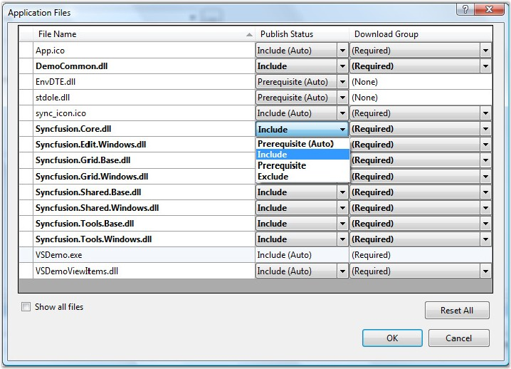{border="0"}

Figure 73: Application Files list that contains details on Files that will be Deployed

**[]{style="FONT-FAMILY: 'Trebuchet MS','sans-serif'; COLOR: #15428b; FONT-SIZE: 9pt"}** 

We have also provided a command line tool called NETDepends.exe that can take any assembly and dump a list of its dependencies. It comes with a help file, netdepends.htm and is included for download along with this article. You can use this tool to verify that all your non-system file dependencies are accounted for.

 

You can check the list of files that will be deployed by clicking the **Application Files** button in the **Publish** property page.

[]{style="FONT-FAMILY: 'Trebuchet MS','sans-serif'; COLOR: #15428b; FONT-SIZE: 9pt"} 

Publish

[]{style="FONT-FAMILY: TTFF4A45C8t00; COLOR: #4f82be; FONT-SIZE: 9pt"} 

Once you verified that all dependencies are correctly handled, you can click the **Publish Now** button on the Publish property page to start the publishing process. The Visual Studio.NET IDE status bar will be updated with details on the status of the publishing process.

 

Please note that as part of the deployment process, files have a suffix ".deploy" added to them. This is a configurable setting but in most cases you do not need to make any changes. Shown below is a screenshot of the files list on the server. One level above this folder is where the deployment entry point that is **Publish.htm** file is created. This is the file that users will have to navigate to install the ClickOnce application.

[]{style="FONT-FAMILY: 'Trebuchet MS','sans-serif'; COLOR: #15428b; FONT-SIZE: 9pt"} 

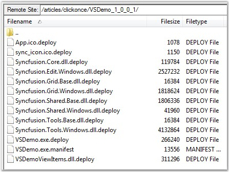{border="0"}

Figure 74: Files on the server

**[]{style="FONT-FAMILY: TTFF439530t00; COLOR: #4f82be; FONT-SIZE: 9pt"}** 

**[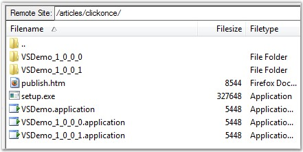{border="0"}]{style="FONT-FAMILY: TTFF439530t00; COLOR: #4f82be; FONT-SIZE: 9pt"}[]{style="FONT-FAMILY: TTFF439530t00; COLOR: #4f82be; FONT-SIZE: 9pt"}**

Figure 75: Publish.htm -- the ClickOnce entry point on the server

[]{style="FONT-FAMILY: 'Trebuchet MS','sans-serif'; COLOR: #15428b; FONT-SIZE: 9pt"} 

Test deployment

**[]{style="FONT-FAMILY: 'Trebuchet MS','sans-serif'; COLOR: #15428b; FONT-SIZE: 9pt"}** 

Navigate to this URL -[ ]{style="COLOR: black"}[[http://help.syncfusion.com/installs/articles/clickonce/publish.htm]{.UGHyperlink}](http://help.syncfusion.com/installs/articles/clickonce/publish.htm)[,]{style="COLOR: blue"}[ ]{style="FONT-FAMILY: TTFF4B80E0t00; COLOR: blue"}to test the deployment. The following user interface is displayed by the browser.

[]{style="FONT-FAMILY: 'Trebuchet MS','sans-serif'; COLOR: #15428b; FONT-SIZE: 9pt"} 

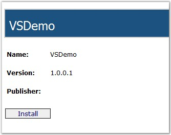{border="0"}

Figure 76: ClickOnce entry point

[]{style="FONT-FAMILY: TTFF439530t00; COLOR: #4f82be; FONT-SIZE: 9pt"} 

You can click the **Install** to start the download process. The ClickOnce runtime displays a note that the Publisher of the application cannot be verified. This can be fixed by signing the deployment manifest as detailed under the section **Signing**.

[]{style="FONT-FAMILY: 'Trebuchet MS','sans-serif'; COLOR: #15428b; FONT-SIZE: 9pt"} 

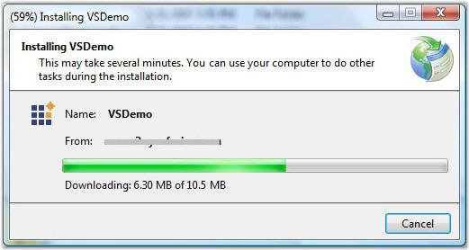{border="0"}

Figure 77: ClickOnce download in progress

[]{style="FONT-FAMILY: 'Trebuchet MS','sans-serif'; COLOR: #4f82be; FONT-SIZE: 9pt"} 

The actual download will take a little time depending on the size of your application, download speed and connection to the server. Once installed locally, the application will automatically startup and run.

[]{style="FONT-FAMILY: 'Trebuchet MS','sans-serif'; COLOR: #15428b; FONT-SIZE: 9pt"} 

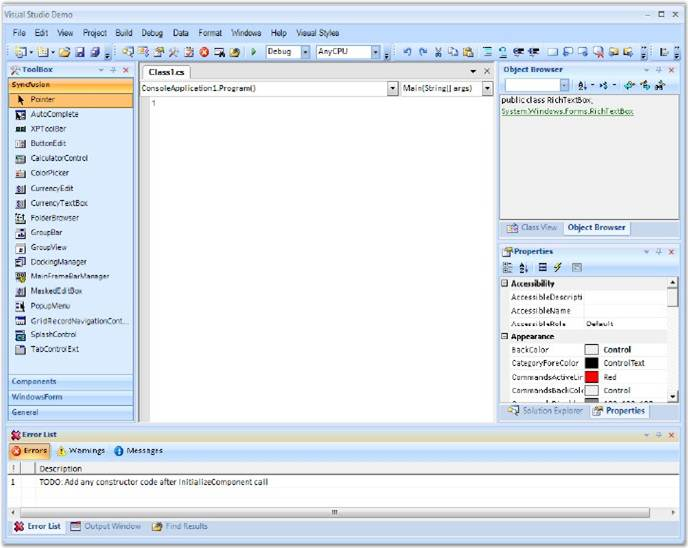{border="0"}

Figure 78: ClickOnce deployed application on the end-user's machine

[]{style="FONT-FAMILY: 'Trebuchet MS','sans-serif'; COLOR: #4f82be; FONT-SIZE: 9pt"} 

If you had selected **The application is available offline as well** option on the Publish property page, a start menu entry will also be automatically added. This will allow the application to be run subsequently without having to navigate to the ClickOnce entry point URL.

[]{style="FONT-FAMILY: 'Trebuchet MS','sans-serif'; COLOR: #15428b; FONT-SIZE: 9pt"} 

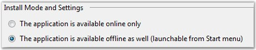{border="0"}

Figure 79: Online / Offline settings

**[]{style="FONT-FAMILY: 'Trebuchet MS','sans-serif'; COLOR: #15428b; FONT-SIZE: 9pt"}** 

You can also view/change the installed ClickOnce application under "Add/Remove programs" in the control panel.

[]{style="FONT-FAMILY: 'Trebuchet MS','sans-serif'; COLOR: #15428b; FONT-SIZE: 9pt"} 

Trust requirements

**[]{style="FONT-FAMILY: 'Trebuchet MS','sans-serif'; COLOR: #15428b; FONT-SIZE: 9pt"}** 

The default trust requirement selected for Windows Forms applications is Full Trust. You can change this by selecting the Security property page. However, for applications that use Syncfusion user interface libraries, Full Trust is a requirement and it is recommended that you do not change this setting.

[]{style="FONT-FAMILY: 'Trebuchet MS','sans-serif'; COLOR: #15428b; FONT-SIZE: 9pt"} 

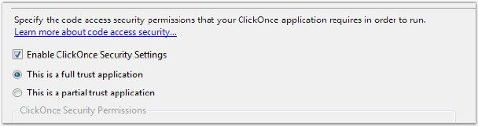{border="0"}

Figure 80: Code Access Security settings for the deployed application

[]{style="FONT-FAMILY: TTFF4A45C8t00; COLOR: #4f82be; FONT-SIZE: 9pt"} 

Signing

[]{style="FONT-FAMILY: TTFF4A45C8t00; COLOR: #4f82be; FONT-SIZE: 9pt"} 

During the deployment test, the ClickOnce runtime warned us that the Publisher of the ClickOnce application could not be verified.

[]{style="FONT-FAMILY: 'Trebuchet MS','sans-serif'; COLOR: #15428b; FONT-SIZE: 9pt"} 

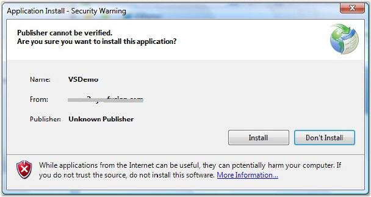{border="0"}

Figure 81: Security warning prior to application installation

[]{style="FONT-FAMILY: TTFF439530t00; COLOR: #4f82be; FONT-SIZE: 9pt"} 

To prevent this warning from being displayed you will have to sign your ClickOnce manifest with a valid Authenticode certificate from a certificate provider (such as Verisign / Thawte). For more details refer to Authenticode links provided under the references section.

[]{style="FONT-FAMILY: 'Trebuchet MS','sans-serif'; COLOR: #15428b; FONT-SIZE: 9pt"} 

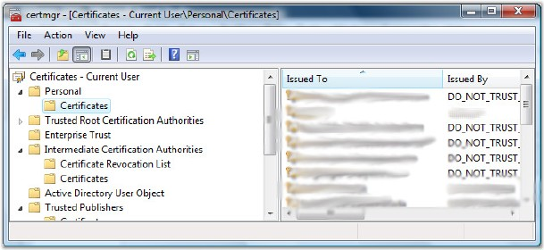{border="0"}

Figure 82: Certificate Manager

[]{style="FONT-FAMILY: TTFF4B80E0t00; COLOR: black; FONT-SIZE: 8pt"} 

Once you obtain a key from a provider you should import it into the certificate store on your machine. To do this simply run CertMgr.exe (should be in your system path). When it comes up navigate to Personal\\Certificates in the tree to the left. Right click on the certificates node and select AllTasks\\Import. You will be presented with a certificate import wizard that will walk you through the process of importing files provided by your certification authority.

 

Once you have a key installed in your certificate store navigate to the Signing property page. You can then select the certificate you wish to use for the signing process by clicking the **Select from Store** option.

 

Once you sign the ClickOnce manifest in this manner the ClickOnce runtime will display a much more re-assuring dialog to your end users. Your end users can install your application confident of the source of the application and of the fact that it has not been tampered with.

[]{style="FONT-FAMILY: 'Trebuchet MS','sans-serif'; COLOR: #15428b; FONT-SIZE: 9pt"} 

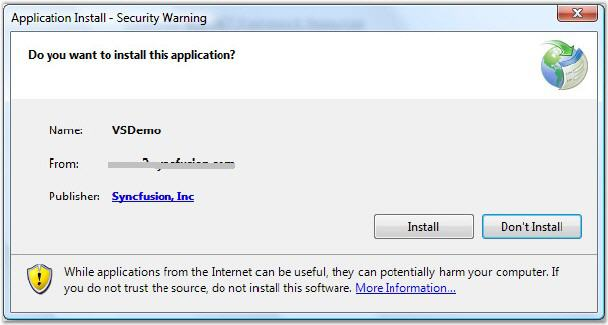{border="0"}

Figure 83: Deploying a signed application

[]{style="FONT-FAMILY: 'Trebuchet MS','sans-serif'; COLOR: #15428b; FONT-SIZE: 9pt"} 

Additional settings

[]{style="FONT-FAMILY: TTFF4A45C8t00; COLOR: #4f82be; FONT-SIZE: 9pt"} 

There are several additional settings that can be tweaked depending on your needs. For further information on these please refer to the articles listed under the references section.

[]{style="FONT-FAMILY: 'Trebuchet MS','sans-serif'; COLOR: black; FONT-SIZE: 9pt"} 

Additional notes

[]{style="FONT-FAMILY: TTFF4A45C8t00; COLOR: #4f82be; FONT-SIZE: 9pt"} 

[·      ]{style="FONT-FAMILY: Symbol"}We recommend that you deploy the application to a clean machine by copying it manually to ensure that regular deployment works prior to trying ClickOnce.

[·      ]{style="FONT-FAMILY: Symbol; COLOR: black"}ClickOnce is supported in Firefox using a plugin, which is available for download from [[http://www.softwarepunk.com/ffclickonce/]{.UGHyperlink}](http://www.softwarepunk.com/ffclickonce/)[.]{style="COLOR: black"}

 

[]{style="FONT-FAMILY: 'Trebuchet MS','sans-serif'; COLOR: #15428b; FONT-SIZE: 9pt"} 

[]{#related-topics}
:::::
