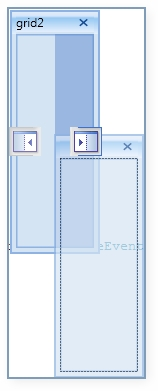

::: {style="DISPLAY: none"}
{#d2h_url_template}{#d2h_package_url style="WIDTH: 0px; DISPLAY: none; HEIGHT: 0px"}
:::

::: {.d2h_secondary_topic style="PADDING-BOTTOM: 10pt; MARGIN: 0pt; PADDING-LEFT: 0pt; PADDING-RIGHT: 0pt; PADDING-TOP: 0pt"}
#### DockAbility of Child {#dockability-of-child style="tab-stops: 0pt"}

**DockAbility** is the property, which is used to decide whether which child can be allowed to dock in using the internal Drag Provider.

[]{style="FONT-FAMILY: 'Times New Roman','serif'; FONT-SIZE: 12pt"} 

+-------------------------------------------------------------------------------------------------------------------------------------------------------------+
| **[\[C#\]]{style="FONT-FAMILY: 'Times New Roman','serif'; FONT-SIZE: 12pt"}**                                                                               |
|                                                                                                                                                             |
| [DockAbility]{style="FONT-FAMILY: 'Courier New'; COLOR: #2b91af"}[ ability=[DockAbility]{style="COLOR: #2b91af"}.None;]{style="FONT-FAMILY: 'Courier New'"} |
|                                                                                                                                                             |
| [ability \|= [DockAbility]{style="COLOR: #2b91af"}.Left;]{style="FONT-FAMILY: 'Courier New'"}                                                               |
|                                                                                                                                                             |
| [ability \|= [DockAbility]{style="COLOR: #2b91af"}.Right;]{style="FONT-FAMILY: 'Courier New'"}                                                              |
|                                                                                                                                                             |
| **[DockingManager]{style="FONT-FAMILY: 'Courier New'; COLOR: #2b91af"}**[.SetDockAbility(grid1, ability);]{style="FONT-FAMILY: 'Courier New'"}              |
+-------------------------------------------------------------------------------------------------------------------------------------------------------------+

 

{border="0"}

Figure 374: DockAbility with left and right enabled[]{style="FONT-FAMILY: 'Times New Roman','serif'; FONT-SIZE: 12pt"}

[]{style="FONT-FAMILY: 'Times New Roman','serif'; FONT-SIZE: 12pt"} 

 

[]{#related-topics}
:::
