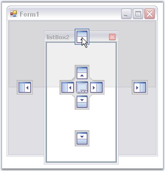
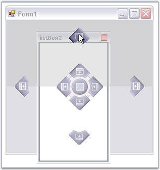
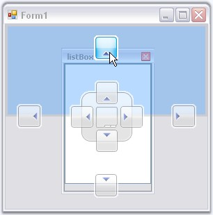
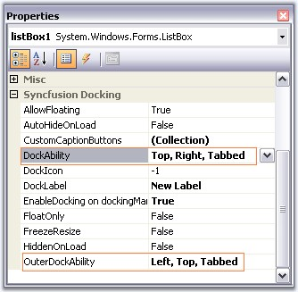
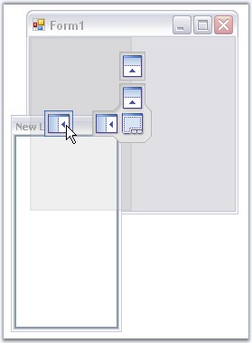
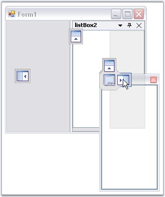

::: {style="DISPLAY: none"}
{#d2h_url_template}{#d2h_package_url style="WIDTH: 0px; DISPLAY: none; HEIGHT: 0px"}
:::

:::: {.d2h_secondary_topic style="PADDING-BOTTOM: 10pt; MARGIN: 0pt; PADDING-LEFT: 0pt; PADDING-RIGHT: 0pt; PADDING-TOP: 0pt"}
##### Dock Arrow Settings {#dock-arrow-settings style="tab-stops: 0pt"}

[]{style="COLOR: #15428b"} 

While dragging and dropping a docked control, DockingManager guides you through the process, using **DragProviderStyle** property.

 

On setting this property to VS2005 or Whidbey style, you will be able to see arrows on four sides of the form, when a control is dragged. These arrows will guide you where to dock the window. Keeping the mouse point on a particular arrow will display a shadow like appearance based on the side of docking.

 

There are three docking provider Styles. They are,

[]{style="COLOR: #15428b"} 

[·      ]{style="FONT-FAMILY: Symbol"}Standard (Default value - no arrows appears for this option),

[·      ]{style="FONT-FAMILY: Symbol"}VS2005,

[·      ]{style="FONT-FAMILY: Symbol"}WhidBey and

[·      ]{style="FONT-FAMILY: Symbol"}VS2008.

[]{style="COLOR: #15428b"} 

+--------------------------------------------------------------------------------------------------------------------------------------------------------------------------------------------+
| **[\[C#\]]{style="FONT-FAMILY: 'Courier New'; COLOR: black"}**                                                                                                                             |
|                                                                                                                                                                                            |
| []{style="FONT-FAMILY: 'Courier New'; COLOR: green"}                                                                                                                                       |
|                                                                                                                                                                                            |
| [this]{style="FONT-FAMILY: 'Courier New'; COLOR: blue"}[.dockingManager1.DragProviderStyle = Syncfusion.Windows.Forms.Tools.DragProviderStyle.VS2008;]{style="FONT-FAMILY: 'Courier New'"} |
+--------------------------------------------------------------------------------------------------------------------------------------------------------------------------------------------+

[]{style="COLOR: #15428b"} 

+-----------------------------------------------------------------------------------------------------------------------------------------------------------------------------------------+
| **[\[VB.NET\]]{style="FONT-FAMILY: 'Courier New'; COLOR: black"}**                                                                                                                      |
|                                                                                                                                                                                         |
| []{style="FONT-FAMILY: 'Courier New'; COLOR: green"}                                                                                                                                    |
|                                                                                                                                                                                         |
| [Me]{style="FONT-FAMILY: 'Courier New'; COLOR: blue"}[.dockingManager1.DragProviderStyle = Syncfusion.Windows.Forms.Tools.DragProviderStyle.VS2008]{style="FONT-FAMILY: 'Courier New'"} |
+-----------------------------------------------------------------------------------------------------------------------------------------------------------------------------------------+

[]{style="COLOR: #15428b"} 

{border="0"}

[]{style="COLOR: #15428b"} 

Figure 85: VS 2005 DragProviderStyle

**[]{style="COLOR: #15428b"}** 

{border="0"}

**[]{style="COLOR: #15428b"}** 

Figure 86: Whidbey DragProviderStyle

**[]{style="COLOR: #15428b"}** 

{border="0"}

**[]{style="COLOR: #15428b"}** 

Figure 87: VS 2008 DragProviderStyle

[]{style="COLOR: #15428b"} 

In the image above, a shadow for docking a panel to the top of the form is displayed. Target area is highlighted at the top, as the mouse is hovered over the top Dock arrow.

[]{style="COLOR: #15428b"} 

Visibility of the Arrows

[]{style="COLOR: #15428b"} 

The docking arrows visibility, while dropping a control inside the form or into another docked control, can be set using the below properties.

[]{style="COLOR: #15428b"} 

::: {align="center"}
  ------------------------ ------------------------------------------------------------------------------------
  DockedControl Property   Description
  DockAbility              Indicates where the user can dock in this control using drag providers.
  OuterDockAbilility       Indicates where the user can dock the controls in a form using the drag providers.
  ------------------------ ------------------------------------------------------------------------------------
:::

**[]{style="COLOR: #15428b"}** 

{border="0"}

**[]{style="COLOR: #15428b"}** 

Figure 88: Property Grid indicating DockAbility and OuterDockAbility

**[]{style="COLOR: #15428b"}** 

{border="0"}

**[]{style="COLOR: #15428b"}** 

Figure 89: OuterDockAbility set in the form to Left, Top and Tabbed

**[]{style="COLOR: #15428b"}** 

{border="0"}

**[]{style="COLOR: #15428b"}** 

Figure 90: DockAbility Set within a control to Right, Top and Tabbed

[]{style="COLOR: #15428b"} 

See Also

[]{style="COLOR: #15428b"} 

[Docking]{.UGHyperlink}[]{.UGHyperlink}

[]{#related-topics}
::::
