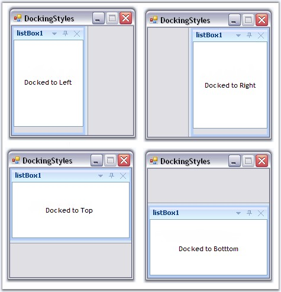
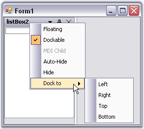

::: {style="DISPLAY: none"}
{#d2h_url_template}{#d2h_package_url style="WIDTH: 0px; DISPLAY: none; HEIGHT: 0px"}
:::

:::: {.d2h_secondary_topic style="PADDING-BOTTOM: 10pt; MARGIN: 0pt; PADDING-LEFT: 0pt; PADDING-RIGHT: 0pt; PADDING-TOP: 0pt"}
##### Docking {#docking style="tab-stops: 0pt"}

[]{#p47}[]{style="COLOR: #15428b"} 

Docked control can be docked to any of the four sides of the container control, i.e., to Left, Right, Top and Bottom. DockingManager lets you specify the type of docking and the bounds of the docked control using the **DockControl** method. This method also sets Tabbed style for the controls.

[]{style="COLOR: #15428b"} 

+----------------------------------------------------------------------------------------------------------------------------------------------------------------------------------------------------------------------------------------------------------------------------------------+
| **[\[C#\]]{style="FONT-FAMILY: 'Courier New'; COLOR: black"}**                                                                                                                                                                                                                         |
|                                                                                                                                                                                                                                                                                        |
| **[]{style="FONT-FAMILY: 'Courier New'; COLOR: black"}**                                                                                                                                                                                                                               |
|                                                                                                                                                                                                                                                                                        |
| [// Tab the docked controls]{style="FONT-FAMILY: 'Courier New'; COLOR: green"}                                                                                                                                                                                                         |
|                                                                                                                                                                                                                                                                                        |
| [this]{style="FONT-FAMILY: 'Courier New'; COLOR: blue"}[.dockingManager.DockControl([this]{style="COLOR: blue"}.listBox1, [this]{style="COLOR: blue"}.listBox2,Syncfusion.Windows.Forms.Tools.DockingStyle.Left,200,[true]{style="COLOR: blue"});]{style="FONT-FAMILY: 'Courier New'"} |
+----------------------------------------------------------------------------------------------------------------------------------------------------------------------------------------------------------------------------------------------------------------------------------------+

[]{style="COLOR: #15428b"} 

+---------------------------------------------------------------------------------------------------------------------------------------------------------------------------------------------------------------------------------------------------------------------------------+
| **[\[VB.NET\]]{style="FONT-FAMILY: 'Courier New'; COLOR: black"}**                                                                                                                                                                                                              |
|                                                                                                                                                                                                                                                                                 |
| **[]{style="FONT-FAMILY: 'Courier New'; COLOR: black"}**                                                                                                                                                                                                                        |
|                                                                                                                                                                                                                                                                                 |
| [\' Tab the docked controls]{style="FONT-FAMILY: 'Courier New'; COLOR: green"}                                                                                                                                                                                                  |
|                                                                                                                                                                                                                                                                                 |
| [Me]{style="FONT-FAMILY: 'Courier New'; COLOR: blue"}[.dockingManager.DockControl([Me]{style="COLOR: blue"}.listBox1, [Me]{style="COLOR: blue"}.listBox2,Syncfusion.Windows.Forms.Tools.DockingStyle.Left,200,[True]{style="COLOR: blue"})]{style="FONT-FAMILY: 'Courier New'"} |
+---------------------------------------------------------------------------------------------------------------------------------------------------------------------------------------------------------------------------------------------------------------------------------+

[]{style="COLOR: #15428b"} 

{border="0"}

[]{style="COLOR: #15428b"} 

Figure 45: Controls docked to Left, Right, Top and Bottom

[]{style="COLOR: #15428b"} 

At runtime, docking style can be selected easily using the context menu.

[]{style="COLOR: #15428b"} 

{border="0"}

***[]{style="COLOR: #15428b"}*** 

Figure 46: Docking Style selected at Run Time

[]{style="COLOR: #15428b"} 

::: {style="BORDER-BOTTOM: windowtext 1pt solid; BORDER-LEFT: medium none; PADDING-BOTTOM: 1pt; MARGIN-TOP: 9pt; PADDING-LEFT: 0pt; PADDING-RIGHT: 0pt; MARGIN-BOTTOM: 9pt; BORDER-TOP: windowtext 1pt solid; BORDER-RIGHT: medium none; PADDING-TOP: 1pt"}
{border="0"} Note:[ ]{style="COLOR: black; FONT-SIZE: 8pt"}At run time, docking style can also be set with the help of Dock Arrows provided by the DragProviderStyle property.
:::

[]{#related-topics}
::::
