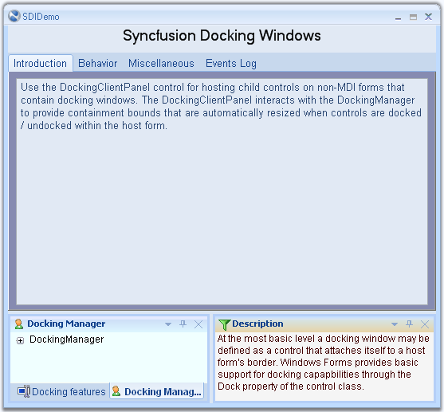
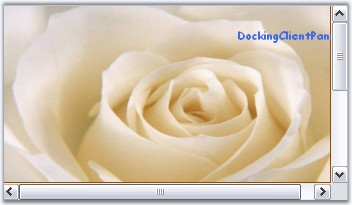

::: {style="DISPLAY: none"}
{#d2h_url_template}{#d2h_package_url style="WIDTH: 0px; DISPLAY: none; HEIGHT: 0px"}
:::

::::::::: {.d2h_secondary_topic style="PADDING-BOTTOM: 10pt; MARGIN: 0pt; PADDING-LEFT: 0pt; PADDING-RIGHT: 0pt; PADDING-TOP: 0pt"}
##### DockingClientPanel {#dockingclientpanel style="tab-stops: 0pt"}

 

[]{#p78}A premise of any docking windows implementation is the existence of a client window the bounds of which vary at run-time as windows get docked or undocked. This paradigm is extremely well suited for MDI type forms where the MDIClient window gets resized / relocated in synchronization with changes in the docking windows layout.

 

Child controls located within the MDIClient window are thus always assured of a static spatial relationship with the parent container.

Non-MDI forms, however, do not have any such client window and all non-dockable statically positioned controls risk being clipped by windows that are docked in their proximity.

 

The Essential Tools **DockingClientPanel** control helps overcome this limitation by providing an auto-resized client surface on which a form\'s non-dockable controls may be located.

[]{style="COLOR: #15428b"} 

::: {style="BORDER-BOTTOM: windowtext 1pt solid; BORDER-LEFT: medium none; PADDING-BOTTOM: 1pt; MARGIN-TOP: 9pt; PADDING-LEFT: 0pt; PADDING-RIGHT: 0pt; MARGIN-BOTTOM: 9pt; BORDER-TOP: windowtext 1pt solid; BORDER-RIGHT: medium none; PADDING-TOP: 1pt"}
 Note: The DockingClientPanel control is intended only for use with forms that do not have the MDIContainer style set.
:::

[]{style="COLOR: #15428b"} 

Using the DockingClientPanel Control

[]{style="COLOR: #15428b"} 

The following sequence lists the steps involved in setting up a docking layout on a non-MDIContainer form using the DockingClientPanel. The DockingClientPanel is used here because in addition to the docking windows, the host form also contains several non-dockable controls that require a container with static relative bounds for implementing positioning and layout management.

[]{style="COLOR: #15428b"} 

1.   Add the DockingManager to the form and apply the EnableDocking on dockingManager1 property for those controls that need to be set as docking windows.

[]{style="COLOR: #15428b"} 

2.   Select the DockingClientPanel control from the designer tool box and drop it onto the form hosting the DockingManager. Size the control so that its bounds are sufficient to accommodate any non-dockable child controls that may already be present on the form.

 

3.   If any non-dockable controls are present on the form, then drag-and-drop these controls onto the DockingClientPanel instance.

 

4.   Set the DockingClientPanel.SizeToFit property to be true. Turning on the **SizeToFit** property will force the DockingClientPanel to start interacting with the Essential Tools docking architecture and the control will automatically be resized / repositioned to occupy the form\'s client bounds, left unoccupied by the docking windows.

 

5.   Set the **BorderStyle** property to get the 3D or fixed single effect to the dockingclientpanel control.

 

6.   The DockingClientPanel will now function as a proxy for the form\'s client surface and all controls originally intended to be placed on the form should henceforth be located on the DockingClientPanel; any anchoring / layout features for the child controls should be set relative to the DockingClientPanel.

 

7.   To add controls directly to the form, the SizeToFit property can temporarily be turned off within the designer and the form resized to expose its surface. At run-time, the SizeToFit property is always enabled.

[]{style="COLOR: #15428b"} 

::: {align="center"}
  ----------------------------- ----------------------------------------------------------------------------------------
  DockingClientPanel Property   Description
  SizeToFit                     Gets or sets a value indicating whether the control is sized to fill the form\'s area.
  BorderStyle                   Indicates the border Style of the Control.
  ----------------------------- ----------------------------------------------------------------------------------------
:::

[]{style="COLOR: #15428b"} 

8.   DockingClientPanel control can be added to the Non-MDI forms using the below code snippet for example.

[]{style="COLOR: #15428b"} 

+------------------------------------------------------------------------------------------------------------------------------------------------------------------------------------------------------------------------------------------------------+
| **[\[C#\]]{style="FONT-FAMILY: 'Courier New'; COLOR: black"}**                                                                                                                                                                                       |
|                                                                                                                                                                                                                                                      |
| []{style="FONT-FAMILY: 'Courier New'; COLOR: green"}                                                                                                                                                                                                 |
|                                                                                                                                                                                                                                                      |
| [//Declaration and initialization]{style="FONT-FAMILY: 'Courier New'; COLOR: green"}                                                                                                                                                                 |
|                                                                                                                                                                                                                                                      |
| [private]{style="FONT-FAMILY: 'Courier New'; COLOR: blue"}[ Syncfusion.Windows.Forms.Tools.DockingClientPanel dockingClientPanel1;]{style="FONT-FAMILY: 'Courier New'"}                                                                              |
|                                                                                                                                                                                                                                                      |
| [this]{style="FONT-FAMILY: 'Courier New'; COLOR: blue"}[.dockingClientPanel1 = [new]{style="COLOR: blue"} Syncfusion.Windows.Forms.Tools.DockingClientPanel();]{style="FONT-FAMILY: 'Courier New'"}                                                  |
|                                                                                                                                                                                                                                                      |
| [this]{style="FONT-FAMILY: 'Courier New'; COLOR: blue"}[.dockingClientPanel1.SuspendLayout();]{style="FONT-FAMILY: 'Courier New'"}                                                                                                                   |
|                                                                                                                                                                                                                                                      |
| []{style="FONT-FAMILY: 'Courier New'"}                                                                                                                                                                                                               |
|                                                                                                                                                                                                                                                      |
| [//Add a control to dockingclientpanel]{style="FONT-FAMILY: 'Courier New'; COLOR: green"}                                                                                                                                                            |
|                                                                                                                                                                                                                                                      |
| [this]{style="FONT-FAMILY: 'Courier New'; COLOR: blue"}[.dockingClientPanel1.Controls.Add([this]{style="COLOR: blue"}.tabControlAdv1);]{style="FONT-FAMILY: 'Courier New'"}                                                                          |
|                                                                                                                                                                                                                                                      |
| []{style="FONT-FAMILY: 'Courier New'"}                                                                                                                                                                                                               |
|                                                                                                                                                                                                                                                      |
| [//set the properties]{style="FONT-FAMILY: 'Courier New'; COLOR: green"}                                                                                                                                                                             |
|                                                                                                                                                                                                                                                      |
| [this]{style="FONT-FAMILY: 'Courier New'; COLOR: blue"}[.dockingClientPanel1.Location = [new]{style="COLOR: blue"} System.Drawing.Point(0, 133);]{style="FONT-FAMILY: 'Courier New'"}                                                                |
|                                                                                                                                                                                                                                                      |
| [this]{style="FONT-FAMILY: 'Courier New'; COLOR: blue"}[.dockingClientPanel1.Name = \"dockingClientPanel1\";]{style="FONT-FAMILY: 'Courier New'"}                                                                                                    |
|                                                                                                                                                                                                                                                      |
| [this]{style="FONT-FAMILY: 'Courier New'; COLOR: blue"}[.dockingClientPanel1.Size = [new]{style="COLOR: blue"} System.Drawing.Size(600, 369);]{style="FONT-FAMILY: 'Courier New'"}                                                                   |
|                                                                                                                                                                                                                                                      |
| [this]{style="FONT-FAMILY: 'Courier New'; COLOR: blue"}[.dockingClientPanel1.SizeToFit = [true]{style="COLOR: blue"};]{style="FONT-FAMILY: 'Courier New'"}                                                                                           |
|                                                                                                                                                                                                                                                      |
| [this]{style="FONT-FAMILY: 'Courier New'; COLOR: blue"}[.dockingClientPanel1.TabIndex = 0;]{style="FONT-FAMILY: 'Courier New'"}                                                                                                                      |
|                                                                                                                                                                                                                                                      |
| [this]{style="FONT-FAMILY: 'Courier New'; COLOR: blue"}[.dockingClientPanel1.Paint += [new]{style="COLOR: blue"} System.Windows.Forms.PaintEventHandler([this]{style="COLOR: blue"}.dockingClientPanel1_Paint);]{style="FONT-FAMILY: 'Courier New'"} |
|                                                                                                                                                                                                                                                      |
| [this]{style="FONT-FAMILY: 'Courier New'; COLOR: blue"}[.DockingClientPanel1.BorderStyle = System.Windows.Forms.BorderStyle.Fixed3D]{style="FONT-FAMILY: 'Courier New'"}                                                                             |
|                                                                                                                                                                                                                                                      |
| []{style="FONT-FAMILY: 'Courier New'"}                                                                                                                                                                                                               |
|                                                                                                                                                                                                                                                      |
| [//Add the control to the form]{style="FONT-FAMILY: 'Courier New'; COLOR: green"}                                                                                                                                                                    |
|                                                                                                                                                                                                                                                      |
| [this]{style="FONT-FAMILY: 'Courier New'; COLOR: blue"}[.Controls.Add([this]{style="COLOR: blue"}.dockingClientPanel1);]{style="FONT-FAMILY: 'Courier New'"}                                                                                         |
|                                                                                                                                                                                                                                                      |
| [this]{style="FONT-FAMILY: 'Courier New'; COLOR: blue"}[.dockingClientPanel1.ResumeLayout([false]{style="COLOR: blue"});]{style="FONT-FAMILY: 'Courier New'"}                                                                                        |
+------------------------------------------------------------------------------------------------------------------------------------------------------------------------------------------------------------------------------------------------------+

[]{style="COLOR: #15428b"} 

+-----------------------------------------------------------------------------------------------------------------------------------------------------------------------------------------------------------------------------------------+
| **[\[VB.NET\]]{style="FONT-FAMILY: 'Courier New'; COLOR: black"}**                                                                                                                                                                      |
|                                                                                                                                                                                                                                         |
| []{style="FONT-FAMILY: 'Courier New'; COLOR: green"}                                                                                                                                                                                    |
|                                                                                                                                                                                                                                         |
| [\' Declaration and initialization]{style="FONT-FAMILY: 'Courier New'; COLOR: green"}                                                                                                                                                   |
|                                                                                                                                                                                                                                         |
| [Private]{style="FONT-FAMILY: 'Courier New'; COLOR: blue"}[ dockingClientPanel1 [As]{style="COLOR: blue"} Syncfusion.Windows.Forms.Tools.DockingClientPanel]{style="FONT-FAMILY: 'Courier New'"}                                        |
|                                                                                                                                                                                                                                         |
| [Me]{style="FONT-FAMILY: 'Courier New'; COLOR: blue"}[.dockingClientPanel1 = [New]{style="COLOR: blue"} Syncfusion.Windows.Forms.Tools.DockingClientPanel()]{style="FONT-FAMILY: 'Courier New'"}                                        |
|                                                                                                                                                                                                                                         |
| [Me]{style="FONT-FAMILY: 'Courier New'; COLOR: blue"}[.dockingClientPanel1.SuspendLayout()]{style="FONT-FAMILY: 'Courier New'"}                                                                                                         |
|                                                                                                                                                                                                                                         |
| []{style="FONT-FAMILY: 'Courier New'"}                                                                                                                                                                                                  |
|                                                                                                                                                                                                                                         |
| [\' Add a control to dockingclientpanel ]{style="FONT-FAMILY: 'Courier New'; COLOR: green"}                                                                                                                                             |
|                                                                                                                                                                                                                                         |
| [Me]{style="FONT-FAMILY: 'Courier New'; COLOR: blue"}[.dockingClientPanel1.Controls.AddRange([New]{style="COLOR: blue"} System.Windows.Forms.Control() {[Me]{style="COLOR: blue"}.tabControlAdv1})]{style="FONT-FAMILY: 'Courier New'"} |
|                                                                                                                                                                                                                                         |
| []{style="FONT-FAMILY: 'Courier New'; COLOR: blue"}                                                                                                                                                                                     |
|                                                                                                                                                                                                                                         |
| [\'set the properties]{style="FONT-FAMILY: 'Courier New'; COLOR: green"}                                                                                                                                                                |
|                                                                                                                                                                                                                                         |
| [Me]{style="FONT-FAMILY: 'Courier New'; COLOR: blue"}[.dockingClientPanel1.AutoScroll = [True]{style="COLOR: blue"}]{style="FONT-FAMILY: 'Courier New'"}                                                                                |
|                                                                                                                                                                                                                                         |
| [Me]{style="FONT-FAMILY: 'Courier New'; COLOR: blue"}[.dockingClientPanel1.Location = [New]{style="COLOR: blue"} System.Drawing.Point(106, 0)]{style="FONT-FAMILY: 'Courier New'"}                                                      |
|                                                                                                                                                                                                                                         |
| [Me]{style="FONT-FAMILY: 'Courier New'; COLOR: blue"}[.dockingClientPanel1.Name = \"dockingClientPanel1\"]{style="FONT-FAMILY: 'Courier New'"}                                                                                          |
|                                                                                                                                                                                                                                         |
| [Me]{style="FONT-FAMILY: 'Courier New'; COLOR: blue"}[.dockingClientPanel1.Size = [New]{style="COLOR: blue"} System.Drawing.Size(452, 417)]{style="FONT-FAMILY: 'Courier New'"}                                                         |
|                                                                                                                                                                                                                                         |
| [Me]{style="FONT-FAMILY: 'Courier New'; COLOR: blue"}[.dockingClientPanel1.SizeToFit = [True]{style="COLOR: blue"}]{style="FONT-FAMILY: 'Courier New'"}                                                                                 |
|                                                                                                                                                                                                                                         |
| [Me]{style="FONT-FAMILY: 'Courier New'; COLOR: blue"}[.DockingClientPanel1.BorderStyle = System.Windows.Forms.BorderStyle.Fixed3D]{style="FONT-FAMILY: 'Courier New'"}                                                                  |
|                                                                                                                                                                                                                                         |
| []{style="FONT-FAMILY: 'Courier New'"}                                                                                                                                                                                                  |
|                                                                                                                                                                                                                                         |
| [\' Add the control to the form]{style="FONT-FAMILY: 'Courier New'; COLOR: green"}                                                                                                                                                      |
|                                                                                                                                                                                                                                         |
| [Me]{style="FONT-FAMILY: 'Courier New'; COLOR: blue"}[.Controls.AddRange([New]{style="COLOR: blue"} System.Windows.Forms.Control() {[Me]{style="COLOR: blue"}.dockingClientPanel1})]{style="FONT-FAMILY: 'Courier New'"}                |
|                                                                                                                                                                                                                                         |
| [Me]{style="FONT-FAMILY: 'Courier New'; COLOR: blue"}[.dockingClientPanel1.ResumeLayout([False]{style="COLOR: blue"})]{style="FONT-FAMILY: 'Courier New'"}                                                                              |
+-----------------------------------------------------------------------------------------------------------------------------------------------------------------------------------------------------------------------------------------+

[]{style="FONT-SIZE: 12pt"} 

{border="0"}

***[]{style="COLOR: #15428b"}*** 

Figure 92: DockingClientPanel with a non-docked TabControlAdv Control

 

A sample which discusses DockingClientPanel is available in the below sample installation path.

 

..My Documents\\Syncfusion\\EssentialStudio\\***Version Number***\\Windows\\Tools.Windows\\Samples\\2.0\\Docking Package\\SDIDemo

###### 3.2.3.7.1.1 Properties {#properties style="tab-stops: 0pt"}

[]{style="COLOR: #15428b"} 

The DockingClientPanel can be given an attractive look and feel using the appearance and size properties. These properties are discussed in detail below. This section also gives an idea about the scrolling feature available for the DockingClientPanel.

[]{style="COLOR: #15428b"} 

Background and Foreground Settings

**[]{style="COLOR: #15428b"}** 

The background and foreground of the DockingClientPanel control can be customized using the below properties.

[]{style="COLOR: #15428b"} 

Background color of the control can be set using the **BackColor** property. Background image for the control can be specified using **BackgroundImage** property and image layout is set through **BackgroundImageLayout** property. Below are the code snippets to set these properties programmatically.

[]{style="COLOR: #15428b"} 

::: {align="center"}
  ----------------------------- -------------------------------------------------------------
  DockingClientPanel Property   Description
  BackColor                     Indicates the background color of the component.
  BackgroundImage               Indicates the background image used for the control.
  BackgroundImageLayout         Indicates the background image layout used for the control.
  ----------------------------- -------------------------------------------------------------
:::

[]{style="COLOR: #15428b"} 

+--------------------------------------------------------------------------------------------------------------------------------------------------------------------------------------+
| **[\[C#\]]{style="FONT-FAMILY: 'Courier New'; COLOR: black"}**                                                                                                                       |
|                                                                                                                                                                                      |
| []{style="FONT-FAMILY: 'Courier New'; COLOR: green"}                                                                                                                                 |
|                                                                                                                                                                                      |
| [this]{style="FONT-FAMILY: 'Courier New'; COLOR: blue"}[.dockingClientPanel1.BackColor = System.Drawing.[Color]{style="COLOR: teal"}.AliceBlue;]{style="FONT-FAMILY: 'Courier New'"} |
|                                                                                                                                                                                      |
| [this]{style="FONT-FAMILY: 'Courier New'; COLOR: blue"}[.dockingClie{\_]{style="FONT-FAMILY: 'Courier New'"}                                                                         |
+--------------------------------------------------------------------------------------------------------------------------------------------------------------------------------------+

[]{style="COLOR: #15428b"} 

+-------------------------------------------------------------------------------------------------------------------------------------------------------------------------------------------------------------------------------------------------------------------------------+
| **[\[VB.NET\]]{style="FONT-FAMILY: 'Courier New'; COLOR: black"}**                                                                                                                                                                                                            |
|                                                                                                                                                                                                                                                                               |
| []{style="FONT-FAMILY: 'Courier New'; COLOR: green"}                                                                                                                                                                                                                          |
|                                                                                                                                                                                                                                                                               |
| [Me]{style="FONT-FAMILY: 'Courier New'; COLOR: blue"}[.dockingClientPanel1.BackColor = System.Drawing.Color.AliceBlue]{style="FONT-FAMILY: 'Courier New'"}                                                                                                                    |
|                                                                                                                                                                                                                                                                               |
| [Me]{style="FONT-FAMILY: 'Courier New'; COLOR: blue"}[.dockingClientPanel1.BackgroundImage = [CType]{style="COLOR: blue"}((Resources.GetObject([\"dockingClientPanel1.BackgroundImage\"]{style="COLOR: maroon"})), System.Drawing.Image)]{style="FONT-FAMILY: 'Courier New'"} |
|                                                                                                                                                                                                                                                                               |
| [Me]{style="FONT-FAMILY: 'Courier New'; COLOR: blue"}[.dockingClientPanel1.BackgroundImageLayout = System.Windows.Forms.ImageLayout.Stretch]{style="FONT-FAMILY: 'Courier New'"}                                                                                              |
+-------------------------------------------------------------------------------------------------------------------------------------------------------------------------------------------------------------------------------------------------------------------------------+

[]{style="COLOR: #15428b"} 

The font used to display the text in the control is set through **Font** property and the forecolor through **ForeColor** property. Below are the code snippets to set these two properties programmatically.

[]{style="COLOR: #15428b"} 

::: {align="center"}
  ----------------------------- ----------------------------------------------------------------------------
  DockingClientPanel Property   Description
  Font                          The font used to display text in the control.
  ForeColor                     The foreground color of this component, which is used to display the text.
  ----------------------------- ----------------------------------------------------------------------------
:::

[]{style="COLOR: #15428b"} 

+---------------------------------------------------------------------------------------------------------------------------------------------------------------------------------------------------------------------------------------------------------------------------------------------------------------------------------------------------------------------------------------------+
| **[\[C#\]]{style="FONT-FAMILY: 'Courier New'; COLOR: black"}**                                                                                                                                                                                                                                                                                                                              |
|                                                                                                                                                                                                                                                                                                                                                                                             |
| []{style="FONT-FAMILY: 'Courier New'; COLOR: green"}                                                                                                                                                                                                                                                                                                                                        |
|                                                                                                                                                                                                                                                                                                                                                                                             |
| [this]{style="FONT-FAMILY: 'Courier New'; COLOR: blue"}[.dockingClientPanel1.Font = [new]{style="COLOR: blue"} System.Drawing.[Font]{style="COLOR: teal"}([\"Arial\"]{style="COLOR: maroon"}, 9F, System.Drawing.[FontStyle]{style="COLOR: teal"}.Bold, System.Drawing.[GraphicsUnit]{style="COLOR: teal"}.Point, (([byte]{style="COLOR: blue"})(0)));]{style="FONT-FAMILY: 'Courier New'"} |
|                                                                                                                                                                                                                                                                                                                                                                                             |
| [this]{style="FONT-FAMILY: 'Courier New'; COLOR: blue"}[.dockingClientPanel1.ForeColor = System.Drawing.[Color]{style="COLOR: teal"}.RoyalBlue;]{style="FONT-FAMILY: 'Courier New'"}                                                                                                                                                                                                        |
+---------------------------------------------------------------------------------------------------------------------------------------------------------------------------------------------------------------------------------------------------------------------------------------------------------------------------------------------------------------------------------------------+

[]{style="COLOR: #15428b"} 

+---------------------------------------------------------------------------------------------------------------------------------------------------------------------------------------------------------------------------------------------------------------------------------------------------------------------------------------------------+
| **[\[VB.NET\]]{style="FONT-FAMILY: 'Courier New'; COLOR: black"}**                                                                                                                                                                                                                                                                                |
|                                                                                                                                                                                                                                                                                                                                                   |
| []{style="FONT-FAMILY: 'Courier New'; COLOR: green"}                                                                                                                                                                                                                                                                                              |
|                                                                                                                                                                                                                                                                                                                                                   |
| [Me]{style="FONT-FAMILY: 'Courier New'; COLOR: blue"}[.dockingClientPanel1.Font = [New]{style="COLOR: blue"} System.Drawing.Font([\"Arial\"]{style="COLOR: maroon"}, 9.0F, System.Drawing.FontStyle.Bold, System.Drawing.GraphicsUnit.Point, [CType]{style="COLOR: blue"}((0), [Byte]{style="COLOR: blue"}))]{style="FONT-FAMILY: 'Courier New'"} |
|                                                                                                                                                                                                                                                                                                                                                   |
| [Me]{style="FONT-FAMILY: 'Courier New'; COLOR: blue"}[.dockingClientPanel1.ForeColor = System.Drawing.Color.RoyalBlue]{style="FONT-FAMILY: 'Courier New'"}                                                                                                                                                                                        |
+---------------------------------------------------------------------------------------------------------------------------------------------------------------------------------------------------------------------------------------------------------------------------------------------------------------------------------------------------+

[]{style="COLOR: #15428b"} 

Below image illustrates a DockingClientPanel with the foreground and background properties set.

[]{style="COLOR: #15428b"} 

{border="0"}

[]{style="COLOR: #15428b"} 

Figure 93: Foreground and Background properties set for the DockingClientPanel

[]{style="COLOR: #15428b"} 

Scroll properties

[]{style="COLOR: #15428b"} 

When the control contents are larger than its visible area, the scroll bars will automatically appear, by enabling **AutoScroll** property. The margin for the control during autoscroll is specified using **AutoScrollMargin** property and the minimum size for auto scroll area can be specified using the **AutoScrollMinSize** property.

[]{style="COLOR: #15428b"} 

::: {align="center"}
  ----------------------------- ----------------------------------------------------------------------------------------------------------------
  DockingClientPanel Property   Description
  AutoScroll                    Indicates whether scroll bars automatically appear when the control contents are larger than its visible area.
  AutoScrollMargin              Indicates the margin around controls during auto scroll.
  AutoScrollMinSize             Indicates the minimum logical size for auto scroll region.
  ----------------------------- ----------------------------------------------------------------------------------------------------------------
:::

[]{style="COLOR: #15428b"} 

+--------------------------------------------------------------------------------------------------------------------------------------------------------------------------------------------------------------------+
| **[\[C#\]]{style="FONT-FAMILY: 'Courier New'; COLOR: black"}**                                                                                                                                                     |
|                                                                                                                                                                                                                    |
| []{style="FONT-FAMILY: 'Courier New'; COLOR: green"}                                                                                                                                                               |
|                                                                                                                                                                                                                    |
| [this]{style="FONT-FAMILY: 'Courier New'; COLOR: blue"}[.dockingClientPanel1.AutoScroll = [true]{style="COLOR: blue"};]{style="FONT-FAMILY: 'Courier New'"}                                                        |
|                                                                                                                                                                                                                    |
| [this]{style="FONT-FAMILY: 'Courier New'; COLOR: blue"}[.dockingClientPanel1.AutoScrollMargin = [new]{style="COLOR: blue"} System.Drawing.[Size]{style="COLOR: teal"}(1, 1);]{style="FONT-FAMILY: 'Courier New'"}  |
|                                                                                                                                                                                                                    |
| [this]{style="FONT-FAMILY: 'Courier New'; COLOR: blue"}[.dockingClientPanel1.AutoScrollMinSize = [new]{style="COLOR: blue"} System.Drawing.[Size]{style="COLOR: teal"}(1, 1);]{style="FONT-FAMILY: 'Courier New'"} |
+--------------------------------------------------------------------------------------------------------------------------------------------------------------------------------------------------------------------+

[]{style="COLOR: #15428b"} 

+-------------------------------------------------------------------------------------------------------------------------------------------------------------------------------------------------------------------------------------+
| **[\[VB.NET\]]{style="FONT-FAMILY: 'Courier New'; COLOR: black"}**                                                                                                                                                                  |
|                                                                                                                                                                                                                                     |
| []{style="FONT-FAMILY: 'Courier New'; COLOR: green"}                                                                                                                                                                                |
|                                                                                                                                                                                                                                     |
| [Me]{style="FONT-FAMILY: 'Courier New'; COLOR: blue"}[.dockingClientPanel1.AutoScroll = [True]{style="COLOR: blue"}]{style="FONT-FAMILY: 'Courier New'"}                                                                            |
|                                                                                                                                                                                                                                     |
| [Me]{style="FONT-FAMILY: 'Courier New'; COLOR: blue"}[.dockingClientPanel1.AutoScrollMargin = [New]{style="COLOR: blue"} System.Drawing.Size(1, 1)]{style="FONT-FAMILY: 'Courier New'"}                                             |
|                                                                                                                                                                                                                                     |
| [Me]{style="FONT-FAMILY: 'Courier New'; COLOR: blue"}[.dockingClientPanel1.AutoScrollMinSize = [New]{style="COLOR: blue"} System.Drawing.Size(1, 1)]{style="FONT-FAMILY: 'Courier New'"}[     ]{style="FONT-FAMILY: 'Courier New'"} |
+-------------------------------------------------------------------------------------------------------------------------------------------------------------------------------------------------------------------------------------+

[]{style="COLOR: #15428b"} 

{border="0"}

***[]{style="COLOR: #15428b"}*** 

Figure 94: Scroll properties set for the DockingClientPanel

[]{style="COLOR: #15428b"} 

Sizing Properties

[]{style="COLOR: #15428b"} 

**AutoSize** property when set, will allow the control to automatically size itself to fit its contents. The resize mode can be specified using **AutoSizeMode** property.

[]{style="COLOR: #15428b"} 

::: {align="center"}
  ----------------------------- --------------------------------------------------------------------------------------
  DockingClientPanel Property   Description
  AutoSize                      Specifies whether a control will automatically size itself to fit its contents.
  AutoSizeMode                  Specifies the mode by which the user interface element automatically resizes itself.
  ----------------------------- --------------------------------------------------------------------------------------
:::

[]{style="COLOR: #15428b"} 

+----------------------------------------------------------------------------------------------------------------------------------------------------------------------------------------------------------+
| **[\[C#\]]{style="FONT-FAMILY: 'Courier New'; COLOR: black"}**                                                                                                                                           |
|                                                                                                                                                                                                          |
| []{style="FONT-FAMILY: 'Courier New'; COLOR: green"}                                                                                                                                                     |
|                                                                                                                                                                                                          |
| [this]{style="FONT-FAMILY: 'Courier New'; COLOR: blue"}[.dockingClientPanel1.AutoSize = [true]{style="COLOR: blue"};]{style="FONT-FAMILY: 'Courier New'"}                                                |
|                                                                                                                                                                                                          |
| [this]{style="FONT-FAMILY: 'Courier New'; COLOR: blue"}[.dockingClientPanel1.AutoSizeMode = System.Windows.Forms.[AutoSizeMode]{style="COLOR: teal"}.GrowAndShrink;]{style="FONT-FAMILY: 'Courier New'"} |
+----------------------------------------------------------------------------------------------------------------------------------------------------------------------------------------------------------+

[]{style="COLOR: #15428b"} 

+--------------------------------------------------------------------------------------------------------------------------------------------------------------------------------+
| **[\[VB.NET\]]{style="FONT-FAMILY: 'Courier New'; COLOR: black"}**                                                                                                             |
|                                                                                                                                                                                |
| []{style="COLOR: black"}                                                                                                                                                       |
|                                                                                                                                                                                |
| [Me]{style="FONT-FAMILY: 'Courier New'; COLOR: blue"}[.dockingClientPanel1.AutoSize = [True]{style="COLOR: blue"}]{style="FONT-FAMILY: 'Courier New'"}                         |
|                                                                                                                                                                                |
| [Me]{style="FONT-FAMILY: 'Courier New'; COLOR: blue"}[.dockingClientPanel1.AutoSizeMode = System.Windows.Forms.AutoSizeMode.GrowAndShrink]{style="FONT-FAMILY: 'Courier New'"} |
+--------------------------------------------------------------------------------------------------------------------------------------------------------------------------------+

[]{#related-topics}
:::::::::
