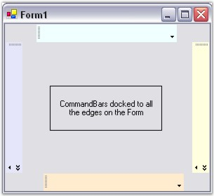
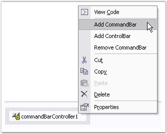
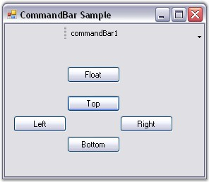
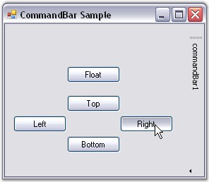

::: {style="DISPLAY: none"}
{#d2h_url_template}{#d2h_package_url style="WIDTH: 0px; DISPLAY: none; HEIGHT: 0px"}
:::

:::::: {.d2h_secondary_topic style="PADDING-BOTTOM: 10pt; MARGIN: 0pt; PADDING-LEFT: 0pt; PADDING-RIGHT: 0pt; PADDING-TOP: 0pt"}
##### Docking CommandBar {#docking-commandbar style="tab-stops: 0pt"}

[]{style="COLOR: #15428b"} 

CommandBar can be docked to all the edges of the form such as Top, Bottom, Right and Left. Docking can be controlled by the CommandBar and CommandBarController properties.

[]{style="COLOR: #15428b"} 

Table 6: Docking CommandBar

::: {align="center"}
+-----------------------------------+-------------------------------------------------------------------------------------------------------------------+
| CommandBar Property               | Description                                                                                                       |
+-----------------------------------+-------------------------------------------------------------------------------------------------------------------+
| AllowedDockBorders                | Gets / sets the edges of the form along which the CommandBar may be docked. The options included are given below. |
|                                   |                                                                                                                   |
|                                   |                                                                                                                   |
|                                   |                                                                                                                   |
|                                   | *Bottom,*                                                                                                         |
|                                   |                                                                                                                   |
|                                   | *Left,*                                                                                                           |
|                                   |                                                                                                                   |
|                                   | *Right,*                                                                                                          |
|                                   |                                                                                                                   |
|                                   | *Top and*                                                                                                         |
|                                   |                                                                                                                   |
|                                   | *None.*                                                                                                           |
|                                   |                                                                                                                   |
|                                   |                                                                                                                   |
|                                   |                                                                                                                   |
|                                   | When set to \'None\', the CommandBar cannot be docked to the form.                                                |
+-----------------------------------+-------------------------------------------------------------------------------------------------------------------+
| AlwaysLeadingEdge                 | Indicates whether the CommandBar is always docked to the leading edge.                                            |
+-----------------------------------+-------------------------------------------------------------------------------------------------------------------+
| AlwaysTrailingEdge                | Indicates whether the CommandBar is always docked to the trailing edge.                                           |
+-----------------------------------+-------------------------------------------------------------------------------------------------------------------+
| DisableDocking                    | Indicates whether the CommandBar is allowed to dock.                                                              |
+-----------------------------------+-------------------------------------------------------------------------------------------------------------------+
| DockModeWrapping                  | Wraps the CommandBar when the bounds are less than the maximum length.                                            |
+-----------------------------------+-------------------------------------------------------------------------------------------------------------------+
| DockState                         | Gets / sets the current dock or float state for the CommandBar.                                                   |
+-----------------------------------+-------------------------------------------------------------------------------------------------------------------+
| ShowDockModeText                  | Indicates whether the text caption should be displayed on a docked CommandBar.                                    |
+-----------------------------------+-------------------------------------------------------------------------------------------------------------------+
:::

[]{style="COLOR: #15428b"} 

::: {style="BORDER-BOTTOM: windowtext 1pt solid; BORDER-LEFT: medium none; PADDING-BOTTOM: 1pt; MARGIN-TOP: 9pt; PADDING-LEFT: 0pt; PADDING-RIGHT: 0pt; MARGIN-BOTTOM: 9pt; BORDER-TOP: windowtext 1pt solid; BORDER-RIGHT: medium none; PADDING-TOP: 1pt"}
{border="0"} Note:[ ]{style="FONT-SIZE: 8pt"}The DisableDocking property must be set to \'False\' for the above settings to take effect.
:::

[]{style="COLOR: #15428b"} 

The docked state of the CommandBar can be disabled by setting the **DisableDocking** property to \'True\'.

[]{style="COLOR: #15428b"} 

EnabledDockBorders

[]{style="COLOR: #15428b"} 

This CommandBarController property allows you to dock the CommandBar to the edges of the form. The AllowedDockBorders property doesn\'t take any effect when this property is set to \'None\'.

[]{style="COLOR: #15428b"} 

Table 7: CommandBarController

::: {align="center"}
+-----------------------------------+--------------------------------------------------------------------------------------------------------------------------+
| CommandBarController Property     | Description                                                                                                              |
+-----------------------------------+--------------------------------------------------------------------------------------------------------------------------+
| EnabledDockBorders                | Gets / sets the edges of the form along which the CommandBars are allowed to dock. The options included are given below. |
|                                   |                                                                                                                          |
|                                   |                                                                                                                          |
|                                   |                                                                                                                          |
|                                   | *Bottom,*                                                                                                                |
|                                   |                                                                                                                          |
|                                   | *Left,*                                                                                                                  |
|                                   |                                                                                                                          |
|                                   | *Right,*                                                                                                                 |
|                                   |                                                                                                                          |
|                                   | *Top and*                                                                                                                |
|                                   |                                                                                                                          |
|                                   | *None.*                                                                                                                  |
+-----------------------------------+--------------------------------------------------------------------------------------------------------------------------+
:::

[\
\
]{style="COLOR: #15428b"}

+----------------------------------------------------------------------------------------------------------------------------------------------------------------------------------------------------------------------------------------------------------------------------------------------------------------------------------------------------------------------------------------------------------------------------------------------------------------------------------------+
| **[\[C#\]]{style="FONT-FAMILY: 'Courier New'; COLOR: black"}**                                                                                                                                                                                                                                                                                                                                                                                                                         |
|                                                                                                                                                                                                                                                                                                                                                                                                                                                                                        |
| []{style="FONT-FAMILY: 'Courier New'; COLOR: green"}                                                                                                                                                                                                                                                                                                                                                                                                                                   |
|                                                                                                                                                                                                                                                                                                                                                                                                                                                                                        |
| [this]{style="FONT-FAMILY: 'Courier New'; COLOR: blue"}[.commandBar1.AllowedDockBorders = ((Syncfusion.Windows.Forms.Tools.[CommandBarDockBorder]{style="COLOR: teal"})(((Syncfusion.Windows.Forms.Tools.[CommandBarDockBorder]{style="COLOR: teal"}.Top \| Syncfusion.Windows.Forms.Tools.[CommandBarDockBorder]{style="COLOR: teal"}.Bottom) \| Syncfusion.Windows.Forms.Tools.[CommandBarDockBorder]{style="COLOR: teal"}.Left)));]{style="FONT-FAMILY: 'Courier New'"}             |
|                                                                                                                                                                                                                                                                                                                                                                                                                                                                                        |
| [this]{style="FONT-FAMILY: 'Courier New'; COLOR: blue"}[.commandBar1.AlwaysLeadingEdge = [true]{style="COLOR: blue"};]{style="FONT-FAMILY: 'Courier New'"}                                                                                                                                                                                                                                                                                                                             |
|                                                                                                                                                                                                                                                                                                                                                                                                                                                                                        |
| [this]{style="FONT-FAMILY: 'Courier New'; COLOR: blue"}[.commandBar1.AlwaysTrailingEdge = [true]{style="COLOR: blue"};]{style="FONT-FAMILY: 'Courier New'"}                                                                                                                                                                                                                                                                                                                            |
|                                                                                                                                                                                                                                                                                                                                                                                                                                                                                        |
| [this]{style="FONT-FAMILY: 'Courier New'; COLOR: blue"}[.commandBar1.DisableDocking = [true]{style="COLOR: blue"};]{style="FONT-FAMILY: 'Courier New'"}                                                                                                                                                                                                                                                                                                                                |
|                                                                                                                                                                                                                                                                                                                                                                                                                                                                                        |
| [this]{style="FONT-FAMILY: 'Courier New'; COLOR: blue"}[.commandBar1.ShowDockModeText = [false]{style="COLOR: blue"};]{style="FONT-FAMILY: 'Courier New'"}                                                                                                                                                                                                                                                                                                                             |
|                                                                                                                                                                                                                                                                                                                                                                                                                                                                                        |
| [this]{style="FONT-FAMILY: 'Courier New'; COLOR: blue"}[.commandBar1.DockState = Syncfusion.Windows.Forms.Tools.[CommandBarDockState]{style="COLOR: teal"}.Top;]{style="FONT-FAMILY: 'Courier New'"}                                                                                                                                                                                                                                                                                   |
|                                                                                                                                                                                                                                                                                                                                                                                                                                                                                        |
| [this]{style="FONT-FAMILY: 'Courier New'; COLOR: blue"}[.commandBar1.DockModeWrapping = [true]{style="COLOR: blue"};]{style="FONT-FAMILY: 'Courier New'"}                                                                                                                                                                                                                                                                                                                              |
|                                                                                                                                                                                                                                                                                                                                                                                                                                                                                        |
| []{style="FONT-FAMILY: 'Courier New'"}                                                                                                                                                                                                                                                                                                                                                                                                                                                 |
|                                                                                                                                                                                                                                                                                                                                                                                                                                                                                        |
| [this]{style="FONT-FAMILY: 'Courier New'; COLOR: blue"}[.commandBarController1.EnabledDockBorders = ((Syncfusion.Windows.Forms.Tools.[CommandBarDockBorder]{style="COLOR: teal"})(((Syncfusion.Windows.Forms.Tools.[CommandBarDockBorder]{style="COLOR: teal"}.Bottom \| Syncfusion.Windows.Forms.Tools.[CommandBarDockBorder]{style="COLOR: teal"}.Left) \| Syncfusion.Windows.Forms.Tools.[CommandBarDockBorder]{style="COLOR: teal"}.Right)));]{style="FONT-FAMILY: 'Courier New'"} |
+----------------------------------------------------------------------------------------------------------------------------------------------------------------------------------------------------------------------------------------------------------------------------------------------------------------------------------------------------------------------------------------------------------------------------------------------------------------------------------------+

[]{style="COLOR: #15428b"} 

+-------------------------------------------------------------------------------------------------------------------------------------------------------------------------------------------------------------------------------------------------------------------------------------------------------------------------------------------------------------------------------------------------------------------------------------------------------------------+
| **[\[VB.NET\]]{style="FONT-FAMILY: 'Courier New'; COLOR: black"}**                                                                                                                                                                                                                                                                                                                                                                                                |
|                                                                                                                                                                                                                                                                                                                                                                                                                                                                   |
| []{style="FONT-FAMILY: 'Courier New'; COLOR: black"}                                                                                                                                                                                                                                                                                                                                                                                                              |
|                                                                                                                                                                                                                                                                                                                                                                                                                                                                   |
| [Me]{style="FONT-FAMILY: 'Courier New'; COLOR: blue"}[.commandBar1.AllowedDockBorders = ([CType]{style="COLOR: blue"}(((Syncfusion.Windows.Forms.Tools.CommandBarDockBorder.Top [Or]{style="COLOR: blue"} Syncfusion.Windows.Forms.Tools.CommandBarDockBorder.Bottom) [Or]{style="COLOR: blue"} Syncfusion.Windows.Forms.Tools.CommandBarDockBorder.Left), Syncfusion.Windows.Forms.Tools.CommandBarDockBorder))]{style="FONT-FAMILY: 'Courier New'"}             |
|                                                                                                                                                                                                                                                                                                                                                                                                                                                                   |
| [Me]{style="FONT-FAMILY: 'Courier New'; COLOR: blue"}[.commandBar1.AlwaysLeadingEdge=[True]{style="COLOR: blue"}]{style="FONT-FAMILY: 'Courier New'"}                                                                                                                                                                                                                                                                                                             |
|                                                                                                                                                                                                                                                                                                                                                                                                                                                                   |
| [Me]{style="FONT-FAMILY: 'Courier New'; COLOR: blue"}[.commandBar1.AlwaysTrailingEdge = [True]{style="COLOR: blue"}]{style="FONT-FAMILY: 'Courier New'"}                                                                                                                                                                                                                                                                                                          |
|                                                                                                                                                                                                                                                                                                                                                                                                                                                                   |
| [Me]{style="FONT-FAMILY: 'Courier New'; COLOR: blue"}[.commandBar1.DisableDocking=[True]{style="COLOR: blue"}]{style="FONT-FAMILY: 'Courier New'"}                                                                                                                                                                                                                                                                                                                |
|                                                                                                                                                                                                                                                                                                                                                                                                                                                                   |
| [Me]{style="FONT-FAMILY: 'Courier New'; COLOR: blue"}[.commandBar1.ShowDockModeText = [False]{style="COLOR: blue"}]{style="FONT-FAMILY: 'Courier New'"}                                                                                                                                                                                                                                                                                                           |
|                                                                                                                                                                                                                                                                                                                                                                                                                                                                   |
| [Me]{style="FONT-FAMILY: 'Courier New'; COLOR: blue"}[.commandBar1.DockState = Syncfusion.Windows.Forms.Tools.CommandBarDockState.Top]{style="FONT-FAMILY: 'Courier New'"}                                                                                                                                                                                                                                                                                        |
|                                                                                                                                                                                                                                                                                                                                                                                                                                                                   |
| [Me]{style="FONT-FAMILY: 'Courier New'; COLOR: blue"}[.commandBar1.DockModeWrapping = [True]{style="COLOR: blue"}]{style="FONT-FAMILY: 'Courier New'"}                                                                                                                                                                                                                                                                                                            |
|                                                                                                                                                                                                                                                                                                                                                                                                                                                                   |
| []{style="FONT-FAMILY: 'Courier New'; COLOR: blue"}                                                                                                                                                                                                                                                                                                                                                                                                               |
|                                                                                                                                                                                                                                                                                                                                                                                                                                                                   |
| [Me]{style="FONT-FAMILY: 'Courier New'; COLOR: blue"}[.commandBarController1.EnabledDockBorders = ([CType]{style="COLOR: blue"}(((Syncfusion.Windows.Forms.Tools.CommandBarDockBorder.Bottom [Or]{style="COLOR: blue"} Syncfusion.Windows.Forms.Tools.CommandBarDockBorder.Left) [Or]{style="COLOR: blue"} Syncfusion.Windows.Forms.Tools.CommandBarDockBorder.Right), Syncfusion.Windows.Forms.Tools.CommandBarDockBorder))]{style="FONT-FAMILY: 'Courier New'"} |
+-------------------------------------------------------------------------------------------------------------------------------------------------------------------------------------------------------------------------------------------------------------------------------------------------------------------------------------------------------------------------------------------------------------------------------------------------------------------+

[]{style="COLOR: #4a5c8c; FONT-SIZE: 8pt"} 

The following figure illustrates the above settings.

[]{style="COLOR: #15428b"} 

 

 

 

{border="0"}

[]{style="COLOR: #15428b"} 

Figure 13: Docking CommandBars

[]{style="COLOR: #4a5c8c; FONT-SIZE: 8pt"} 

Procedure

[]{style="COLOR: #4a5c8c; FONT-SIZE: 8pt"} 

The following step by step procedure helps you to dock the CommandBar to the target location.

[]{style="COLOR: #15428b"} 

1.   Drag the CommandBarController onto the form and add a CommandBar through the design time verb.

[]{style="COLOR: #15428b"} 

{border="0"}

[]{style="COLOR: #15428b"} 

Figure 14: Adding CommandBar Through Design Time Verb

[]{style="COLOR: #15428b"} 

2.   Drag buttons onto the form and arrange the buttons as shown as below.

[]{style="COLOR: #15428b"} 

{border="0"}

[]{style="COLOR: #15428b"} 

Figure 15: CommandBar and Buttons in the Designer

[]{style="COLOR: #15428b"} 

3.   Specify the docking state of the CommandBar in the button click event using the following code snippet.

[]{style="COLOR: #15428b"} 

+-----------------------------------------------------------------------------------------------------------------------------------------------------------------------------------------------------------------------------+
| **[\[C#\]]{style="FONT-FAMILY: 'Courier New'; COLOR: black"}**                                                                                                                                                              |
|                                                                                                                                                                                                                             |
| []{style="FONT-FAMILY: 'Courier New'; COLOR: black"}                                                                                                                                                                        |
|                                                                                                                                                                                                                             |
| [private]{style="FONT-FAMILY: 'Courier New'; COLOR: blue"}[ [void]{style="COLOR: blue"} button1_Click([object]{style="COLOR: blue"} sender, System.[EventArgs]{style="COLOR: teal"} e)]{style="FONT-FAMILY: 'Courier New'"} |
|                                                                                                                                                                                                                             |
| [{]{style="FONT-FAMILY: 'Courier New'"}                                                                                                                                                                                     |
|                                                                                                                                                                                                                             |
| [Button]{style="FONT-FAMILY: 'Courier New'; COLOR: teal"}[ btn = sender [as]{style="COLOR: blue"} [Button]{style="COLOR: teal"}; ]{style="FONT-FAMILY: 'Courier New'"}                                                      |
|                                                                                                                                                                                                                             |
| [// Dock to the Top]{style="FONT-FAMILY: 'Courier New'; COLOR: green"}                                                                                                                                                      |
|                                                                                                                                                                                                                             |
| [if]{style="FONT-FAMILY: 'Courier New'; COLOR: blue"}[ (btn == [this]{style="COLOR: blue"}.top)]{style="FONT-FAMILY: 'Courier New'"}                                                                                        |
|                                                                                                                                                                                                                             |
| [this]{style="FONT-FAMILY: 'Courier New'; COLOR: blue"}[.commandBar1.DockState = [CommandBarDockState]{style="COLOR: teal"}.Top;]{style="FONT-FAMILY: 'Courier New'"}                                                       |
|                                                                                                                                                                                                                             |
| [// Dock to the Bottom]{style="FONT-FAMILY: 'Courier New'; COLOR: green"}                                                                                                                                                   |
|                                                                                                                                                                                                                             |
| [if]{style="FONT-FAMILY: 'Courier New'; COLOR: blue"}[ (btn == [this]{style="COLOR: blue"}.bottom)]{style="FONT-FAMILY: 'Courier New'"}                                                                                     |
|                                                                                                                                                                                                                             |
| [this]{style="FONT-FAMILY: 'Courier New'; COLOR: blue"}[.commandBar1.DockState = [CommandBarDockState]{style="COLOR: teal"}.Bottom;]{style="FONT-FAMILY: 'Courier New'"}                                                    |
|                                                                                                                                                                                                                             |
| [// Dock to the Right]{style="FONT-FAMILY: 'Courier New'; COLOR: green"}                                                                                                                                                    |
|                                                                                                                                                                                                                             |
| [if]{style="FONT-FAMILY: 'Courier New'; COLOR: blue"}[ (btn == [this]{style="COLOR: blue"}.right)]{style="FONT-FAMILY: 'Courier New'"}                                                                                      |
|                                                                                                                                                                                                                             |
| [this]{style="FONT-FAMILY: 'Courier New'; COLOR: blue"}[.commandBar1.DockState = [CommandBarDockState]{style="COLOR: teal"}.Right;]{style="FONT-FAMILY: 'Courier New'"}                                                     |
|                                                                                                                                                                                                                             |
| [// Dock to the Left]{style="FONT-FAMILY: 'Courier New'; COLOR: green"}                                                                                                                                                     |
|                                                                                                                                                                                                                             |
| [if]{style="FONT-FAMILY: 'Courier New'; COLOR: blue"}[ (btn == [this]{style="COLOR: blue"}.left)]{style="FONT-FAMILY: 'Courier New'"}                                                                                       |
|                                                                                                                                                                                                                             |
| [this]{style="FONT-FAMILY: 'Courier New'; COLOR: blue"}[.commandBar1.DockState = [CommandBarDockState]{style="COLOR: teal"}.Left;]{style="FONT-FAMILY: 'Courier New'"}                                                      |
|                                                                                                                                                                                                                             |
| [// Dock as Floating]{style="FONT-FAMILY: 'Courier New'; COLOR: green"}                                                                                                                                                     |
|                                                                                                                                                                                                                             |
| [if]{style="FONT-FAMILY: 'Courier New'; COLOR: blue"}[ (btn == [this]{style="COLOR: blue"}.float_btn)]{style="FONT-FAMILY: 'Courier New'"}                                                                                  |
|                                                                                                                                                                                                                             |
| [this]{style="FONT-FAMILY: 'Courier New'; COLOR: blue"}[.commandBar1.DockState = [CommandBarDockState]{style="COLOR: teal"}.Float;]{style="FONT-FAMILY: 'Courier New'"}                                                     |
|                                                                                                                                                                                                                             |
| [}]{style="FONT-FAMILY: 'Courier New'"}                                                                                                                                                                                     |
+-----------------------------------------------------------------------------------------------------------------------------------------------------------------------------------------------------------------------------+

[]{style="COLOR: #15428b"} 

+--------------------------------------------------------------------------------------------------------------------------------------------------------------------------------------------------------------------------------------------------------------------------------------------------------------------------------------------------------------------------------------------------------------------+
| **[\[VB.NET\]]{style="FONT-FAMILY: 'Courier New'; COLOR: black"}**                                                                                                                                                                                                                                                                                                                                                 |
|                                                                                                                                                                                                                                                                                                                                                                                                                    |
| []{style="FONT-FAMILY: 'Courier New'; COLOR: black"}                                                                                                                                                                                                                                                                                                                                                               |
|                                                                                                                                                                                                                                                                                                                                                                                                                    |
| [Private]{style="FONT-FAMILY: 'Courier New'; COLOR: blue"}[ [Sub]{style="COLOR: blue"} button1_Click([ByVal]{style="COLOR: blue"} sender [As]{style="COLOR: blue"} [Object]{style="COLOR: blue"}, [ByVal]{style="COLOR: blue"} e [As]{style="COLOR: blue"} System.EventArgs) [Handles]{style="COLOR: blue"} top.Click, right.Click, left.Click, bottom.Click, float_btn.Click]{style="FONT-FAMILY: 'Courier New'"} |
|                                                                                                                                                                                                                                                                                                                                                                                                                    |
| [Dim]{style="FONT-FAMILY: 'Courier New'; COLOR: blue"}[ btn [As]{style="COLOR: blue"} Button = sender [\']{style="COLOR: green"}]{style="FONT-FAMILY: 'Courier New'"}                                                                                                                                                                                                                                              |
|                                                                                                                                                                                                                                                                                                                                                                                                                    |
| [\' Dock to the Top]{style="FONT-FAMILY: 'Courier New'; COLOR: green"}                                                                                                                                                                                                                                                                                                                                             |
|                                                                                                                                                                                                                                                                                                                                                                                                                    |
| [If]{style="FONT-FAMILY: 'Courier New'; COLOR: blue"}[ btn [Is]{style="COLOR: blue"} [Me]{style="COLOR: blue"}.top [Then]{style="COLOR: blue"}]{style="FONT-FAMILY: 'Courier New'"}                                                                                                                                                                                                                                |
|                                                                                                                                                                                                                                                                                                                                                                                                                    |
| [Me]{style="FONT-FAMILY: 'Courier New'; COLOR: blue"}[.commandBar1.DockState = CommandBarDockState.Top]{style="FONT-FAMILY: 'Courier New'"}                                                                                                                                                                                                                                                                        |
|                                                                                                                                                                                                                                                                                                                                                                                                                    |
| [End]{style="FONT-FAMILY: 'Courier New'; COLOR: blue"}[ [If]{style="COLOR: blue"}]{style="FONT-FAMILY: 'Courier New'"}                                                                                                                                                                                                                                                                                             |
|                                                                                                                                                                                                                                                                                                                                                                                                                    |
| [\'Dock to the Bottom]{style="FONT-FAMILY: 'Courier New'; COLOR: green"}                                                                                                                                                                                                                                                                                                                                           |
|                                                                                                                                                                                                                                                                                                                                                                                                                    |
| [If]{style="FONT-FAMILY: 'Courier New'; COLOR: blue"}[ btn [Is]{style="COLOR: blue"} [Me]{style="COLOR: blue"}.bottom [Then]{style="COLOR: blue"}]{style="FONT-FAMILY: 'Courier New'"}                                                                                                                                                                                                                             |
|                                                                                                                                                                                                                                                                                                                                                                                                                    |
| [Me]{style="FONT-FAMILY: 'Courier New'; COLOR: blue"}[.commandBar1.DockState = CommandBarDockState.Bottom]{style="FONT-FAMILY: 'Courier New'"}                                                                                                                                                                                                                                                                     |
|                                                                                                                                                                                                                                                                                                                                                                                                                    |
| [End]{style="FONT-FAMILY: 'Courier New'; COLOR: blue"}[ [If]{style="COLOR: blue"}]{style="FONT-FAMILY: 'Courier New'"}                                                                                                                                                                                                                                                                                             |
|                                                                                                                                                                                                                                                                                                                                                                                                                    |
| [\'Dock to the Right]{style="FONT-FAMILY: 'Courier New'; COLOR: green"}                                                                                                                                                                                                                                                                                                                                            |
|                                                                                                                                                                                                                                                                                                                                                                                                                    |
| [If]{style="FONT-FAMILY: 'Courier New'; COLOR: blue"}[ btn [Is]{style="COLOR: blue"} [Me]{style="COLOR: blue"}.right [Then]{style="COLOR: blue"}]{style="FONT-FAMILY: 'Courier New'"}                                                                                                                                                                                                                              |
|                                                                                                                                                                                                                                                                                                                                                                                                                    |
| [Me]{style="FONT-FAMILY: 'Courier New'; COLOR: blue"}[.commandBar1.DockState = CommandBarDockState.Right]{style="FONT-FAMILY: 'Courier New'"}                                                                                                                                                                                                                                                                      |
|                                                                                                                                                                                                                                                                                                                                                                                                                    |
| [End]{style="FONT-FAMILY: 'Courier New'; COLOR: blue"}[ [If]{style="COLOR: blue"}]{style="FONT-FAMILY: 'Courier New'"}                                                                                                                                                                                                                                                                                             |
|                                                                                                                                                                                                                                                                                                                                                                                                                    |
| [\'Dock to the Left]{style="FONT-FAMILY: 'Courier New'; COLOR: green"}                                                                                                                                                                                                                                                                                                                                             |
|                                                                                                                                                                                                                                                                                                                                                                                                                    |
| [If]{style="FONT-FAMILY: 'Courier New'; COLOR: blue"}[ btn [Is]{style="COLOR: blue"} [Me]{style="COLOR: blue"}.left [Then]{style="COLOR: blue"}]{style="FONT-FAMILY: 'Courier New'"}                                                                                                                                                                                                                               |
|                                                                                                                                                                                                                                                                                                                                                                                                                    |
| [Me]{style="FONT-FAMILY: 'Courier New'; COLOR: blue"}[.commandBar1.DockState = CommandBarDockState.Left]{style="FONT-FAMILY: 'Courier New'"}                                                                                                                                                                                                                                                                       |
|                                                                                                                                                                                                                                                                                                                                                                                                                    |
| [End]{style="FONT-FAMILY: 'Courier New'; COLOR: blue"}[ [If]{style="COLOR: blue"}]{style="FONT-FAMILY: 'Courier New'"}                                                                                                                                                                                                                                                                                             |
|                                                                                                                                                                                                                                                                                                                                                                                                                    |
| [Dock [as]{style="COLOR: blue"} Floating]{style="FONT-FAMILY: 'Courier New'"}                                                                                                                                                                                                                                                                                                                                      |
|                                                                                                                                                                                                                                                                                                                                                                                                                    |
| [If]{style="FONT-FAMILY: 'Courier New'; COLOR: blue"}[ btn [Is]{style="COLOR: blue"} [Me]{style="COLOR: blue"}.float_btn [Then]{style="COLOR: blue"}]{style="FONT-FAMILY: 'Courier New'"}                                                                                                                                                                                                                          |
|                                                                                                                                                                                                                                                                                                                                                                                                                    |
| [Me]{style="FONT-FAMILY: 'Courier New'; COLOR: blue"}[.commandBar1.DockState = CommandBarDockState.Float]{style="FONT-FAMILY: 'Courier New'"}                                                                                                                                                                                                                                                                      |
|                                                                                                                                                                                                                                                                                                                                                                                                                    |
| [End]{style="FONT-FAMILY: 'Courier New'; COLOR: blue"}[ [If]{style="COLOR: blue"}]{style="FONT-FAMILY: 'Courier New'"}                                                                                                                                                                                                                                                                                             |
|                                                                                                                                                                                                                                                                                                                                                                                                                    |
| [End]{style="FONT-FAMILY: 'Courier New'; COLOR: blue"}[ [Sub]{style="COLOR: blue"}]{style="FONT-FAMILY: 'Courier New'"}                                                                                                                                                                                                                                                                                            |
+--------------------------------------------------------------------------------------------------------------------------------------------------------------------------------------------------------------------------------------------------------------------------------------------------------------------------------------------------------------------------------------------------------------------+

[]{style="COLOR: #15428b"} 

Output

[]{style="COLOR: #15428b"} 

The following figure shows the CommandBar docked to the right border of the Form.

[]{style="COLOR: #15428b"} 

{border="0"}

***[]{style="COLOR: #15428b"}*** 

Figure 16: CommandBar docked to the right border of the form on clicking the Right Button

[]{style="COLOR: #15428b"} 

A sample which demonstrates the Docked CommandBar is available in the below sample installation path.

 

..My Documents\\Syncfusion\\EssentialStudio\\***Version Number***\\Windows\\Tools.Windows\\Samples\\2.0\\CommandBars Package\\CommandBars

[]{style="COLOR: #15428b"} 

See Also

[]{style="COLOR: #15428b"} 

[Floating CommandBar]{.UGHyperlink}[]{.UGHyperlink}

[]{#related-topics}
::::::
