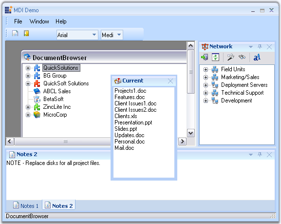

::: {style="DISPLAY: none"}
{#d2h_url_template}{#d2h_package_url style="WIDTH: 0px; DISPLAY: none; HEIGHT: 0px"}
:::

::::: {#nsbanner .d2h_main_nsbanner style="BORDER-BOTTOM: #999999 1px solid; POSITION: relative; PADDING-BOTTOM: 0px; BACKGROUND-COLOR: transparent; PADDING-LEFT: 0px; PADDING-RIGHT: 0px; DISPLAY: none; BORDER-TOP: #999999 1px solid; PADDING-TOP: 0px; LEFT: 0px"}
:::: {#TitleRow .d2h_main_titlerow style="PADDING-BOTTOM: 4px; BACKGROUND-COLOR: transparent; PADDING-LEFT: 22px; WIDTH: 100%; PADDING-RIGHT: 10px; DISPLAY: none; PADDING-TOP: 4px"}
::: {#ienav .d2h_main_ienav style="DISPLAY: none"}
{#D2HPrevious .D2HPreviousEnabled}  {#D2HNext .D2HNextEnabled}
:::
::::
:::::

:::: {#nstext .d2h_main_nstext style="PADDING-BOTTOM: 10px; BACKGROUND-COLOR: transparent; PADDING-LEFT: 22px; PADDING-RIGHT: 10px; HEIGHT: 100%; OVERFLOW: auto; PADDING-TOP: 5px" hasuserbackground="true" valign="bottom"}
::: {#d2h_breadcrumbs .d2h_breadcrumbs}
[Essential Studio User Guide Documentation](ms-xhelp:///?Id=12457748-09e3-4d74-a240-8e049cedf030){.d2h_breadcrumbsNormal}[ \> ]{.d2h_breadcrumbsLinkSeparator}[User Interface Edition](ms-xhelp:///?Id=c29296b7-531c-413b-a0ec-488ca1f7f669){.d2h_breadcrumbsNormal}[ \> ]{.d2h_breadcrumbsLinkSeparator}[Essential Windows](ms-xhelp:///?Id=e60759d8-47a4-4570-9d7a-16a68d63f2ea){.d2h_breadcrumbsNormal}[ \> ]{.d2h_breadcrumbsLinkSeparator}[Essential Tools]{.d2h_breadcrumbsContentsOnly}[ \> ]{.d2h_breadcrumbsLinkSeparator}[Tools Controls](ms-xhelp:///?Id=13c3c4f4-9d16-4b69-93f2-7e98eec67452){.d2h_breadcrumbsNormal}
:::

## Docking Package {#docking-package style="tab-stops: 0pt"}

 

[]{#p41}The Docking Package comprises of the Essential Tools docking windows architecture that allows users to add Visual Studio .NET type dockable controls to Windows Forms applications. Any control can be set as a docking window and docking layouts can be hosted within Forms, UserControls or any derivative of the ContainerControl type. The framework supports the complete range of docking behaviors such as docking/floating, nested levels, tabbed groups, state transitions, autohide, MDIChild transitions, non-dockable/non-floatable options, a unique fill mode and full state persistence. An advanced designer allows users to harness full WYSIWYG configuration of the dock layout.

 

The Essential Tools docking framework implements the core docking interactions and additionally implements certain other complex features such as multiple docking levels, nested docking, tabbed docking, tear-off tabs, auto-hide mode and full state persistence.

 

Docking Manager is the component that supports Visual Studio .NET style docking / floating windows with full design-time support. The Office 2007 visual styles in blue, black and silver color schemes can also be applied to the docking windows.

 

{border="0"}

***[]{style="COLOR: #15428b"}*** 

Figure 37: Syncfusion Essential Docking

 

More:

[ ]{#related-topics}

[{border="0" align="absMiddle"}Features](ms-xhelp:///?Id=8ad01cec-15ed-4dbb-9a44-b2bb6eabbd07){style="TEXT-DECORATION: none"}

[{border="0" align="absMiddle"}Getting Started](ms-xhelp:///?Id=da0a4929-ede7-4061-ab4f-273d2f235682){style="TEXT-DECORATION: none"}

[{border="0" align="absMiddle"}Concepts and Features](ms-xhelp:///?Id=59d498e2-f141-4f5a-830e-6b76732bc4fe){style="TEXT-DECORATION: none"}

[{border="0" align="absMiddle"}Frequently Asked Questions](ms-xhelp:///?Id=e0ec7ca9-6a29-4e15-83ee-4f01c9e61071){style="TEXT-DECORATION: none"}
::::
