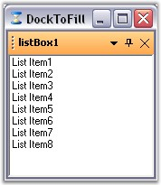

::: {style="DISPLAY: none"}
{#d2h_url_template}{#d2h_package_url style="WIDTH: 0px; DISPLAY: none; HEIGHT: 0px"}
:::

::::: {.d2h_secondary_topic style="PADDING-BOTTOM: 10pt; MARGIN: 0pt; PADDING-LEFT: 0pt; PADDING-RIGHT: 0pt; PADDING-TOP: 0pt"}
##### DockToFill, Freeze Resizing {#docktofill-freeze-resizing style="tab-stops: 0pt"}

[]{style="COLOR: #15428b"} 

The DockToFill property allows users to implement a very unique docking layout where a non-MDIContainer form or ContainerControl\'s entire client region is occupied by the dockable controls.

[]{style="COLOR: #15428b"} 

::: {align="center"}
  ------------------------- -------------------------------------------------------------------------------------------------------
  DockingManager Property   Description
  DockToFill                Sets the boolean value indicating whether the docked control occupies the form\'s full client region.
  ------------------------- -------------------------------------------------------------------------------------------------------
:::

[]{style="COLOR: #15428b"} 

+---------------------------------------------------------------------------------------------------------------------------------------------------------+
| **[\[C#\]]{style="FONT-FAMILY: 'Courier New'; COLOR: black"}**                                                                                          |
|                                                                                                                                                         |
| []{style="FONT-FAMILY: 'Courier New'; COLOR: green"}                                                                                                    |
|                                                                                                                                                         |
| [this]{style="FONT-FAMILY: 'Courier New'; COLOR: blue"}[.dockingManager1.DockToFill = [true]{style="COLOR: blue"};]{style="FONT-FAMILY: 'Courier New'"} |
+---------------------------------------------------------------------------------------------------------------------------------------------------------+

[]{style="COLOR: #15428b"} 

+-------------------------------------------------------------------------------------------------------------------------------------------------------+
| **[\[VB.NET\]]{style="FONT-FAMILY: 'Courier New'; COLOR: black"}**                                                                                    |
|                                                                                                                                                       |
| []{style="FONT-FAMILY: 'Courier New'; COLOR: green"}                                                                                                  |
|                                                                                                                                                       |
| [Me]{style="FONT-FAMILY: 'Courier New'; COLOR: blue"}[.dockingManager1.DockToFill = [True]{style="COLOR: blue"};]{style="FONT-FAMILY: 'Courier New'"} |
+-------------------------------------------------------------------------------------------------------------------------------------------------------+

**[]{style="COLOR: #15428b"}** 

{border="0"}

[]{style="COLOR: #15428b"} 

Figure 91: DocToFill Enabled

**[]{style="COLOR: #15428b"}** 

A sample which demonstrates DockToFill property is available in the below sample installation path.

 

..My Documents\\Syncfusion\\EssentialStudio\\***Version Number***\\Windows\\Tools.Windows\\Samples\\2.0\\Docking Package\\WindowFill

**[]{style="COLOR: #15428b"}** 

FreezeResizing

**[]{style="COLOR: #15428b"}** 

The FreezeResizing property has been implemented for each control by which, the end users can freeze any particular control. Also, the property value can be persisted. A global FreezeResizing property is also available using which all the controls can be frozen.

 

The controls can also be frozen by calling the **SetFreezeResizing** method which freezes the specified control and the user will no more be able to resize the controls.

 

::: {align="center"}
+-----------------------------------+----------------------------------------------------------------------------------------------------------------------------------------+
| Parameter                         | Description                                                                                                                            |
+-----------------------------------+----------------------------------------------------------------------------------------------------------------------------------------+
| SetFreezeResizing                 | Freezes the specified control. The parameters are,                                                                                     |
|                                   |                                                                                                                                        |
|                                   | *[]{style="COLOR: black; FONT-SIZE: 8pt"}*                                                                                             |
|                                   |                                                                                                                                        |
|                                   | *Ctrl* - The control for which docking is enabled.                                                                                     |
|                                   |                                                                                                                                        |
|                                   | *freeze* -*[ ]{style="COLOR: black; FONT-SIZE: 8pt"}*Represents a boolean value which decides whether to freeze the specified control. |
+-----------------------------------+----------------------------------------------------------------------------------------------------------------------------------------+
:::

[]{style="COLOR: #15428b"} 

+-------------------------------------------------------------------------------------------------------------------------------------------------------------------------------------------------+
| **[\[C#\]]{style="FONT-FAMILY: 'Courier New'; COLOR: black"}**                                                                                                                                  |
|                                                                                                                                                                                                 |
| []{style="FONT-FAMILY: 'Courier New'; COLOR: green"}                                                                                                                                            |
|                                                                                                                                                                                                 |
| [this]{style="FONT-FAMILY: 'Courier New'; COLOR: blue"}[.dockingManager1.FreezeResizing = [true]{style="COLOR: blue"};]{style="FONT-FAMILY: 'Courier New'"}                                     |
|                                                                                                                                                                                                 |
| [this]{style="FONT-FAMILY: 'Courier New'; COLOR: blue"}[.dockingManager1.SetFreezeResize([this]{style="COLOR: blue"}.panel1, [true]{style="COLOR: blue"});]{style="FONT-FAMILY: 'Courier New'"} |
+-------------------------------------------------------------------------------------------------------------------------------------------------------------------------------------------------+

[]{style="COLOR: #15428b"} 

+--------------------------------------------------------------------------------------------------------------------------------------------------------------------------------------------+
| **[\[VB.NET\]]{style="FONT-FAMILY: 'Courier New'; COLOR: black"}**                                                                                                                         |
|                                                                                                                                                                                            |
| []{style="COLOR: #15428b"}                                                                                                                                                                 |
|                                                                                                                                                                                            |
| [Me]{style="FONT-FAMILY: 'Courier New'; COLOR: blue"}[.dockingManager1.FreezeResizing = [True]{style="COLOR: blue"}]{style="FONT-FAMILY: 'Courier New'"}                                   |
|                                                                                                                                                                                            |
| [Me]{style="FONT-FAMILY: 'Courier New'; COLOR: blue"}[.dockingManager1.SetFreezeResize([Me]{style="COLOR: blue"}.panel1, [True]{style="COLOR: blue"})]{style="FONT-FAMILY: 'Courier New'"} |
+--------------------------------------------------------------------------------------------------------------------------------------------------------------------------------------------+

**[]{style="COLOR: #15428b"}** 

A sample which uses FreezeResizing property is available in the below sample installation path.

 

..My Documents\\Syncfusion\\EssentialStudio\\***Version Number***\\Windows\\Tools.Windows\\Samples\\2.0\\Docking Package\\SDIDemo

[]{style="COLOR: #15428b"} 

See Also

[]{style="COLOR: black"}

[[Getting Started]{style="COLOR: blue"}]{.UGHyperlink}

 

[]{#p76} 

[]{#related-topics}
:::::
