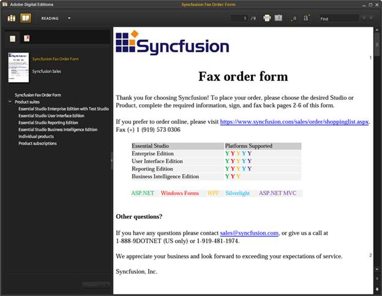
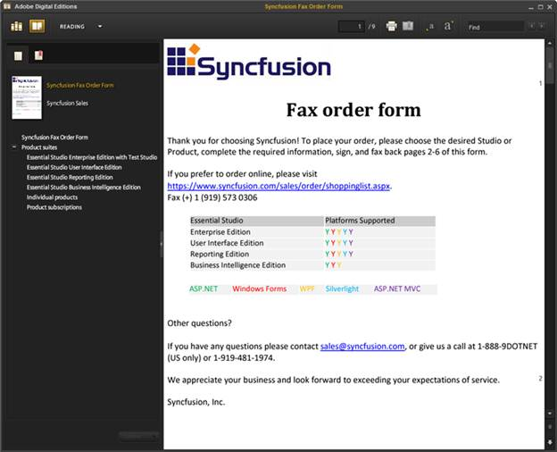
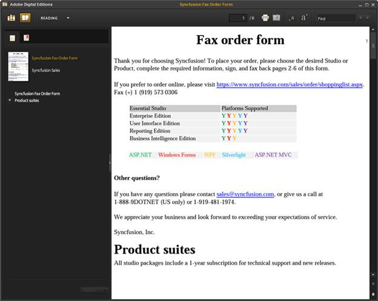

::: {style="DISPLAY: none"}
{#d2h_url_template}{#d2h_package_url style="WIDTH: 0px; DISPLAY: none; HEIGHT: 0px"}
:::

::::: {#nsbanner .d2h_main_nsbanner style="BORDER-BOTTOM: #999999 1px solid; POSITION: relative; PADDING-BOTTOM: 0px; BACKGROUND-COLOR: transparent; PADDING-LEFT: 0px; PADDING-RIGHT: 0px; DISPLAY: none; BORDER-TOP: #999999 1px solid; PADDING-TOP: 0px; LEFT: 0px"}
:::: {#TitleRow .d2h_main_titlerow style="PADDING-BOTTOM: 4px; BACKGROUND-COLOR: transparent; PADDING-LEFT: 22px; WIDTH: 100%; PADDING-RIGHT: 10px; DISPLAY: none; PADDING-TOP: 4px"}
::: {#ienav .d2h_main_ienav style="DISPLAY: none"}
{#D2HPrevious .D2HPreviousEnabled}  {#D2HNext .D2HNextEnabled}
:::
::::
:::::

::::::: {#nstext .d2h_main_nstext style="PADDING-BOTTOM: 10px; BACKGROUND-COLOR: transparent; PADDING-LEFT: 22px; PADDING-RIGHT: 10px; HEIGHT: 100%; OVERFLOW: auto; PADDING-TOP: 5px" hasuserbackground="true" valign="bottom"}
::: {#d2h_breadcrumbs .d2h_breadcrumbs}
[Essential Studio User Guide Documentation](ms-xhelp:///?Id=12457748-09e3-4d74-a240-8e049cedf030){.d2h_breadcrumbsNormal}[ \> ]{.d2h_breadcrumbsLinkSeparator}[Reporting Edition](ms-xhelp:///?Id=027aa5b6-6676-4f93-ad23-c20e8c45792e){.d2h_breadcrumbsNormal}[ \> ]{.d2h_breadcrumbsLinkSeparator}[Essential DocIO](ms-xhelp:///?Id=b88d77b3-4c51-460f-a761-d2ef6d5b0ca6){.d2h_breadcrumbsNormal}[ \> ]{.d2h_breadcrumbsLinkSeparator}[Concepts and Features](ms-xhelp:///?Id=c1881696-52ce-4414-9f3d-97433d8e9775){.d2h_breadcrumbsNormal}[ \> ]{.d2h_breadcrumbsLinkSeparator}[Conversion](ms-xhelp:///?Id=40fa4de2-c2cf-4de2-b478-32fe4a79387b){.d2h_breadcrumbsNormal}
:::

### Doc to EPub {#doc-to-epub style="tab-stops: 0pt"}

 

EPub is the short form of Electronic Publication; the popular e-book standard by [[International Digital Publishing Forum]{.UGHyperlink}](http://www.idpf.org/) (IDPF) with the extension .epub. EPub files have reflowable content, which allows the document text display to be optimized based on the reader and device in use.

::: {style="BORDER-BOTTOM: windowtext 1pt solid; BORDER-LEFT: medium none; PADDING-BOTTOM: 1pt; MARGIN-TOP: 9pt; PADDING-LEFT: 0pt; PADDING-RIGHT: 0pt; MARGIN-BOTTOM: 9pt; BORDER-TOP: windowtext 1pt solid; BORDER-RIGHT: medium none; PADDING-TOP: 1pt"}
Note: A reflowable document is a type of electronic document that can adapt its presentation to the output device. Typical desktop publishing (DTP) output formats like Postscript or PDF are page-oriented, so are not generally reflowable, whereas the world wide web standard, HTML is a reflowable format.
:::

 

Use Case Scenario

This feature helps users to convert Word documents to reflowable content (EPUB Formatted Book) that can be used for distribution and sales.

 

EPub Conversion Using DocIO

Essential DocIO supports conversion of MS Word documents to EPub v2.0.1. DocIO supports conversion of elements such as Text and Paragraph formatting, Lists, Images, Hyperlinks, Tables and Footnotes to EPub format.

By default, Table of Contents (TOC) is enabled in the EPub document. It is generated based on the built-in heading styles or custom styles mentioned in the TOC field.

::: {style="BORDER-BOTTOM: windowtext 1pt solid; BORDER-LEFT: medium none; PADDING-BOTTOM: 1pt; MARGIN-TOP: 9pt; PADDING-LEFT: 0pt; PADDING-RIGHT: 0pt; MARGIN-BOTTOM: 9pt; BORDER-TOP: windowtext 1pt solid; BORDER-RIGHT: medium none; PADDING-TOP: 1pt"}
Note: You need to have an EPub reader installed in the machine to view the output EPub document.
:::

 

Support for conversion to EPub is available in the following platforms:

 

[·      ]{style="FONT-FAMILY: Symbol"}Windows Forms

[·      ]{style="FONT-FAMILY: Symbol"}ASP.NET

[·      ]{style="FONT-FAMILY: Symbol"}WPF

[·      ]{style="FONT-FAMILY: Symbol"}ASP.NET MVC

 

The following code illustrates how to convert a Word document to EPub file format.

 

+--------------------------------------------------------------------------------------------------------------------------------------------------------------------------------------------------+
| **[\[C#\]]{style="FONT-FAMILY: 'Courier New'"}**                                                                                                                                                 |
|                                                                                                                                                                                                  |
| **[]{style="FONT-FAMILY: 'Courier New'"}**                                                                                                                                                       |
|                                                                                                                                                                                                  |
| [// Load any .doc or .docx file]{style="FONT-FAMILY: 'Courier New'; COLOR: green"}                                                                                                               |
|                                                                                                                                                                                                  |
| [WordDocument]{style="FONT-FAMILY: 'Courier New'; COLOR: #2b91af"}[ document = [new]{style="COLOR: blue"} [WordDocument]{style="COLOR: #2b91af"}(filename);]{style="FONT-FAMILY: 'Courier New'"} |
|                                                                                                                                                                                                  |
| [                ]{style="FONT-FAMILY: 'Courier New'"}                                                                                                                                           |
|                                                                                                                                                                                                  |
| [// Save the EPub file]{style="FONT-FAMILY: 'Courier New'; COLOR: green"}[]{style="FONT-FAMILY: 'Courier New'"}                                                                                  |
|                                                                                                                                                                                                  |
| [document.Save([\"Sample.epub\"]{style="COLOR: #a31515"}, [FormatType]{style="COLOR: #2b91af"}.EPub);[]{style="COLOR: green"}]{style="FONT-FAMILY: 'Courier New'"}                               |
+--------------------------------------------------------------------------------------------------------------------------------------------------------------------------------------------------+

 

+--------------------------------------------------------------------------------------------------------------------------------------------------------------------------------------------------+
| **[\[VB\]]{style="FONT-FAMILY: 'Courier New'"}**                                                                                                                                                 |
|                                                                                                                                                                                                  |
| **[]{style="FONT-FAMILY: 'Courier New'"}**                                                                                                                                                       |
|                                                                                                                                                                                                  |
| [\' Load any .doc or .docx file]{style="FONT-FAMILY: 'Courier New'; COLOR: green"}                                                                                                               |
|                                                                                                                                                                                                  |
| [Dim]{style="FONT-FAMILY: 'Courier New'; COLOR: blue"}[ document [As]{style="COLOR: blue"} WordDocument = [New]{style="COLOR: blue"} WordDocument(filename)]{style="FONT-FAMILY: 'Courier New'"} |
|                                                                                                                                                                                                  |
| []{style="FONT-FAMILY: 'Courier New'"}                                                                                                                                                           |
|                                                                                                                                                                                                  |
| [\' Save the EPub file   ]{style="FONT-FAMILY: 'Courier New'; COLOR: green"}                                                                                                                     |
|                                                                                                                                                                                                  |
| [document.Save([\"Sample.epub\"]{style="COLOR: #a31515"}, FormatType.EPub)[]{style="COLOR: green"}]{style="FONT-FAMILY: 'Courier New'"}                                                          |
+--------------------------------------------------------------------------------------------------------------------------------------------------------------------------------------------------+

 

The following is the sample image of the output EPub document when converted, using the above code.

 

{border="0"}

Figure 85: Output EPub document

Embedding Font

Conversion of EPub using default options does not embed font files. Hence, the reading device uses its own default font for the texts in the document, which may vary depending on the reader being used. To read the texts in the same font as used in the input word document, the user should embed the font files into the generated EPub. This can be done by turning on EPubExportFont property. By default, this property is set to false since this actually embeds the exact font file from the machine, which may increase the size of the EPub document.

 

The following code illustrates how to embed font file.

 

+--------------------------------------------------------------------------------------------------------------------------------------------------------------------------------------------------+
| **[\[C#\]]{style="FONT-FAMILY: 'Courier New'"}**                                                                                                                                                 |
|                                                                                                                                                                                                  |
| **[]{style="FONT-FAMILY: 'Courier New'"}**                                                                                                                                                       |
|                                                                                                                                                                                                  |
| [// Load any .doc or .docx file]{style="FONT-FAMILY: 'Courier New'; COLOR: green"}                                                                                                               |
|                                                                                                                                                                                                  |
| [WordDocument]{style="FONT-FAMILY: 'Courier New'; COLOR: #2b91af"}[ document = [new]{style="COLOR: blue"} [WordDocument]{style="COLOR: #2b91af"}(filename);]{style="FONT-FAMILY: 'Courier New'"} |
|                                                                                                                                                                                                  |
| [                ]{style="FONT-FAMILY: 'Courier New'"}                                                                                                                                           |
|                                                                                                                                                                                                  |
| [// Turn on embedding font files]{style="FONT-FAMILY: 'Courier New'; COLOR: green"}                                                                                                              |
|                                                                                                                                                                                                  |
| [document.SaveOptions.EPubExportFont = [true]{style="COLOR: blue"};]{style="FONT-FAMILY: 'Courier New'"}                                                                                         |
|                                                                                                                                                                                                  |
| []{style="FONT-FAMILY: 'Courier New'"}                                                                                                                                                           |
|                                                                                                                                                                                                  |
| [// Save the EPub file]{style="FONT-FAMILY: 'Courier New'; COLOR: green"}[]{style="FONT-FAMILY: 'Courier New'"}                                                                                  |
|                                                                                                                                                                                                  |
| [document.Save([\"Sample.epub\"]{style="COLOR: #a31515"}, [FormatType]{style="COLOR: #2b91af"}.EPub);[]{style="COLOR: green"}]{style="FONT-FAMILY: 'Courier New'"}                               |
+--------------------------------------------------------------------------------------------------------------------------------------------------------------------------------------------------+

 

+--------------------------------------------------------------------------------------------------------------------------------------------------------------------------------------------------+
| **[\[VB\]]{style="FONT-FAMILY: 'Courier New'"}**                                                                                                                                                 |
|                                                                                                                                                                                                  |
| **[]{style="FONT-FAMILY: 'Courier New'"}**                                                                                                                                                       |
|                                                                                                                                                                                                  |
| [\' Load any .doc or .docx file]{style="FONT-FAMILY: 'Courier New'; COLOR: green"}                                                                                                               |
|                                                                                                                                                                                                  |
| [Dim]{style="FONT-FAMILY: 'Courier New'; COLOR: blue"}[ document [As]{style="COLOR: blue"} WordDocument = [New]{style="COLOR: blue"} WordDocument(filename)]{style="FONT-FAMILY: 'Courier New'"} |
|                                                                                                                                                                                                  |
| []{style="FONT-FAMILY: 'Courier New'"}                                                                                                                                                           |
|                                                                                                                                                                                                  |
| [\' Turn on embedding font files]{style="FONT-FAMILY: 'Courier New'; COLOR: green"}                                                                                                              |
|                                                                                                                                                                                                  |
| [document.SaveOptions.EPubExportFont = [True]{style="COLOR: blue"}]{style="FONT-FAMILY: 'Courier New'"}                                                                                          |
|                                                                                                                                                                                                  |
| []{style="FONT-FAMILY: 'Courier New'; COLOR: blue"}                                                                                                                                              |
|                                                                                                                                                                                                  |
| [\' Save the EPub file   ]{style="FONT-FAMILY: 'Courier New'; COLOR: green"}                                                                                                                     |
|                                                                                                                                                                                                  |
| [document.Save([\"Sample.epub\"]{style="COLOR: #a31515"}, FormatType.EPub)[]{style="COLOR: green"}]{style="FONT-FAMILY: 'Courier New'"}                                                          |
+--------------------------------------------------------------------------------------------------------------------------------------------------------------------------------------------------+

 

The following is the sample image of output EPub document when converted using the above code.

 

{border="0"}

Figure 86: EPub with embedded font files

Exporting Header and Footer

Header and Footer in the Word document are helpful in placing specific information that has to be displayed on every page. These headers and footers can be exported to the EPub document in such a way that only the first section header would appear at the top of the document and the first section footer would appear at the end of the document. This can be done by turning on HtmlExportHeadersFooters property. By default, this property is set to true and hence it always exports header and footer.

 

The following code illustrates how to export header and footer.

 

+--------------------------------------------------------------------------------------------------------------------------------------------------------------------------------------------------+
| **[\[C#\]]{style="FONT-FAMILY: 'Courier New'"}**                                                                                                                                                 |
|                                                                                                                                                                                                  |
| **[]{style="FONT-FAMILY: 'Courier New'"}**                                                                                                                                                       |
|                                                                                                                                                                                                  |
| [// Load any .doc or .docx file]{style="FONT-FAMILY: 'Courier New'; COLOR: green"}                                                                                                               |
|                                                                                                                                                                                                  |
| [WordDocument]{style="FONT-FAMILY: 'Courier New'; COLOR: #2b91af"}[ document = [new]{style="COLOR: blue"} [WordDocument]{style="COLOR: #2b91af"}(filename);]{style="FONT-FAMILY: 'Courier New'"} |
|                                                                                                                                                                                                  |
| [                ]{style="FONT-FAMILY: 'Courier New'"}                                                                                                                                           |
|                                                                                                                                                                                                  |
| [// Turn on exporting headers and footers]{style="FONT-FAMILY: 'Courier New'; COLOR: green"}                                                                                                     |
|                                                                                                                                                                                                  |
| [document.SaveOptions.HtmlExportHeadersFooters = [true]{style="COLOR: blue"};]{style="FONT-FAMILY: 'Courier New'"}                                                                               |
|                                                                                                                                                                                                  |
| []{style="FONT-FAMILY: 'Courier New'"}                                                                                                                                                           |
|                                                                                                                                                                                                  |
| [// Save the EPub file]{style="FONT-FAMILY: 'Courier New'; COLOR: green"}[]{style="FONT-FAMILY: 'Courier New'"}                                                                                  |
|                                                                                                                                                                                                  |
| [document.Save([\"Sample.epub\"]{style="COLOR: #a31515"}, [FormatType]{style="COLOR: #2b91af"}.EPub);[]{style="COLOR: green"}]{style="FONT-FAMILY: 'Courier New'"}                               |
+--------------------------------------------------------------------------------------------------------------------------------------------------------------------------------------------------+

 

+--------------------------------------------------------------------------------------------------------------------------------------------------------------------------------------------------+
| **[\[VB\]]{style="FONT-FAMILY: 'Courier New'"}**                                                                                                                                                 |
|                                                                                                                                                                                                  |
| **[]{style="FONT-FAMILY: 'Courier New'"}**                                                                                                                                                       |
|                                                                                                                                                                                                  |
| [\' Load any .doc or .docx file]{style="FONT-FAMILY: 'Courier New'; COLOR: green"}                                                                                                               |
|                                                                                                                                                                                                  |
| [Dim]{style="FONT-FAMILY: 'Courier New'; COLOR: blue"}[ document [As]{style="COLOR: blue"} WordDocument = [New]{style="COLOR: blue"} WordDocument(filename)]{style="FONT-FAMILY: 'Courier New'"} |
|                                                                                                                                                                                                  |
| []{style="FONT-FAMILY: 'Courier New'"}                                                                                                                                                           |
|                                                                                                                                                                                                  |
| [\' Turn on exporting headers and footers]{style="FONT-FAMILY: 'Courier New'; COLOR: green"}                                                                                                     |
|                                                                                                                                                                                                  |
| [document.SaveOptions.HtmlExportHeadersFooters = [True]{style="COLOR: blue"}]{style="FONT-FAMILY: 'Courier New'"}                                                                                |
|                                                                                                                                                                                                  |
| []{style="FONT-FAMILY: 'Courier New'; COLOR: blue"}                                                                                                                                              |
|                                                                                                                                                                                                  |
| [\' Save the EPub file   ]{style="FONT-FAMILY: 'Courier New'; COLOR: green"}                                                                                                                     |
|                                                                                                                                                                                                  |
| [document.Save([\"Sample.epub\"]{style="COLOR: #a31515"}, FormatType.EPub)[]{style="COLOR: green"}]{style="FONT-FAMILY: 'Courier New'"}                                                          |
+--------------------------------------------------------------------------------------------------------------------------------------------------------------------------------------------------+

 

The following is the sample image of the output EPub document with header and footer disabled.

 

{border="0"}

Figure 87: EPub document without header and footer

 

Sample Link

The paths to access the samples are as given below:

 

Windows Forms:

Start-\>All Programs-\>Syncfusion-\>Essential Studio x.x.x.xx-\>Dashboard-\>Windows Forms-\>DocIO.Windows-\>Samples-\>2.0-\>Import And Export-\>Doc to EPub

 

ASP.NET:

Start-\>All Programs-\>Syncfusion-\>Essential Studio x.x.x.xx-\>Dashboard-\>ASP.NET-\>DocIO.Web-\>Samples-\>3.5-\>Import and Export-\>DocToEPub

 

WPF:

Start-\>All Programs-\>Syncfusion-\>Essential Studio x.x.x.xx-\>Dashboard-\>WPF-\>DocIO.WPF-\>Samples-\>3.5-\> WindowsSamples-\>Import and Export-\> Doc to EPub

 

ASP.NET MVC:

Start-\>All Programs-\>Syncfusion-\>Essential Studio x.x.x.xx-\>Dashboard-\>ASP.NET MVC-\>DocIO.MVC-\>Samples-\>3.5-\>Views-\>ImportandExport-\>DOCToEPub.aspx

 

Supported Elements

The following are the Supported Elements:

 

[·      ]{style="FONT-FAMILY: Symbol"}Text and Paragraph Formatting

[·      ]{style="FONT-FAMILY: Symbol"}Lists

[·      ]{style="FONT-FAMILY: Symbol"}Tables

[·      ]{style="FONT-FAMILY: Symbol"}Images

[·      ]{style="FONT-FAMILY: Symbol"}Footnote

[·      ]{style="FONT-FAMILY: Symbol"}Hyperlink

[·      ]{style="FONT-FAMILY: Symbol"}Styles

[·      ]{style="FONT-FAMILY: Symbol"}Table of Contents

[·      ]{style="FONT-FAMILY: Symbol"}Document Properties

 

Known Limitations

The following are the known limitations:

 

[·      ]{style="FONT-FAMILY: Symbol"}Embedding font files may increase the size of the EPub document

[·      ]{style="FONT-FAMILY: Symbol"}Embedding font files is not supported in medium trust

 

::: {style="BORDER-BOTTOM: windowtext 1pt solid; BORDER-LEFT: medium none; PADDING-BOTTOM: 1pt; MARGIN-TOP: 9pt; PADDING-LEFT: 0pt; PADDING-RIGHT: 0pt; MARGIN-BOTTOM: 9pt; BORDER-TOP: windowtext 1pt solid; BORDER-RIGHT: medium none; PADDING-TOP: 1pt"}
{border="0"}Notes:Currently Doc to EPub conversion is not supported in Silverlight application.
:::

 

[]{#related-topics}
:::::::
