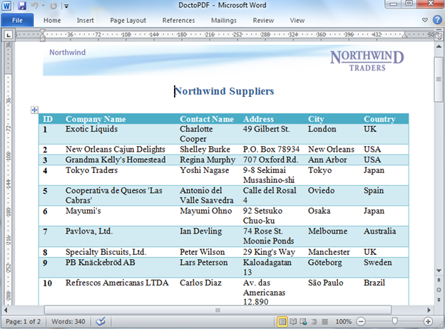
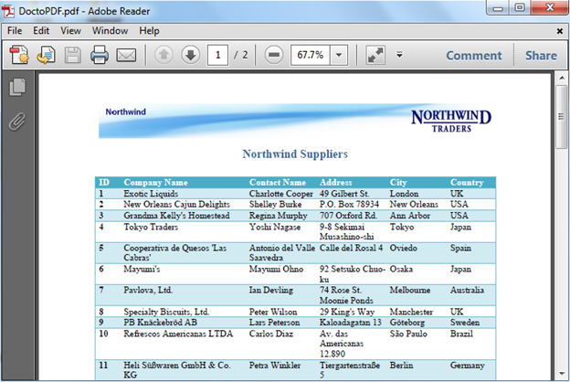

::: {style="DISPLAY: none"}
{#d2h_url_template}{#d2h_package_url style="WIDTH: 0px; DISPLAY: none; HEIGHT: 0px"}
:::

::::: {#nsbanner .d2h_main_nsbanner style="BORDER-BOTTOM: #999999 1px solid; POSITION: relative; PADDING-BOTTOM: 0px; BACKGROUND-COLOR: transparent; PADDING-LEFT: 0px; PADDING-RIGHT: 0px; DISPLAY: none; BORDER-TOP: #999999 1px solid; PADDING-TOP: 0px; LEFT: 0px"}
:::: {#TitleRow .d2h_main_titlerow style="PADDING-BOTTOM: 4px; BACKGROUND-COLOR: transparent; PADDING-LEFT: 22px; WIDTH: 100%; PADDING-RIGHT: 10px; DISPLAY: none; PADDING-TOP: 4px"}
::: {#ienav .d2h_main_ienav style="DISPLAY: none"}
{#D2HPrevious .D2HPreviousEnabled}  {#D2HNext .D2HNextEnabled}
:::
::::
:::::

:::::: {#nstext .d2h_main_nstext style="PADDING-BOTTOM: 10px; BACKGROUND-COLOR: transparent; PADDING-LEFT: 22px; PADDING-RIGHT: 10px; HEIGHT: 100%; OVERFLOW: auto; PADDING-TOP: 5px" hasuserbackground="true" valign="bottom"}
::: {#d2h_breadcrumbs .d2h_breadcrumbs}
[Essential Studio User Guide Documentation](ms-xhelp:///?Id=12457748-09e3-4d74-a240-8e049cedf030){.d2h_breadcrumbsNormal}[ \> ]{.d2h_breadcrumbsLinkSeparator}[Reporting Edition](ms-xhelp:///?Id=027aa5b6-6676-4f93-ad23-c20e8c45792e){.d2h_breadcrumbsNormal}[ \> ]{.d2h_breadcrumbsLinkSeparator}[Essential DocIO](ms-xhelp:///?Id=b88d77b3-4c51-460f-a761-d2ef6d5b0ca6){.d2h_breadcrumbsNormal}[ \> ]{.d2h_breadcrumbsLinkSeparator}[Concepts and Features](ms-xhelp:///?Id=c1881696-52ce-4414-9f3d-97433d8e9775){.d2h_breadcrumbsNormal}[ \> ]{.d2h_breadcrumbsLinkSeparator}[Conversion](ms-xhelp:///?Id=40fa4de2-c2cf-4de2-b478-32fe4a79387b){.d2h_breadcrumbsNormal}
:::

### Doc to PDF {#doc-to-pdf style="tab-stops: 0pt"}

 

Essential DocIO allows you to export the word document into a PDF document. Use the **ConvertToPDF** method of **DocToPDFConverter** class, to convert the doc to pdf, and save the PDF document. Using this, the user can easily convert the word document to PDF document.

 

 

::: {style="BORDER-BOTTOM: windowtext 1pt solid; BORDER-LEFT: medium none; PADDING-BOTTOM: 1pt; MARGIN-TOP: 9pt; PADDING-LEFT: 0pt; PADDING-RIGHT: 0pt; MARGIN-BOTTOM: 9pt; BORDER-TOP: windowtext 1pt solid; BORDER-RIGHT: medium none; PADDING-TOP: 1pt"}
{border="0"}Note: You need to have Essential PDF and Essential DocIO installed in your system. Since \"Syncfusion.DocToPDFConverter.Base.dll\" is conditionally shipped when both DocIO.Base and Pdf.Base is installed.
:::

 

Assembly Dependency for this Conversion

 

[·      ]{style="FONT-FAMILY: Symbol"}Syncfusion.DocToPDFConverter.Base.dll

[·      ]{style="FONT-FAMILY: Symbol"}Syncfusion.DocIO.Base.dll

[·      ]{style="FONT-FAMILY: Symbol"}Syncfusion.Pdf.Base.dll

[·      ]{style="FONT-FAMILY: Symbol"}Syncfusion.Core.dll

[·      ]{style="FONT-FAMILY: Symbol"}Syncfusion.Compression.Base.dll

 

+---------------------------------------------------------------------------------------------------------------------------------------------------------------------------------------------------------------------------------+
| **[\[C#\]]{style="FONT-FAMILY: 'Courier New'; COLOR: black"}**                                                                                                                                                                  |
|                                                                                                                                                                                                                                 |
| []{style="FONT-FAMILY: 'Courier New'; COLOR: #2b91af"}                                                                                                                                                                          |
|                                                                                                                                                                                                                                 |
| [WordDocument]{style="FONT-FAMILY: 'Courier New'; COLOR: #2b91af"}[ wordDoc = [new]{style="COLOR: blue"} [WordDocument]{style="COLOR: #2b91af"}([\"sample.doc\"]{style="COLOR: #a31515"});]{style="FONT-FAMILY: 'Courier New'"} |
|                                                                                                                                                                                                                                 |
| [DocToPDFConverter converter = [new]{style="COLOR: blue"} DocToPDFConverter();]{style="FONT-FAMILY: 'Courier New'"}                                                                                                             |
|                                                                                                                                                                                                                                 |
| []{style="FONT-FAMILY: 'Courier New'; COLOR: green"}                                                                                                                                                                            |
|                                                                                                                                                                                                                                 |
| [// Convert word document into PDF document]{style="FONT-FAMILY: 'Courier New'; COLOR: green"}                                                                                                                                  |
|                                                                                                                                                                                                                                 |
| [PdfDocument pdfDoc = converter.ConvertToPDF(wordDoc);]{style="FONT-FAMILY: 'Courier New'"}                                                                                                                                     |
|                                                                                                                                                                                                                                 |
| []{style="FONT-FAMILY: 'Courier New'; COLOR: green"}                                                                                                                                                                            |
|                                                                                                                                                                                                                                 |
| [// Save the pdf file]{style="FONT-FAMILY: 'Courier New'; COLOR: green"}                                                                                                                                                        |
|                                                                                                                                                                                                                                 |
| [pdfDoc.Save([\"DoctoPDF.pdf\"]{style="COLOR: #a31515"});]{style="FONT-FAMILY: 'Courier New'"}                                                                                                                                  |
+---------------------------------------------------------------------------------------------------------------------------------------------------------------------------------------------------------------------------------+

 

+-------------------------------------------------------------------------------------------------------------------------------------------------------------------------------------------+
| **[\[VB.NET\]]{style="FONT-FAMILY: 'Courier New'; COLOR: black"}**                                                                                                                        |
|                                                                                                                                                                                           |
| []{style="COLOR: black"}                                                                                                                                                                  |
|                                                                                                                                                                                           |
| [Dim]{style="FONT-FAMILY: 'Courier New'; COLOR: blue"}[ wordDoc [As New]{style="COLOR: blue"} WordDocument([\"sample.doc\"]{style="COLOR: #a31515"})]{style="FONT-FAMILY: 'Courier New'"} |
|                                                                                                                                                                                           |
| [Dim]{style="FONT-FAMILY: 'Courier New'; COLOR: blue"}[ converter As New DocToPDFConverter()]{style="FONT-FAMILY: 'Courier New'"}                                                         |
|                                                                                                                                                                                           |
| []{style="FONT-FAMILY: 'Courier New'; COLOR: green"}                                                                                                                                      |
|                                                                                                                                                                                           |
| [\' Convert word document into PDF document]{style="FONT-FAMILY: 'Courier New'; COLOR: green"}                                                                                            |
|                                                                                                                                                                                           |
| [Dim]{style="FONT-FAMILY: 'Courier New'; COLOR: blue"}[ pdfDoc As PdfDocument = converter.ConvertToPDF(wordDoc)]{style="FONT-FAMILY: 'Courier New'"}                                      |
|                                                                                                                                                                                           |
| []{style="FONT-FAMILY: 'Courier New'; COLOR: green"}                                                                                                                                      |
|                                                                                                                                                                                           |
| [\' Save the pdf file]{style="FONT-FAMILY: 'Courier New'; COLOR: green"}                                                                                                                  |
|                                                                                                                                                                                           |
| [pdfDoc.Save([\"DoctoPDF.pdf\"]{style="COLOR: #a31515"})]{style="FONT-FAMILY: 'Courier New'"}                                                                                             |
+-------------------------------------------------------------------------------------------------------------------------------------------------------------------------------------------+

[]{style="FONT-FAMILY: 'Calibri','sans-serif'; COLOR: black"} 

Supported Elements

 

With the initial version of the feature, this feature provides support for the following elements.

 

[·      ]{style="FONT-FAMILY: Symbol"}Paragraph and character formatting

[·      ]{style="FONT-FAMILY: Symbol"}Multi-Column Texts

[·      ]{style="FONT-FAMILY: Symbol"}Headers and Footers

[·      ]{style="FONT-FAMILY: Symbol"}Bulleted, numbered and multi-level lists

[·      ]{style="FONT-FAMILY: Symbol"}Images

[·      ]{style="FONT-FAMILY: Symbol"}Tables (both simple and nested)

[·      ]{style="FONT-FAMILY: Symbol"}Table styles for docx formats (Word 2007 and Word 2010 formats)

[·      ]{style="FONT-FAMILY: Symbol"}Breaks (page, section, linebreak, etc)

[·      ]{style="FONT-FAMILY: Symbol"}OLEObject

[·      ]{style="FONT-FAMILY: Symbol"}Textbox

[·      ]{style="FONT-FAMILY: Symbol"}Page Settings and background image

[·      ]{style="FONT-FAMILY: Symbol"}Document Properties

 

Paragraph and Character formatting

 

This feature supports almost all the paragraph formatting except Full-Justification. The supported paragraph formatting features are,

*[]{style="COLOR: red"}* 

[·      ]{style="FONT-FAMILY: Symbol"}Paragraph and character fonts

[·      ]{style="FONT-FAMILY: Symbol"}Font styles (Bold, Italic, Underline, and Strike through)

[·      ]{style="FONT-FAMILY: Symbol"}Subscript and Superscript

[·      ]{style="FONT-FAMILY: Symbol"}Paragraph and text highlighting

[·      ]{style="FONT-FAMILY: Symbol"}Indents, tabs and spaces

[·      ]{style="FONT-FAMILY: Symbol"}Line spacing

[·      ]{style="FONT-FAMILY: Symbol"}Left, right and center justification

 

+-----------------------------------------------------------------------+
| Known Limitations                                                     |
|                                                                       |
|                                                                       |
|                                                                       |
| [·      ]{style="FONT-FAMILY: Symbol"}Borders around paragraphs.      |
|                                                                       |
| [·      ]{style="FONT-FAMILY: Symbol"}Full Justification.             |
+-----------------------------------------------------------------------+

 

Multi-Column Texts

 

The word documents containing multi-column text were supported.

 

  ---------------------------------------------------------------------------------------------------------------------------------
  ***Known Limitations* -** But the output may look different in case full-justification formatting is applied on to the columns.
  ---------------------------------------------------------------------------------------------------------------------------------

 

Headers and Footers

 

The page headers and footers are supported and can contain images, texts and page number fields.

 

Bulleted, Numbered and Multi-level lists

 

The bulleted list, numbered and multi-level list were supported with proper indentation and alignments as represented in the word document.

 

  ----------------------------------------------------------------------------------------------------------------------------------------------------------------
  ***Known Limitations*** - In some case, the image bullets which is set on document may be replaced by the following symbol in the generated document. For eg :
  ----------------------------------------------------------------------------------------------------------------------------------------------------------------

 

{border="0"}

Figure 82: Bulleted, Numbered and Multi-level Lists

 

 

Images

 

The images present in the document are supported along with their corresponding positions and sizes.

 

  --------------------------------------------------------------------------------------------------------------------------
  ***Known Limitations*** - However, the images placed inside a shape will not be preserved in the generated PDF document.
  --------------------------------------------------------------------------------------------------------------------------

 

Tables

 

Both simple and nested tables are supported with proper preservation of text formatting and images present inside the table cell. Text directions are also supported.

 

+---------------------------------------------------------------------------------------------------------------------------------+
| Known Limitations                                                                                                               |
|                                                                                                                                 |
|                                                                                                                                 |
|                                                                                                                                 |
| [·      ]{style="FONT-FAMILY: Symbol"}Tables making use of patterns and 3D borders will not be retained in the output document. |
|                                                                                                                                 |
| [·      ]{style="FONT-FAMILY: Symbol"}Absolutely positioned tables are not supported.                                           |
+---------------------------------------------------------------------------------------------------------------------------------+

 

Doc to PDF Conversion Support for Table Styles for Word 2007 and Word 2010 Documents

 

Support is now added for table styles in Doc to PDF conversion for Word 2007 and Word 2010 documents. During Doc to PDF conversion, Table-style support provides a unique look and feel to tables in the converted PDF documents, similar to the tables in Word documents.

[]{style="COLOR: #c00000"} 

{border="0"}[]{style="COLOR: #c00000"}

[]{style="COLOR: #c00000"} 

Figure 83: MS Word Document with Table Style

[]{style="COLOR: #c00000"} 

{border="0"}[]{style="COLOR: #c00000"}

 

Figure 84: Converted PDF with Table Style -- Light Shading

 

  ----------------------------------------------------------------------------------------
  ***Known Limitations*** - Table styles for Word 97 -- 2003 documents are not supported
  ----------------------------------------------------------------------------------------

 

Breaks

 

The columns, section, line and page breaks are fully-supported.

 

OLEObject

 

The OLEObjects are partially supported, (i.e) image which represents a particular document will be available in the generated PDF document. But the object associated with the object will not be converted into the generated document.

 

Text box

 

The text value present in the text box will be rendered as text at its actual position in the generated PDF document. Text directions are also supported.

 

PageSettings

 

The actual page settings will be preserved in the generated PDF documents, which includes page size, orientation, page borders and its background image if available.

 

Document Properties

 

The document properties present in the word documents will also be preserved in the generated PdfDocument.

 

Un-Supported Elements

 

The following are the list of un-supported elements, which will be supported in the future releases and will not be preserved in the generated PDF document.

 

[·      ]{style="FONT-FAMILY: Symbol"}Shapes and auto shapes

[·      ]{style="FONT-FAMILY: Symbol"}Comments

[·      ]{style="FONT-FAMILY: Symbol"}Hyperlinks

[·      ]{style="FONT-FAMILY: Symbol"}Bookmarks

[·      ]{style="FONT-FAMILY: Symbol"}Foot note and end note

[·      ]{style="FONT-FAMILY: Symbol"}Dynamic Fields

[·      ]{style="FONT-FAMILY: Symbol"}Charts

[·      ]{style="FONT-FAMILY: Symbol"}Table of Contents

 

  --------------------------------------
  ***Known Limitations -*** Pagination
  --------------------------------------

 

Pagination

 

Essential DocIO makes sensible decision while layouting the text, and its supported elements while generating the PDF documents. But however, we cannot guarantee pagination with all the documents.

 

::: {style="BORDER-BOTTOM: windowtext 1pt solid; BORDER-LEFT: medium none; PADDING-BOTTOM: 1pt; MARGIN-TOP: 9pt; PADDING-LEFT: 0pt; PADDING-RIGHT: 0pt; MARGIN-BOTTOM: 9pt; BORDER-TOP: windowtext 1pt solid; BORDER-RIGHT: medium none; PADDING-TOP: 1pt"}
{border="0"}Note: Currently Doc to Pdf conversion is not supported in Silverlight application.

 

 
:::

[]{#related-topics}
::::::
