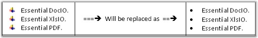

::: {style="DISPLAY: none"}
{#d2h_url_template}{#d2h_package_url style="WIDTH: 0px; DISPLAY: none; HEIGHT: 0px"}
:::

::::: {#nsbanner .d2h_main_nsbanner style="BORDER-BOTTOM: #999999 1px solid; POSITION: relative; PADDING-BOTTOM: 0px; BACKGROUND-COLOR: transparent; PADDING-LEFT: 0px; PADDING-RIGHT: 0px; DISPLAY: none; BORDER-TOP: #999999 1px solid; PADDING-TOP: 0px; LEFT: 0px"}
:::: {#TitleRow .d2h_main_titlerow style="PADDING-BOTTOM: 4px; BACKGROUND-COLOR: transparent; PADDING-LEFT: 22px; WIDTH: 100%; PADDING-RIGHT: 10px; DISPLAY: none; PADDING-TOP: 4px"}
::: {#ienav .d2h_main_ienav style="DISPLAY: none"}
{#D2HPrevious .D2HPreviousEnabled}  {#D2HNext .D2HNextEnabled}
:::
::::
:::::

::::: {#nstext .d2h_main_nstext style="PADDING-BOTTOM: 10px; BACKGROUND-COLOR: transparent; PADDING-LEFT: 22px; PADDING-RIGHT: 10px; HEIGHT: 100%; OVERFLOW: auto; PADDING-TOP: 5px" hasuserbackground="true" valign="bottom"}
::: {#d2h_breadcrumbs .d2h_breadcrumbs}
[Essential Studio User Guide Documentation](ms-xhelp:///?Id=12457748-09e3-4d74-a240-8e049cedf030){.d2h_breadcrumbsNormal}[ \> ]{.d2h_breadcrumbsLinkSeparator}[Reporting Edition](ms-xhelp:///?Id=027aa5b6-6676-4f93-ad23-c20e8c45792e){.d2h_breadcrumbsNormal}[ \> ]{.d2h_breadcrumbsLinkSeparator}[Essential Pdf](ms-xhelp:///?Id=22756092-3da5-4797-9514-dab0617c6902){.d2h_breadcrumbsNormal}[ \> ]{.d2h_breadcrumbsLinkSeparator}[Concepts and Features](ms-xhelp:///?Id=b2064337-afd6-4241-aa41-868a5489a8dd){.d2h_breadcrumbsNormal}[ \> ]{.d2h_breadcrumbsLinkSeparator}[PDF Convertor](ms-xhelp:///?Id=2b6a7d69-810d-44e0-aca8-fc3a5e75a9da){.d2h_breadcrumbsNormal}
:::

### Doc To PDF {#doc-to-pdf style="tab-stops: 0pt"}

 

Essential DocIO enables to export the Word document into a PDF document. By using the **ConvertToPDF** method of the **DocToPDFConverter** class, you can convert the Word document to PDF, and save the PDF document.

 

::: {style="BORDER-BOTTOM: windowtext 1pt solid; BORDER-LEFT: medium none; PADDING-BOTTOM: 1pt; MARGIN-TOP: 9pt; PADDING-LEFT: 0pt; PADDING-RIGHT: 0pt; MARGIN-BOTTOM: 9pt; BORDER-TOP: windowtext 1pt solid; BORDER-RIGHT: medium none; PADDING-TOP: 1pt"}
{border="0"}Note:[ ]{style="FONT-SIZE: 14pt"}You need to have Essential PDF and Essential DocIO installed in your system. This is because \"Syncfusion.DocToPDFConverter.Base.dll\" is conditionally shipped when both DocIO.Base and Pdf.Base is installed.
:::

 

This section covers the following:

 

[·      ]{style="FONT-FAMILY: Symbol"}Assemblies Dependent for this Conversion

[·      ]{style="FONT-FAMILY: Symbol"}Supported Elements and Limitations

[·      ]{style="FONT-FAMILY: Symbol"}UnSupported Elements and Limitation

[]{style="FONT-FAMILY: 'Trebuchet MS','sans-serif'; COLOR: #15428b; FONT-SIZE: 9pt"} 

Assembly Dependency for this Conversion

**[]{style="FONT-FAMILY: 'Trebuchet MS','sans-serif'; COLOR: #15428b; FONT-SIZE: 9pt"}** 

[·      ]{style="FONT-FAMILY: Symbol"}Syncfusion.DocToPDFConverter.Base.dll

[·      ]{style="FONT-FAMILY: Symbol"}Syncfusion.DocIO.Base.dll

[·      ]{style="FONT-FAMILY: Symbol"}Syncfusion.Pdf.Base.dll

[·      ]{style="FONT-FAMILY: Symbol"}Syncfusion.Core.dll

[·      ]{style="FONT-FAMILY: Symbol"}Syncfusion.Compression.Base.dll

 

The following code illustrates how to convert a word document, say, \"sample.doc\" to a PDF document.

 

+---------------------------------------------------------------------------------------------------------------------------------------------------------------------------------------------------------------------------------+
| **[\[C#\]]{style="FONT-FAMILY: 'Courier New'; COLOR: black"}**                                                                                                                                                                  |
|                                                                                                                                                                                                                                 |
| []{style="FONT-FAMILY: 'Courier New'; COLOR: #2b91af"}                                                                                                                                                                          |
|                                                                                                                                                                                                                                 |
| [WordDocument]{style="FONT-FAMILY: 'Courier New'; COLOR: #2b91af"}[ wordDoc = [new]{style="COLOR: blue"} [WordDocument]{style="COLOR: #2b91af"}([\"sample.doc\"]{style="COLOR: #a31515"});]{style="FONT-FAMILY: 'Courier New'"} |
|                                                                                                                                                                                                                                 |
| [DocToPDFConverter converter = [new]{style="COLOR: blue"} DocToPDFConverter();]{style="FONT-FAMILY: 'Courier New'"}                                                                                                             |
|                                                                                                                                                                                                                                 |
| []{style="FONT-FAMILY: 'Courier New'; COLOR: green"}                                                                                                                                                                            |
|                                                                                                                                                                                                                                 |
| [//Convert word document into PDF document]{style="FONT-FAMILY: 'Courier New'; COLOR: green"}                                                                                                                                   |
|                                                                                                                                                                                                                                 |
| [PdfDocument pdfDoc = converter.ConvertToPDF(wordDoc);]{style="FONT-FAMILY: 'Courier New'"}                                                                                                                                     |
|                                                                                                                                                                                                                                 |
| []{style="FONT-FAMILY: 'Courier New'; COLOR: green"}                                                                                                                                                                            |
|                                                                                                                                                                                                                                 |
| [//Save the pdf file]{style="FONT-FAMILY: 'Courier New'; COLOR: green"}                                                                                                                                                         |
|                                                                                                                                                                                                                                 |
| [pdfDoc.Save([\"DoctoPDF.pdf\"]{style="COLOR: #a31515"});]{style="FONT-FAMILY: 'Courier New'"}                                                                                                                                  |
+---------------------------------------------------------------------------------------------------------------------------------------------------------------------------------------------------------------------------------+

[]{style="FONT-FAMILY: 'Trebuchet MS','sans-serif'; COLOR: #15428b; FONT-SIZE: 9pt"} 

+-------------------------------------------------------------------------------------------------------------------------------------------------------------------------------------------+
| **[\[VB.NET\]]{style="FONT-FAMILY: 'Courier New'; COLOR: black"}**                                                                                                                        |
|                                                                                                                                                                                           |
| []{style="COLOR: black"}                                                                                                                                                                  |
|                                                                                                                                                                                           |
| [Dim]{style="FONT-FAMILY: 'Courier New'; COLOR: blue"}[ wordDoc [As New]{style="COLOR: blue"} WordDocument([\"sample.doc\"]{style="COLOR: #a31515"})]{style="FONT-FAMILY: 'Courier New'"} |
|                                                                                                                                                                                           |
| [Dim]{style="FONT-FAMILY: 'Courier New'; COLOR: blue"}[ converter As New DocToPDFConverter()]{style="FONT-FAMILY: 'Courier New'"}                                                         |
|                                                                                                                                                                                           |
| []{style="FONT-FAMILY: 'Courier New'; COLOR: green"}                                                                                                                                      |
|                                                                                                                                                                                           |
| [\'Convert word document into PDF document]{style="FONT-FAMILY: 'Courier New'; COLOR: green"}                                                                                             |
|                                                                                                                                                                                           |
| [Dim]{style="FONT-FAMILY: 'Courier New'; COLOR: blue"}[ pdfDoc As PdfDocument = converter.ConvertToPDF(wordDoc)]{style="FONT-FAMILY: 'Courier New'"}                                      |
|                                                                                                                                                                                           |
| []{style="FONT-FAMILY: 'Courier New'; COLOR: green"}                                                                                                                                      |
|                                                                                                                                                                                           |
| [\'Save the pdf file]{style="FONT-FAMILY: 'Courier New'; COLOR: green"}                                                                                                                   |
|                                                                                                                                                                                           |
| [pdfDoc.Save([\"DoctoPDF.pdf\"]{style="COLOR: #a31515"})]{style="FONT-FAMILY: 'Courier New'"}                                                                                             |
+-------------------------------------------------------------------------------------------------------------------------------------------------------------------------------------------+

[]{style="FONT-FAMILY: 'Calibri','sans-serif'; COLOR: black"} 

Supported Elements

 

This feature provides support for the following elements.

 

[·      ]{style="FONT-FAMILY: Symbol"}Paragraph and Character Formatting

[·      ]{style="FONT-FAMILY: Symbol"}MultiColumn Text

[·      ]{style="FONT-FAMILY: Symbol"}Headers and Footers

[·      ]{style="FONT-FAMILY: Symbol"}Bulleted, Numbered and MultiLevel Lists

[·      ]{style="FONT-FAMILY: Symbol"}Images

[·      ]{style="FONT-FAMILY: Symbol"}Tables (both simple and nested)

[·      ]{style="FONT-FAMILY: Symbol"}Breaks (page, section, linebreak, etc.)

[·      ]{style="FONT-FAMILY: Symbol"}OLEObject

[·      ]{style="FONT-FAMILY: Symbol"}Text Box

[·      ]{style="FONT-FAMILY: Symbol"}Page Settings and Background Image

[·      ]{style="FONT-FAMILY: Symbol"}Document Properties

[]{style="FONT-FAMILY: 'Trebuchet MS','sans-serif'; COLOR: #15428b; FONT-SIZE: 9pt"} 

[·      ]{style="FONT-FAMILY: Symbol; FONT-WEIGHT: normal"}Paragraph and Character Formatting

[]{style="FONT-FAMILY: 'Trebuchet MS','sans-serif'; COLOR: #15428b; FONT-SIZE: 9pt"} 

This feature supports almost all the paragraph formatting options except Full-Justification. The supported paragraph formatting options are as follows.

[]{style="FONT-FAMILY: 'Trebuchet MS','sans-serif'; COLOR: #15428b; FONT-SIZE: 9pt"} 

[·      ]{style="FONT-FAMILY: Symbol"}Paragraph and Character Fonts

[·      ]{style="FONT-FAMILY: Symbol"}Font styles (Bold, Italic, Underline and Strike through)

[·      ]{style="FONT-FAMILY: Symbol"}Subscript and Superscript

[·      ]{style="FONT-FAMILY: Symbol"}Paragraph and Text Highlighting

[·      ]{style="FONT-FAMILY: Symbol"}Indents, tabs and spaces

[·      ]{style="FONT-FAMILY: Symbol"}Line Spacing

[·      ]{style="FONT-FAMILY: Symbol"}Left, Right and Center Justification

**[]{style="FONT-FAMILY: 'Trebuchet MS','sans-serif'; COLOR: #15428b; FONT-SIZE: 9pt"}** 

+-------------------------------------------------------------------------------------------+
| Known Limitations                                                                         |
|                                                                                           |
| **[]{style="FONT-FAMILY: 'Trebuchet MS','sans-serif'; COLOR: #15428b; FONT-SIZE: 9pt"}**  |
|                                                                                           |
| [·      ]{style="FONT-FAMILY: Symbol"}Borders around paragraphs.                          |
|                                                                                           |
| [·      ]{style="FONT-FAMILY: Symbol"}Full Justification.                                 |
+-------------------------------------------------------------------------------------------+

[]{style="FONT-FAMILY: 'Trebuchet MS','sans-serif'; COLOR: #15428b; FONT-SIZE: 9pt"} 

[·      ]{style="FONT-FAMILY: Symbol; FONT-WEIGHT: normal"}MultiColumn Text

 

Word document containing multicolumn text is supported.

 

  --------------------------------------------------------------------------------------------------------------------------------
  ***Known Limitations* -** But the output may look different in case full-justification formatting is applied onto the columns.
  --------------------------------------------------------------------------------------------------------------------------------

[]{style="FONT-FAMILY: 'Trebuchet MS','sans-serif'; COLOR: #15428b; FONT-SIZE: 9pt"} 

[·      ]{style="FONT-FAMILY: Symbol; FONT-WEIGHT: normal"}Headers and Footers

 

Page headers and footers are supported and can contain images, text and page number fields.

 

[·      ]{style="FONT-FAMILY: Symbol; FONT-WEIGHT: normal"}Bulleted, Numbered and MultiLevel Lists

 

Bulleted, numbered and multilevel lists are supported with proper indentation and alignments as represented in the Word document.

 

  ----------------------------------------------------------------------------------------------------------------------------------------------------------------
  ***Known Limitations*** - In some case, the image bullets which is set on document may be replaced by the following symbol in the generated document. For eg :
  ----------------------------------------------------------------------------------------------------------------------------------------------------------------

[]{style="FONT-FAMILY: 'Trebuchet MS','sans-serif'; COLOR: #15428b; FONT-SIZE: 9pt"} 

[{border="0"}]{style="FONT-FAMILY: 'Trebuchet MS','sans-serif'; COLOR: #15428b; FONT-SIZE: 9pt"}

Figure 64: Image replacement

[·      ]{style="FONT-FAMILY: Symbol; FONT-WEIGHT: normal"}Images

 

The images present in the document are supported along with their corresponding positions and sizes.

 

  --------------------------------------------------------------------------------------------------------------------------
  ***Known Limitations*** - However, the images placed inside a shape will not be preserved in the generated PDF document.
  --------------------------------------------------------------------------------------------------------------------------

 

[·      ]{style="FONT-FAMILY: Symbol; FONT-WEIGHT: normal"}Tables

 

Both simple and nested tables are supported with proper preservation of text formatting and images present inside the table cell.

 

+---------------------------------------------------------------------------------------------------------------------------------+
| Known Limitations                                                                                                               |
|                                                                                                                                 |
| **[]{style="FONT-FAMILY: 'Trebuchet MS','sans-serif'; COLOR: #15428b; FONT-SIZE: 9pt"}**                                        |
|                                                                                                                                 |
| [·      ]{style="FONT-FAMILY: Symbol"}Tables making use of patterns and 3D borders will not be retained in the output document. |
|                                                                                                                                 |
| [·      ]{style="FONT-FAMILY: Symbol"}Absolutely positioned tables are not supported.                                           |
+---------------------------------------------------------------------------------------------------------------------------------+

[]{style="FONT-FAMILY: 'Trebuchet MS','sans-serif'; COLOR: #15428b; FONT-SIZE: 9pt"} 

[·      ]{style="FONT-FAMILY: Symbol; FONT-WEIGHT: normal"}Breaks

 

Columns, section, line and page breaks are fully supported.

 

[·      ]{style="FONT-FAMILY: Symbol; FONT-WEIGHT: normal"}OLEObject

 

OLEObjects are partially supported, i.e., the image, which represents a particular document that will be available in the generated PDF document. But the object associated with the object will not be converted into the generated document.

 

[·      ]{style="FONT-FAMILY: Symbol; COLOR: #15428b; FONT-SIZE: 9pt; FONT-WEIGHT: normal"}Text Box []{style="FONT-FAMILY: 'Trebuchet MS','sans-serif'; COLOR: #15428b; FONT-SIZE: 9pt; FONT-WEIGHT: normal"}

 

The text value present in the text box will be rendered as text in its actual position in the generated PDF document.

 

[·      ]{style="FONT-FAMILY: Symbol; COLOR: #15428b; FONT-SIZE: 9pt; FONT-WEIGHT: normal"}Page Settings []{style="FONT-FAMILY: 'Trebuchet MS','sans-serif'; COLOR: #15428b; FONT-SIZE: 9pt; FONT-WEIGHT: normal"}

 

The actual page settings will be preserved in the generated PDF document which includes page size, orientation, page borders and its background image, if available.

 

[·      ]{style="FONT-FAMILY: Symbol; FONT-WEIGHT: normal"}Document Properties

 

The document properties present in the Word document will also be preserved in the generated PDF Document.

 

Unsupported Elements

 

The following are the list of unsupported elements, which will not be preserved in the generated PDF document.

 

[·      ]{style="FONT-FAMILY: Symbol"}Shapes and AutoShapes

[·      ]{style="FONT-FAMILY: Symbol"}Comments

[·      ]{style="FONT-FAMILY: Symbol"}Hyperlinks

[·      ]{style="FONT-FAMILY: Symbol"}Bookmarks

[·      ]{style="FONT-FAMILY: Symbol"}Footnotes and Endnotes

[·      ]{style="FONT-FAMILY: Symbol"}Dynamic Fields

[·      ]{style="FONT-FAMILY: Symbol"}Charts

[·      ]{style="FONT-FAMILY: Symbol"}Table of Contents

[]{style="FONT-FAMILY: 'Trebuchet MS','sans-serif'; COLOR: #15428b; FONT-SIZE: 9pt"} 

[]{style="FONT-FAMILY: 'Trebuchet MS','sans-serif'; COLOR: #15428b; FONT-SIZE: 9pt"} 

  ------------------------------------
  **Known Limitations** - Pagination
  ------------------------------------

[]{style="FONT-FAMILY: 'Trebuchet MS','sans-serif'; COLOR: #15428b; FONT-SIZE: 9pt"} 

Pagination

Essential DocIO, when generating the PDF document, makes sensible decisions while laying out the text and its supported elements. However, pagination is not guaranteed with all the documents.

 

 

[]{#related-topics}
:::::
