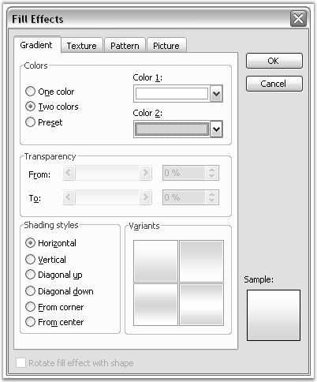

::: {style="DISPLAY: none"}
{#d2h_url_template}{#d2h_package_url style="WIDTH: 0px; DISPLAY: none; HEIGHT: 0px"}
:::

::::::: {.d2h_secondary_topic style="PADDING-BOTTOM: 10pt; MARGIN: 0pt; PADDING-LEFT: 0pt; PADDING-RIGHT: 0pt; PADDING-TOP: 0pt"}
#### Document Color {#document-color style="tab-stops: 0pt"}

 

**Background** class represents the background color and fills effects in the Word document. The type of the background effect is defined by using the Type property. This property returns the value of BackgroundType type, and it can take the following variants.

 

[·      ]{style="FONT-FAMILY: Symbol"}**NoBackground**: no background fill effect

[·      ]{style="FONT-FAMILY: Symbol"}**Gradient**: gradient fill effect

[·      ]{style="FONT-FAMILY: Symbol"}**Picture**: background picture

[·      ]{style="FONT-FAMILY: Symbol"}**Texture**: texture fill effect

[·      ]{style="FONT-FAMILY: Symbol"}**Color**: color fill effect

 

::: {style="BORDER-BOTTOM: windowtext 1pt solid; BORDER-LEFT: medium none; PADDING-BOTTOM: 1pt; MARGIN-TOP: 9pt; PADDING-LEFT: 0pt; PADDING-RIGHT: 0pt; MARGIN-BOTTOM: 9pt; BORDER-TOP: windowtext 1pt solid; BORDER-RIGHT: medium none; PADDING-TOP: 1pt"}
{border="0"}Note: Pattern fill effect is not supported.
:::

 

**Picture** property defines the picture to be reflected as the document background (in case background type is set to BackgroundType.Picture). If the background type is BackgroundType.Texture, the background picture will be used as a picture for texture. So the background picture must be present in such cases.

 

**Color** property defines the color to be reflected as the document background (in case background type is set to BackgroundType.Color).

 

**Gradient** property defines the gradient to be reflected as the document background (in case background type is set to BackgroundType.Gradient). Gradient property returns the object of the **BackgroundGradient** class. For more details on BackgroundGradient class, refer the BackgroundGradient documentation.

 

**WordDocument.Background** property is used to access the DocIO document background. Background property of WordDocument is automatically initialized. If there is no background in the default DocIO document, it means that the Type property of the Background is set to NoBackground.

 

**Public Properties**

 

::: {align="center"}
  ---------- ----------------------------------------------------------
  **Name**   **Description**
  Color      Gets or sets the background color.  
  Gradient   Gets or sets the background gradient.  
  Picture    Gets or sets the background picture.  
  Type       Gets the type of the background effect for the document.
  ---------- ----------------------------------------------------------
:::

 

The following example illustrates how to use the Background class.

 

+---------------------------------------------------------------------------------------------------------------------------------------------------------------------------------+
| **[\[C#\]]{style="FONT-FAMILY: 'Courier New'; COLOR: black"}**                                                                                                                  |
|                                                                                                                                                                                 |
| []{style="COLOR: black"}                                                                                                                                                        |
|                                                                                                                                                                                 |
| [IWordDocument]{style="FONT-FAMILY: 'Courier New'; COLOR: teal"}[ doc1 = [new]{style="COLOR: blue"} [WordDocument]{style="COLOR: teal"}();]{style="FONT-FAMILY: 'Courier New'"} |
|                                                                                                                                                                                 |
| [doc1.Open([\"Background.doc\"]{style="COLOR: maroon"});]{style="FONT-FAMILY: 'Courier New'"}                                                                                   |
|                                                                                                                                                                                 |
| [IWordDocument]{style="FONT-FAMILY: 'Courier New'; COLOR: teal"}[ doc2 = [new]{style="COLOR: blue"} [WordDocument]{style="COLOR: teal"}();]{style="FONT-FAMILY: 'Courier New'"} |
|                                                                                                                                                                                 |
| [doc2.EnsureMinimal();]{style="FONT-FAMILY: 'Courier New'"}                                                                                                                     |
|                                                                                                                                                                                 |
| []{style="FONT-FAMILY: 'Courier New'"}                                                                                                                                          |
|                                                                                                                                                                                 |
| [switch]{style="FONT-FAMILY: 'Courier New'; COLOR: blue"}[ (doc1.Background.Type)]{style="FONT-FAMILY: 'Courier New'"}                                                          |
|                                                                                                                                                                                 |
| [{]{style="FONT-FAMILY: 'Courier New'"}                                                                                                                                         |
|                                                                                                                                                                                 |
| [    [case]{style="COLOR: blue"} [BackgroundType]{style="COLOR: teal"}.Gradient:]{style="FONT-FAMILY: 'Courier New'"}                                                           |
|                                                                                                                                                                                 |
| [        doc2.Background.Gradient = doc1.Background.Gradient.Clone();]{style="FONT-FAMILY: 'Courier New'"}                                                                      |
|                                                                                                                                                                                 |
| [        [break]{style="COLOR: blue"};]{style="FONT-FAMILY: 'Courier New'"}                                                                                                     |
|                                                                                                                                                                                 |
| []{style="FONT-FAMILY: 'Courier New'"}                                                                                                                                          |
|                                                                                                                                                                                 |
| [    [case]{style="COLOR: blue"} [BackgroundType]{style="COLOR: teal"}.Picture:]{style="FONT-FAMILY: 'Courier New'"}                                                            |
|                                                                                                                                                                                 |
| [    [case]{style="COLOR: blue"} [BackgroundType]{style="COLOR: teal"}.Texture:]{style="FONT-FAMILY: 'Courier New'"}                                                            |
|                                                                                                                                                                                 |
| [        doc2.Background.Picture = doc1.Background.Picture;]{style="FONT-FAMILY: 'Courier New'"}                                                                                |
|                                                                                                                                                                                 |
| [        [break]{style="COLOR: blue"};]{style="FONT-FAMILY: 'Courier New'"}                                                                                                     |
|                                                                                                                                                                                 |
| []{style="FONT-FAMILY: 'Courier New'"}                                                                                                                                          |
|                                                                                                                                                                                 |
| [    [case]{style="COLOR: blue"} [BackgroundType]{style="COLOR: teal"}.Color:]{style="FONT-FAMILY: 'Courier New'"}                                                              |
|                                                                                                                                                                                 |
| [        doc2.Background.Color = doc1.Background.Color;]{style="FONT-FAMILY: 'Courier New'"}                                                                                    |
|                                                                                                                                                                                 |
| [        [break]{style="COLOR: blue"};]{style="FONT-FAMILY: 'Courier New'"}                                                                                                     |
|                                                                                                                                                                                 |
| []{style="FONT-FAMILY: 'Courier New'"}                                                                                                                                          |
|                                                                                                                                                                                 |
| [    [default]{style="COLOR: blue"}: [break]{style="COLOR: blue"};]{style="FONT-FAMILY: 'Courier New'"}                                                                         |
|                                                                                                                                                                                 |
| [}]{style="FONT-FAMILY: 'Courier New'"}                                                                                                                                         |
|                                                                                                                                                                                 |
| []{style="FONT-FAMILY: 'Courier New'"}                                                                                                                                          |
|                                                                                                                                                                                 |
| [doc2.Background.Type = doc1.Background.Type;]{style="FONT-FAMILY: 'Courier New'"}                                                                                              |
|                                                                                                                                                                                 |
| [doc1.Background.Type = [BackgroundType]{style="COLOR: teal"}.Color;]{style="FONT-FAMILY: 'Courier New'"}                                                                       |
|                                                                                                                                                                                 |
| [doc1.Background.Color = [Color]{style="COLOR: teal"}.Red;]{style="FONT-FAMILY: 'Courier New'"}                                                                                 |
|                                                                                                                                                                                 |
| []{style="FONT-FAMILY: 'Courier New'"}                                                                                                                                          |
|                                                                                                                                                                                 |
| [doc1.Save([\"Background.doc\"]{style="COLOR: maroon"});]{style="FONT-FAMILY: 'Courier New'"}                                                                                   |
|                                                                                                                                                                                 |
| [doc2.Save([\"BackgroundNew.doc\"]{style="COLOR: maroon"});]{style="FONT-FAMILY: 'Courier New'"}                                                                                |
+---------------------------------------------------------------------------------------------------------------------------------------------------------------------------------+

 

+---------------------------------------------------------------------------------------------------------------------------------------------------------------------------------------+
| **[\[VB.NET\]]{style="FONT-FAMILY: 'Courier New'; COLOR: black"}**                                                                                                                    |
|                                                                                                                                                                                       |
| []{style="COLOR: black"}                                                                                                                                                              |
|                                                                                                                                                                                       |
| [Dim]{style="FONT-FAMILY: 'Courier New'; COLOR: blue"}[ doc1 [As]{style="COLOR: blue"} IWordDocument = [New]{style="COLOR: blue"} WordDocument()]{style="FONT-FAMILY: 'Courier New'"} |
|                                                                                                                                                                                       |
| [doc1.Open([\"Background.doc\"]{style="COLOR: maroon"})]{style="FONT-FAMILY: 'Courier New'"}                                                                                          |
|                                                                                                                                                                                       |
| [Dim]{style="FONT-FAMILY: 'Courier New'; COLOR: blue"}[ doc2 [As]{style="COLOR: blue"} IWordDocument = [New]{style="COLOR: blue"} WordDocument()]{style="FONT-FAMILY: 'Courier New'"} |
|                                                                                                                                                                                       |
| [doc2.EnsureMinimal()]{style="FONT-FAMILY: 'Courier New'"}                                                                                                                            |
|                                                                                                                                                                                       |
| []{style="FONT-FAMILY: 'Courier New'"}                                                                                                                                                |
|                                                                                                                                                                                       |
| [Select]{style="FONT-FAMILY: 'Courier New'; COLOR: blue"}[ [Case]{style="COLOR: blue"} doc1.Background.Type]{style="FONT-FAMILY: 'Courier New'"}                                      |
|                                                                                                                                                                                       |
| [      [Case]{style="COLOR: blue"} BackgroundType.Gradient]{style="FONT-FAMILY: 'Courier New'"}                                                                                       |
|                                                                                                                                                                                       |
| [            doc2.Background.Gradient = doc1.Background.Gradient.Clone()]{style="FONT-FAMILY: 'Courier New'"}                                                                         |
|                                                                                                                                                                                       |
| []{style="FONT-FAMILY: 'Courier New'"}                                                                                                                                                |
|                                                                                                                                                                                       |
| [      [Case]{style="COLOR: blue"} BackgroundType.Picture, BackgroundType.Texture]{style="FONT-FAMILY: 'Courier New'"}                                                                |
|                                                                                                                                                                                       |
| [            doc2.Background.Picture = doc1.Background.Picture]{style="FONT-FAMILY: 'Courier New'"}                                                                                   |
|                                                                                                                                                                                       |
| []{style="FONT-FAMILY: 'Courier New'"}                                                                                                                                                |
|                                                                                                                                                                                       |
| [      [Case]{style="COLOR: blue"} BackgroundType.Color]{style="FONT-FAMILY: 'Courier New'"}                                                                                          |
|                                                                                                                                                                                       |
| [            doc2.Background.Color = doc1.Background.Color]{style="FONT-FAMILY: 'Courier New'"}                                                                                       |
|                                                                                                                                                                                       |
| []{style="FONT-FAMILY: 'Courier New'"}                                                                                                                                                |
|                                                                                                                                                                                       |
| [      [Case]{style="COLOR: blue"} [Else]{style="COLOR: blue"}]{style="FONT-FAMILY: 'Courier New'"}                                                                                   |
|                                                                                                                                                                                       |
| [End]{style="FONT-FAMILY: 'Courier New'; COLOR: blue"}[ [Select]{style="COLOR: blue"}]{style="FONT-FAMILY: 'Courier New'"}                                                            |
|                                                                                                                                                                                       |
| []{style="FONT-FAMILY: 'Courier New'; COLOR: blue"}                                                                                                                                   |
|                                                                                                                                                                                       |
| [doc2.Background.Type = doc1.Background.Type]{style="FONT-FAMILY: 'Courier New'"}                                                                                                     |
|                                                                                                                                                                                       |
| [doc1.Background.Type = BackgroundType.Color]{style="FONT-FAMILY: 'Courier New'"}                                                                                                     |
|                                                                                                                                                                                       |
| [doc1.Background.Color = Color.Red]{style="FONT-FAMILY: 'Courier New'"}                                                                                                               |
|                                                                                                                                                                                       |
| []{style="FONT-FAMILY: 'Courier New'"}                                                                                                                                                |
|                                                                                                                                                                                       |
| [doc1.Save([\"Background.doc\"]{style="COLOR: maroon"})]{style="FONT-FAMILY: 'Courier New'"}                                                                                          |
|                                                                                                                                                                                       |
| [doc2.Save([\"BackgroundNew.doc\"]{style="COLOR: maroon"})]{style="FONT-FAMILY: 'Courier New'"}                                                                                       |
+---------------------------------------------------------------------------------------------------------------------------------------------------------------------------------------+

 

**Background Gradient**

 

**Background Gradient class** represents the background gradient fill effect in the Word document. To set the gradient by using Word menu, open the **Format** menu, point to **Background**, **Fill Effects**, and then click **Gradient**.

 

The following screen shot shows the **Fill Effects** dialog box.

 

{border="0"}

Figure 28: Fill Effects Dialog Box

 

Using DocIO, you can access background gradient options through the **WordDocument.Background.Gradient** option. Background Gradient will be set as the background fill effect when the WordDocument.Background.Type option is set to BackgroundType.Gradient.

 

**Color1** and **Color2** properties of Background Gradient define the gradient colors. **GradientShadingStyle** and **GradientShadingVariant** properties define the type of the different variants of the gradient.

 

**Public Properties**

 

::: {align="center"}
  ---------------- -----------------------------------------------------------------------------
  Name             Description
  Color1           Gets or sets first color for gradient.
  Color2           Gets or sets second color for gradient (used when TwoColors set to true).  
  ShadingStyle     Gets or sets shading style for gradient.
  ShadingVariant   Gets or sets shading variants.
  ---------------- -----------------------------------------------------------------------------
:::

 

Public Methods

 

::: {align="center"}
  ------- ---------------------------------
  Name    Description
  Clone   Clones current Gradient object.
  ------- ---------------------------------
:::

 

The following example illustrates how to use the Background Gradient class.

 

+-----------------------------------------------------------------------------------------------------------------------------------------------------------------------------------------------------------+
| **[\[C#\]]{style="FONT-FAMILY: 'Courier New'; COLOR: black"}**                                                                                                                                            |
|                                                                                                                                                                                                           |
| []{style="COLOR: black"}                                                                                                                                                                                  |
|                                                                                                                                                                                                           |
| [IWordDocument]{style="FONT-FAMILY: 'Courier New'; COLOR: teal"}[ doc = [new]{style="COLOR: blue"} [WordDocument]{style="COLOR: teal"}([true]{style="COLOR: blue"});]{style="FONT-FAMILY: 'Courier New'"} |
|                                                                                                                                                                                                           |
| [doc.Background.Type = [BackgroundType]{style="COLOR: teal"}.Gradient;]{style="FONT-FAMILY: 'Courier New'"}                                                                                               |
|                                                                                                                                                                                                           |
| [doc.Background.Gradient.Color1 = [Color]{style="COLOR: teal"}.White;]{style="FONT-FAMILY: 'Courier New'"}                                                                                                |
|                                                                                                                                                                                                           |
| [doc.Background.Gradient.Color2 = [Color]{style="COLOR: teal"}.Black;]{style="FONT-FAMILY: 'Courier New'"}                                                                                                |
|                                                                                                                                                                                                           |
| [doc.Background.Gradient.ShadingStyle = [GradientShadingStyle]{style="COLOR: teal"}.FromCenter;]{style="FONT-FAMILY: 'Courier New'"}                                                                      |
|                                                                                                                                                                                                           |
| [doc.Background.Gradient.ShadingVariant = [GradientShadingVariant]{style="COLOR: teal"}.ShadingDown;]{style="FONT-FAMILY: 'Courier New'"}                                                                 |
+-----------------------------------------------------------------------------------------------------------------------------------------------------------------------------------------------------------+

 

+-------------------------------------------------------------------------------------------------------------------+
| **[\[VB\]]{style="FONT-FAMILY: 'Courier New'; COLOR: black"}**                                                    |
|                                                                                                                   |
| []{style="COLOR: black"}                                                                                          |
|                                                                                                                   |
| [Dim doc As IWordDocument = New WordDocument(True)]{style="FONT-FAMILY: 'Courier New'"}                           |
|                                                                                                                   |
| [doc.Background.Type = BackgroundType.Gradient]{style="FONT-FAMILY: 'Courier New'"}                               |
|                                                                                                                   |
| [doc.Background.Gradient.Color1 = Color.White]{style="FONT-FAMILY: 'Courier New'"}                                |
|                                                                                                                   |
| [doc.Background.Gradient.Color2 = Color.Black]{style="FONT-FAMILY: 'Courier New'"}                                |
|                                                                                                                   |
| [doc.Background.Gradient.ShadingStyle = GradientShadingStyle.FromCenter]{style="FONT-FAMILY: 'Courier New'"}      |
|                                                                                                                   |
| [doc.Background.Gradient.ShadingVariant = GradientShadingVariant.ShadingDown]{style="FONT-FAMILY: 'Courier New'"} |
+-------------------------------------------------------------------------------------------------------------------+

[]{#related-topics}
:::::::
