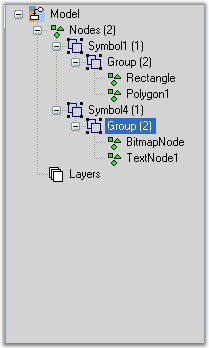
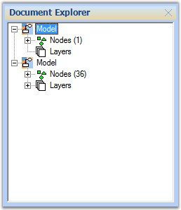

::: {style="DISPLAY: none"}
{#d2h_url_template}{#d2h_package_url style="WIDTH: 0px; DISPLAY: none; HEIGHT: 0px"}
:::

::::: {#nsbanner .d2h_main_nsbanner style="BORDER-BOTTOM: #999999 1px solid; POSITION: relative; PADDING-BOTTOM: 0px; BACKGROUND-COLOR: transparent; PADDING-LEFT: 0px; PADDING-RIGHT: 0px; DISPLAY: none; BORDER-TOP: #999999 1px solid; PADDING-TOP: 0px; LEFT: 0px"}
:::: {#TitleRow .d2h_main_titlerow style="PADDING-BOTTOM: 4px; BACKGROUND-COLOR: transparent; PADDING-LEFT: 22px; WIDTH: 100%; PADDING-RIGHT: 10px; DISPLAY: none; PADDING-TOP: 4px"}
::: {#ienav .d2h_main_ienav style="DISPLAY: none"}
{#D2HPrevious .D2HPreviousEnabled}  {#D2HNext .D2HNextEnabled}
:::
::::
:::::

::::::: {#nstext .d2h_main_nstext style="PADDING-BOTTOM: 10px; BACKGROUND-COLOR: transparent; PADDING-LEFT: 22px; PADDING-RIGHT: 10px; HEIGHT: 100%; OVERFLOW: auto; PADDING-TOP: 5px" hasuserbackground="true" valign="bottom"}
::: {#d2h_breadcrumbs .d2h_breadcrumbs}
[Essential Studio User Guide Documentation](ms-xhelp:///?Id=12457748-09e3-4d74-a240-8e049cedf030){.d2h_breadcrumbsNormal}[ \> ]{.d2h_breadcrumbsLinkSeparator}[User Interface Edition](ms-xhelp:///?Id=c29296b7-531c-413b-a0ec-488ca1f7f669){.d2h_breadcrumbsNormal}[ \> ]{.d2h_breadcrumbsLinkSeparator}[Essential Windows](ms-xhelp:///?Id=e60759d8-47a4-4570-9d7a-16a68d63f2ea){.d2h_breadcrumbsNormal}[ \> ]{.d2h_breadcrumbsLinkSeparator}[Essential Diagram]{.d2h_breadcrumbsContentsOnly}[ \> ]{.d2h_breadcrumbsLinkSeparator}[Concepts And Features](ms-xhelp:///?Id=008cec4b-5177-4859-8616-c062751d8fb6){.d2h_breadcrumbsNormal}[ \> ]{.d2h_breadcrumbsLinkSeparator}[Supported Controls](ms-xhelp:///?Id=aa17622e-7642-4f9d-b086-6c705e48f9fa){.d2h_breadcrumbsNormal}
:::

### Document Explorer {#document-explorer style="tab-stops: 0pt"}

[]{style="FONT-FAMILY: 'Trebuchet MS','sans-serif'; COLOR: #15428b; FONT-SIZE: 9pt"} 

Document Explorer allows you to visualize the details of various objects that are added onto the diagram control at run-time. The layers will be listed under the Layers node and other objects like shapes, links, lines and text editor will be listed under Nodes node.

 

The properties of the Document Explorer are listed below with their respective descriptions.

[]{style="FONT-FAMILY: 'Trebuchet MS','sans-serif'; COLOR: #15428b; FONT-SIZE: 9pt"} 

::: {align="center"}
  -------------------- ------------------------------------------------------------------------------------------------------------------------------
      Property         Description
  BackColor            Background color of the component.
  BorderStyle          Border style for the component. It can be FixedSingle, Fixed3D or None.
  CheckBoxes           Boolean value indicating whether check boxes should be displayed besides the nodes.
  ItemHeight           Height of the tree view node.
  Enabled              Indicates if the control is enabled.
  FullRowSelect        Indicates whether the whole row (through out the width of the TreeView) is selected when the corresponding node is selected.
  HideSelection        Removes the highlight from the selected node when the control loses focus.
  HotTracking          Indicates whether the selected node will interact with the user by giving a link-like appearance.
  ImageIndex           Default image index for the nodes.
  ImageKey             Default image key for the nodes.
  Imagelist            Imagelist with images to be used for the nodes.
  Indent               Indentation of child nodes in pixels.
  LabelEdit            Boolean value indicating whether nodes labels can be edited.
  LineColor            Color of the lines that connects the nodes of the TreeView.
  Nodes                Node Collection of the TreeView control.
  PathSeparator        String Delimiter used for the path returned by a node\'s Fullpath property.
  Scrollable           Enables scroll bars if required.
  SelectedImageIndex   Default image index for the selected nodes.
  SelectedImageKey     Default image key for the selected nodes.
  ShowLines            Indicates whether lines are displayed between sibling nodes and between parent and child nodes.
  ShowNodeToolTips     Indicates whether tooltips will be displayed on the nodes.
  ShowPlusMinus        Indicates whether plus / minus buttons are shown next to  parent nodes.
  ShowRootLines        Indicates whether lines are shown between root nodes.
  StateImageList       ImageList used for custom state images.
  Visible              Sets visibility of the control.
  -------------------- ------------------------------------------------------------------------------------------------------------------------------
:::

[]{style="FONT-FAMILY: 'Calibri','sans-serif'"} 

::: {align="center"}
  ------------- ----------------------------------------------
  Method        Description
  AttachModel   Adds Diagram Model to the Document Explorer.
  ------------- ----------------------------------------------
:::

 

The important events of Document Explorer are as follows,

[]{style="FONT-FAMILY: 'Trebuchet MS','sans-serif'; COLOR: #15428b; FONT-SIZE: 9pt"} 

::: {align="center"}
  ---------------------- -----------------------------------------------------------------------------
  Event                  Description
  Click                  Occurs when the component is clicked.
  DoubleClick            Occurs when the component is double-clicked.
  AfterCheck             Occurs when a check box on a tree node has been checked or unchecked.
  AfterCollapse          Occurs when a node has been collapsed.
  AfterExpand            Occurs when a node has been expanded.
  AfterLabelEdit         Occurs when the text of a node has been edited by the user.
  AfterSelect            Occurs when the selection has been changed.
  BeforeCheck            Occurs when a check box on a tree node is about to be checked or unchecked.
  BeforeCollapse         Occurs when a node is about to be collapsed.
  BeforeExpand           Occurs when a node is about to be expanded.
  BeforeLabelEdit        Occurs when the text of a node is about to be edited by the user.
  BeforeSelect           Occurs when the selection is about to change.
  DrawNode               Occurs in owner draw-mode, when a node needs to be drawn.
  NodeMouseClick         Occurs when a node is clicked with the mouse.
  NodeMouseDoubleClick   Occurs when a node is double-clicked with the mouse.
  ---------------------- -----------------------------------------------------------------------------
:::

[]{style="FONT-FAMILY: 'Trebuchet MS','sans-serif'; COLOR: #15428b; FONT-SIZE: 9pt"} 

Programmatically, the properties can be set as follows.

[]{style="FONT-FAMILY: 'Trebuchet MS','sans-serif'; COLOR: #15428b; FONT-SIZE: 9pt"} 

+----------------------------------------------------------------------------------------------------------------------------------------------------+
| **[\[C#\]]{style="FONT-FAMILY: 'Courier New'; COLOR: black"}**                                                                                     |
|                                                                                                                                                    |
| []{style="FONT-FAMILY: 'Courier New'"}                                                                                                             |
|                                                                                                                                                    |
| [documentExplorer1.AttachModel(model1);]{style="FONT-FAMILY: 'Courier New'"}                                                                       |
|                                                                                                                                                    |
| [documentExplorer1.Dock = [DockStyle]{style="COLOR: teal"}.Right;]{style="FONT-FAMILY: 'Courier New'"}                                             |
|                                                                                                                                                    |
| [documentExplorer1.BackColor = System.Drawing.[SystemColors]{style="COLOR: teal"}.Window;]{style="FONT-FAMILY: 'Courier New'"}                     |
|                                                                                                                                                    |
| [documentExplorer1.Location = [new]{style="COLOR: blue"} System.Drawing.[Point]{style="COLOR: teal"}(0, 377);]{style="FONT-FAMILY: 'Courier New'"} |
|                                                                                                                                                    |
| [documentExplorer1.Size = [new]{style="COLOR: blue"} System.Drawing.[Size]{style="COLOR: teal"}(200, 100);]{style="FONT-FAMILY: 'Courier New'"}    |
|                                                                                                                                                    |
| [documentExplorer1.BorderStyle = System.Windows.Forms.[BorderStyle]{style="COLOR: teal"}.Fixed3D;]{style="FONT-FAMILY: 'Courier New'"}             |
|                                                                                                                                                    |
| [documentExplorer1.ShowNodeToolTips = [true]{style="COLOR: blue"};]{style="FONT-FAMILY: 'Courier New'"}                                            |
+----------------------------------------------------------------------------------------------------------------------------------------------------+

[]{style="FONT-FAMILY: 'Courier New'"} 

+----------------------------------------------------------------------------------------------------------------------------+
| **[\[VB\]]{style="FONT-FAMILY: 'Courier New'; COLOR: black"}**                                                             |
|                                                                                                                            |
| []{style="FONT-FAMILY: 'Courier New'; COLOR: blue"}                                                                        |
|                                                                                                                            |
| [documentExplorer1.AttachModel(model1)]{style="FONT-FAMILY: 'Courier New'"}                                                |
|                                                                                                                            |
| [documentExplorer1.Dock = DockStyle.Right]{style="FONT-FAMILY: 'Courier New'"}                                             |
|                                                                                                                            |
| [documentExplorer1.BackColor = System.Drawing.SystemColors.Window]{style="FONT-FAMILY: 'Courier New'"}                     |
|                                                                                                                            |
| [documentExplorer1.Location = [New]{style="COLOR: blue"} System.Drawing.Point(0, 377)]{style="FONT-FAMILY: 'Courier New'"} |
|                                                                                                                            |
| [documentExplorer1.Size = [New]{style="COLOR: blue"} System.Drawing.Size(200, 100)]{style="FONT-FAMILY: 'Courier New'"}    |
|                                                                                                                            |
| [documentExplorer1.BorderStyle = System.Windows.Forms.BorderStyle.Fixed3D]{style="FONT-FAMILY: 'Courier New'"}             |
|                                                                                                                            |
| [documentExplorer1.ShowNodeToolTips = [True]{style="COLOR: blue"}]{style="FONT-FAMILY: 'Courier New'"}                     |
+----------------------------------------------------------------------------------------------------------------------------+

**[]{style="FONT-FAMILY: 'Trebuchet MS','sans-serif'; COLOR: #15428b; FONT-SIZE: 9pt"}** 

{border="0"}

**[]{style="FONT-FAMILY: 'Trebuchet MS','sans-serif'; COLOR: #15428b; FONT-SIZE: 9pt"}** 

Figure 41: Document Explorer

***[]{style="FONT-FAMILY: 'Trebuchet MS','sans-serif'; COLOR: #15428b; FONT-SIZE: 9pt"}*** 

Sample code snippet for documentExplorer1.AfterSelect Event

**[]{style="FONT-FAMILY: 'Trebuchet MS','sans-serif'; COLOR: #15428b"}** 

+-----------------------------------------------------------------------------------------------------------------------------------------------------------------------------------------------------------------------+
| **[\[C#\]]{style="FONT-FAMILY: 'Courier New'; COLOR: black"}**                                                                                                                                                        |
|                                                                                                                                                                                                                       |
| []{style="FONT-FAMILY: 'Courier New'; COLOR: blue"}                                                                                                                                                                   |
|                                                                                                                                                                                                                       |
| [documentExplorer1.AfterSelect+=[new]{style="COLOR: blue"} TreeViewEventHandler( documentExplorer1_AfterSelect );]{style="FONT-FAMILY: 'Courier New'"}                                                                |
|                                                                                                                                                                                                                       |
| []{style="FONT-FAMILY: 'Courier New'"}                                                                                                                                                                                |
|                                                                                                                                                                                                                       |
| [private]{style="FONT-FAMILY: 'Courier New'; COLOR: blue"}[ [void]{style="COLOR: blue"} documentExplorer1_AfterSelect([object]{style="COLOR: blue"} sender,TreeViewEventArgs e) ]{style="FONT-FAMILY: 'Courier New'"} |
|                                                                                                                                                                                                                       |
| [{]{style="FONT-FAMILY: 'Courier New'"}                                                                                                                                                                               |
|                                                                                                                                                                                                                       |
| [  [// Update diagram\'s selection list depending on TreeNode Tag]{style="COLOR: green"}]{style="FONT-FAMILY: 'Courier New'"}                                                                                         |
|                                                                                                                                                                                                                       |
| [   [if]{style="COLOR: blue"} ( e.Node.Tag [is]{style="COLOR: blue"} Node )]{style="FONT-FAMILY: 'Courier New'"}                                                                                                      |
|                                                                                                                                                                                                                       |
| [   {]{style="FONT-FAMILY: 'Courier New'"}                                                                                                                                                                            |
|                                                                                                                                                                                                                       |
| [      Node nodeTemp = e.Node.Tag [as]{style="COLOR: blue"} Node;]{style="FONT-FAMILY: 'Courier New'"}                                                                                                                |
|                                                                                                                                                                                                                       |
| [      [if]{style="COLOR: blue"} ( nodeTemp != [null]{style="COLOR: blue"} )]{style="FONT-FAMILY: 'Courier New'"}                                                                                                     |
|                                                                                                                                                                                                                       |
| [      {]{style="FONT-FAMILY: 'Courier New'"}                                                                                                                                                                         |
|                                                                                                                                                                                                                       |
| [        [if]{style="COLOR: blue"} (nodeTemp.Visible && nodeTemp.Root.Equals([this]{style="COLOR: blue"}.diagram1.Model))]{style="FONT-FAMILY: 'Courier New'"}                                                        |
|                                                                                                                                                                                                                       |
| [        {]{style="FONT-FAMILY: 'Courier New'"}                                                                                                                                                                       |
|                                                                                                                                                                                                                       |
| [            diagram1.View.SelectionList.Clear();]{style="FONT-FAMILY: 'Courier New'"}                                                                                                                                |
|                                                                                                                                                                                                                       |
| [            diagram1.View.SelectionList.Add(e.Node.Tag [as]{style="COLOR: blue"} Node);]{style="FONT-FAMILY: 'Courier New'"}                                                                                         |
|                                                                                                                                                                                                                       |
| [        }]{style="FONT-FAMILY: 'Courier New'"}                                                                                                                                                                       |
|                                                                                                                                                                                                                       |
| [        [else]{style="COLOR: blue"}]{style="FONT-FAMILY: 'Courier New'"}                                                                                                                                             |
|                                                                                                                                                                                                                       |
| [        {]{style="FONT-FAMILY: 'Courier New'"}                                                                                                                                                                       |
|                                                                                                                                                                                                                       |
| [            propertyEditor.PropertyGrid.SelectedObject = nodeTemp;]{style="FONT-FAMILY: 'Courier New'"}                                                                                                              |
|                                                                                                                                                                                                                       |
| [        }]{style="FONT-FAMILY: 'Courier New'"}                                                                                                                                                                       |
|                                                                                                                                                                                                                       |
| [      }]{style="FONT-FAMILY: 'Courier New'"}                                                                                                                                                                         |
|                                                                                                                                                                                                                       |
| [    }]{style="FONT-FAMILY: 'Courier New'"}                                                                                                                                                                           |
|                                                                                                                                                                                                                       |
| [}]{style="FONT-FAMILY: 'Courier New'"}                                                                                                                                                                               |
+-----------------------------------------------------------------------------------------------------------------------------------------------------------------------------------------------------------------------+

**[]{style="FONT-FAMILY: 'Trebuchet MS','sans-serif'; COLOR: #15428b; FONT-SIZE: 9pt"}** 

{border="0"}

**[]{style="FONT-FAMILY: 'Trebuchet MS','sans-serif'; COLOR: #15428b; FONT-SIZE: 9pt"}** 

Figure 42: Document Explorer

 

[]{#p24} 

 

[]{#related-topics}
:::::::
