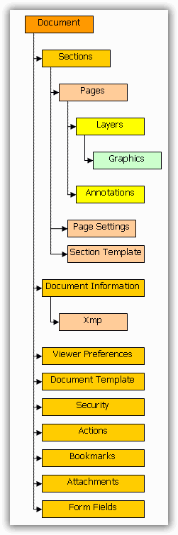

::: {style="DISPLAY: none"}
{#d2h_url_template}{#d2h_package_url style="WIDTH: 0px; DISPLAY: none; HEIGHT: 0px"}
:::

::::::::::::: {.d2h_secondary_topic style="PADDING-BOTTOM: 10pt; MARGIN: 0pt; PADDING-LEFT: 0pt; PADDING-RIGHT: 0pt; PADDING-TOP: 0pt"}
#### Document Object Model {#document-object-model style="tab-stops: 0pt"}

[]{style="FONT-FAMILY: 'Trebuchet MS','sans-serif'; COLOR: #15428b; FONT-SIZE: 9pt"} 

**PdfDocument** is a top-level object in Essential PDF, which is a representation of a PDF document. The document contains a collection of sections that are represented by the **PdfSection** class, which is a logical entity containing a collection of pages and their settings. Pages (which are represented by **PdfPage class**) are the main destinations of the graphics output.

[]{style="FONT-FAMILY: 'Trebuchet MS','sans-serif'; COLOR: #15428b; FONT-SIZE: 9pt"} 

::: {style="BORDER-BOTTOM: windowtext 1pt solid; BORDER-LEFT: medium none; PADDING-BOTTOM: 1pt; MARGIN-TOP: 9pt; PADDING-LEFT: 0pt; PADDING-RIGHT: 0pt; MARGIN-BOTTOM: 9pt; BORDER-TOP: windowtext 1pt solid; BORDER-RIGHT: medium none; PADDING-TOP: 1pt"}
{border="0"}Note: A document should contain at least one section with one page.
:::

[]{style="FONT-FAMILY: 'Trebuchet MS','sans-serif'; COLOR: #15428b; FONT-SIZE: 9pt"} 

A page does not contain any self-settings, but it inherits them from its parent section instead. It means that all the pages in the same section have the same dimensions. If a new page with different settings has to be created, then a new section should be created. A document also has capabilities to specify page settings. When a new section is created, it inherits page settings from the parent document.

[]{style="FONT-FAMILY: 'Trebuchet MS','sans-serif'; COLOR: #15428b; FONT-SIZE: 9pt"} 

You can save a document either to a file or stream through its **Save** method.

[]{style="FONT-FAMILY: 'Trebuchet MS','sans-serif'; COLOR: #15428b; FONT-SIZE: 9pt"} 

\

{border="0"}

Figure 25: DOM

 

PDF Document

[]{style="FONT-FAMILY: 'Trebuchet MS','sans-serif'; COLOR: #15428b; FONT-SIZE: 9pt"} 

It manipulates with general document properties and stores sections. By default, an empty PDF document is created with a single page.

[]{style="FONT-FAMILY: 'Trebuchet MS','sans-serif'; COLOR: #15428b; FONT-SIZE: 9pt"} 

**PdfDocument** class is used to create a PDF document. The following are the public members of the PdfDocument class.

[]{style="FONT-FAMILY: 'Trebuchet MS','sans-serif'; COLOR: #15428b; FONT-SIZE: 9pt"} 

Methods

**[]{style="FONT-FAMILY: 'Trebuchet MS','sans-serif'; COLOR: #15428b; FONT-SIZE: 9pt"}** 

::: {align="center"}
  ----------------- ----------------------------------------------------------------------------------------------
  Name              Description
  AddFields         Adds the fields connected to the page.
  Append            Appends the specified loaded document to this one.
  CheckFields       Checks what fields are connected with the page.
  Clone             Creates a shallow copy of the current document.
  ClonePage         Clones pages and their resource dictionaries and adds them into the document.
  Close             Closes the document and releases the memory.
  DisposeOnClose    Adds an object to a collection of the objects that will be disposed during document closing.
  GetForm           Gets the form.
  ImportPage        Imports a Page.
  ImportPageRange   Imports a page range from a loaded document.
  OnDocumentSaved   Raises DocumentSaved event.
  OnPageSave        Called when a page is saved.
  OnSaveProgress    Raises the \[E:Progress\] event.
  PageLabelsSet     Informs the document that the page labels were set.
  Save              Saves the document.
  ----------------- ----------------------------------------------------------------------------------------------
:::

[]{style="FONT-FAMILY: 'Trebuchet MS','sans-serif'; COLOR: #15428b; FONT-SIZE: 9pt"} 

Properties

[]{style="FONT-FAMILY: 'Trebuchet MS','sans-serif'; COLOR: #15428b; FONT-SIZE: 9pt"} 

::: {align="center"}
  --------------------- ------------------------------------------------------------------------------------------------------------------------
  Name                  Description
  Actions               Gets the additional document\'s actions.
  Attachments           Gets the attachments of the document.
  Bookmarks             Gets the root of the bookmark tree in the document.
  Cache                 Gets collection of the cached objects.
  Catalog               Gets the PDF document catalog.
  ColorSpace            Gets or sets the color space for the page that will be created.
  Compression           Gets or sets the desired level of stream compression.
  Conformance           Gets or sets the Pdf Conformance level. Supported: PDF/A-1b - Level B compliance in Part 1.
  DefaultFont           Gets the default font. It is used for complex objects when font is not explicitly defined.
  DisposeObjects        Gets a list of the objects that have to be disposed after document closing.
  DocumentInformation   Gets or sets document\'s information and properties.
  FileStructure         Gets or sets the internal structure of the PDF file.
  Form                  Gets the interactive form of the document.
  Pages                 Gets the collection of the pages in the document.
  PageSettings          Gets or sets default page settings of the document\'s sections.
  Sections              Gets the collection of the sections in the document.
  Security              Gets the security parameters of the document.
  Template              Gets or sets a template that is applied to all pages in the document.
  ViewerPreferences     Gets or sets a viewer preference object controlling the way the document is to be presented on the screen or in print.
  --------------------- ------------------------------------------------------------------------------------------------------------------------
:::

[]{style="FONT-FAMILY: 'Trebuchet MS','sans-serif'; COLOR: #15428b; FONT-SIZE: 9pt"} 

Events

[]{style="FONT-FAMILY: 'Trebuchet MS','sans-serif'; COLOR: #15428b; FONT-SIZE: 9pt"} 

::: {align="center"}
  --------------- -----------------------------------------------------------------------
  Name            Description
  DocumentSaved   This event is raised when the document is saved.
  SaveProgress    This event exposes the progression of the save state of the document.
  --------------- -----------------------------------------------------------------------
:::

[]{style="FONT-FAMILY: 'Trebuchet MS','sans-serif'; COLOR: #15428b; FONT-SIZE: 9pt"} 

Section

[]{style="FONT-FAMILY: 'Trebuchet MS','sans-serif'; COLOR: #15428b; FONT-SIZE: 9pt"} 

[·      ]{style="FONT-FAMILY: Symbol"}Contains pages with the same parameters.

[·      ]{style="FONT-FAMILY: Symbol"}When new pages are added to the section, it obtains parameters from the section even if it was imported from another section or document.

[·      ]{style="FONT-FAMILY: Symbol"}When a high-level graphic object needs to be drawn on more than one page, it adds a new page to the section of the start page from which the object starts, if required.

[]{style="FONT-FAMILY: 'Trebuchet MS','sans-serif'; COLOR: #15428b; FONT-SIZE: 9pt"} 

**PdfSection** class allows creating and managing sections. The following are the members exposed by the PdfSection class.

**[]{style="FONT-FAMILY: 'Trebuchet MS','sans-serif'; COLOR: #15428b; FONT-SIZE: 9pt"}** 

Methods

**[]{style="FONT-FAMILY: 'Trebuchet MS','sans-serif'; COLOR: #15428b; FONT-SIZE: 9pt"}** 

::: {align="center"}
  --------------- ----------------------------------------------------
  Name            Description
  Add             Overloaded.
  Clear           Removes all the pages from the section.
  Contains        Determines whether the page is within the section.
  DrawTemplates   Draws page templates on the page.
  IndexOf         Gets the index of the page.
  Insert          Inserts a page at the specified index.
  OnPageAdded     Called when the page is added.
  OnPageSaving    Called when a page is being saved.
  Remove          Removes the page from the section.
  RemoveAt        Removes the page by its index in the section.
  --------------- ----------------------------------------------------
:::

 

Properties

 

::: {align="center"}
  -------------- -------------------------------------------------------
  Name           Description
  Count          Gets the count of the pages in the section.
  Document       Gets the document.
  Item           Gets the PdfPage at the specified index.
  PageLabel      Gets or sets the page label.
  Pages          Gets the pages.
  PageSettings   Gets or sets the page settings of the section.
  Template       Gets or sets a template for the pages in the section.
  -------------- -------------------------------------------------------
:::

 

Events

[]{style="FONT-FAMILY: 'Trebuchet MS','sans-serif'; COLOR: #15428b; FONT-SIZE: 9pt"} 

::: {align="center"}
  ----------- ------------------------------------------------
  Name        Description
  PageAdded   This event is raised when a new page is added.
  ----------- ------------------------------------------------
:::

[]{style="FONT-FAMILY: 'Trebuchet MS','sans-serif'; COLOR: #15428b; FONT-SIZE: 9pt"} 

Page

[]{style="FONT-FAMILY: 'Trebuchet MS','sans-serif'; COLOR: #15428b; FONT-SIZE: 9pt"} 

Represents a rectangular area where the user can draw something, attach annotations, and so on. Each page has layers. When a page is created, it has one default layer. You can create more layers and refer them by an index. Each layer is associated with a graphics stream and has its own graphics (PdfGraphics class).

 

**PdfPage** class is used to create a page. The following are the members exposed by this class.

 

**Methods**

 

::: {align="center"}
  ---------------- ---------------------------------------------------------------------------
  Name             Description
  CreateTemplate   Creates a template from the page content and all annotation appearances.
  ExtractImages    Extracts images from the given PDF page.
  ExtractText      Extracts text from the given PDF Page.
  GetAnnots        Gets the annotations array.
  GetClientSize    Returns a page size reduced by page margins and page template dimensions.
  GetContent       Gets the content of the page in form of a PDF template.
  OnBeginSave      Raises BeginSave event.
  ResetProgress    Resets the progress.
  SetProgress      Sets the progress.
  SetSection       Sets parent section to the page.
  ---------------- ---------------------------------------------------------------------------
:::

 

Properties

 

::: {align="center"}
  ------------------- -----------------------------------------------
  Name                Description
  Annotations         Gets a collection of annotations of the page.
  Contents            Gets array of page\'s content.
  DefaultLayer        Gets the default layer of the page.
  DefaultLayerIndex   Gets or sets index of the default layer.
  Dictionary          Gets the page dictionary.
  Document            Gets current document.
  Graphics            Gets the graphics of the DefaultLayer.
  Layers              Gets the collection of the page\'s layers.
  Orientation         Gets the page orientation.
  Rotation            Gets the page rotation.
  Section             Gets the parent section of the page.
  Size                Gets the size of the page.
  ------------------- -----------------------------------------------
:::

[]{style="FONT-FAMILY: 'Trebuchet MS','sans-serif'; COLOR: #15428b; FONT-SIZE: 9pt"} 

Events

[]{style="FONT-FAMILY: 'Trebuchet MS','sans-serif'; COLOR: #15428b; FONT-SIZE: 9pt"} 

::: {align="center"}
  ----------- -------------------------------
  Name        Description
  BeginSave   Raises before the page saves.
  ----------- -------------------------------
:::

 

[]{#related-topics}
:::::::::::::
