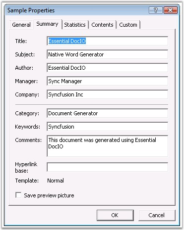
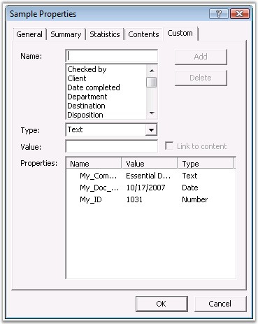

::: {style="DISPLAY: none"}
{#d2h_url_template}{#d2h_package_url style="WIDTH: 0px; DISPLAY: none; HEIGHT: 0px"}
:::

::::: {#nsbanner .d2h_main_nsbanner style="BORDER-BOTTOM: #999999 1px solid; POSITION: relative; PADDING-BOTTOM: 0px; BACKGROUND-COLOR: transparent; PADDING-LEFT: 0px; PADDING-RIGHT: 0px; DISPLAY: none; BORDER-TOP: #999999 1px solid; PADDING-TOP: 0px; LEFT: 0px"}
:::: {#TitleRow .d2h_main_titlerow style="PADDING-BOTTOM: 4px; BACKGROUND-COLOR: transparent; PADDING-LEFT: 22px; WIDTH: 100%; PADDING-RIGHT: 10px; DISPLAY: none; PADDING-TOP: 4px"}
::: {#ienav .d2h_main_ienav style="DISPLAY: none"}
{#D2HPrevious .D2HPreviousEnabled}  {#D2HNext .D2HNextEnabled}
:::
::::
:::::

::::::::: {#nstext .d2h_main_nstext style="PADDING-BOTTOM: 10px; BACKGROUND-COLOR: transparent; PADDING-LEFT: 22px; PADDING-RIGHT: 10px; HEIGHT: 100%; OVERFLOW: auto; PADDING-TOP: 5px" hasuserbackground="true" valign="bottom"}
::: {#d2h_breadcrumbs .d2h_breadcrumbs}
[Essential Studio User Guide Documentation](ms-xhelp:///?Id=12457748-09e3-4d74-a240-8e049cedf030){.d2h_breadcrumbsNormal}[ \> ]{.d2h_breadcrumbsLinkSeparator}[Reporting Edition](ms-xhelp:///?Id=027aa5b6-6676-4f93-ad23-c20e8c45792e){.d2h_breadcrumbsNormal}[ \> ]{.d2h_breadcrumbsLinkSeparator}[Essential DocIO](ms-xhelp:///?Id=b88d77b3-4c51-460f-a761-d2ef6d5b0ca6){.d2h_breadcrumbsNormal}[ \> ]{.d2h_breadcrumbsLinkSeparator}[Concepts and Features](ms-xhelp:///?Id=c1881696-52ce-4414-9f3d-97433d8e9775){.d2h_breadcrumbsNormal}[ \> ]{.d2h_breadcrumbsLinkSeparator}[Word Document](ms-xhelp:///?Id=d4b2bc62-8cff-43ca-bbb3-bdd5cc1553de){.d2h_breadcrumbsNormal}
:::

### Document Properties {#document-properties style="tab-stops: 0pt"}

 

Document Properties contain general information about the document like author of the document, subject, character count, word count, page count, creation date and so on.

 

To view or edit the document properties, go to the **File** menu and click **Properties**. The Document Properties dialog box will appear as follows.

 

{border="0"}

Figure 25: Document Properties Dialog Box

 

 

The Document Properties dialog box contains the following tabs.

 

[·      ]{style="FONT-FAMILY: Symbol"}**General** (not editable): contains general document information such as file name, type, size, location, creation, modification and access date

[·      ]{style="FONT-FAMILY: Symbol"}**Summary** (editable): set or modify the document properties such as author name, title, company, subject, keywords, and so on

[·      ]{style="FONT-FAMILY: Symbol"}**Statistics** (not editable): displays the statistics of the document such as creation, modification, access and print dates, revision number, characters, words, pages number, and so on

[·      ]{style="FONT-FAMILY: Symbol"}**Contents** (not editable): displays the content of the document

[·      ]{style="FONT-FAMILY: Symbol"}**Custom** (editable): enables you to create your own properties combining their name, type and value. For example, you may want to mark some document as \"Checked\". You can do it by creating a custom property with the Name as \"Checked\", Type as \"Text\", and Value as \"your name\".

 

Built-in Properties

 

BuiltinDocumentProperties class represents all document properties, excluding custom properties.

 

Class Hierarchy

 

SummaryDocumentProperties

            \|

            BuiltinDocumentProperties

 

**Public Properties**

 

::: {align="center"}
  ---------------- ----------------------------------------------------------
  Name             Description
  BytesCount       Represents the number of bytes in the document.  
  Category         Gets or sets the category of the document.  
  Company          Gets or sets Company property.  
  HiddenCount      Gets or sets hidden count.  
  LinesCount       Gets or sets the number of lines in the document.  
  Manager          Gets or sets Manager property.  
  NoteCount        Gets or sets Note count.
  ParagraphCount   Gets or sets the number of paragraphs in the document.  
  SlideCount       Gets or sets slide count.  
  ---------------- ----------------------------------------------------------
:::

 

Public Methods

 

::: {align="center"}
  ------- -----------------
  Name    Description
  Clone    Clones itself.
  ------- -----------------
:::

 

The following example illustrates how to get, set and modify the document properties.

 

+-------------------------------------------------------------------------------------------------------------------------------------------------------------------------------+
| **[\[C#\]]{style="FONT-FAMILY: 'Courier New'; COLOR: black"}**                                                                                                                |
|                                                                                                                                                                               |
| []{style="COLOR: black"}                                                                                                                                                      |
|                                                                                                                                                                               |
| [WordDocument]{style="FONT-FAMILY: 'Courier New'; COLOR: teal"}[ doc = [new]{style="COLOR: blue"} [WordDocument]{style="COLOR: teal"}();]{style="FONT-FAMILY: 'Courier New'"} |
|                                                                                                                                                                               |
| [doc.Open( [\"DocumentProperties.doc\"]{style="COLOR: maroon"} );]{style="FONT-FAMILY: 'Courier New'"}                                                                        |
|                                                                                                                                                                               |
| []{style="FONT-FAMILY: 'Courier New'"}                                                                                                                                        |
|                                                                                                                                                                               |
| [string]{style="FONT-FAMILY: 'Courier New'; COLOR: blue"}[ author = doc.BuiltinDocumentProperties.Author;]{style="FONT-FAMILY: 'Courier New'"}                                |
|                                                                                                                                                                               |
| [int]{style="FONT-FAMILY: 'Courier New'; COLOR: blue"}[ bytesCount = doc.BuiltinDocumentProperties.BytesCount;]{style="FONT-FAMILY: 'Courier New'"}                           |
|                                                                                                                                                                               |
| [doc.BuiltinDocumentProperties.Keywords += [\"document properties\"]{style="COLOR: maroon"};]{style="FONT-FAMILY: 'Courier New'"}                                             |
|                                                                                                                                                                               |
| []{style="FONT-FAMILY: 'Courier New'"}                                                                                                                                        |
|                                                                                                                                                                               |
| [doc.BuiltinDocumentProperties.Author = [\"Author\'s name\"]{style="COLOR: maroon"};]{style="FONT-FAMILY: 'Courier New'"}                                                     |
|                                                                                                                                                                               |
| [doc.BuiltinDocumentProperties.Comments = [\"Document comments\"]{style="COLOR: maroon"};]{style="FONT-FAMILY: 'Courier New'"}                                                |
+-------------------------------------------------------------------------------------------------------------------------------------------------------------------------------+

 

+-------------------------------------------------------------------------------------------------------------------------------------------------------------------------------------------------------------+
| **[\[VB.NET\]]{style="FONT-FAMILY: 'Courier New'; COLOR: black"}**                                                                                                                                          |
|                                                                                                                                                                                                             |
| []{style="COLOR: black"}                                                                                                                                                                                    |
|                                                                                                                                                                                                             |
| [Dim]{style="FONT-FAMILY: 'Courier New'; COLOR: blue"}[ doc [As]{style="COLOR: blue"} WordDocument = [New]{style="COLOR: blue"} WordDocument()]{style="FONT-FAMILY: 'Courier New'"}                         |
|                                                                                                                                                                                                             |
| [doc.Open([\"DocumentProperties.doc\"]{style="COLOR: maroon"})]{style="FONT-FAMILY: 'Courier New'"}                                                                                                         |
|                                                                                                                                                                                                             |
| []{style="FONT-FAMILY: 'Courier New'"}                                                                                                                                                                      |
|                                                                                                                                                                                                             |
| [Dim]{style="FONT-FAMILY: 'Courier New'; COLOR: blue"}[ author [As]{style="COLOR: blue"} [String]{style="COLOR: blue"} = doc.BuiltinDocumentProperties.Author]{style="FONT-FAMILY: 'Courier New'"}          |
|                                                                                                                                                                                                             |
| [Dim]{style="FONT-FAMILY: 'Courier New'; COLOR: blue"}[ bytesCount [As]{style="COLOR: blue"} [Integer]{style="COLOR: blue"} = doc.BuiltinDocumentProperties.BytesCount]{style="FONT-FAMILY: 'Courier New'"} |
|                                                                                                                                                                                                             |
| [doc.BuiltinDocumentProperties.Keywords &= [\"document properties\"]{style="COLOR: maroon"}]{style="FONT-FAMILY: 'Courier New'"}                                                                            |
|                                                                                                                                                                                                             |
| []{style="FONT-FAMILY: 'Courier New'; COLOR: maroon"}                                                                                                                                                       |
|                                                                                                                                                                                                             |
| [doc.BuiltinDocumentProperties.Author = [\"Author\'s name\"]{style="COLOR: maroon"}]{style="FONT-FAMILY: 'Courier New'"}                                                                                    |
|                                                                                                                                                                                                             |
| [doc.BuiltinDocumentProperties.Comments = [\"Document comments\"]{style="COLOR: maroon"}]{style="FONT-FAMILY: 'Courier New'"}                                                                               |
+-------------------------------------------------------------------------------------------------------------------------------------------------------------------------------------------------------------+

 

**Custom Properties**

 

**CustomDocumentProperties** class enables you to create and save custom properties. It contains a collection of DocumentProperty class instances. You can access a document property by indexing, i.e., by specifying the property name or index.

 

{border="0"}

Figure 26: Custom Tab in Document Properties Dialog Box

 

 

Public Properties

 

::: {align="center"}
  ------- -------------------------------
  Name    Description
  Count   Gets count of the properties.
  ------- -------------------------------
:::

 

Public Methods

 

::: {align="center"}
  -------- --------------------------------------
  Name     Description
  Add      Adds a new custom property.
  Clone    Clones itself.
  Remove   Remove property specified by name.  
  -------- --------------------------------------
:::

 

DocumentProperty

 

**DocumentProperty** class represents each custom document property.

 

**Public Methods**

 

::: {align="center"}
  ------------- -------------------------------
  Name          Description
  Clone         Clones itself.
  ToBool        Converts value to Boolean.
  ToByteArray   Converts value to byte array.
  ToDateTime    Converts value to DateTime.
  ToFloat       Converts value to float.
  ToInt         Converts value to integer.
  ToString      Converts value to string.
  ------------- -------------------------------
:::

 

The following example illustrates how to get or set the existing custom document properties, and also how to add new custom document properties.

 

+----------------------------------------------------------------------------------------------------------------------------------------------------------------------------------------------------+
| **[\[C#\]]{style="FONT-FAMILY: 'Courier New'; COLOR: black"}**                                                                                                                                     |
|                                                                                                                                                                                                    |
| []{style="COLOR: black"}                                                                                                                                                                           |
|                                                                                                                                                                                                    |
| [WordDocument]{style="FONT-FAMILY: 'Courier New'; COLOR: teal"}[ doc = [new]{style="COLOR: blue"} [WordDocument]{style="COLOR: teal"}();]{style="FONT-FAMILY: 'Courier New'"}                      |
|                                                                                                                                                                                                    |
| [doc.Open( [\"DocumentProperties.doc\"]{style="COLOR: maroon"} );]{style="FONT-FAMILY: 'Courier New'"}                                                                                             |
|                                                                                                                                                                                                    |
| []{style="FONT-FAMILY: 'Courier New'"}                                                                                                                                                             |
|                                                                                                                                                                                                    |
| [// Getting custom property value]{style="FONT-FAMILY: 'Courier New'; COLOR: green"}                                                                                                               |
|                                                                                                                                                                                                    |
| [int]{style="FONT-FAMILY: 'Courier New'; COLOR: blue"}[ phoneNumber = doc.CustomDocumentProperties\[[\"Telephone number \"]{style="COLOR: maroon"}\].ToInt();]{style="FONT-FAMILY: 'Courier New'"} |
|                                                                                                                                                                                                    |
| []{style="FONT-FAMILY: 'Courier New'"}                                                                                                                                                             |
|                                                                                                                                                                                                    |
| [// Setting existent custom property value]{style="FONT-FAMILY: 'Courier New'; COLOR: green"}                                                                                                      |
|                                                                                                                                                                                                    |
| [doc.CustomDocumentProperties\[[\"Check by\"]{style="COLOR: maroon"}\].Value = [\"user name\"]{style="COLOR: maroon"};]{style="FONT-FAMILY: 'Courier New'"}                                        |
|                                                                                                                                                                                                    |
| []{style="FONT-FAMILY: 'Courier New'"}                                                                                                                                                             |
|                                                                                                                                                                                                    |
| [// Adding new custom property]{style="FONT-FAMILY: 'Courier New'; COLOR: green"}                                                                                                                  |
|                                                                                                                                                                                                    |
| [DateTime]{style="FONT-FAMILY: 'Courier New'; COLOR: teal"}[ completedDate = [DateTime]{style="COLOR: teal"}.Now;]{style="FONT-FAMILY: 'Courier New'"}                                             |
|                                                                                                                                                                                                    |
| [doc.CustomDocumentProperties.Add( [\"Date completed\"]{style="COLOR: maroon"}, completedDate );]{style="FONT-FAMILY: 'Courier New'"}                                                              |
+----------------------------------------------------------------------------------------------------------------------------------------------------------------------------------------------------+

 

+----------------------------------------------------------------------------------------------------------------------------------------------------------------------------------------------------------------------------------------------------------+
| **[\[VB.NET\]]{style="FONT-FAMILY: 'Courier New'; COLOR: black"}**                                                                                                                                                                                       |
|                                                                                                                                                                                                                                                          |
| []{style="COLOR: black"}                                                                                                                                                                                                                                 |
|                                                                                                                                                                                                                                                          |
| [Dim]{style="FONT-FAMILY: 'Courier New'; COLOR: blue"}[ doc [As]{style="COLOR: blue"} WordDocument = [New]{style="COLOR: blue"} WordDocument()]{style="FONT-FAMILY: 'Courier New'"}                                                                      |
|                                                                                                                                                                                                                                                          |
| [doc.Open([\"DocumentProperties.doc\"]{style="COLOR: maroon"})]{style="FONT-FAMILY: 'Courier New'"}                                                                                                                                                      |
|                                                                                                                                                                                                                                                          |
| []{style="FONT-FAMILY: 'Courier New'"}                                                                                                                                                                                                                   |
|                                                                                                                                                                                                                                                          |
| [\' Getting custom property value]{style="FONT-FAMILY: 'Courier New'; COLOR: green"}                                                                                                                                                                     |
|                                                                                                                                                                                                                                                          |
| [Dim]{style="FONT-FAMILY: 'Courier New'; COLOR: blue"}[ phoneNumber [As]{style="COLOR: blue"} [Integer]{style="COLOR: blue"} = doc.CustomDocumentProperties([\"Telephone number \"]{style="COLOR: maroon"}).ToInt()]{style="FONT-FAMILY: 'Courier New'"} |
|                                                                                                                                                                                                                                                          |
| []{style="FONT-FAMILY: 'Courier New'"}                                                                                                                                                                                                                   |
|                                                                                                                                                                                                                                                          |
| [\' Setting existent custom property value]{style="FONT-FAMILY: 'Courier New'; COLOR: green"}                                                                                                                                                            |
|                                                                                                                                                                                                                                                          |
| [doc.CustomDocumentProperties([\"Check by\"]{style="COLOR: maroon"}).Value = [\"user name\"]{style="COLOR: maroon"}]{style="FONT-FAMILY: 'Courier New'"}                                                                                                 |
|                                                                                                                                                                                                                                                          |
| []{style="FONT-FAMILY: 'Courier New'; COLOR: maroon"}                                                                                                                                                                                                    |
|                                                                                                                                                                                                                                                          |
| [\' Adding new custom property]{style="FONT-FAMILY: 'Courier New'; COLOR: green"}                                                                                                                                                                        |
|                                                                                                                                                                                                                                                          |
| [Dim]{style="FONT-FAMILY: 'Courier New'; COLOR: blue"}[ completedDate [As]{style="COLOR: blue"} DateTime = DateTime.Now]{style="FONT-FAMILY: 'Courier New'"}                                                                                             |
|                                                                                                                                                                                                                                                          |
| [doc.CustomDocumentProperties.Add([\"Date completed\"]{style="COLOR: maroon"}, completedDate)]{style="FONT-FAMILY: 'Courier New'"}                                                                                                                       |
+----------------------------------------------------------------------------------------------------------------------------------------------------------------------------------------------------------------------------------------------------------+

[]{#related-topics}
:::::::::
