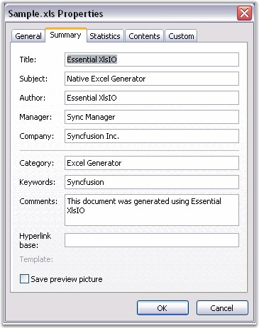

::: {style="DISPLAY: none"}
{#d2h_url_template}{#d2h_package_url style="WIDTH: 0px; DISPLAY: none; HEIGHT: 0px"}
:::

::::: {#nsbanner .d2h_main_nsbanner style="BORDER-BOTTOM: #999999 1px solid; POSITION: relative; PADDING-BOTTOM: 0px; BACKGROUND-COLOR: transparent; PADDING-LEFT: 0px; PADDING-RIGHT: 0px; DISPLAY: none; BORDER-TOP: #999999 1px solid; PADDING-TOP: 0px; LEFT: 0px"}
:::: {#TitleRow .d2h_main_titlerow style="PADDING-BOTTOM: 4px; BACKGROUND-COLOR: transparent; PADDING-LEFT: 22px; WIDTH: 100%; PADDING-RIGHT: 10px; DISPLAY: none; PADDING-TOP: 4px"}
::: {#ienav .d2h_main_ienav style="DISPLAY: none"}
{#D2HPrevious .D2HPreviousEnabled}  {#D2HNext .D2HNextEnabled}
:::
::::
:::::

:::: {#nstext .d2h_main_nstext style="PADDING-BOTTOM: 10px; BACKGROUND-COLOR: transparent; PADDING-LEFT: 22px; PADDING-RIGHT: 10px; HEIGHT: 100%; OVERFLOW: auto; PADDING-TOP: 5px" hasuserbackground="true" valign="bottom"}
::: {#d2h_breadcrumbs .d2h_breadcrumbs}
[Essential Studio User Guide Documentation](ms-xhelp:///?Id=12457748-09e3-4d74-a240-8e049cedf030){.d2h_breadcrumbsNormal}[ \> ]{.d2h_breadcrumbsLinkSeparator}[Reporting Edition](ms-xhelp:///?Id=027aa5b6-6676-4f93-ad23-c20e8c45792e){.d2h_breadcrumbsNormal}[ \> ]{.d2h_breadcrumbsLinkSeparator}[Essential XlsIO](ms-xhelp:///?Id=b01a1b50-1d7d-40c0-bc83-af67e57c9005){.d2h_breadcrumbsNormal}[ \> ]{.d2h_breadcrumbsLinkSeparator}[Concepts and Features](ms-xhelp:///?Id=21b26556-5905-4ad9-90b4-40320db25faf){.d2h_breadcrumbsNormal}[ \> ]{.d2h_breadcrumbsLinkSeparator}[Prepare](ms-xhelp:///?Id=4e8e7026-9449-4e3b-907a-f10090d1e212){.d2h_breadcrumbsNormal}
:::

### Document Properties {#document-properties style="tab-stops: 0pt"}

**[]{style="FONT-FAMILY: 'Segoe UI','sans-serif'; COLOR: black"}** 

Document Properties are named values that provide information about the document, such as the date and time at which the document was last saved, the last user to modify the document, and so on. Document Properties are either built into the document, or are custom user-defined properties.

[]{style="FONT-FAMILY: 'Trebuchet MS','sans-serif'; COLOR: #15428b; FONT-SIZE: 9pt"} 

You can read, and manually add or modify some Built-In properties, and all Custom properties, by selecting the properties from the **File** menu. Built-in properties can be automatically updated properties such as **LastSaveDate**, or preset properties such as **Keywords**.

[]{style="FONT-FAMILY: 'Trebuchet MS','sans-serif'; COLOR: #15428b; FONT-SIZE: 9pt"} 

XlsIO allows to read and write Built-In and Custom properties through the **IBuiltinDocumentProperties** and **ICustomDocumentProperties**.

[]{style="FONT-FAMILY: 'Trebuchet MS','sans-serif'; COLOR: #15428b; FONT-SIZE: 9pt"} 

The following code example illustrates how to set the spreadsheet\'s Built-In and Custom properties.

[]{style="FONT-FAMILY: 'Trebuchet MS','sans-serif'; COLOR: #15428b; FONT-SIZE: 9pt"} 

+-----------------------------------------------------------------------------------------------------------------------------------------------------------------------------------+
| **[\[C#\]]{style="FONT-FAMILY: 'Courier New'"}**                                                                                                                                  |
|                                                                                                                                                                                   |
| []{style="FONT-FAMILY: 'Courier New'"}                                                                                                                                            |
|                                                                                                                                                                                   |
| [// Setting Built-in Document Properties.     ]{style="FONT-FAMILY: 'Courier New'; COLOR: green"}                                                                                 |
|                                                                                                                                                                                   |
| [IBuiltInDocumentProperties]{style="FONT-FAMILY: 'Courier New'; COLOR: teal"}[ builtInProperites = book.BuiltInDocumentProperties;]{style="FONT-FAMILY: 'Courier New'"}           |
|                                                                                                                                                                                   |
| [builtInProperites.Author  =  [\"Essential XlsIO\"]{style="COLOR: maroon"};]{style="FONT-FAMILY: 'Courier New'"}                                                                  |
|                                                                                                                                                                                   |
| [builtInProperites.Comments = [\"This document was generated using Essential XlsIO\"]{style="COLOR: maroon"};]{style="FONT-FAMILY: 'Courier New'"}                                |
|                                                                                                                                                                                   |
| [builtInProperites.ByteCount = 120;]{style="FONT-FAMILY: 'Courier New'"}                                                                                                          |
|                                                                                                                                                                                   |
| [builtInProperites.LastSaveDate = [new]{style="COLOR: blue"} [DateTime]{style="COLOR: teal"}( 1950, 1, 2, 3, 4, 5, 6 );]{style="FONT-FAMILY: 'Courier New'"}                      |
|                                                                                                                                                                                   |
| [builtInProperites.Manager = [\"Manager\"]{style="COLOR: maroon"};]{style="FONT-FAMILY: 'Courier New'"}                                                                           |
|                                                                                                                                                                                   |
| []{style="FONT-FAMILY: 'Courier New'"}                                                                                                                                            |
|                                                                                                                                                                                   |
| [// Setting Custom Properties.]{style="FONT-FAMILY: 'Courier New'; COLOR: green"}                                                                                                 |
|                                                                                                                                                                                   |
| [ICustomDocumentProperties]{style="FONT-FAMILY: 'Courier New'; COLOR: teal"}[ customProperites = workbook.CustomDocumentProperties;]{style="FONT-FAMILY: 'Courier New'"}          |
|                                                                                                                                                                                   |
| [customProperites\[ [\"Author\"]{style="COLOR: maroon"} \].Text = [\"\"]{style="COLOR: maroon"}Essential XlsIO[\"\"]{style="COLOR: maroon"};]{style="FONT-FAMILY: 'Courier New'"} |
|                                                                                                                                                                                   |
| [customProperites\[ [\"Comments\"]{style="COLOR: maroon"} \].Text = [\"XlsIO support Custom document properties\"]{style="COLOR: maroon"};]{style="FONT-FAMILY: 'Courier New'"}   |
|                                                                                                                                                                                   |
| [customProperites\[ [\"Double\"]{style="COLOR: maroon"} \].Double = 120.2;  ]{style="FONT-FAMILY: 'Courier New'"}                                                                 |
+-----------------------------------------------------------------------------------------------------------------------------------------------------------------------------------+

[]{style="FONT-FAMILY: 'Trebuchet MS','sans-serif'; COLOR: #15428b; FONT-SIZE: 9pt"} 

+-------------------------------------------------------------------------------------------------------------------------------------------------------------------------------------------------------+
| **[\[VB.NET\]]{style="FONT-FAMILY: 'Courier New'"}**                                                                                                                                                  |
|                                                                                                                                                                                                       |
| []{style="FONT-FAMILY: 'Courier New'"}                                                                                                                                                                |
|                                                                                                                                                                                                       |
| [\' Setting Built-in Document Properties.     ]{style="FONT-FAMILY: 'Courier New'; COLOR: green"}                                                                                                     |
|                                                                                                                                                                                                       |
| [Dim]{style="FONT-FAMILY: 'Courier New'; COLOR: blue"}[ builtInProperites [As]{style="COLOR: blue"} IBuiltInDocumentProperties = book.BuiltInDocumentProperties]{style="FONT-FAMILY: 'Courier New'"}  |
|                                                                                                                                                                                                       |
| [builtInProperites.Author = [\"Essential XlsIO\"]{style="COLOR: maroon"}]{style="FONT-FAMILY: 'Courier New'"}                                                                                         |
|                                                                                                                                                                                                       |
| [builtInProperites.Comments  = [\"This document was generated using Essential XlsIO\"]{style="COLOR: maroon"}]{style="FONT-FAMILY: 'Courier New'"}                                                    |
|                                                                                                                                                                                                       |
| [builtInProperites.ByteCount = 120]{style="FONT-FAMILY: 'Courier New'"}                                                                                                                               |
|                                                                                                                                                                                                       |
| [builtInProperites.LastSaveDate  = [New]{style="COLOR: blue"} DateTime(1950, 1, 2, 3, 4, 5, 6)]{style="FONT-FAMILY: 'Courier New'"}                                                                   |
|                                                                                                                                                                                                       |
| [builtInProperites.Manager = [\"Manager\"]{style="COLOR: maroon"}]{style="FONT-FAMILY: 'Courier New'"}                                                                                                |
|                                                                                                                                                                                                       |
| []{style="FONT-FAMILY: 'Courier New'; COLOR: maroon"}                                                                                                                                                 |
|                                                                                                                                                                                                       |
| [\' Setting Custom Properties.]{style="FONT-FAMILY: 'Courier New'; COLOR: green"}                                                                                                                     |
|                                                                                                                                                                                                       |
| [Dim]{style="FONT-FAMILY: 'Courier New'; COLOR: blue"}[ customProperites [As]{style="COLOR: blue"} ICustomDocumentProperties = workbook.CustomDocumentProperties]{style="FONT-FAMILY: 'Courier New'"} |
|                                                                                                                                                                                                       |
| [customProperites( [\"Author\"]{style="COLOR: maroon"} ).Text = [\"Essential XlsIO\"]{style="COLOR: maroon"}]{style="FONT-FAMILY: 'Courier New'"}                                                     |
|                                                                                                                                                                                                       |
| [customProperites( [\"Comments\"]{style="COLOR: maroon"} ).Text = [\"XlsIO support Custom document properties\"]{style="COLOR: maroon"}]{style="FONT-FAMILY: 'Courier New'"}                          |
|                                                                                                                                                                                                       |
| [customProperites( [\"Double\"]{style="COLOR: maroon"} ).Double = 120.2]{style="FONT-FAMILY: 'Courier New'"}                                                                                          |
+-------------------------------------------------------------------------------------------------------------------------------------------------------------------------------------------------------+

[]{style="FONT-FAMILY: 'Trebuchet MS','sans-serif'; COLOR: #15428b; FONT-SIZE: 9pt"} 

{border="0"}

Figure 153: XlsIO with Document Properties[]{style="FONT-FAMILY: 'Trebuchet MS','sans-serif'; COLOR: #15428b"}

[]{style="FONT-FAMILY: 'Trebuchet MS','sans-serif'; COLOR: #15428b; FONT-SIZE: 9pt"} 

 

[]{#related-topics}
::::
