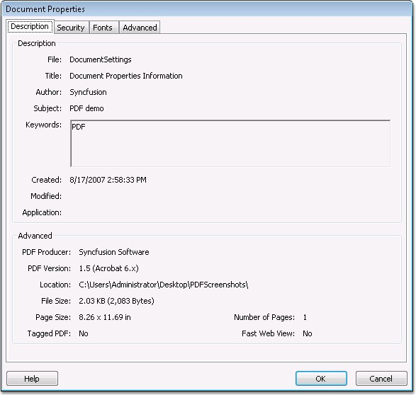

::: {style="DISPLAY: none"}
{#d2h_url_template}{#d2h_package_url style="WIDTH: 0px; DISPLAY: none; HEIGHT: 0px"}
:::

::: {.d2h_secondary_topic style="PADDING-BOTTOM: 10pt; MARGIN: 0pt; PADDING-LEFT: 0pt; PADDING-RIGHT: 0pt; PADDING-TOP: 0pt"}
#### Document Settings {#document-settings style="tab-stops: 0pt"}

 

The Document settings help in storing information about the document. Extensible Metadata Platform (XMP) is a technology that enables to embed metadata.

 

{border="0"} Metadata is the data that describes a file into the file itself.

 

It uses XML as the syntax for metadata description. XMP is provided with the following schemas:

 

[·      ]{style="FONT-FAMILY: Symbol"}Basic Schema

[·      ]{style="FONT-FAMILY: Symbol"}Dublin Core Schema

[·      ]{style="FONT-FAMILY: Symbol"}Rights Management Schema

[·      ]{style="FONT-FAMILY: Symbol"}Basic Job Ticket Schema

[·      ]{style="FONT-FAMILY: Symbol"}Paged-Text Schema

[·      ]{style="FONT-FAMILY: Symbol"}PDF Schema

 

The document properties of Adobe are set by using either the **XMP\'s PDF** schema or the **DocumentInformation** method of the PdfDocument. The properties that can be set are as follows.

 

[·      ]{style="FONT-FAMILY: Symbol"}Author

[·      ]{style="FONT-FAMILY: Symbol"}CreationDate

[·      ]{style="FONT-FAMILY: Symbol"}Keywords

[·      ]{style="FONT-FAMILY: Symbol"}Producer

[·      ]{style="FONT-FAMILY: Symbol"}Subject

[·      ]{style="FONT-FAMILY: Symbol"}Title

 

The following code snippet illustrates setting the document properties such as **Title**, **Author** and **Keywords**.

 

+--------------------------------------------------------------------------------------------------------------------------------------------------------------+
| **[\[C#\]]{style="FONT-FAMILY: 'Courier New'; COLOR: black"}**                                                                                               |
|                                                                                                                                                              |
| []{style="FONT-FAMILY: 'Courier New'; COLOR: black"}                                                                                                         |
|                                                                                                                                                              |
| [// Setting various Document Properties.]{style="FONT-FAMILY: 'Courier New'; COLOR: green"}                                                                  |
|                                                                                                                                                              |
| [pdfDoc.DocumentInformation.Title = [\"Document Properties Information\"]{style="COLOR: maroon"};]{style="FONT-FAMILY: 'Courier New'"}                       |
|                                                                                                                                                              |
| [pdfDoc.DocumentInformation.Author = [\"Syncfusion\"]{style="COLOR: maroon"};]{style="FONT-FAMILY: 'Courier New'"}                                           |
|                                                                                                                                                              |
| [pdfDoc.DocumentInformation.Keywords = [\"PDF\"]{style="COLOR: maroon"};]{style="FONT-FAMILY: 'Courier New'"}                                                |
|                                                                                                                                                              |
| []{style="FONT-FAMILY: 'Courier New'"}                                                                                                                       |
|                                                                                                                                                              |
| [// XMP Basic Schema.]{style="FONT-FAMILY: 'Courier New'; COLOR: green"}                                                                                     |
|                                                                                                                                                              |
| [BasicSchema]{style="FONT-FAMILY: 'Courier New'; COLOR: teal"}[ basic = xmp.BasicSchema;]{style="FONT-FAMILY: 'Courier New'"}                                |
|                                                                                                                                                              |
| [basic.Advisory.Add([\"advisory\"]{style="COLOR: maroon"});]{style="FONT-FAMILY: 'Courier New'"}                                                             |
|                                                                                                                                                              |
| [basic.BaseURL = [new]{style="COLOR: blue"} [Uri]{style="COLOR: teal"}([\"http://google.com\"]{style="COLOR: maroon"});]{style="FONT-FAMILY: 'Courier New'"} |
+--------------------------------------------------------------------------------------------------------------------------------------------------------------+

[]{style="FONT-FAMILY: 'Trebuchet MS','sans-serif'; COLOR: #15428b; FONT-SIZE: 9pt"} 

+-------------------------------------------------------------------------------------------------------------------------------------------------------------------------------+
| **[\[]{style="FONT-FAMILY: 'Courier New'; COLOR: black"}[VB.NET[\]]{style="COLOR: black"}]{style="FONT-FAMILY: 'Courier New'"}**                                              |
|                                                                                                                                                                               |
| []{style="FONT-FAMILY: 'Courier New'; COLOR: black"}                                                                                                                          |
|                                                                                                                                                                               |
| [\' Setting various Document Properties.]{style="FONT-FAMILY: 'Courier New'; COLOR: green"}                                                                                   |
|                                                                                                                                                                               |
| [pdfDoc.DocumentInformation.Title = [\"Document Properties Information\"]{style="COLOR: maroon"}]{style="FONT-FAMILY: 'Courier New'"}                                         |
|                                                                                                                                                                               |
| [pdfDoc.DocumentInformation.Author = [\"Syncfusion\"]{style="COLOR: maroon"}]{style="FONT-FAMILY: 'Courier New'"}                                                             |
|                                                                                                                                                                               |
| [pdfDoc.DocumentInformation.Keywords = [\"PDF\"]{style="COLOR: maroon"}]{style="FONT-FAMILY: 'Courier New'"}                                                                  |
|                                                                                                                                                                               |
| []{style="FONT-FAMILY: 'Courier New'; COLOR: maroon"}                                                                                                                         |
|                                                                                                                                                                               |
| [\' XMP Basic Schema.]{style="FONT-FAMILY: 'Courier New'; COLOR: green"}                                                                                                      |
|                                                                                                                                                                               |
| [Dim]{style="FONT-FAMILY: 'Courier New'; COLOR: blue"}[ basic [As]{style="COLOR: blue"} Syncfusion.Pdf.Xmp.BasicSchema = xmp.BasicSchema]{style="FONT-FAMILY: 'Courier New'"} |
|                                                                                                                                                                               |
| [basic.Advisory.Add([\"advisory\"]{style="COLOR: maroon"})]{style="FONT-FAMILY: 'Courier New'"}                                                                               |
|                                                                                                                                                                               |
| [basic.BaseURL = [New]{style="COLOR: blue"} Uri([\"http://google.com\"]{style="COLOR: maroon"})]{style="FONT-FAMILY: 'Courier New'"}                                          |
+-------------------------------------------------------------------------------------------------------------------------------------------------------------------------------+

[]{style="FONT-FAMILY: 'Trebuchet MS','sans-serif'; COLOR: #15428b; FONT-SIZE: 9pt"} 

{border="0"}

Figure 32: Document Properties

 

 

 

[]{#related-topics}
:::
