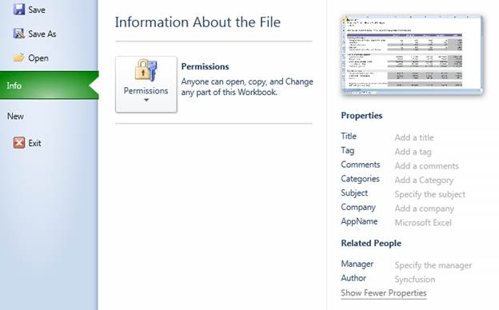

::: {style="DISPLAY: none"}
{#d2h_url_template}{#d2h_package_url style="WIDTH: 0px; DISPLAY: none; HEIGHT: 0px"}
:::

::::: {#nsbanner .d2h_main_nsbanner style="BORDER-BOTTOM: #999999 1px solid; POSITION: relative; PADDING-BOTTOM: 0px; BACKGROUND-COLOR: transparent; PADDING-LEFT: 0px; PADDING-RIGHT: 0px; DISPLAY: none; BORDER-TOP: #999999 1px solid; PADDING-TOP: 0px; LEFT: 0px"}
:::: {#TitleRow .d2h_main_titlerow style="PADDING-BOTTOM: 4px; BACKGROUND-COLOR: transparent; PADDING-LEFT: 22px; WIDTH: 100%; PADDING-RIGHT: 10px; DISPLAY: none; PADDING-TOP: 4px"}
::: {#ienav .d2h_main_ienav style="DISPLAY: none"}
{#D2HPrevious .D2HPreviousEnabled}  {#D2HNext .D2HNextEnabled}
:::
::::
:::::

::::: {#nstext .d2h_main_nstext style="PADDING-BOTTOM: 10px; BACKGROUND-COLOR: transparent; PADDING-LEFT: 22px; PADDING-RIGHT: 10px; HEIGHT: 100%; OVERFLOW: auto; PADDING-TOP: 5px" hasuserbackground="true" valign="bottom"}
::: {#d2h_breadcrumbs .d2h_breadcrumbs}
[Essential Studio User Guide Documentation](ms-xhelp:///?Id=12457748-09e3-4d74-a240-8e049cedf030){.d2h_breadcrumbsNormal}[ \> ]{.d2h_breadcrumbsLinkSeparator}[User Interface Edition](ms-xhelp:///?Id=c29296b7-531c-413b-a0ec-488ca1f7f669){.d2h_breadcrumbsNormal}[ \> ]{.d2h_breadcrumbsLinkSeparator}[Essential WPF](ms-xhelp:///?Id=7f4f82c5-151c-4262-94d0-75c4626c77bc){.d2h_breadcrumbsNormal}[ \> ]{.d2h_breadcrumbsLinkSeparator}[Essential Spreadsheet]{.d2h_breadcrumbsContentsOnly}[ \> ]{.d2h_breadcrumbsLinkSeparator}[Concepts and Features](ms-xhelp:///?Id=625a8128-e556-4a29-9ea6-d472120ad9e1){.d2h_breadcrumbsNormal}[ \> ]{.d2h_breadcrumbsLinkSeparator}[Documents Settings](ms-xhelp:///?Id=d795f8a3-f119-442d-ab46-8e5ade8ee54e){.d2h_breadcrumbsNormal}
:::

### Document Settings Options {#document-settings-options style="tab-stops: 0pt"}

Document properties are named values that provide information about the document namely author, manager, title, tags, commands, subject, company and AppName. Values for these properties can be changed.

Use Case Scenario

When importing and exporting and the Excel sheet, users can get and set the values of the Excel properties.

 

{border="0"}

Figure 37: Excel Properties

 

Properties

::: {align="center"}
+-----------------+------------------------------------------------------+-----------------+-----------------+
| Property        | Description                                          | Type            | Data Type       |
+-----------------+------------------------------------------------------+-----------------+-----------------+
|                 |                                                      |                 |                 |
|                 |                                                      |                 |                 |
| Author          | Used to get or set the  author of the Excel          | Dependency      | String          |
+-----------------+------------------------------------------------------+-----------------+-----------------+
|                 | Used to get or set the application name of the Excel | Dependency      | String          |
|                 |                                                      |                 |                 |
| ApplicationName |                                                      |                 |                 |
+-----------------+------------------------------------------------------+-----------------+-----------------+
| Category        |                                                      |                 |                 |
|                 |                                                      |                 |                 |
|                 | Used to get or set the CategoryName of the Excel     | Dependency      | String          |
|                 |                                                      |                 |                 |
|                 |                                                      |                 |                 |
|                 |                                                      |                 |                 |
|                 |                                                      |                 |                 |
+-----------------+------------------------------------------------------+-----------------+-----------------+
|                 | Used to get or set the comments of an Excel          |                 |                 |
|                 |                                                      |                 |                 |
|                 |                                                      |                 |                 |
|                 |                                                      |                 |                 |
| Comments        |                                                      | Dependency      | String          |
+-----------------+------------------------------------------------------+-----------------+-----------------+
| Company         | Used to get or set the company name of the Excel     |                 |                 |
|                 |                                                      |                 |                 |
|                 |                                                      |                 |                 |
|                 |                                                      |                 |                 |
|                 |                                                      |                 |                 |
+-----------------+------------------------------------------------------+-----------------+-----------------+
| Subject         | Used to get or set                                   | Dependency      | String          |
|                 |                                                      |                 |                 |
|                 | the subject of the Excel                             |                 |                 |
|                 |                                                      |                 |                 |
|                 |                                                      |                 |                 |
+-----------------+------------------------------------------------------+-----------------+-----------------+
| Keywords        | Used to get or set the keywords of the Excel         | Dependency      | String          |
|                 |                                                      |                 |                 |
|                 |                                                      |                 |                 |
+-----------------+------------------------------------------------------+-----------------+-----------------+
|                 | Used to get or set the Manager's name                |                 |                 |
|                 |                                                      |                 |                 |
| Manager         |                                                      | Dependency      | String          |
|                 |                                                      |                 |                 |
|                 |                                                      |                 |                 |
+-----------------+------------------------------------------------------+-----------------+-----------------+
| Title           | Used to get  or set the Title                        | Dependency      | String          |
|                 |                                                      |                 |                 |
|                 |                                                      |                 |                 |
|                 |                                                      |                 |                 |
|                 |                                                      |                 |                 |
|                 |                                                      |                 |                 |
|                 |                                                      |                 |                 |
+-----------------+------------------------------------------------------+-----------------+-----------------+
:::

 

More:

[ ]{#related-topics}

[{border="0" align="absMiddle"}Setting Values in Document Properties](ms-xhelp:///?Id=fc35a309-48f9-4164-afcc-2ff1fa017992){style="TEXT-DECORATION: none"}
:::::
