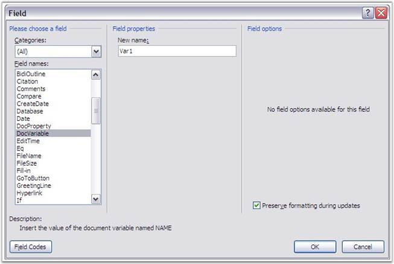

::: {style="DISPLAY: none"}
{#d2h_url_template}{#d2h_package_url style="WIDTH: 0px; DISPLAY: none; HEIGHT: 0px"}
:::

::: {.d2h_secondary_topic style="PADDING-BOTTOM: 10pt; MARGIN: 0pt; PADDING-LEFT: 0pt; PADDING-RIGHT: 0pt; PADDING-TOP: 0pt"}
##### Document Variable {#document-variable style="tab-stops: 0pt"}

 

A document variable is stored as part of a document or template. Document variables store information about the document. These are useful for document automation because they allow the programmer to store information for future use. For example, some firms use document variables to store Client and Author information, for use in the footer or field code purposes.

 

Essential DocIO provides support to work with these document variables. You can get or set the variables by using the variable name or index.

 

Document variables are accessible through the **IDocument.Variables** property.

 

Variables are added to the document by using the **IDocument.Variables.Add(string variableName, string variableValue)** method. Variables are removed from the document by using the **IDocument.Variables.Remove(string variableName)** method.

 

These fields could be referred to, in other parts of the document easily. For example, use the \"IWParagraph.AppendField(string fieldName, FieldType type)\" method, where the 1st argument is the name of the document field and the 2nd argument is FiledType.FieldDocVariable.

 

{border="0"}

Figure 55: Document Variable Field

 

 

 

+-------------------------------------------------------------------------------------------------------------------------------------------------------------------------------------------------------+
| **[\[C#\]]{style="FONT-FAMILY: 'Courier New'; COLOR: black"}**                                                                                                                                        |
|                                                                                                                                                                                                       |
| []{style="COLOR: black"}                                                                                                                                                                              |
|                                                                                                                                                                                                       |
| [WordDocument]{style="FONT-FAMILY: 'Courier New'; COLOR: teal"}[ doc = [new]{style="COLOR: blue"} [WordDocument]{style="COLOR: teal"}();]{style="FONT-FAMILY: 'Courier New'"}                         |
|                                                                                                                                                                                                       |
| [doc.Open([\"Sample.doc\"]{style="COLOR: maroon"});]{style="FONT-FAMILY: 'Courier New'"}                                                                                                              |
|                                                                                                                                                                                                       |
| [DocVariables v = document1.Variables;]{style="FONT-FAMILY: 'Courier New'"}                                                                                                                           |
|                                                                                                                                                                                                       |
| []{style="FONT-FAMILY: 'Courier New'"}                                                                                                                                                                |
|                                                                                                                                                                                                       |
| [//Add a variable]{style="FONT-FAMILY: 'Courier New'; COLOR: green"}                                                                                                                                  |
|                                                                                                                                                                                                       |
| [v.Add([\"var1\"]{style="COLOR: maroon"}, [\"Author Name\"]{style="COLOR: maroon"});]{style="FONT-FAMILY: 'Courier New'"}                                                                             |
|                                                                                                                                                                                                       |
| []{style="FONT-FAMILY: 'Courier New'"}                                                                                                                                                                |
|                                                                                                                                                                                                       |
| [//Add / modify variables:]{style="FONT-FAMILY: 'Courier New'; COLOR: green"}                                                                                                                         |
|                                                                                                                                                                                                       |
| [v\[[\"var2\"]{style="COLOR: maroon"}\] = [\"change name\"]{style="COLOR: maroon"};]{style="FONT-FAMILY: 'Courier New'"}                                                                              |
|                                                                                                                                                                                                       |
| []{style="FONT-FAMILY: 'Courier New'"}                                                                                                                                                                |
|                                                                                                                                                                                                       |
| [Console]{style="FONT-FAMILY: 'Courier New'; COLOR: teal"}[.WriteLine([\"Number of Variables:\"]{style="COLOR: maroon"} + document1.Variables.Count.ToString());]{style="FONT-FAMILY: 'Courier New'"} |
|                                                                                                                                                                                                       |
| [Console]{style="FONT-FAMILY: 'Courier New'; COLOR: teal"}[.WriteLine([\"Variable Name:\"]{style="COLOR: maroon"} + document1.Variables.GetNameByIndex(0));]{style="FONT-FAMILY: 'Courier New'"}      |
|                                                                                                                                                                                                       |
| [Console]{style="FONT-FAMILY: 'Courier New'; COLOR: teal"}[.WriteLine([\"Varaible Value:\"]{style="COLOR: maroon"} + document1.Variables.GetValueByIndex(0));]{style="FONT-FAMILY: 'Courier New'"}    |
|                                                                                                                                                                                                       |
| []{style="FONT-FAMILY: 'Courier New'"}                                                                                                                                                                |
|                                                                                                                                                                                                       |
| [doc.Save([\"SampleModified.doc\"]{style="COLOR: maroon"});]{style="FONT-FAMILY: 'Courier New'"}                                                                                                      |
+-------------------------------------------------------------------------------------------------------------------------------------------------------------------------------------------------------+

 

+-------------------------------------------------------------------------------------------------------------------------------------------------------------------------------------+
| **[\[VB.NET\]]{style="FONT-FAMILY: 'Courier New'; COLOR: black"}**                                                                                                                  |
|                                                                                                                                                                                     |
| []{style="FONT-FAMILY: 'Courier New'; COLOR: black"}                                                                                                                                |
|                                                                                                                                                                                     |
| [Dim]{style="FONT-FAMILY: 'Courier New'; COLOR: blue"}[ doc [As]{style="COLOR: blue"} WordDocument = [New]{style="COLOR: blue"} WordDocument()]{style="FONT-FAMILY: 'Courier New'"} |
|                                                                                                                                                                                     |
| [doc.Open([\"Sample.doc\"]{style="COLOR: maroon"})]{style="FONT-FAMILY: 'Courier New'"}                                                                                             |
|                                                                                                                                                                                     |
| [Dim]{style="FONT-FAMILY: 'Courier New'; COLOR: blue"}[ v [As]{style="COLOR: blue"} DocVariables = document1.Variables]{style="FONT-FAMILY: 'Courier New'"}                         |
|                                                                                                                                                                                     |
| []{style="FONT-FAMILY: 'Courier New'"}                                                                                                                                              |
|                                                                                                                                                                                     |
| [\'Add a variable]{style="FONT-FAMILY: 'Courier New'; COLOR: green"}                                                                                                                |
|                                                                                                                                                                                     |
| [v.Add([\"var1\"]{style="COLOR: maroon"}, [\"Author Name\"]{style="COLOR: maroon"})]{style="FONT-FAMILY: 'Courier New'"}                                                            |
|                                                                                                                                                                                     |
| []{style="FONT-FAMILY: 'Courier New'"}                                                                                                                                              |
|                                                                                                                                                                                     |
| [\'Add / modify variables:]{style="FONT-FAMILY: 'Courier New'; COLOR: green"}                                                                                                       |
|                                                                                                                                                                                     |
| [v([\"var2\"]{style="COLOR: maroon"}) = [\"change name\"]{style="COLOR: maroon"}]{style="FONT-FAMILY: 'Courier New'"}                                                               |
|                                                                                                                                                                                     |
| []{style="FONT-FAMILY: 'Courier New'"}                                                                                                                                              |
|                                                                                                                                                                                     |
| [Console.WriteLine([\"Number of Variables:\"]{style="COLOR: maroon"} + document1.Variables.Count.ToString())]{style="FONT-FAMILY: 'Courier New'"}                                   |
|                                                                                                                                                                                     |
| [Console.WriteLine([\"Variable Name:\"]{style="COLOR: maroon"} + document1.Variables.GetNameByIndex(0))]{style="FONT-FAMILY: 'Courier New'"}                                        |
|                                                                                                                                                                                     |
| [Console.WriteLine([\"Varaible Value:\"]{style="COLOR: maroon"} + document1.Variables.GetValueByIndex(0))]{style="FONT-FAMILY: 'Courier New'"}                                      |
|                                                                                                                                                                                     |
| []{style="FONT-FAMILY: 'Courier New'"}                                                                                                                                              |
|                                                                                                                                                                                     |
| [doc.Save([\"SampleModified.doc\"]{style="COLOR: maroon"})]{style="FONT-FAMILY: 'Courier New'"}                                                                                     |
+-------------------------------------------------------------------------------------------------------------------------------------------------------------------------------------+

[]{#related-topics}
:::
