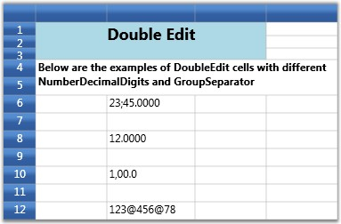

::: {style="DISPLAY: none"}
{#d2h_url_template}{#d2h_package_url style="WIDTH: 0px; DISPLAY: none; HEIGHT: 0px"}
:::

::::: {.d2h_secondary_topic style="PADDING-BOTTOM: 10pt; MARGIN: 0pt; PADDING-LEFT: 0pt; PADDING-RIGHT: 0pt; PADDING-TOP: 0pt"}
##### Double Edit Cells {#double-edit-cells style="tab-stops: 0pt"}

Using DoubleEdit cell type will restrict the user to enter only double(value type) values into the cell. Thus it can be used to display System.Double type values. Below are the style properties that affect this cell.

 

 Table 9: GridStyleInfo Property

::: {align="center"}
  ------------------------ -------------------------------------------------------------------
  GridStyleInfo Property   Description
  Cell Type                Set to "DoubleEdit"
  NumberGroupSeparator     String that separates groups of digits to the left of the decimal
  NumberDecimalSeparator   String to use as decimal separator
  NumberDecimalDigits      Number of decimal places
  ------------------------ -------------------------------------------------------------------
:::

**[]{style="COLOR: #15428b"}** 

Example

Setting up four Double Edit cells using different group separators and decimal digits.

[]{style="COLOR: #15428b"} 

+-----------------------------------------------------------------------------------------------------------------------+
| [\[C#\]]{style="FONT-FAMILY: 'Courier New'; COLOR: black"}                                                            |
|                                                                                                                       |
| []{style="FONT-FAMILY: 'Courier New'; COLOR: blue"}                                                                   |
|                                                                                                                       |
| [int]{style="FONT-FAMILY: 'Courier New'; COLOR: blue"}[\[\] sizes = { 2, 3, 4 };]{style="FONT-FAMILY: 'Courier New'"} |
|                                                                                                                       |
| [grid.Model\[6, 2\].CellType = [\"DoubleEdit\"]{style="COLOR: #a31515"};]{style="FONT-FAMILY: 'Courier New'"}         |
|                                                                                                                       |
| [grid.Model\[6, 2\].NumberFormat = [new]{style="COLOR: blue"} NumberFormatInfo ]{style="FONT-FAMILY: 'Courier New'"}  |
|                                                                                                                       |
| [{ ]{style="FONT-FAMILY: 'Courier New'"}                                                                              |
|                                                                                                                       |
| [    NumberGroupSeparator = [\";\"]{style="COLOR: #a31515"}, ]{style="FONT-FAMILY: 'Courier New'"}                    |
|                                                                                                                       |
| [    NumberDecimalSeparator = [\".\"]{style="COLOR: #a31515"}, ]{style="FONT-FAMILY: 'Courier New'"}                  |
|                                                                                                                       |
| [    NumberDecimalDigits = 4 ]{style="FONT-FAMILY: 'Courier New'"}                                                    |
|                                                                                                                       |
| [};]{style="FONT-FAMILY: 'Courier New'"}                                                                              |
|                                                                                                                       |
| [grid.Model\[6, 2\].NumberFormat.NumberGroupSizes = sizes;]{style="FONT-FAMILY: 'Courier New'"}                       |
|                                                                                                                       |
| [grid.Model\[6, 2\].CellValue = 2345.00; ]{style="FONT-FAMILY: 'Courier New'"}                                        |
|                                                                                                                       |
| []{style="FONT-FAMILY: 'Courier New'"}                                                                                |
|                                                                                                                       |
| [grid.Model\[8, 2\].CellType = [\"DoubleEdit\"]{style="COLOR: #a31515"};]{style="FONT-FAMILY: 'Courier New'"}         |
|                                                                                                                       |
| [grid.Model\[8, 2\].NumberFormat = [new]{style="COLOR: blue"} NumberFormatInfo ]{style="FONT-FAMILY: 'Courier New'"}  |
|                                                                                                                       |
| [{ ]{style="FONT-FAMILY: 'Courier New'"}                                                                              |
|                                                                                                                       |
| [    NumberGroupSeparator = [\",\"]{style="COLOR: #a31515"}, ]{style="FONT-FAMILY: 'Courier New'"}                    |
|                                                                                                                       |
| [    NumberDecimalSeparator = [\".\"]{style="COLOR: #a31515"}, ]{style="FONT-FAMILY: 'Courier New'"}                  |
|                                                                                                                       |
| [    NumberDecimalDigits = 4 ]{style="FONT-FAMILY: 'Courier New'"}                                                    |
|                                                                                                                       |
| [};]{style="FONT-FAMILY: 'Courier New'"}                                                                              |
|                                                                                                                       |
| [grid.Model\[8, 2\].NumberFormat.NumberGroupSizes = sizes;]{style="FONT-FAMILY: 'Courier New'"}                       |
|                                                                                                                       |
| [grid.Model\[8, 2\].CellValue = 12;]{style="FONT-FAMILY: 'Courier New'"}                                              |
|                                                                                                                       |
| []{style="FONT-FAMILY: 'Courier New'"}                                                                                |
|                                                                                                                       |
| [grid.Model\[10, 2\].CellType = [\"DoubleEdit\"]{style="COLOR: #a31515"};]{style="FONT-FAMILY: 'Courier New'"}        |
|                                                                                                                       |
| [grid.Model\[10, 2\].NumberFormat = [new]{style="COLOR: blue"} NumberFormatInfo ]{style="FONT-FAMILY: 'Courier New'"} |
|                                                                                                                       |
| [{ ]{style="FONT-FAMILY: 'Courier New'"}                                                                              |
|                                                                                                                       |
| [    NumberGroupSeparator = [\",\"]{style="COLOR: #a31515"}, ]{style="FONT-FAMILY: 'Courier New'"}                    |
|                                                                                                                       |
| [    NumberDecimalSeparator = [\".\"]{style="COLOR: #a31515"}, ]{style="FONT-FAMILY: 'Courier New'"}                  |
|                                                                                                                       |
| [    NumberDecimalDigits = 1 ]{style="FONT-FAMILY: 'Courier New'"}                                                    |
|                                                                                                                       |
| [};]{style="FONT-FAMILY: 'Courier New'"}                                                                              |
|                                                                                                                       |
| [grid.Model\[10, 2\].NumberFormat.NumberGroupSizes = sizes;]{style="FONT-FAMILY: 'Courier New'"}                      |
|                                                                                                                       |
| [grid.Model\[10, 2\].CellValue = 100;]{style="FONT-FAMILY: 'Courier New'"}                                            |
|                                                                                                                       |
| []{style="FONT-FAMILY: 'Courier New'"}                                                                                |
|                                                                                                                       |
| [grid.Model\[12, 2\].CellType = [\"DoubleEdit\"]{style="COLOR: #a31515"};]{style="FONT-FAMILY: 'Courier New'"}        |
|                                                                                                                       |
| [grid.Model\[12, 2\].NumberFormat = [new]{style="COLOR: blue"} NumberFormatInfo ]{style="FONT-FAMILY: 'Courier New'"} |
|                                                                                                                       |
| [{ ]{style="FONT-FAMILY: 'Courier New'"}                                                                              |
|                                                                                                                       |
| [    NumberGroupSeparator = [\"@\"]{style="COLOR: #a31515"}, ]{style="FONT-FAMILY: 'Courier New'"}                    |
|                                                                                                                       |
| [    NumberDecimalSeparator = [\".\"]{style="COLOR: #a31515"}, ]{style="FONT-FAMILY: 'Courier New'"}                  |
|                                                                                                                       |
| [    NumberDecimalDigits = 0 ]{style="FONT-FAMILY: 'Courier New'"}                                                    |
|                                                                                                                       |
| [};]{style="FONT-FAMILY: 'Courier New'"}                                                                              |
|                                                                                                                       |
| [grid.Model\[12, 2\].NumberFormat.NumberGroupSizes = sizes;]{style="FONT-FAMILY: 'Courier New'"}                      |
|                                                                                                                       |
| [grid.Model\[12, 2\].CellValue = 12345678.00;.00;]{style="FONT-FAMILY: 'Courier New'"}                                |
+-----------------------------------------------------------------------------------------------------------------------+

 

Output

The following output is generated using the code above.

 

{border="0"}

Figure 29: Double Edit Cell

::: {style="BORDER-BOTTOM: windowtext 1pt solid; BORDER-LEFT: medium none; PADDING-BOTTOM: 1pt; MARGIN-TOP: 9pt; PADDING-LEFT: 0pt; PADDING-RIGHT: 0pt; MARGIN-BOTTOM: 9pt; BORDER-TOP: windowtext 1pt solid; BORDER-RIGHT: medium none; PADDING-TOP: 1pt"}
{border="0"}Note: For complete code, please refer to the following browser sample.
:::

 

\...\\My Documents\\Syncfusion\\EssentialStudio\\\<Version Number\>\\WPF\\Grid.WPF\\Samples\\3.5\\WindowsSamples\\Cell Types\\Double Edit Cell Demo

 

[]{#related-topics}
:::::
