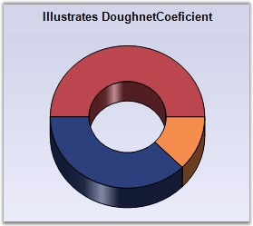

::: {style="DISPLAY: none"}
{#d2h_url_template}{#d2h_package_url style="WIDTH: 0px; DISPLAY: none; HEIGHT: 0px"}
:::

::: {.d2h_secondary_topic style="PADDING-BOTTOM: 10pt; MARGIN: 0pt; PADDING-LEFT: 0pt; PADDING-RIGHT: 0pt; PADDING-TOP: 0pt"}
#### Doughnut Chart {#doughnut-chart style="tab-stops: 0pt"}

[]{style="FONT-FAMILY: 'Trebuchet MS','sans-serif'; FONT-SIZE: 9pt"} 

DoughnutCoeficient

**[]{style="FONT-FAMILY: 'Trebuchet MS','sans-serif'"}** 

PieCharts specified with a **DoughnutCoeficient** will be rendered as the Doughnut chart. By default, this value is set to 0.0 and hence the chart will be rendered as a full pie. The coeficient specifies the fraction of radius occupied by the doughnut whole. Hence the value can range from 0.0 to 0.9.

[]{style="FONT-FAMILY: 'Trebuchet MS','sans-serif'; FONT-SIZE: 9pt"} 

+-----------------------------------------------------------------------------------------------------------------------------------------------------------------------+
| **[\[C#\]]{style="FONT-FAMILY: 'Courier New'; COLOR: black"}**                                                                                                        |
|                                                                                                                                                                       |
| **[]{style="FONT-FAMILY: 'Courier New'; COLOR: black"}**                                                                                                              |
|                                                                                                                                                                       |
| [this]{style="FONT-FAMILY: 'Courier New'; COLOR: blue"}[.ChartWebControl1.Series(0).ConfigItems.PieItem.DoughnutCoeficient=0.5f;]{style="FONT-FAMILY: 'Courier New'"} |
+-----------------------------------------------------------------------------------------------------------------------------------------------------------------------+

[]{style="FONT-FAMILY: 'Trebuchet MS','sans-serif'; FONT-SIZE: 9pt"} 

+--------------------------------------------------------------------------------------------------------------------------------------------------------------------+
| **[\[VB.NET\]]{style="FONT-FAMILY: 'Courier New'; COLOR: black"}**                                                                                                 |
|                                                                                                                                                                    |
| **[]{style="FONT-FAMILY: 'Courier New'; COLOR: black"}**                                                                                                           |
|                                                                                                                                                                    |
| [Me]{style="FONT-FAMILY: 'Courier New'; COLOR: blue"}[.ChartWebControl1.Series(0).ConfigItems.PieItem.DoughnutCoeficient=0.5f]{style="FONT-FAMILY: 'Courier New'"} |
+--------------------------------------------------------------------------------------------------------------------------------------------------------------------+

[]{style="FONT-FAMILY: 'Trebuchet MS','sans-serif'; FONT-SIZE: 9pt"} 

{border="0"}

[]{style="FONT-FAMILY: 'Trebuchet MS','sans-serif'; FONT-SIZE: 9pt"} 

Figure 80: Pie Chart with DoughnutCoeficient property set to \"0.5f\"

**[]{style="FONT-FAMILY: 'Trebuchet MS','sans-serif'; FONT-SIZE: 9pt"}** 

HeightCoeficient

[]{style="FONT-FAMILY: 'Trebuchet MS','sans-serif'; FONT-SIZE: 9pt"} 

When in **3D** mode, the relative height of the pie chart can be specified via the **HeightCoeficient** property. Note that the **HeightByAreaDepth** property should be set as **false** for this to take effect. The valid values are 0.1f to 0.5f. This property is set to **0.2f by default**.

[]{style="FONT-FAMILY: 'Trebuchet MS','sans-serif'; FONT-SIZE: 9pt"} 

[]{style="FONT-FAMILY: 'Trebuchet MS','sans-serif'; FONT-SIZE: 9pt"} 

+--------------------------------------------------------------------------------------------------------------------------------------------------------------------------------------------------+
| **[\[C#\]]{style="FONT-FAMILY: 'Courier New'; COLOR: black"}**                                                                                                                                   |
|                                                                                                                                                                                                  |
| **[]{style="FONT-FAMILY: 'Courier New'; COLOR: black"}**                                                                                                                                         |
|                                                                                                                                                                                                  |
| [this]{style="FONT-FAMILY: 'Courier New'; COLOR: blue"}[.ChartWebControl1.Series\[0\].ConfigItems.PieItem.HeightByAreaDepth = [false]{style="COLOR: blue"};]{style="FONT-FAMILY: 'Courier New'"} |
|                                                                                                                                                                                                  |
| [this]{style="FONT-FAMILY: 'Courier New'; COLOR: blue"}[.ChartWebControl1.Series\[0\].ConfigItems.PieItem.HeightCoeficient = 0.1f;]{style="FONT-FAMILY: 'Courier New'"}                          |
+--------------------------------------------------------------------------------------------------------------------------------------------------------------------------------------------------+

[]{style="FONT-FAMILY: 'Trebuchet MS','sans-serif'; FONT-SIZE: 9pt"} 

+---------------------------------------------------------------------------------------------------------------------------------------------------------------------------------------------+
| **[\[VB.NET\]]{style="FONT-FAMILY: 'Courier New'; COLOR: black"}**                                                                                                                          |
|                                                                                                                                                                                             |
| **[]{style="FONT-FAMILY: 'Courier New'; COLOR: black"}**                                                                                                                                    |
|                                                                                                                                                                                             |
| [Me]{style="FONT-FAMILY: 'Courier New'; COLOR: blue"}[.ChartWebControl1.Series(0).ConfigItems.PieItem.HeightByAreaDepth = [False]{style="COLOR: blue"}]{style="FONT-FAMILY: 'Courier New'"} |
|                                                                                                                                                                                             |
| [Me]{style="FONT-FAMILY: 'Courier New'; COLOR: blue"}[.ChartWebControl1.Series(0).ConfigItems.PieItem.HeightCoeficient = 0.1f]{style="FONT-FAMILY: 'Courier New'"}                          |
+---------------------------------------------------------------------------------------------------------------------------------------------------------------------------------------------+

[]{style="FONT-FAMILY: 'Trebuchet MS','sans-serif'; FONT-SIZE: 9pt"} 

{border="0"}

[]{style="FONT-FAMILY: 'Trebuchet MS','sans-serif'; FONT-SIZE: 9pt"} 

Figure 81: Pie Chart with HeightCoeficient property set to \"0.1f\"

[]{#p70} 

+--------------------------------------------------------------------------------------------------------------------------------------------------------------------------------------------------------------------------------------------------------------------------------------------------------------------------------------------------------------------------------------------------------------------------------------------------------------------------------------------------------------------------------------------------------------------------------------------------------------------------------------------------------------------------------------------------------------------------------------------------------------------------------------------------------------------------------------------------------------------------------------------------------------------------------------------------------------------------------------------------------------------------------------------------------------------------------------------------------------------------------------------------------------------------------------------------------------------------------------------------------------+
| []{style="COLOR: black; FONT-SIZE: 8pt"}                                                                                                                                                                                                                                                                                                                                                                                                                                                                                                                                                                                                                                                                                                                                                                                                                                                                                                                                                                                                                                                                                                                                                                                                                     |
|                                                                                                                                                                                                                                                                                                                                                                                                                                                                                                                                                                                                                                                                                                                                                                                                                                                                                                                                                                                                                                                                                                                                                                                                                                                              |
| Customization Options[]{style="FONT-FAMILY: 'Trebuchet MS','sans-serif'; FONT-SIZE: 9pt; FONT-WEIGHT: normal"}                                                                                                                                                                                                                                                                                                                                                                                                                                                                                                                                                                                                                                                                                                                                                                                                                                                                                                                                                                                                                                                                                                                                               |
+--------------------------------------------------------------------------------------------------------------------------------------------------------------------------------------------------------------------------------------------------------------------------------------------------------------------------------------------------------------------------------------------------------------------------------------------------------------------------------------------------------------------------------------------------------------------------------------------------------------------------------------------------------------------------------------------------------------------------------------------------------------------------------------------------------------------------------------------------------------------------------------------------------------------------------------------------------------------------------------------------------------------------------------------------------------------------------------------------------------------------------------------------------------------------------------------------------------------------------------------------------------+
| [[DisplayShadow]{.UGHyperlink}](ms-xhelp:///?Id=400a544d-f0e6-4cd4-9a67-76ca6e33d3fc)[, ]{.UGHyperlink}[[DisplayText]{.UGHyperlink}](ms-xhelp:///?Id=400a544d-f0e6-4cd4-9a67-76ca6e33d3fc)[, ]{.UGHyperlink}[[DrawErrorBars]{.UGHyperlink}](ms-xhelp:///?Id=4f060375-c5c6-458b-bde3-8e263ba9c947)[, ]{.UGHyperlink}[[DrawSeriesNameInDepth]{.UGHyperlink}](ms-xhelp:///?Id=4f060375-c5c6-458b-bde3-8e263ba9c947)[, ]{.UGHyperlink}[[ElementBorders]{.UGHyperlink}](ms-xhelp:///?Id=a0783636-9881-4bb3-b802-bce0330947a9)[, ]{.UGHyperlink}[[ErrorBarsSymbolShape]{.UGHyperlink}](ms-xhelp:///?Id=a0783636-9881-4bb3-b802-bce0330947a9)[, ]{.UGHyperlink}[[HighlightInterior]{.UGHyperlink}](ms-xhelp:///?Id=a0783636-9881-4bb3-b802-bce0330947a9)[, ]{.UGHyperlink}[[HitTestRadius]{.UGHyperlink}](ms-xhelp:///?Id=fd77911d-e883-4bf8-a0b0-fee3352c3121)[, ]{.UGHyperlink}[[Images]{.UGHyperlink}](ms-xhelp:///?Id=5df0d4a2-dd21-4743-9142-c97b5f6c86e0)[]{.UGHyperlink}                                                                                                                                                                                                                                                                                     |
|                                                                                                                                                                                                                                                                                                                                                                                                                                                                                                                                                                                                                                                                                                                                                                                                                                                                                                                                                                                                                                                                                                                                                                                                                                                              |
| [[ImageIndex]{.UGHyperlink}](ms-xhelp:///?Id=264352e0-540c-4186-b1f0-d19250dae50b)[, ]{.UGHyperlink}[[Rotate]{.UGHyperlink}](ms-xhelp:///?Id=568d82ca-c45b-4043-bd94-20b270e510a5)[, ]{.UGHyperlink}[[Spacing Between Series]{.UGHyperlink}](ms-xhelp:///?Id=355fc08c-4d81-4bea-8a8c-9a957615e282)[, ]{.UGHyperlink}[[ShadowInterior]{.UGHyperlink}](ms-xhelp:///?Id=568d82ca-c45b-4043-bd94-20b270e510a5)[, ]{.UGHyperlink}[[ShadowOffset]{.UGHyperlink}](ms-xhelp:///?Id=5df0d4a2-dd21-4743-9142-c97b5f6c86e0)[, ]{.UGHyperlink}[[FancyToolTip]{.UGHyperlink}](ms-xhelp:///?Id=ccab2740-d581-4489-a09d-a29014549d48)[, ]{.UGHyperlink}[[Font]{.UGHyperlink}](ms-xhelp:///?Id=6605fc50-59dd-4809-bcd8-6bb429a3589f)[, ]{.UGHyperlink}[[Interior]{.UGHyperlink}](ms-xhelp:///?Id=f764d3df-be17-4773-927f-db6747ef6dc6)[, ]{.UGHyperlink}[[LegendItem]{.UGHyperlink}](ms-xhelp:///?Id=2f0a5bfa-c0be-4f5d-84cb-6cf6081caa87)[, ]{.UGHyperlink}[[Name,]{.UGHyperlink}](ms-xhelp:///?Id=2f0a5bfa-c0be-4f5d-84cb-6cf6081caa87)[ ]{.UGHyperlink}[[PointsToolTipFormat]{.UGHyperlink}](ms-xhelp:///?Id=5df0d4a2-dd21-4743-9142-c97b5f6c86e0)[, ]{.UGHyperlink}[[SmartLabels]{.UGHyperlink}](ms-xhelp:///?Id=998007a8-f6fe-4729-86a6-5f38d4561f29)[, ]{.UGHyperlink} |
|                                                                                                                                                                                                                                                                                                                                                                                                                                                                                                                                                                                                                                                                                                                                                                                                                                                                                                                                                                                                                                                                                                                                                                                                                                                              |
| [[Summary]{.UGHyperlink}](ms-xhelp:///?Id=7567ed2f-2066-44df-a1ca-869cc2fbfce3)[, ]{.UGHyperlink}[[Text]{.UGHyperlink}](ms-xhelp:///?Id=4f2ae716-5e72-4dac-8e82-3d7e65215ad2)[, ]{.UGHyperlink}[[TextColor]{.UGHyperlink}](ms-xhelp:///?Id=7ab099de-b0db-4586-8b53-bb3490f1c625)[, ]{.UGHyperlink}[[TextFormat]{.UGHyperlink}](ms-xhelp:///?Id=7ab099de-b0db-4586-8b53-bb3490f1c625)[, ]{.UGHyperlink}[[TextOffset]{.UGHyperlink}](ms-xhelp:///?Id=405451a1-8b47-41c8-96ba-7abe947a323f)[, ]{.UGHyperlink}[[TextOrientation]{.UGHyperlink}](ms-xhelp:///?Id=f3af9bf1-81b6-4cac-ba97-1b669376f47a)[, ]{.UGHyperlink}[[Visible]{.UGHyperlink}](ms-xhelp:///?Id=c8c9a8a7-fca9-4262-9a4c-48261ab6f7eb)[]{.UGHyperlink}                                                                                                                                                                                                                                                                                                                                                                                                                                                                                                                                           |
+--------------------------------------------------------------------------------------------------------------------------------------------------------------------------------------------------------------------------------------------------------------------------------------------------------------------------------------------------------------------------------------------------------------------------------------------------------------------------------------------------------------------------------------------------------------------------------------------------------------------------------------------------------------------------------------------------------------------------------------------------------------------------------------------------------------------------------------------------------------------------------------------------------------------------------------------------------------------------------------------------------------------------------------------------------------------------------------------------------------------------------------------------------------------------------------------------------------------------------------------------------------+

 

[]{#related-topics}
:::
