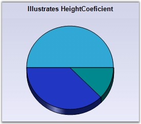

::: {style="DISPLAY: none"}
{#d2h_url_template}{#d2h_package_url style="WIDTH: 0px; DISPLAY: none; HEIGHT: 0px"}
:::

::: {.d2h_secondary_topic style="PADDING-BOTTOM: 10pt; MARGIN: 0pt; PADDING-LEFT: 0pt; PADDING-RIGHT: 0pt; PADDING-TOP: 0pt"}
#### Doughnut Chart {#doughnut-chart style="tab-stops: 0pt"}

 

DoughnutCoeficient

 

PieCharts specified with a **DoughnutCoeficient** will be rendered as the Doughnut chart. By default, this value is set to 0.0 and hence the chart will be rendered as a full pie. The DoughnutCoeficient property specifies the fraction of radius occupied by the doughnut whole. Hence the value can range from 0.0 to 0.9.

 

+--------------------------------------------------------------------------------------------------------------------------------------------------------------------+
| **[\[C#\]]{style="FONT-FAMILY: 'Courier New'; COLOR: black"}**                                                                                                     |
|                                                                                                                                                                    |
| **[]{style="FONT-FAMILY: 'Courier New'; COLOR: black"}**                                                                                                           |
|                                                                                                                                                                    |
| [this]{style="FONT-FAMILY: 'Courier New'; COLOR: blue"}[.chartControl1.Series(0).ConfigItems.PieItem.DoughnutCoeficient=0.5f;]{style="FONT-FAMILY: 'Courier New'"} |
+--------------------------------------------------------------------------------------------------------------------------------------------------------------------+

 

+-----------------------------------------------------------------------------------------------------------------------------------------------------------------+
| **[\[VB.NET\]]{style="FONT-FAMILY: 'Courier New'; COLOR: black"}**                                                                                              |
|                                                                                                                                                                 |
| **[]{style="FONT-FAMILY: 'Courier New'; COLOR: black"}**                                                                                                        |
|                                                                                                                                                                 |
| [Me]{style="FONT-FAMILY: 'Courier New'; COLOR: blue"}[.chartControl1.Series(0).ConfigItems.PieItem.DoughnutCoeficient=0.5f]{style="FONT-FAMILY: 'Courier New'"} |
+-----------------------------------------------------------------------------------------------------------------------------------------------------------------+

 

{border="0"}

 

Figure 82: Pie Chart with DoughnutCoeficient Property Set

 

HeightCoeficient

 

When in **3D** mode, the relative height of the pie chart can be specified via the **HeightCoeficient** property. Note that the **HeightByAreaDepth** property should be set as **false** for this to take effect. The valid values are 0.1f to 0.5f. This property is set to **0.2f by default**.

 

+-----------------------------------------------------------------------------------------------------------------------------------------------------------------------------------------------+
| **[\[C#\]]{style="FONT-FAMILY: 'Courier New'; COLOR: black"}**                                                                                                                                |
|                                                                                                                                                                                               |
| **[]{style="FONT-FAMILY: 'Courier New'; COLOR: black"}**                                                                                                                                      |
|                                                                                                                                                                                               |
| [this]{style="FONT-FAMILY: 'Courier New'; COLOR: blue"}[.chartControl1.Series\[0\].ConfigItems.PieItem.HeightByAreaDepth = [false]{style="COLOR: blue"};]{style="FONT-FAMILY: 'Courier New'"} |
|                                                                                                                                                                                               |
| [this]{style="FONT-FAMILY: 'Courier New'; COLOR: blue"}[.chartControl1.Series\[0\].ConfigItems.PieItem.HeightCoeficient = 0.1f;]{style="FONT-FAMILY: 'Courier New'"}                          |
+-----------------------------------------------------------------------------------------------------------------------------------------------------------------------------------------------+

 

+------------------------------------------------------------------------------------------------------------------------------------------------------------------------------------------+
| **[\[VB.NET\]]{style="FONT-FAMILY: 'Courier New'; COLOR: black"}**                                                                                                                       |
|                                                                                                                                                                                          |
| **[]{style="FONT-FAMILY: 'Courier New'; COLOR: black"}**                                                                                                                                 |
|                                                                                                                                                                                          |
| [Me]{style="FONT-FAMILY: 'Courier New'; COLOR: blue"}[.chartControl1.Series(0).ConfigItems.PieItem.HeightByAreaDepth = [False]{style="COLOR: blue"}]{style="FONT-FAMILY: 'Courier New'"} |
|                                                                                                                                                                                          |
| [Me]{style="FONT-FAMILY: 'Courier New'; COLOR: blue"}[.chartControl1.Series(0).ConfigItems.PieItem.HeightCoeficient=0.1f]{style="FONT-FAMILY: 'Courier New'"}                            |
+------------------------------------------------------------------------------------------------------------------------------------------------------------------------------------------+

 

{border="0"}

 

Figure 83: Pie Chart with HeightCoeficient Property Set

 

+--------------------------------------------------------------------------------------------------------------------------------------------------------------------------------+
| []{style="FONT-FAMILY: 'Segoe UI','sans-serif'; COLOR: black"}                                                                                                                 |
|                                                                                                                                                                                |
| Customization Options                                                                                                                                                          |
+--------------------------------------------------------------------------------------------------------------------------------------------------------------------------------+
| AngleOffset[, ]{style="COLOR: blue"}Border, DisplayShadow, DisplayText, DoughnutCoeficient, DrawSeriesNameInDepth, ElementBorders, ExplodedAll, ExplodedIndex, ExplosionOffset |
|                                                                                                                                                                                |
| FillMode, Gradient, HeightByAreaDepth, HeightCoeficient, HighlightInterior, InSideRadius, OptimizePiePointPositions, PieType, ShadowInterior, ShadowOffset                     |
|                                                                                                                                                                                |
| ShowTicks, VisibleAllPies, FancyToolTip, Font, Interior, LegendItem, Name, PointsToolTipFormat, SmartLabels,                                                                   |
|                                                                                                                                                                                |
| Summary, Text, TextColor, TextFormat, TextOffset, TextOrientation, Visible, ShowDataBindLabels                                                                                 |
+--------------------------------------------------------------------------------------------------------------------------------------------------------------------------------+

 

[]{#p68} 

[]{#related-topics}
:::
