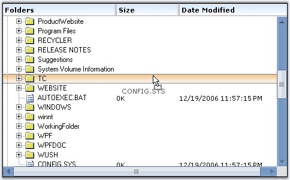

::: {style="DISPLAY: none"}
{#d2h_url_template}{#d2h_package_url style="WIDTH: 0px; DISPLAY: none; HEIGHT: 0px"}
:::

::: {.d2h_secondary_topic style="PADDING-BOTTOM: 10pt; MARGIN: 0pt; PADDING-LEFT: 0pt; PADDING-RIGHT: 0pt; PADDING-TOP: 0pt"}
#### Drag and Drop {#drag-and-drop style="MARGIN-LEFT: 18pt; tab-stops: 18.0pt"}

[]{style="COLOR: #15428b"} 

MultiColumnTreeView control also supports [[[drag drop]{style="COLOR: windowtext; TEXT-DECORATION: none; text-underline: none"}]{.UGHyperlink}](../../../../../../../../Documents%20and%20Settings/sylviap/Desktop/Tools%20-%20Part%202.docx#_Drag_And_Drop)[]{#p1042} operation which lets you drag a complete row with multiple columns to the desired position.

[]{style="COLOR: #15428b"} 

{border="0"}

[]{style="COLOR: #15428b"} 

Figure 1183: Drag Support Illustrated

[]{style="COLOR: #15428b"} 

This can be done similar to that of the treeview control. The only difference is that, in MultiColumnTreeView, we need to use the **MultiColumnTreeView** class instead of the **TreeView** class.

 

There are different selection modes for the nodes during drag drop. They are discussed in [Node Selection]{style="COLOR: black"} topic.

 

**See Also**

[]{style="COLOR: #15428b"} 

[[Drag and Drop]{.UGHyperlink}](../../../../../../../../Documents%20and%20Settings/sylviap/Desktop/Tools%20-%20Part%202.docx#_Drag_And_Drop)[, ]{.UGHyperlink}[[Selection Settings While Drag Drop]{.UGHyperlink}](../../../../../../../../Documents%20and%20Settings/sylviap/Desktop/Tools%20-%20Part%202.docx#_Selection_Settings_While)[, ]{.UGHyperlink}[[Mouse and Keyboard Based Selection]{.UGHyperlink}](../../../../../../../../Documents%20and%20Settings/sylviap/Desktop/Tools%20-%20Part%202.docx#_Mouse_and_Keyboard)[, ]{.UGHyperlink}[[Drag and Drop Events]{.UGHyperlink}](../../../../../../../../Documents%20and%20Settings/sylviap/Desktop/Tools%20-%20Part%202.docx#_Drag_and_Drop_1)[]{.UGHyperlink}

 

 

 

 

[]{#related-topics}
:::
