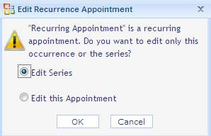
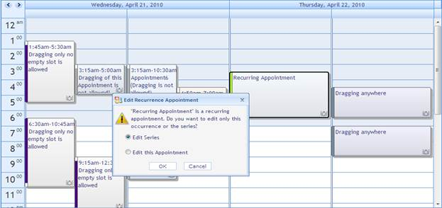
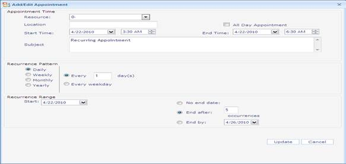
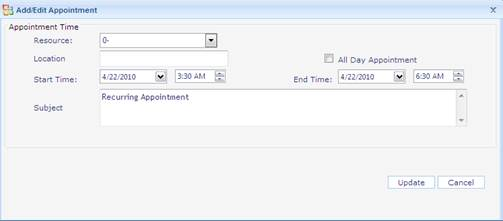

::: {style="DISPLAY: none"}
{#d2h_url_template}{#d2h_package_url style="WIDTH: 0px; DISPLAY: none; HEIGHT: 0px"}
:::

::::: {#nsbanner .d2h_main_nsbanner style="BORDER-BOTTOM: #999999 1px solid; POSITION: relative; PADDING-BOTTOM: 0px; BACKGROUND-COLOR: transparent; PADDING-LEFT: 0px; PADDING-RIGHT: 0px; DISPLAY: none; BORDER-TOP: #999999 1px solid; PADDING-TOP: 0px; LEFT: 0px"}
:::: {#TitleRow .d2h_main_titlerow style="PADDING-BOTTOM: 4px; BACKGROUND-COLOR: transparent; PADDING-LEFT: 22px; WIDTH: 100%; PADDING-RIGHT: 10px; DISPLAY: none; PADDING-TOP: 4px"}
::: {#ienav .d2h_main_ienav style="DISPLAY: none"}
{#D2HPrevious .D2HPreviousEnabled}  {#D2HNext .D2HNextEnabled}
:::
::::
:::::

:::: {#nstext .d2h_main_nstext style="PADDING-BOTTOM: 10px; BACKGROUND-COLOR: transparent; PADDING-LEFT: 22px; PADDING-RIGHT: 10px; HEIGHT: 100%; OVERFLOW: auto; PADDING-TOP: 5px" hasuserbackground="true" valign="bottom"}
::: {#d2h_breadcrumbs .d2h_breadcrumbs}
[Essential Studio User Guide Documentation](ms-xhelp:///?Id=12457748-09e3-4d74-a240-8e049cedf030){.d2h_breadcrumbsNormal}[ \> ]{.d2h_breadcrumbsLinkSeparator}[User Interface Edition](ms-xhelp:///?Id=c29296b7-531c-413b-a0ec-488ca1f7f669){.d2h_breadcrumbsNormal}[ \> ]{.d2h_breadcrumbsLinkSeparator}[Essential ASP.NET](ms-xhelp:///?Id=25c35330-c127-4dad-9a92-ed79dc7261a6){.d2h_breadcrumbsNormal}[ \> ]{.d2h_breadcrumbsLinkSeparator}[Essential Schedule]{.d2h_breadcrumbsContentsOnly}[ \> ]{.d2h_breadcrumbsLinkSeparator}[Concepts and Features](ms-xhelp:///?Id=64869483-f57f-4838-b322-b1a3d1ce8e40){.d2h_breadcrumbsNormal}[ \> ]{.d2h_breadcrumbsLinkSeparator}[Appointments](ms-xhelp:///?Id=8545e8cf-5b26-43a2-932f-f0087c9a1e0a){.d2h_breadcrumbsNormal}
:::

### Drag and Drop for Recurrence Appointments {#drag-and-drop-for-recurrence-appointments style="tab-stops: 0pt"}

Appointments can be dragged between various resources and set for different time intervals. To perform the drag action, the **AllowAppointmentDrag** property must be set to True. When dragging a recurrence appointment, a dialog box with two options will pop up. i.e. **Editing the Series**or **Editing this Appointment**. The first option is for editing the entire series, and the second option is for editing the specific appointment in the recurrence series.

**[]{style="FONT-FAMILY: 'Trebuchet MS','sans-serif'; COLOR: #15428b; FONT-SIZE: 9pt"}** 

Use Case Scenarios

Drag and Drop option gives users an option to easily edit appointments' start times and end times.

1.   If the recurrence appointment is dragged, two options will be displayed. (Edit the specific appointment and edit the entire appointment series).

2.   If the first option is selected, the specific appointment in the recurrence series alone changes and the other appointments in the recurrence series remain the same.

The following screenshot shows the dialog box that pops up when dragging the recurrence appointment.

[]{style="COLOR: #4f6228"} 

{border="0"}

***[]{style="FONT-FAMILY: 'Trebuchet MS','sans-serif'; COLOR: #15428b; FONT-SIZE: 9pt"}*** 

Figure 70: Popup Dialog Displayed when Recurrence Appointment is Dragged.

**[]{style="COLOR: #4e84c4; FONT-SIZE: 16pt"}** 

Dragging Recurrence Appointments in an Application

When the recurrence appointment is dragged, a dialog box will pop up. This is shown in the following screenshot.

 

{border="0"}

***[]{style="FONT-FAMILY: 'Trebuchet MS','sans-serif'; COLOR: #15428b; FONT-SIZE: 9pt"}*** 

Figure 71: Popup Dialog displayed when Recurrence Appointment is Dragged

On selecting the option, **Edit Series**, a dialog box to edit the entire recurrence series pops up. Refer to the following screenshot.

[]{style="FONT-FAMILY: 'Trebuchet MS','sans-serif'; COLOR: #15428b; FONT-SIZE: 9pt"} 

{border="0"}

***[]{style="FONT-FAMILY: 'Trebuchet MS','sans-serif'; COLOR: #15428b; FONT-SIZE: 9pt"}*** 

Figure 72: Dialog for Editing the Entire Recurrence Series

[]{style="FONT-FAMILY: 'Trebuchet MS','sans-serif'; COLOR: #15428b; FONT-SIZE: 9pt"} 

On selecting the option, **Edit this appointment**, a dialog box to edit a particular appointment in the recurrence series pops up. Refer to the following code snippet.

 

{border="0"}

***[]{style="FONT-FAMILY: 'Trebuchet MS','sans-serif'; COLOR: #15428b; FONT-SIZE: 9pt"}*** 

Figure 73: Dialog for Editing a Specific Recurrence Appointment

 

Sample Link

To access the Recurrence sample:

1.   Open the Syncfusion Dashboard.

2.   Click **User Interface**.

3.   Click the **ASP.NET** drop-down list, and select **Locally Installed Samples**. 

4.   Select **Essential Schedule** from **Other Products** tab.

5.   Navigate to **Basic Features- -\>Drag-and-drop Features Demo** sample.

 

[]{#related-topics}
::::
