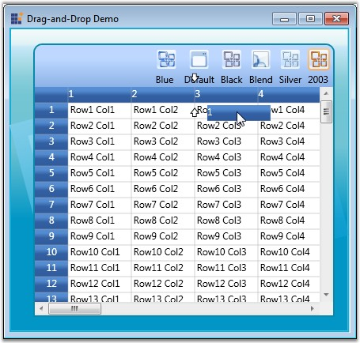

::: {style="DISPLAY: none"}
{#d2h_url_template}{#d2h_package_url style="WIDTH: 0px; DISPLAY: none; HEIGHT: 0px"}
:::

::: {.d2h_secondary_topic style="PADDING-BOTTOM: 10pt; MARGIN: 0pt; PADDING-LEFT: 0pt; PADDING-RIGHT: 0pt; PADDING-TOP: 0pt"}
#### Drag-and-Drop Support {#drag-and-drop-support style="tab-stops: 0pt"}

Essential Grid for WPF provides support for drag-and-drop functionality. This feature enables the user to just click a column header and drag it to a new position. It is not required to select the column header for dragging. This is an easy way of rearranging the columns dynamically. You can enable or disable this feature using AllowDragColumns property of the Grid as follows:

 

+----------------------------------------------------------------------------------------------------------------------------------------------------+
| [\[C#\]]{style="FONT-FAMILY: 'Courier New'; COLOR: black"}                                                                                         |
|                                                                                                                                                    |
| **[]{style="FONT-FAMILY: 'Courier New'; COLOR: black"}**                                                                                           |
|                                                                                                                                                    |
| [//Allow column dragging]{style="FONT-FAMILY: 'Courier New'; COLOR: green"}                                                                        |
|                                                                                                                                                    |
| [this]{style="FONT-FAMILY: 'Courier New'; COLOR: blue"}[.grid.AllowDragColumns = [true]{style="COLOR: blue"};]{style="FONT-FAMILY: 'Courier New'"} |
+----------------------------------------------------------------------------------------------------------------------------------------------------+

 

The following image illustrates this feature:

 

{border="0"}

Figure 68: Drag and Drop support

**[]{style="COLOR: #15428b"}** 

In the above image, you can see the column header 1 being dragged to be placed before column 3.

[]{#related-topics}
:::
