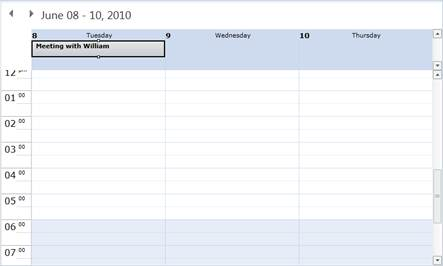

::: {style="DISPLAY: none"}
{#d2h_url_template}{#d2h_package_url style="WIDTH: 0px; DISPLAY: none; HEIGHT: 0px"}
:::

::: {.d2h_secondary_topic style="PADDING-BOTTOM: 10pt; MARGIN: 0pt; PADDING-LEFT: 0pt; PADDING-RIGHT: 0pt; PADDING-TOP: 0pt"}
##### Dragging an All-Day Appointment {#dragging-an-all-day-appointment style="tab-stops: 0pt"}

Appointments in time slots or day headers (all-day appointments) can be dragged. The schedule control will change the appointment to a time-slot or an all-day appointment according to where it is being dropped.

{border="0"}

 

Figure 17: Appointment Dropped on Header

[]{style="FONT-FAMILY: 'Trebuchet MS','sans-serif'; COLOR: #15428b"} 

[]{#related-topics}
:::
