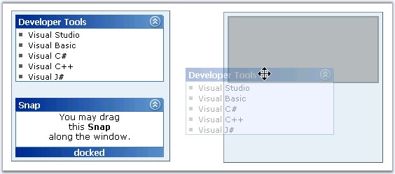

::: {style="DISPLAY: none"}
{#d2h_url_template}{#d2h_package_url style="WIDTH: 0px; DISPLAY: none; HEIGHT: 0px"}
:::

::::: {.d2h_secondary_topic style="PADDING-BOTTOM: 10pt; MARGIN: 0pt; PADDING-LEFT: 0pt; PADDING-RIGHT: 0pt; PADDING-TOP: 0pt"}
##### Dragging and Docking Styles {#dragging-and-docking-styles style="tab-stops: 0pt"}

[]{style="FONT-FAMILY: 'Trebuchet MS','sans-serif'; COLOR: #15428b; FONT-SIZE: 9pt"} 

Styles can be chosen from the provided options for the dragging and docking actions. Set the respective properties to the required option to apply the styles for drag[ ]{style="FONT-SIZE: 8pt"}and dock actions.

[]{style="FONT-FAMILY: 'Trebuchet MS','sans-serif'; COLOR: black"} 

::: {align="center"}
+-----------------------------------+-------------------------------------------------------------------------------------+
|                                   |                                                                                     |
|                                   |                                                                                     |
| Property                          | Description                                                                         |
+-----------------------------------+-------------------------------------------------------------------------------------+
| DockingStyle                      | Specifies the styles to be used for Snap dock. The options included are as follows: |
|                                   |                                                                                     |
|                                   | [·      ]{style="FONT-FAMILY: Symbol"}None                                          |
|                                   |                                                                                     |
|                                   | [·      ]{style="FONT-FAMILY: Symbol"}Original                                      |
|                                   |                                                                                     |
|                                   | [·      ]{style="FONT-FAMILY: Symbol"}SolidOutline                                  |
|                                   |                                                                                     |
|                                   | [·      ]{style="FONT-FAMILY: Symbol"}DashedOutline                                 |
|                                   |                                                                                     |
|                                   | [·      ]{style="FONT-FAMILY: Symbol"}TransparentRectangle                          |
|                                   |                                                                                     |
|                                   | [·      ]{style="FONT-FAMILY: Symbol"}GhostCopy                                     |
+-----------------------------------+-------------------------------------------------------------------------------------+
| DraggingStyle                     | Specifies the dragging style. The options included are as follows:                  |
|                                   |                                                                                     |
|                                   | [·      ]{style="FONT-FAMILY: Symbol"}Original                                      |
|                                   |                                                                                     |
|                                   | [·      ]{style="FONT-FAMILY: Symbol"}GhostCopy                                     |
|                                   |                                                                                     |
|                                   | [·      ]{style="FONT-FAMILY: Symbol"}SolidOutline                                  |
|                                   |                                                                                     |
|                                   | [·      ]{style="FONT-FAMILY: Symbol"}DashedOutline                                 |
|                                   |                                                                                     |
|                                   | [·      ]{style="FONT-FAMILY: Symbol"}TransparentRectangle                          |
|                                   |                                                                                     |
|                                   | [·      ]{style="FONT-FAMILY: Symbol"}None                                          |
+-----------------------------------+-------------------------------------------------------------------------------------+
:::

[]{style="FONT-FAMILY: 'Trebuchet MS','sans-serif'; COLOR: #15428b; FONT-SIZE: 9pt"} 

{border="0"}

**[]{style="FONT-FAMILY: 'Trebuchet MS','sans-serif'; COLOR: #15428b; FONT-SIZE: 9pt"}** 

Figure 378: Drag style set to GhostCopy, Dock style to TransparentRectangle and DragMode to FreeStyle

[]{style="FONT-SIZE: 8pt"} 

**DraggingMode** specifies the styles as to how the drag actions must be performed.

[]{style="FONT-FAMILY: 'Trebuchet MS','sans-serif'; COLOR: #15428b; FONT-SIZE: 9pt"} 

::: {align="center"}
+-----------------------------------+-----------------------------------------------------------------------------------+
| Property                          | Description                                                                       |
+-----------------------------------+-----------------------------------------------------------------------------------+
| DraggingMode                      | Specifies the style to be used on Snap drag. The options included are as follows: |
|                                   |                                                                                   |
|                                   | [·      ]{style="FONT-FAMILY: Symbol"}None                                        |
|                                   |                                                                                   |
|                                   | [·      ]{style="FONT-FAMILY: Symbol"}FreeStyle                                   |
|                                   |                                                                                   |
|                                   | [·      ]{style="FONT-FAMILY: Symbol"}Horizontal                                  |
|                                   |                                                                                   |
|                                   | [·      ]{style="FONT-FAMILY: Symbol"}Vertical                                    |
+-----------------------------------+-----------------------------------------------------------------------------------+
:::

[]{style="FONT-FAMILY: 'Trebuchet MS','sans-serif'; COLOR: #15428b; FONT-SIZE: 9pt"} 

The html view of the dragging and docking styles and the dragging mode properties settings and the code snippets are given below.

[]{style="FONT-FAMILY: 'Trebuchet MS','sans-serif'; COLOR: #15428b; FONT-SIZE: 9pt"} 

+----------------------------------------------------------------------------------------------------------------------------------------------------------------------------------------------------------------------------------------------------------------------------------------------------------------------------------------------------------------------------------------------------------------------------------------------------------------------------------------------------------------------------------------------------------------------------------------------------------------------------------------------------------------------------------------------------------------------------------------+
| **[\[aspx\]]{style="FONT-FAMILY: 'Courier New'"}**                                                                                                                                                                                                                                                                                                                                                                                                                                                                                                                                                                                                                                                                                     |
|                                                                                                                                                                                                                                                                                                                                                                                                                                                                                                                                                                                                                                                                                                                                        |
| **[]{style="FONT-FAMILY: 'Courier New'"}**                                                                                                                                                                                                                                                                                                                                                                                                                                                                                                                                                                                                                                                                                             |
|                                                                                                                                                                                                                                                                                                                                                                                                                                                                                                                                                                                                                                                                                                                                        |
| [\<]{style="FONT-FAMILY: 'Courier New'; COLOR: blue"}[cc1]{style="FONT-FAMILY: 'Courier New'; COLOR: maroon"}[:]{style="FONT-FAMILY: 'Courier New'; COLOR: blue"}[Snap]{style="FONT-FAMILY: 'Courier New'; COLOR: maroon"}[ [ID]{style="COLOR: red"}[=\"Snap1\"]{style="COLOR: blue"} [runat]{style="COLOR: red"}[=\"server\"]{style="COLOR: blue"} [DraggingMode]{style="COLOR: red"}[=\"FreeStyle\"]{style="COLOR: blue"} [DraggingStyle]{style="COLOR: red"}[=\"GhostCopy\"]{style="COLOR: blue"} [DockingStyle]{style="COLOR: red"}[=TransparentRectangle\>\<]{style="COLOR: blue"}[cc1]{style="COLOR: maroon"}[:]{style="COLOR: blue"}[Snap]{style="COLOR: maroon"}[\>]{style="COLOR: blue"}]{style="FONT-FAMILY: 'Courier New'"} |
+----------------------------------------------------------------------------------------------------------------------------------------------------------------------------------------------------------------------------------------------------------------------------------------------------------------------------------------------------------------------------------------------------------------------------------------------------------------------------------------------------------------------------------------------------------------------------------------------------------------------------------------------------------------------------------------------------------------------------------------+

[]{style="FONT-FAMILY: 'Trebuchet MS','sans-serif'; COLOR: #15428b; FONT-SIZE: 9pt"} 

+--------------------------------------------------------------------------------------------------------------------------------------------------------------------------------------+
| **[\[C#\]]{style="FONT-FAMILY: 'Courier New'"}**                                                                                                                                     |
|                                                                                                                                                                                      |
| **[]{style="FONT-FAMILY: 'Courier New'"}**                                                                                                                                           |
|                                                                                                                                                                                      |
| [this]{style="FONT-FAMILY: 'Courier New'; COLOR: blue"}[.Snap1.DraggingStyle = [SnapDraggingStyleType]{style="COLOR: teal"}.GhostCopy;]{style="FONT-FAMILY: 'Courier New'"}          |
|                                                                                                                                                                                      |
| [this]{style="FONT-FAMILY: 'Courier New'; COLOR: blue"}[.Snap1.DockingStyle = [SnapDockingStyleType]{style="COLOR: teal"}.TransparentRectangle;]{style="FONT-FAMILY: 'Courier New'"} |
|                                                                                                                                                                                      |
| [this]{style="FONT-FAMILY: 'Courier New'; COLOR: blue"}[.Snap1.DraggingMode = [SnapDraggingType]{style="COLOR: teal"}.FreeStyle;]{style="FONT-FAMILY: 'Courier New'"}                |
+--------------------------------------------------------------------------------------------------------------------------------------------------------------------------------------+

[]{style="FONT-FAMILY: 'Trebuchet MS','sans-serif'; COLOR: #15428b; FONT-SIZE: 9pt"} 

+-------------------------------------------------------------------------------------------------------------------------------------------------------------------------------------------+
| **[\[VB\]]{style="FONT-FAMILY: 'Courier New'"}**                                                                                                                                          |
|                                                                                                                                                                                           |
| **[]{style="FONT-FAMILY: 'Courier New'"}**                                                                                                                                                |
|                                                                                                                                                                                           |
| [Private]{style="FONT-FAMILY: 'Courier New'; COLOR: blue"}[ [Me]{style="COLOR: blue"}.Snap1.DraggingStyle = SnapDraggingStyleType.GhostCopy]{style="FONT-FAMILY: 'Courier New'"}          |
|                                                                                                                                                                                           |
| [Private]{style="FONT-FAMILY: 'Courier New'; COLOR: blue"}[ [Me]{style="COLOR: blue"}.Snap1.DockingStyle = SnapDockingStyleType.TransparentRectangle]{style="FONT-FAMILY: 'Courier New'"} |
|                                                                                                                                                                                           |
| [Private]{style="FONT-FAMILY: 'Courier New'; COLOR: blue"}[ [Me]{style="COLOR: blue"}.Snap1.DraggingMode = SnapDraggingType.FreeStyle]{style="FONT-FAMILY: 'Courier New'"}                |
+-------------------------------------------------------------------------------------------------------------------------------------------------------------------------------------------+

[]{style="FONT-FAMILY: 'Trebuchet MS','sans-serif'; COLOR: #15428b; FONT-SIZE: 9pt"} 

See Also

[]{style="FONT-FAMILY: 'Trebuchet MS','sans-serif'; COLOR: #15428b; FONT-SIZE: 9pt"} 

[Docking Containers and Snap Dock settings]{.UGHyperlink}[]{.UGHyperlink}

 

[]{#p504} 

[]{#related-topics}
:::::
