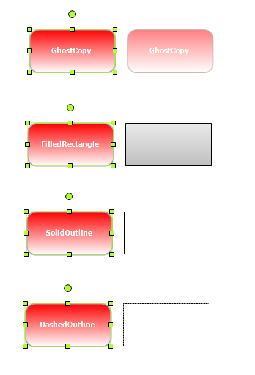

::: {style="DISPLAY: none"}
{#d2h_url_template}{#d2h_package_url style="WIDTH: 0px; DISPLAY: none; HEIGHT: 0px"}
:::

::::: {#nsbanner .d2h_main_nsbanner style="BORDER-BOTTOM: #999999 1px solid; POSITION: relative; PADDING-BOTTOM: 0px; BACKGROUND-COLOR: transparent; PADDING-LEFT: 0px; PADDING-RIGHT: 0px; DISPLAY: none; BORDER-TOP: #999999 1px solid; PADDING-TOP: 0px; LEFT: 0px"}
:::: {#TitleRow .d2h_main_titlerow style="PADDING-BOTTOM: 4px; BACKGROUND-COLOR: transparent; PADDING-LEFT: 22px; WIDTH: 100%; PADDING-RIGHT: 10px; DISPLAY: none; PADDING-TOP: 4px"}
::: {#ienav .d2h_main_ienav style="DISPLAY: none"}
{#D2HPrevious .D2HPreviousEnabled}  {#D2HNext .D2HNextEnabled}
:::
::::
:::::

::::: {#nstext .d2h_main_nstext style="PADDING-BOTTOM: 10px; BACKGROUND-COLOR: transparent; PADDING-LEFT: 22px; PADDING-RIGHT: 10px; HEIGHT: 100%; OVERFLOW: auto; PADDING-TOP: 5px" hasuserbackground="true" valign="bottom"}
::: {#d2h_breadcrumbs .d2h_breadcrumbs}
[Essential Studio User Guide Documentation](ms-xhelp:///?Id=12457748-09e3-4d74-a240-8e049cedf030){.d2h_breadcrumbsNormal}[ \> ]{.d2h_breadcrumbsLinkSeparator}[User Interface Edition](ms-xhelp:///?Id=c29296b7-531c-413b-a0ec-488ca1f7f669){.d2h_breadcrumbsNormal}[ \> ]{.d2h_breadcrumbsLinkSeparator}[Essential Windows](ms-xhelp:///?Id=e60759d8-47a4-4570-9d7a-16a68d63f2ea){.d2h_breadcrumbsNormal}[ \> ]{.d2h_breadcrumbsLinkSeparator}[Essential Diagram]{.d2h_breadcrumbsContentsOnly}[ \> ]{.d2h_breadcrumbsLinkSeparator}[Concepts And Features](ms-xhelp:///?Id=008cec4b-5177-4859-8616-c062751d8fb6){.d2h_breadcrumbsNormal}[ \> ]{.d2h_breadcrumbsLinkSeparator}[Advanced Features](ms-xhelp:///?Id=f661be94-4825-49a2-ac75-df5e8495098e){.d2h_breadcrumbsNormal}
:::

### Dragging, Resizing, and Rotation Styles for Nodes {#dragging-resizing-and-rotation-styles-for-nodes style="tab-stops: 0pt"}

Essential Diagram for Windows Forms provides dragging, resizing, and rotation styles such as ghost copy, filled rectangle, solid outline, and dashed outline, for nodes. These styles provide better visual effect to your diagram and increase the performance speed of the diagram while dragging, rotating, or resizing nodes.

 

Properties

Table 6: Properties Table

::: {align="center"}
  --------------- ------------------------------------------------------ ------ ---------------------- -----------------
  Property        Description                                            Type   Data Type              Reference links
  ResizingStyle   Gets or sets resizing style for the rendering helper   NA     RenderingHelperStyle   NA
  DraggingStyle   Gets or sets dragging style for the rendering helper   NA     RenderingHelperStyle   NA
  RotatingStyle   Gets or sets rotating style for the rendering helper   NA     RenderingHelperStyle   NA
  --------------- ------------------------------------------------------ ------ ---------------------- -----------------
:::

 

Applying Styles to Rendering Helper

The following code example illustrates how to apply styles to the rendering helper while resizing, dragging, and rotating nodes.

 

+-----------------------------------------------------------------------------------------------------------------------------------------------------------------------+
| **[\[C#\]]{style="FONT-FAMILY: 'Courier New'"}**                                                                                                                      |
|                                                                                                                                                                       |
| [  ]{style="FONT-FAMILY: 'Courier New'"}[//Specify dragging, resizing, and rotation styles to the rendering helper]{style="FONT-FAMILY: 'Courier New'; COLOR: green"} |
|                                                                                                                                                                       |
| [            diagram1.Controller.DraggingStyle = [RenderingHelperStyle]{style="COLOR: #2b91af"}.SolidOutline;]{style="FONT-FAMILY: 'Courier New'"}                    |
|                                                                                                                                                                       |
| [            diagram1.Controller.ResizingStyle = [RenderingHelperStyle]{style="COLOR: #2b91af"}.GhostCopy;]{style="FONT-FAMILY: 'Courier New'"}                       |
|                                                                                                                                                                       |
| [            diagram1.Controller.RotatingStyle = [RenderingHelperStyle]{style="COLOR: #2b91af"}.DashedOutline;]{style="FONT-FAMILY: 'Courier New'"}                   |
|                                                                                                                                                                       |
|                                                                                                                                                                       |
+-----------------------------------------------------------------------------------------------------------------------------------------------------------------------+

 

+-------------------------------------------------------------------------------------------------------------------------------------------------------------------------------------------------------------+
| **[\[VB\]]{style="FONT-FAMILY: 'Courier New'"}**                                                                                                                                                            |
|                                                                                                                                                                                                             |
| [  ]{style="FONT-FAMILY: 'Courier New'"}[\'Specify dragging, resizing, and rotation styles to the rendering helper]{style="FONT-FAMILY: 'Courier New'; COLOR: green"}[]{style="FONT-FAMILY: 'Courier New'"} |
|                                                                                                                                                                                                             |
| [                  diagram1.Controller.DraggingStyle = RenderingHelperStyle.SolidOutline]{style="FONT-FAMILY: 'Courier New'"}                                                                               |
|                                                                                                                                                                                                             |
| [                  diagram1.Controller.ResizingStyle = RenderingHelperStyle.GhostCopy]{style="FONT-FAMILY: 'Courier New'"}                                                                                  |
|                                                                                                                                                                                                             |
| [                  diagram1.Controller.RotatingStyle = RenderingHelperStyle.DashedOutline]{style="FONT-FAMILY: 'Courier New'"}                                                                              |
|                                                                                                                                                                                                             |
|                                                                                                                                                                                                             |
+-------------------------------------------------------------------------------------------------------------------------------------------------------------------------------------------------------------+

 

{border="0"}

Figure 121: Diagram nodes with different styles

 

[]{#related-topics}
:::::
