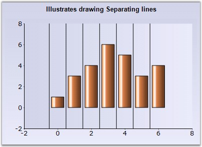

::: {style="DISPLAY: none"}
{#d2h_url_template}{#d2h_package_url style="WIDTH: 0px; DISPLAY: none; HEIGHT: 0px"}
:::

:::: {.d2h_secondary_topic style="PADDING-BOTTOM: 10pt; MARGIN: 0pt; PADDING-LEFT: 0pt; PADDING-RIGHT: 0pt; PADDING-TOP: 0pt"}
#### DrawColumnSeparatingLines {#drawcolumnseparatinglines style="tab-stops: 0pt"}

 

The drawing of separating line between columns is controlled by this property.

 

::: {align="center"}
+-------------------------------------+-------------------------------------+
|                                                                           |
|                                                                           |
| Details                                                                   |
+-------------------------------------+-------------------------------------+
| **Possible Values**                 | True or False                       |
+-------------------------------------+-------------------------------------+
| **Default Value    **               | **False**                           |
+-------------------------------------+-------------------------------------+
| **2D / 3D Limitations**             | No                                  |
+-------------------------------------+-------------------------------------+
| **Applies to Chart Element**        | All series                          |
+-------------------------------------+-------------------------------------+
| **Applies to Chart Types**          | Column Chart and Bar Chart          |
+-------------------------------------+-------------------------------------+
:::

 

Here is some sample code.

 

+----------------------------------------------------------------------------------------------------------------------------------------------------------------------------------+
| **[\[C#\]]{style="FONT-FAMILY: 'Courier New'; COLOR: black"}**                                                                                                                   |
|                                                                                                                                                                                  |
| **[]{style="FONT-FAMILY: 'Courier New'; COLOR: black"}**                                                                                                                         |
|                                                                                                                                                                                  |
| [this]{style="FONT-FAMILY: 'Courier New'; COLOR: blue"}[.chartControl1.Series\[0\].DrawColumnSeparatingLines = [true]{style="COLOR: blue"};]{style="FONT-FAMILY: 'Courier New'"} |
+----------------------------------------------------------------------------------------------------------------------------------------------------------------------------------+

 

+-----------------------------------------------------------------------------------------------------------------------------------------------------------------------------------------------------------------------+
| **[\[VB.NET\]]{style="FONT-FAMILY: 'Courier New'; COLOR: black"}**                                                                                                                                                    |
|                                                                                                                                                                                                                       |
| **[]{style="FONT-FAMILY: 'Courier New'; COLOR: black"}**                                                                                                                                                              |
|                                                                                                                                                                                                                       |
| [Me]{style="FONT-FAMILY: 'Courier New'; COLOR: blue"}[.chartControl1.Series(0).DrawColumnSeparatingLines = ]{style="FONT-FAMILY: 'Courier New'; COLOR: black"}[True]{style="FONT-FAMILY: 'Courier New'; COLOR: blue"} |
+-----------------------------------------------------------------------------------------------------------------------------------------------------------------------------------------------------------------------+

 

{border="0"}

 

Figure 115: Column Chart without ColumnSeparatingLines

**[]{style="FONT-FAMILY: 'Courier New'; COLOR: black"}** 

See Also

 

[Column Chart]{.UGHyperlink}, [Bar Chart]{.UGHyperlink}[]{style="COLOR: black"}

[]{#p90} 

 

[]{#related-topics}
::::
