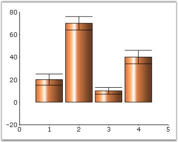
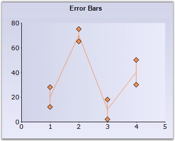
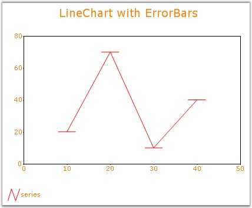

::: {style="DISPLAY: none"}
{#d2h_url_template}{#d2h_package_url style="WIDTH: 0px; DISPLAY: none; HEIGHT: 0px"}
:::

:::: {.d2h_secondary_topic style="PADDING-BOTTOM: 10pt; MARGIN: 0pt; PADDING-LEFT: 0pt; PADDING-RIGHT: 0pt; PADDING-TOP: 0pt"}
#### DrawErrorBars {#drawerrorbars style="tab-stops: 0pt"}

[]{style="FONT-FAMILY: 'Trebuchet MS','sans-serif'; FONT-SIZE: 9pt"} 

Error Bars are used to indicate a degree of uncertainty in the plotted data through a bar indicating an \"error range\".

The 2nd y value is used to indicate the error range. For example, a value of 5 indicates an error range of -5 to +5 from the specified y value.

[]{style="FONT-FAMILY: 'Trebuchet MS','sans-serif'; FONT-SIZE: 9pt"} 

::: {align="center"}
+--------------------------+-----------------------------------------+
| Details                                                            |
+--------------------------+-----------------------------------------+
| Possible Values          | True or False                           |
+--------------------------+-----------------------------------------+
| Default Value            | False                                   |
+--------------------------+-----------------------------------------+
| 2D / 3D Limitations      | No                                      |
+--------------------------+-----------------------------------------+
| Applies to Chart Element | All series                              |
+--------------------------+-----------------------------------------+
| Applies to Chart Types   | Column Chart, Line Chart and HiLo Chart |
+--------------------------+-----------------------------------------+
:::

**[]{style="FONT-FAMILY: 'Trebuchet MS','sans-serif'; FONT-SIZE: 9pt"}** 

Here is some sample code.

[]{style="FONT-FAMILY: 'Trebuchet MS','sans-serif'; FONT-SIZE: 9pt"} 

+----------------------------------------------------------------------------------------------------------------------------------------------------------------------------------------------------------------------------------------------------------------+
| **[\[C#\]]{style="FONT-FAMILY: 'Courier New'; COLOR: black"}**                                                                                                                                                                                                 |
|                                                                                                                                                                                                                                                                |
| []{style="FONT-FAMILY: 'Courier New'"}                                                                                                                                                                                                                         |
|                                                                                                                                                                                                                                                                |
| [ [// Generating Series]{style="COLOR: green"}]{style="FONT-FAMILY: 'Courier New'"}                                                                                                                                                                            |
|                                                                                                                                                                                                                                                                |
| [ChartSeries]{style="FONT-FAMILY: 'Courier New'; COLOR: teal"}[ series = [this]{style="COLOR: blue"}.ChartWebControl1.Model.NewSeries([\"Sales\"]{style="COLOR: maroon"}, [ChartSeriesType]{style="COLOR: teal"}.Column);]{style="FONT-FAMILY: 'Courier New'"} |
|                                                                                                                                                                                                                                                                |
| [ [// 2nd Y value indicates the error range]{style="COLOR: green"}]{style="FONT-FAMILY: 'Courier New'"}                                                                                                                                                        |
|                                                                                                                                                                                                                                                                |
| [series.Points.Add(1, [new]{style="COLOR: blue"} [double]{style="COLOR: blue"}\[\] { 20, 5 });]{style="FONT-FAMILY: 'Courier New'"}                                                                                                                            |
|                                                                                                                                                                                                                                                                |
| [series.Points.Add(2, [new]{style="COLOR: blue"} [double]{style="COLOR: blue"}\[\] { 70, 6 });]{style="FONT-FAMILY: 'Courier New'"}                                                                                                                            |
|                                                                                                                                                                                                                                                                |
| [series.Points.Add(3, [new]{style="COLOR: blue"} [double]{style="COLOR: blue"}\[\] { 10, 3 });]{style="FONT-FAMILY: 'Courier New'"}                                                                                                                            |
|                                                                                                                                                                                                                                                                |
| [series.Points.Add(4, [new]{style="COLOR: blue"} [double]{style="COLOR: blue"}\[\] { 40, 6 });]{style="FONT-FAMILY: 'Courier New'"}                                                                                                                            |
|                                                                                                                                                                                                                                                                |
| [series.Text = series.Name;]{style="FONT-FAMILY: 'Courier New'"}                                                                                                                                                                                               |
|                                                                                                                                                                                                                                                                |
| [// Adding Series to the Chart]{style="FONT-FAMILY: 'Courier New'; COLOR: green"}                                                                                                                                                                              |
|                                                                                                                                                                                                                                                                |
| [this]{style="FONT-FAMILY: 'Courier New'; COLOR: blue"}[.ChartWebControl1.Series.Add(series);]{style="FONT-FAMILY: 'Courier New'"}                                                                                                                             |
|                                                                                                                                                                                                                                                                |
| [// Specifies the Error Bar in Column chart.]{style="FONT-FAMILY: 'Courier New'; COLOR: green"}                                                                                                                                                                |
|                                                                                                                                                                                                                                                                |
| [this]{style="FONT-FAMILY: 'Courier New'; COLOR: blue"}[.ChartWebControl1.Series\[0\].DrawErrorBars = [true]{style="COLOR: blue"};]{style="FONT-FAMILY: 'Courier New'"}                                                                                        |
+----------------------------------------------------------------------------------------------------------------------------------------------------------------------------------------------------------------------------------------------------------------+

[]{style="FONT-FAMILY: 'Trebuchet MS','sans-serif'; FONT-SIZE: 9pt"} 

+----------------------------------------------------------------------------------------------------------------------------------------------------------------------------------------------------------------------------------------------------------------------------------------------------------------------------------------------------------------------------------------------------------------------------------------------------------------------------------------------------------------------------------------------------------------------------------+
| **[\[VB.NET\]]{style="FONT-FAMILY: 'Courier New'; COLOR: black"}**                                                                                                                                                                                                                                                                                                                                                                                                                                                                                                               |
|                                                                                                                                                                                                                                                                                                                                                                                                                                                                                                                                                                                  |
| **[]{style="FONT-FAMILY: 'Courier New'; COLOR: green"}**                                                                                                                                                                                                                                                                                                                                                                                                                                                                                                                         |
|                                                                                                                                                                                                                                                                                                                                                                                                                                                                                                                                                                                  |
| **[ ]{style="FONT-FAMILY: 'Courier New'; COLOR: green"}**[\' Generating Series]{style="FONT-FAMILY: 'Courier New'; COLOR: green"}                                                                                                                                                                                                                                                                                                                                                                                                                                                |
|                                                                                                                                                                                                                                                                                                                                                                                                                                                                                                                                                                                  |
| [series As ]{style="FONT-FAMILY: 'Courier New'; COLOR: black"}[ChartSeries]{style="FONT-FAMILY: 'Courier New'; COLOR: teal"}[ = ]{style="FONT-FAMILY: 'Courier New'; COLOR: black"}[Me]{style="FONT-FAMILY: 'Courier New'; COLOR: blue"}[.ChartWebControl1.Model.NewSeries(]{style="FONT-FAMILY: 'Courier New'; COLOR: black"}[\"Sales\"]{style="FONT-FAMILY: 'Courier New'; COLOR: maroon"}[, ]{style="FONT-FAMILY: 'Courier New'; COLOR: black"}[ChartSeriesType]{style="FONT-FAMILY: 'Courier New'; COLOR: teal"}[.Column)]{style="FONT-FAMILY: 'Courier New'; COLOR: black"} |
|                                                                                                                                                                                                                                                                                                                                                                                                                                                                                                                                                                                  |
| [ [\' 2nd Y value indicates the error range]{style="COLOR: green"}]{style="FONT-FAMILY: 'Courier New'"}                                                                                                                                                                                                                                                                                                                                                                                                                                                                          |
|                                                                                                                                                                                                                                                                                                                                                                                                                                                                                                                                                                                  |
| [series.Points.Add(1,]{style="FONT-FAMILY: 'Courier New'; COLOR: black"}[ New Double]{style="FONT-FAMILY: 'Courier New'; COLOR: blue"}[() { 20, 5 })]{style="FONT-FAMILY: 'Courier New'; COLOR: black"}                                                                                                                                                                                                                                                                                                                                                                          |
|                                                                                                                                                                                                                                                                                                                                                                                                                                                                                                                                                                                  |
| [series.Points.Add(2, ]{style="FONT-FAMILY: 'Courier New'; COLOR: black"}[New Double]{style="FONT-FAMILY: 'Courier New'; COLOR: blue"}[() { 70, 6 })]{style="FONT-FAMILY: 'Courier New'; COLOR: black"}                                                                                                                                                                                                                                                                                                                                                                          |
|                                                                                                                                                                                                                                                                                                                                                                                                                                                                                                                                                                                  |
| [series.Points.Add(3, ]{style="FONT-FAMILY: 'Courier New'; COLOR: black"}[New Double]{style="FONT-FAMILY: 'Courier New'; COLOR: blue"}[() { 10, 3 })]{style="FONT-FAMILY: 'Courier New'; COLOR: black"}                                                                                                                                                                                                                                                                                                                                                                          |
|                                                                                                                                                                                                                                                                                                                                                                                                                                                                                                                                                                                  |
| [series.Points.Add(4, ]{style="FONT-FAMILY: 'Courier New'; COLOR: black"}[New Double]{style="FONT-FAMILY: 'Courier New'; COLOR: blue"}[() { 40, 6 })]{style="FONT-FAMILY: 'Courier New'; COLOR: black"}                                                                                                                                                                                                                                                                                                                                                                          |
|                                                                                                                                                                                                                                                                                                                                                                                                                                                                                                                                                                                  |
| [series.Text = series.Name]{style="FONT-FAMILY: 'Courier New'; COLOR: black"}                                                                                                                                                                                                                                                                                                                                                                                                                                                                                                    |
|                                                                                                                                                                                                                                                                                                                                                                                                                                                                                                                                                                                  |
| [\' Adding Series to the Chart]{style="FONT-FAMILY: 'Courier New'; COLOR: green"}                                                                                                                                                                                                                                                                                                                                                                                                                                                                                                |
|                                                                                                                                                                                                                                                                                                                                                                                                                                                                                                                                                                                  |
| [Me]{style="FONT-FAMILY: 'Courier New'; COLOR: blue"}[.ChartWebControl1.Series.Add(series)]{style="FONT-FAMILY: 'Courier New'; COLOR: black"}                                                                                                                                                                                                                                                                                                                                                                                                                                    |
|                                                                                                                                                                                                                                                                                                                                                                                                                                                                                                                                                                                  |
| [\' Specifies the Error Bar in Column chart.]{style="FONT-FAMILY: 'Courier New'; COLOR: green"}                                                                                                                                                                                                                                                                                                                                                                                                                                                                                  |
|                                                                                                                                                                                                                                                                                                                                                                                                                                                                                                                                                                                  |
| [Private Me.ChartWebControl1.Series(0).DrawErrorBars = ]{style="FONT-FAMILY: 'Courier New'; COLOR: black"}[True]{style="FONT-FAMILY: 'Courier New'; COLOR: blue"}                                                                                                                                                                                                                                                                                                                                                                                                                |
+----------------------------------------------------------------------------------------------------------------------------------------------------------------------------------------------------------------------------------------------------------------------------------------------------------------------------------------------------------------------------------------------------------------------------------------------------------------------------------------------------------------------------------------------------------------------------------+

**[]{style="FONT-FAMILY: 'Trebuchet MS','sans-serif'"}** 

{border="0"}

**[]{style="FONT-FAMILY: 'Trebuchet MS','sans-serif'; FONT-SIZE: 9pt"}** 

Figure 112: ColumnChart with ErrorBars

**[]{style="FONT-FAMILY: 'Trebuchet MS','sans-serif'; FONT-SIZE: 9pt"}** 

{border="0"}

**[]{style="FONT-FAMILY: 'Trebuchet MS','sans-serif'; FONT-SIZE: 9pt"}** 

Figure 113: Line Chart with ErrorBars and ErrorBarsSymbolShape = \"Diamond\"

**[]{style="FONT-FAMILY: 'Trebuchet MS','sans-serif'; FONT-SIZE: 9pt"}** 

ErrorBar Orientation

[]{style="FONT-FAMILY: 'Trebuchet MS','sans-serif'; FONT-SIZE: 9pt"} 

Orientation of the ErrorBars can be specified in the **ErrorBars.Orientation** property. It can be *Vertical* or *Horizontal*.

[]{style="FONT-FAMILY: 'Trebuchet MS','sans-serif'; FONT-SIZE: 9pt"} 

+---------------------------------------------------------------------------------------------------------------------------------------------------------------------------------------------------------------+
| **[\[C#\]]{style="FONT-FAMILY: 'Courier New'; COLOR: black"}**                                                                                                                                                |
|                                                                                                                                                                                                               |
| []{style="FONT-FAMILY: 'Courier New'"}                                                                                                                                                                        |
|                                                                                                                                                                                                               |
| [//Creates a New Series]{style="FONT-FAMILY: 'Courier New'; COLOR: green"}                                                                                                                                    |
|                                                                                                                                                                                                               |
| [ChartSeries]{style="FONT-FAMILY: 'Courier New'; COLOR: teal"}[ s1 = [new]{style="COLOR: blue"} [ChartSeries]{style="COLOR: teal"}([\"series\"]{style="COLOR: maroon"});]{style="FONT-FAMILY: 'Courier New'"} |
|                                                                                                                                                                                                               |
| [//Points for the Series]{style="FONT-FAMILY: 'Courier New'; COLOR: green"}                                                                                                                                   |
|                                                                                                                                                                                                               |
| [s1.Points.Add(10, [new]{style="COLOR: blue"} [double]{style="COLOR: blue"}\[\] {20, 2, 2});]{style="FONT-FAMILY: 'Courier New'"}                                                                             |
|                                                                                                                                                                                                               |
| [s1.Points.Add(20, [new]{style="COLOR: blue"} [double]{style="COLOR: blue"}\[\] {70, 2, 2});]{style="FONT-FAMILY: 'Courier New'"}                                                                             |
|                                                                                                                                                                                                               |
| [s1.Points.Add(30, [new]{style="COLOR: blue"} [double]{style="COLOR: blue"}\[\] {10, 2, 2});]{style="FONT-FAMILY: 'Courier New'"}                                                                             |
|                                                                                                                                                                                                               |
| [s1.Points.Add(40, [new]{style="COLOR: blue"} [double]{style="COLOR: blue"}\[\] {40, 2, 2});]{style="FONT-FAMILY: 'Courier New'"}                                                                             |
|                                                                                                                                                                                                               |
| [s1.Points.Add(40, [new]{style="COLOR: blue"} [double]{style="COLOR: blue"}\[\] {40, 2, 2});]{style="FONT-FAMILY: 'Courier New'"}                                                                             |
|                                                                                                                                                                                                               |
| [s1.Text = s1.Name;]{style="FONT-FAMILY: 'Courier New'"}                                                                                                                                                      |
|                                                                                                                                                                                                               |
| []{style="FONT-FAMILY: 'Courier New'"}                                                                                                                                                                        |
|                                                                                                                                                                                                               |
| [//Type of Series]{style="FONT-FAMILY: 'Courier New'; COLOR: green"}                                                                                                                                          |
|                                                                                                                                                                                                               |
| [s1.Type = [ChartSeriesType]{style="COLOR: teal"}.Line;]{style="FONT-FAMILY: 'Courier New'"}                                                                                                                  |
|                                                                                                                                                                                                               |
| [s1.ConfigItems.ErrorBars.Enabled = [true]{style="COLOR: blue"};]{style="FONT-FAMILY: 'Courier New'"}                                                                                                         |
|                                                                                                                                                                                                               |
| []{style="FONT-FAMILY: 'Courier New'"}                                                                                                                                                                        |
|                                                                                                                                                                                                               |
| [// Set the orientation to horizontal]{style="FONT-FAMILY: 'Courier New'; COLOR: green"}                                                                                                                      |
|                                                                                                                                                                                                               |
| [s1.ConfigItems.ErrorBars.Orientation = [ChartOrientation]{style="COLOR: teal"}.Horizontal;]{style="FONT-FAMILY: 'Courier New'"}                                                                              |
|                                                                                                                                                                                                               |
| [s1.ConfigItems.ErrorBars.SymbolShape = [ChartSymbolShape]{style="COLOR: teal"}.None;]{style="FONT-FAMILY: 'Courier New'"}                                                                                    |
|                                                                                                                                                                                                               |
| []{style="FONT-FAMILY: 'Courier New'"}                                                                                                                                                                        |
|                                                                                                                                                                                                               |
| [s1.Style.Interior = [new]{style="COLOR: blue"} Syncfusion.Drawing.[BrushInfo]{style="COLOR: teal"}([Color]{style="COLOR: teal"}.Red);]{style="FONT-FAMILY: 'Courier New'"}                                   |
|                                                                                                                                                                                                               |
| [this]{style="FONT-FAMILY: 'Courier New'; COLOR: blue"}[.ChartWebControl1.PrimaryXAxis.DrawGrid = [false]{style="COLOR: blue"};]{style="FONT-FAMILY: 'Courier New'"}                                          |
|                                                                                                                                                                                                               |
| [this]{style="FONT-FAMILY: 'Courier New'; COLOR: blue"}[.ChartWebControl1.PrimaryYAxis.DrawGrid = [false]{style="COLOR: blue"};]{style="FONT-FAMILY: 'Courier New'"}                                          |
|                                                                                                                                                                                                               |
| []{style="FONT-FAMILY: 'Courier New'"}                                                                                                                                                                        |
|                                                                                                                                                                                                               |
| [this]{style="FONT-FAMILY: 'Courier New'; COLOR: blue"}[.ChartWebControl1.Series.Add(s1);]{style="FONT-FAMILY: 'Courier New'"}                                                                                |
+---------------------------------------------------------------------------------------------------------------------------------------------------------------------------------------------------------------+

[]{style="FONT-FAMILY: 'Trebuchet MS','sans-serif'; FONT-SIZE: 9pt"} 

+-------------------------------------------------------------------------------------------------------------------------------------------------------------------------------------------------------+
| **[\[VB.NET\]]{style="FONT-FAMILY: 'Courier New'; COLOR: black"}**                                                                                                                                    |
|                                                                                                                                                                                                       |
| **[]{style="FONT-FAMILY: 'Courier New'; COLOR: green"}**                                                                                                                                              |
|                                                                                                                                                                                                       |
| [\'Creates a New Series ]{style="FONT-FAMILY: 'Courier New'; COLOR: green"}                                                                                                                           |
|                                                                                                                                                                                                       |
| [Dim]{style="FONT-FAMILY: 'Courier New'; COLOR: blue"}[ s1 [As]{style="COLOR: blue"} [New]{style="COLOR: blue"} ChartSeries([\"series\"]{style="COLOR: maroon"})]{style="FONT-FAMILY: 'Courier New'"} |
|                                                                                                                                                                                                       |
| [\'Points for the Series ]{style="FONT-FAMILY: 'Courier New'; COLOR: green"}                                                                                                                          |
|                                                                                                                                                                                                       |
| [s1.Points.Add(10, [New]{style="COLOR: blue"} [Double]{style="COLOR: blue"}() {20, 2, 2}) ]{style="FONT-FAMILY: 'Courier New'"}                                                                       |
|                                                                                                                                                                                                       |
| [s1.Points.Add(20, [New]{style="COLOR: blue"} [Double]{style="COLOR: blue"}() {70, 2, 2}) ]{style="FONT-FAMILY: 'Courier New'"}                                                                       |
|                                                                                                                                                                                                       |
| [s1.Points.Add(30, [New]{style="COLOR: blue"} [Double]{style="COLOR: blue"}() {10, 2, 2}) ]{style="FONT-FAMILY: 'Courier New'"}                                                                       |
|                                                                                                                                                                                                       |
| [s1.Points.Add(40, [New]{style="COLOR: blue"} [Double]{style="COLOR: blue"}() {40, 2, 2}) ]{style="FONT-FAMILY: 'Courier New'"}                                                                       |
|                                                                                                                                                                                                       |
| [s1.Points.Add(40, [New]{style="COLOR: blue"} [Double]{style="COLOR: blue"}() {40, 2, 2}) ]{style="FONT-FAMILY: 'Courier New'"}                                                                       |
|                                                                                                                                                                                                       |
| [s1.Text = s1.Name ]{style="FONT-FAMILY: 'Courier New'"}                                                                                                                                              |
|                                                                                                                                                                                                       |
| []{style="FONT-FAMILY: 'Courier New'"}                                                                                                                                                                |
|                                                                                                                                                                                                       |
| [\'Type of Series ]{style="FONT-FAMILY: 'Courier New'; COLOR: green"}                                                                                                                                 |
|                                                                                                                                                                                                       |
| [s1.Type = ChartSeriesType.Line ]{style="FONT-FAMILY: 'Courier New'"}                                                                                                                                 |
|                                                                                                                                                                                                       |
| [s1.ConfigItems.ErrorBars.Enabled = [True]{style="COLOR: blue"} ]{style="FONT-FAMILY: 'Courier New'"}                                                                                                 |
|                                                                                                                                                                                                       |
| []{style="FONT-FAMILY: 'Courier New'"}                                                                                                                                                                |
|                                                                                                                                                                                                       |
| [\' Set the orientation to horizontal ]{style="FONT-FAMILY: 'Courier New'; COLOR: green"}                                                                                                             |
|                                                                                                                                                                                                       |
| [s1.ConfigItems.ErrorBars.Orientation = ChartOrientation.Horizontal ]{style="FONT-FAMILY: 'Courier New'"}                                                                                             |
|                                                                                                                                                                                                       |
| [s1.ConfigItems.ErrorBars.SymbolShape = ChartSymbolShape.None ]{style="FONT-FAMILY: 'Courier New'"}                                                                                                   |
|                                                                                                                                                                                                       |
| []{style="FONT-FAMILY: 'Courier New'"}                                                                                                                                                                |
|                                                                                                                                                                                                       |
| [s1.Style.Interior = [New]{style="COLOR: blue"} Syncfusion.Drawing.BrushInfo(Color.Red) ]{style="FONT-FAMILY: 'Courier New'"}                                                                         |
|                                                                                                                                                                                                       |
| [Me]{style="FONT-FAMILY: 'Courier New'; COLOR: blue"}[.ChartWebControl1.PrimaryXAxis.DrawGrid = [False]{style="COLOR: blue"} ]{style="FONT-FAMILY: 'Courier New'"}                                    |
|                                                                                                                                                                                                       |
| [Me]{style="FONT-FAMILY: 'Courier New'; COLOR: blue"}[.ChartWebControl1.PrimaryYAxis.DrawGrid = [False]{style="COLOR: blue"} ]{style="FONT-FAMILY: 'Courier New'"}                                    |
|                                                                                                                                                                                                       |
| []{style="FONT-FAMILY: 'Courier New'"}                                                                                                                                                                |
|                                                                                                                                                                                                       |
| [Me]{style="FONT-FAMILY: 'Courier New'; COLOR: blue"}[.ChartWebControl1.Series.Add(s1) ]{style="FONT-FAMILY: 'Courier New'"}                                                                          |
+-------------------------------------------------------------------------------------------------------------------------------------------------------------------------------------------------------+

**[]{style="FONT-FAMILY: 'Trebuchet MS','sans-serif'"}** 

{border="0"}

[]{style="FONT-FAMILY: 'Trebuchet MS','sans-serif'; FONT-SIZE: 9pt"} 

Figure 114: Errorbar Orientation set to \"Horizontal\"

See Also

**[]{style="FONT-FAMILY: 'Trebuchet MS','sans-serif'; FONT-SIZE: 9pt"}** 

[Line Chart]{.UGHyperlink}[, ]{.UGHyperlink}[Column Chart]{.UGHyperlink}[, ]{.UGHyperlink}[Hi Lo Chart]{.UGHyperlink}[, ]{.UGHyperlink}[ErrorBarsSymbolShape]{.UGHyperlink}[]{.UGHyperlink}

[]{#p93} 

 

[]{#related-topics}
::::
