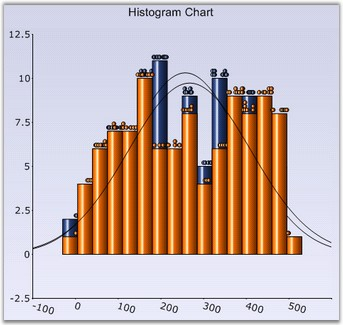

::: {style="DISPLAY: none"}
{#d2h_url_template}{#d2h_package_url style="WIDTH: 0px; DISPLAY: none; HEIGHT: 0px"}
:::

:::: {.d2h_secondary_topic style="PADDING-BOTTOM: 10pt; MARGIN: 0pt; PADDING-LEFT: 0pt; PADDING-RIGHT: 0pt; PADDING-TOP: 0pt"}
#### DrawHistogramNormalDistribution {#drawhistogramnormaldistribution style="tab-stops: 0pt"}

**[]{style="FONT-FAMILY: 'Trebuchet MS','sans-serif'"}** 

The normal distribution curve is drawn by setting this property of the ChartSeries class to **true**.

[]{style="FONT-FAMILY: 'Trebuchet MS','sans-serif'; FONT-SIZE: 9pt"} 

::: {align="center"}
+--------------------------+-----------------+
| Details                                    |
+--------------------------+-----------------+
| Possible Values          | True or False   |
+--------------------------+-----------------+
| Default Value            | False           |
+--------------------------+-----------------+
| 2D / 3D Limitations      | No              |
+--------------------------+-----------------+
| Applies to Chart Element | All series      |
+--------------------------+-----------------+
| Applies to Chart Types   | Histogram Chart |
+--------------------------+-----------------+
:::

**[]{style="FONT-FAMILY: 'Trebuchet MS','sans-serif'; FONT-SIZE: 9pt"}** 

Here is some sample code.

[]{style="FONT-FAMILY: 'Trebuchet MS','sans-serif'; FONT-SIZE: 9pt"} 

+------------------------------------------------------------------------------------------------------------------------------+
| **[\[C#\]]{style="FONT-FAMILY: 'Courier New'; COLOR: black"}**                                                               |
|                                                                                                                              |
| **[]{style="FONT-FAMILY: 'Courier New'; COLOR: black"}**                                                                     |
|                                                                                                                              |
| [// This draws the normal distribution curve for the histogram chart.]{style="FONT-FAMILY: 'Courier New'; COLOR: green"}     |
|                                                                                                                              |
| [series2.DrawHistogramNormalDistribution = [true]{style="COLOR: blue"};]{style="FONT-FAMILY: 'Courier New'"}                 |
|                                                                                                                              |
| []{style="FONT-FAMILY: 'Courier New'"}                                                                                       |
|                                                                                                                              |
| [// Set the desired number of intervals required for the histogram chart.]{style="FONT-FAMILY: 'Courier New'; COLOR: green"} |
|                                                                                                                              |
| [series2.NumberOfHistogramIntervals = 10;]{style="FONT-FAMILY: 'Courier New'"}                                               |
+------------------------------------------------------------------------------------------------------------------------------+

[]{style="FONT-FAMILY: 'Trebuchet MS','sans-serif'; FONT-SIZE: 9pt"} 

+-------------------------------------------------------------------------------------------------------------------------------------------------------+
| **[\[VB.NET\]]{style="FONT-FAMILY: 'Courier New'; COLOR: black"}**                                                                                    |
|                                                                                                                                                       |
| **[]{style="FONT-FAMILY: 'Courier New'; COLOR: black"}**                                                                                              |
|                                                                                                                                                       |
| [\' This draws the normal distribution curve for the histogram chart.]{style="FONT-FAMILY: 'Courier New'; COLOR: green"}                              |
|                                                                                                                                                       |
| [series2.DrawHistogramNormalDistribution = ]{style="FONT-FAMILY: 'Courier New'; COLOR: black"}[True]{style="FONT-FAMILY: 'Courier New'; COLOR: blue"} |
|                                                                                                                                                       |
| []{style="FONT-FAMILY: 'Courier New'; COLOR: black"}                                                                                                  |
|                                                                                                                                                       |
| [\' Set the desired number of intervals required for the histogram chart.]{style="FONT-FAMILY: 'Courier New'; COLOR: green"}                          |
|                                                                                                                                                       |
| [series2.NumberOfHistogramIntervals = 10]{style="FONT-FAMILY: 'Courier New'; COLOR: black"}                                                           |
+-------------------------------------------------------------------------------------------------------------------------------------------------------+

[]{style="FONT-FAMILY: 'Trebuchet MS','sans-serif'; FONT-SIZE: 9pt"} 

{border="0"}

**[]{style="FONT-FAMILY: 'Trebuchet MS','sans-serif'; FONT-SIZE: 9pt"}** 

Figure 115: Histogram Chart with Normal Distribution Curve

[]{style="COLOR: black; FONT-SIZE: 8pt"} 

See Also

[]{style="FONT-FAMILY: 'Segoe UI','sans-serif'; COLOR: black; FONT-SIZE: 9pt"} 

[Histogram Chart]{.UGHyperlink}[]{.UGHyperlink}

[]{#p94} 

[]{#related-topics}
::::
