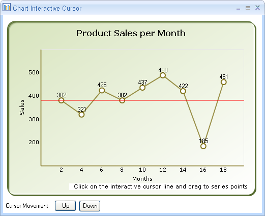
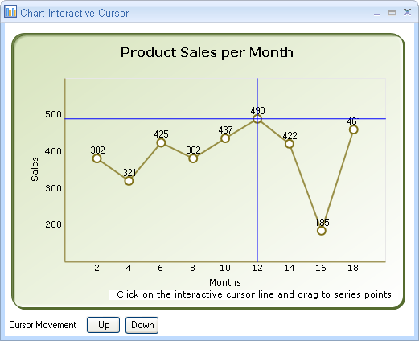
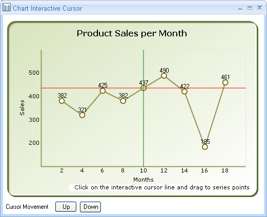

::: {style="DISPLAY: none"}
{#d2h_url_template}{#d2h_package_url style="WIDTH: 0px; DISPLAY: none; HEIGHT: 0px"}
:::

::: {.d2h_secondary_topic style="PADDING-BOTTOM: 10pt; MARGIN: 0pt; PADDING-LEFT: 0pt; PADDING-RIGHT: 0pt; PADDING-TOP: 0pt"}
#### Drawing Interactive Cursor Separately -- Either Horizontally or Vertically or Both {#drawing-interactive-cursor-separately-either-horizontally-or-vertically-or-both style="tab-stops: 0pt"}

 

An Interactive cursor is used to indicate the x-axis and y-axis values of a data point. The interactive cursor can be drawn in different orientations namely Horizontal, Vertical and in both directions. The cursor color can also be changed according to requirements. The default color is set at the initial stage and this can be changed according to orientation or a common color can be set for both orientations as the parent color.

 

 Use Case Scenarios[]{style="FONT-SIZE: 16pt"}

 

The purpose of using Chart Interactive Cursor is to indicate the x-axis and y-axis values for a specified data point.  You can accurately locate the position of the point on the axes. You can use it as per your requirement i.e. horizontal, vertical or both accordingly.

The following screen shot shows the Interactive cursor, which is drawn in horizontal orientation:

{border="0"}[]{style="FONT-SIZE: 12pt"}

Figure 307: Interactive Cursor with Horizontal Orientation

 

 

Properties[]{style="COLOR: #4e84c4"}

**[]{style="FONT-FAMILY: 'Arial','sans-serif'; COLOR: #4f81bd; FONT-SIZE: 14pt"}** 

+-----------------------+----------------------------------------------------------------------------------------------------------+-----------------------+
| Property              | Description                                                                                              | Data Type             |
+-----------------------+----------------------------------------------------------------------------------------------------------+-----------------------+
| CursorOrientation     | Indicates the orientation in which the Interactive Cursor is to be drawn. The options are :              | Enum                  |
|                       |                                                                                                          |                       |
|                       | [·      ]{style="FONT-FAMILY: Symbol"}Horizontal                                                         |                       |
|                       |                                                                                                          |                       |
|                       | [·      ]{style="FONT-FAMILY: Symbol"}Vertical                                                           |                       |
|                       |                                                                                                          |                       |
|                       | [·      ]{style="FONT-FAMILY: Symbol"}Both                                                               |                       |
+-----------------------+----------------------------------------------------------------------------------------------------------+-----------------------+
| HorizontalCursorColor | Specifies the color, which is to be used when Horizontal Interactive Cursor is drawn                     | Color                 |
+-----------------------+----------------------------------------------------------------------------------------------------------+-----------------------+
| VerticalCursorColor   | Specifies the color, which is to be used when Vertical  Interactive Cursor is drawn                      | Color                 |
+-----------------------+----------------------------------------------------------------------------------------------------------+-----------------------+
| Color                 | Specifies the base color, which is to be used other than the default color. This acts as a parent color. | Color                 |
+-----------------------+----------------------------------------------------------------------------------------------------------+-----------------------+

[]{style="LINE-HEIGHT: 115%; FONT-FAMILY: 'Calibri','sans-serif'; COLOR: black; FONT-SIZE: 12pt"} 

 

 

Drawing Interactive Cursor in a Chart Application[]{style="COLOR: #4e84c4"}

[]{style="FONT-FAMILY: 'Arial','sans-serif'"} 

To add Interactive Cursor to the Chart control:

1.   Add a Interactive cursor to the **Chart** control.

2.   Set the orientation to horizontal or vertical or both.

3.   Choose the color.

 

Refer to the following code snippets to draw the interactive cursor separately.

 

 

+-------------------------------------------------------------------------------------------------------------------------------------------------------------------------------------+
| **[\[C#.NET\]]{style="FONT-FAMILY: 'Courier New'"}[]{style="FONT-FAMILY: 'Courier New'"}**                                                                                          |
|                                                                                                                                                                                     |
| [cursor1 = [new]{style="COLOR: blue"} [ChartInteractiveCursor]{style="COLOR: #2b91af"}([this]{style="COLOR: blue"}.chartControl1.Series\[0\]);]{style="FONT-FAMILY: 'Courier New'"} |
|                                                                                                                                                                                     |
| [this]{style="FONT-FAMILY: 'Courier New'; COLOR: blue"}[.chartControl1.ChartArea.InteractiveCursors.Add(cursor1);           ]{style="FONT-FAMILY: 'Courier New'"}                   |
|                                                                                                                                                                                     |
| [cursor1.CursorOrientation = [InteractiveCursorOrientation]{style="COLOR: #2b91af"}.Horizontal;]{style="FONT-FAMILY: 'Courier New'"}                                                |
|                                                                                                                                                                                     |
| [cursor1.HorizontalCursorColor = [Color]{style="COLOR: #2b91af"}.Red;]{style="FONT-FAMILY: 'Courier New'"}[]{style="FONT-FAMILY: 'Courier New'"}                                    |
+-------------------------------------------------------------------------------------------------------------------------------------------------------------------------------------+

 

 

+------------------------------------------------------------------------------------------------------------------------------------------------------+
| **[\[VB.NET\]]{style="FONT-FAMILY: 'Courier New'"}[]{style="FONT-FAMILY: 'Courier New'"}**                                                           |
|                                                                                                                                                      |
| **[]{style="FONT-FAMILY: 'Courier New'"}**                                                                                                           |
|                                                                                                                                                      |
| [cursor1 = [New]{style="COLOR: blue"} ChartInteractiveCursor([Me]{style="COLOR: blue"}.chartControl1.Series(0))]{style="FONT-FAMILY: 'Courier New'"} |
|                                                                                                                                                      |
| [      [Me]{style="COLOR: blue"}.chartControl1.ChartArea.InteractiveCursors.Add(cursor1)]{style="FONT-FAMILY: 'Courier New'"}                        |
|                                                                                                                                                      |
| [      cursor1.CursorOrientation = InteractiveCursorOrientation.Horizontal]{style="FONT-FAMILY: 'Courier New'"}                                      |
|                                                                                                                                                      |
| [      cursor1.HorizontalCursorColor = Color.Red]{style="FONT-FAMILY: 'Courier New'"}[]{style="FONT-SIZE: 12pt"}                                     |
+------------------------------------------------------------------------------------------------------------------------------------------------------+

 

The interactive cursor as described earlier can be set in three different orientations.

To draw the interactive cursor in horizontal orientation, you need to set the cursor orientation to "Horizontal" as shown in the following code snippets:

 

+----------------------------------------------------------------------------------------------------------------------------------------------------------------------------+
| **[\[C#.NET\]]{style="FONT-FAMILY: 'Courier New'"}[]{style="FONT-FAMILY: 'Courier New'"}**                                                                                 |
|                                                                                                                                                                            |
| []{style="FONT-FAMILY: 'Courier New'"}                                                                                                                                     |
|                                                                                                                                                                            |
| [cursor1.CursorOrientation = [InteractiveCursorOrientation]{style="COLOR: #2b91af"}.Horizontal;]{style="FONT-FAMILY: 'Courier New'"}[]{style="FONT-FAMILY: 'Courier New'"} |
+----------------------------------------------------------------------------------------------------------------------------------------------------------------------------+

 

+--------------------------------------------------------------------------------------------------------------------------------------------+
| **[\[VB.NET\]]{style="FONT-FAMILY: 'Courier New'"}[]{style="FONT-FAMILY: 'Courier New'"}**                                                 |
|                                                                                                                                            |
| **[]{style="FONT-FAMILY: 'Courier New'"}**                                                                                                 |
|                                                                                                                                            |
| [      cursor1.CursorOrientation = InteractiveCursorOrientation.Horizontal]{style="FONT-FAMILY: 'Courier New'"}[]{style="FONT-SIZE: 12pt"} |
+--------------------------------------------------------------------------------------------------------------------------------------------+

[]{style="FONT-FAMILY: 'Courier New'"} 

The same step is repeated for "vertical" and "both" cursor orientations except for the naming "Vertical" and "Both" respectively.

You can also add color(s) to individual interactive cursor. The default color (base color) is Red. You can change the default color by using Color, HorizontalCursorColor, and VerticalCursorColor properties. When you use the Color property, the interactive cursor will be drawn based on the color specified by the Color property (assuming this as base/parent color) regardless of the colors specified for Horizontal and Vertical cursor orientations. This is shown in the following code snippets:

 

+--------------------------------------------------------------------------------------------------------------------------------------------------+
| **[\[C#.NET\]]{style="FONT-FAMILY: 'Courier New'"}[]{style="FONT-FAMILY: 'Courier New'"}**                                                       |
|                                                                                                                                                  |
| []{style="FONT-FAMILY: 'Courier New'"}                                                                                                           |
|                                                                                                                                                  |
| [      cursor1.CursorOrientation = [InteractiveCursorOrientation]{style="COLOR: #2b91af"}.Both ;]{style="FONT-FAMILY: 'Courier New'"}            |
|                                                                                                                                                  |
| [      cursor1.Color = [Color]{style="COLOR: #2b91af"}.Blue;]{style="FONT-FAMILY: 'Courier New'"}                                                |
|                                                                                                                                                  |
| [      cursor1.VerticalCursorColor = [Color]{style="COLOR: #2b91af"}.Green;]{style="FONT-FAMILY: 'Courier New'"}                                 |
|                                                                                                                                                  |
| [cursor1.HorizontalCursorColor = [Color]{style="COLOR: #2b91af"}.Red;]{style="FONT-FAMILY: 'Courier New'"}[]{style="FONT-FAMILY: 'Courier New'"} |
+--------------------------------------------------------------------------------------------------------------------------------------------------+

 

+--------------------------------------------------------------------------------------------------------------------------------------------------+
| **[\[VB.NET\]]{style="FONT-FAMILY: 'Courier New'"}[]{style="FONT-FAMILY: 'Courier New'"}**                                                       |
|                                                                                                                                                  |
| [      ]{style="FONT-FAMILY: 'Courier New'"}                                                                                                     |
|                                                                                                                                                  |
| [       cursor1.CursorOrientation = InteractiveCursorOrientation.Both]{style="FONT-FAMILY: 'Courier New'"}[]{style="FONT-FAMILY: 'Courier New'"} |
|                                                                                                                                                  |
| [       cursor1.Color = Color.Blue]{style="FONT-FAMILY: 'Courier New'"}                                                                          |
|                                                                                                                                                  |
| [       cursor1.VerticalCursorColor = Color.Green]{style="FONT-FAMILY: 'Courier New'"}                                                           |
|                                                                                                                                                  |
| [       cursor1.HorizontalCursorColor = Color.Red]{style="FONT-FAMILY: 'Courier New'"}[]{style="FONT-SIZE: 12pt"}                                |
+--------------------------------------------------------------------------------------------------------------------------------------------------+

[]{style="FONT-FAMILY: 'Courier New'"} 

Now, the default color would be replaced with blue color at both the orientations as it is the parent color.

 

{border="0"}

Figure 308: Interactive Cursor with Parent Color Set to Blue

 

The following code snippets draw interactive cursor in different colors:

 

+--------------------------------------------------------------------------------------------------------------------------------------------------+
| **[\[C#.NET\]]{style="FONT-FAMILY: 'Courier New'"}[]{style="FONT-FAMILY: 'Courier New'"}**                                                       |
|                                                                                                                                                  |
| []{style="FONT-FAMILY: 'Courier New'"}                                                                                                           |
|                                                                                                                                                  |
| [      cursor1.CursorOrientation = [InteractiveCursorOrientation]{style="COLOR: #2b91af"}.Both ;]{style="FONT-FAMILY: 'Courier New'"}            |
|                                                                                                                                                  |
| [      cursor1.VerticalCursorColor = [Color]{style="COLOR: #2b91af"}.Green;]{style="FONT-FAMILY: 'Courier New'"}                                 |
|                                                                                                                                                  |
| [cursor1.HorizontalCursorColor = [Color]{style="COLOR: #2b91af"}.Red;]{style="FONT-FAMILY: 'Courier New'"}[]{style="FONT-FAMILY: 'Courier New'"} |
+--------------------------------------------------------------------------------------------------------------------------------------------------+

 

+--------------------------------------------------------------------------------------------------------------------------------------------------+
| **[\[VB.NET\]]{style="FONT-FAMILY: 'Courier New'"}[]{style="FONT-FAMILY: 'Courier New'"}**                                                       |
|                                                                                                                                                  |
| [      ]{style="FONT-FAMILY: 'Courier New'"}                                                                                                     |
|                                                                                                                                                  |
| [       cursor1.CursorOrientation = InteractiveCursorOrientation.Both]{style="FONT-FAMILY: 'Courier New'"}[]{style="FONT-FAMILY: 'Courier New'"} |
|                                                                                                                                                  |
| [       cursor1.VerticalCursorColor = Color.Green]{style="FONT-FAMILY: 'Courier New'"}                                                           |
|                                                                                                                                                  |
| [       cursor1.HorizontalCursorColor = Color.Red]{style="FONT-FAMILY: 'Courier New'"}[]{style="FONT-SIZE: 12pt"}                                |
+--------------------------------------------------------------------------------------------------------------------------------------------------+

[]{style="FONT-FAMILY: 'Courier New'"} 

[]{style="FONT-FAMILY: 'Courier New'"} 

[]{style="LINE-HEIGHT: 115%; FONT-FAMILY: 'Times New Roman','serif'; COLOR: black; FONT-SIZE: 12pt"} 

[]{style="COLOR: black"} 

{border="0"}

Figure 309 : Interactive Cursor with Horizontal Cursor Color Red and Vertical Cursor Color Green.[]{style="COLOR: black"}

 

 

[]{#related-topics}
:::
