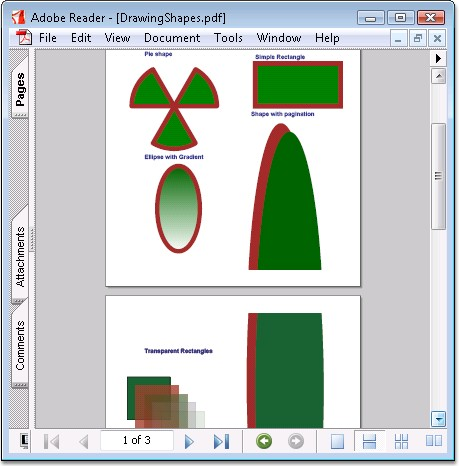

::: {style="DISPLAY: none"}
{#d2h_url_template}{#d2h_package_url style="WIDTH: 0px; DISPLAY: none; HEIGHT: 0px"}
:::

:::: {.d2h_secondary_topic style="PADDING-BOTTOM: 10pt; MARGIN: 0pt; PADDING-LEFT: 0pt; PADDING-RIGHT: 0pt; PADDING-TOP: 0pt"}
#### Drawing Shapes {#drawing-shapes style="tab-stops: 0pt"}

 

Essential PDF has a comprehensive set of APIs that can be used for drawing a variety of shapes such as,

 

[·      ]{style="FONT-FAMILY: Symbol"}Rectangles

[·      ]{style="FONT-FAMILY: Symbol"}Circles

[·      ]{style="FONT-FAMILY: Symbol"}Arcs

[·      ]{style="FONT-FAMILY: Symbol"}Curves and so on.

 

Shapes are filled by using different types of brushes like gradient brush, Tiling brush, and so on. Essential PDF supports drawing of shapes with different color spaces. Transparency of shapes can also be set.

 

**PdfGraphics** class allows drawing a wide range of primitives like

 

[·      ]{style="FONT-FAMILY: Symbol"}Lines

[·      ]{style="FONT-FAMILY: Symbol"}Curves

[·      ]{style="FONT-FAMILY: Symbol"}Paths

[·      ]{style="FONT-FAMILY: Symbol"}Text

[]{style="FONT-FAMILY: 'Trebuchet MS','sans-serif'; COLOR: #15428b; FONT-SIZE: 9pt"} 

For each such operation there is a set of methods like Draw*\<primitive\>*() (for example: DrawLine).

 

Each set of methods accepts parameters specific to each primitive type (for example: pen, brush, boundaries, etc.).

 

[·      ]{style="FONT-FAMILY: Symbol"}If pen is used, the primitive will be drawn

[·      ]{style="FONT-FAMILY: Symbol"}If brush is used, the primitive will be filled.

[]{style="FONT-FAMILY: 'Trebuchet MS','sans-serif'; COLOR: #15428b; FONT-SIZE: 9pt"} 

::: {style="BORDER-BOTTOM: windowtext 1pt solid; BORDER-LEFT: medium none; PADDING-BOTTOM: 1pt; MARGIN-TOP: 9pt; PADDING-LEFT: 0pt; PADDING-RIGHT: 0pt; MARGIN-BOTTOM: 9pt; BORDER-TOP: windowtext 1pt solid; BORDER-RIGHT: medium none; PADDING-TOP: 1pt"}
{border="0"}Note: You must add the Syncfusion.Pdf.Graphics namespace to work with graphic objects.
:::

 

The following code example illustrates how to draw shapes.

 

+---------------------------------------------------------------------------------------------------------------------------------------------------------------------------------------------------------------------+
| **[\[C#\]]{style="FONT-FAMILY: 'Courier New'; COLOR: black"}**                                                                                                                                                      |
|                                                                                                                                                                                                                     |
| []{style="FONT-FAMILY: 'Courier New'; COLOR: black"}                                                                                                                                                                |
|                                                                                                                                                                                                                     |
| [//Draws polygon with pen and brush.]{style="FONT-FAMILY: 'Courier New'; COLOR: green"}                                                                                                                             |
|                                                                                                                                                                                                                     |
| [PdfGraphics]{style="FONT-FAMILY: 'Courier New'; COLOR: teal"}[ g = page.Graphics;]{style="FONT-FAMILY: 'Courier New'"}                                                                                             |
|                                                                                                                                                                                                                     |
| [PdfPen]{style="FONT-FAMILY: 'Courier New'; COLOR: teal"}[ pen = [new]{style="COLOR: blue"} [PdfPen]{style="COLOR: teal"}([Color]{style="COLOR: teal"}.Brown);]{style="FONT-FAMILY: 'Courier New'"}                 |
|                                                                                                                                                                                                                     |
| [PdfSolidBrush]{style="FONT-FAMILY: 'Courier New'; COLOR: teal"}[ brush = [new]{style="COLOR: blue"} [PdfSolidBrush]{style="COLOR: teal"}([Color]{style="COLOR: teal"}.Green);]{style="FONT-FAMILY: 'Courier New'"} |
|                                                                                                                                                                                                                     |
| [g.DrawPolygon(pen, brush, points);  ]{style="FONT-FAMILY: 'Courier New'"}                                                                                                                                          |
+---------------------------------------------------------------------------------------------------------------------------------------------------------------------------------------------------------------------+

[]{style="FONT-FAMILY: 'Trebuchet MS','sans-serif'; COLOR: #15428b; FONT-SIZE: 9pt"} 

+----------------------------------------------------------------------------------------------------------------------------------------------------------------------------------------------------+
| **[\[]{style="FONT-FAMILY: 'Courier New'; COLOR: black"}[VB.NET[\]]{style="COLOR: black"}]{style="FONT-FAMILY: 'Courier New'"}**                                                                   |
|                                                                                                                                                                                                    |
| []{style="FONT-FAMILY: 'Courier New'; COLOR: black"}                                                                                                                                               |
|                                                                                                                                                                                                    |
| [\'Draws polygon with pen and brush.]{style="FONT-FAMILY: 'Courier New'; COLOR: green"}                                                                                                            |
|                                                                                                                                                                                                    |
| [Dim]{style="FONT-FAMILY: 'Courier New'; COLOR: blue"}[ g [As]{style="COLOR: blue"} PdfGraphics = page.Graphics]{style="FONT-FAMILY: 'Courier New'"}                                               |
|                                                                                                                                                                                                    |
| [Dim]{style="FONT-FAMILY: 'Courier New'; COLOR: blue"}[ pen [As]{style="COLOR: blue"} PdfPen = [New]{style="COLOR: blue"} PdfPen(Color.Brown)]{style="FONT-FAMILY: 'Courier New'"}                 |
|                                                                                                                                                                                                    |
| [Dim]{style="FONT-FAMILY: 'Courier New'; COLOR: blue"}[ brush [As]{style="COLOR: blue"} PdfSolidBrush = [New]{style="COLOR: blue"} PdfSolidBrush(Color.Green)]{style="FONT-FAMILY: 'Courier New'"} |
|                                                                                                                                                                                                    |
| [g.DrawPolygon(pen, brush, points)]{style="FONT-FAMILY: 'Courier New'"}                                                                                                                            |
+----------------------------------------------------------------------------------------------------------------------------------------------------------------------------------------------------+

 

You can paginate the element as follows.

 

+----------------------------------------------------------------------------------------------------------------------------------------------------------------------------------------+
| **[\[C#\]]{style="FONT-FAMILY: 'Courier New'; COLOR: black"}**                                                                                                                         |
|                                                                                                                                                                                        |
| []{style="FONT-FAMILY: 'Courier New'; COLOR: black"}                                                                                                                                   |
|                                                                                                                                                                                        |
| [PdfEllipse]{style="FONT-FAMILY: 'Courier New'; COLOR: teal"}[ ellipse = [new]{style="COLOR: blue"} [PdfEllipse]{style="COLOR: teal"}(rect);]{style="FONT-FAMILY: 'Courier New'"}      |
|                                                                                                                                                                                        |
| []{style="FONT-FAMILY: 'Courier New'"}                                                                                                                                                 |
|                                                                                                                                                                                        |
| [//Set layout property to make the element break across the pages.]{style="FONT-FAMILY: 'Courier New'; COLOR: green"}                                                                  |
|                                                                                                                                                                                        |
| [PdfLayoutFormat]{style="FONT-FAMILY: 'Courier New'; COLOR: teal"}[ format = [new]{style="COLOR: blue"} [PdfLayoutFormat]{style="COLOR: teal"}();]{style="FONT-FAMILY: 'Courier New'"} |
|                                                                                                                                                                                        |
| [format.Break = [PdfLayoutBreakType]{style="COLOR: teal"}.FitPage;]{style="FONT-FAMILY: 'Courier New'"}                                                                                |
|                                                                                                                                                                                        |
| [format.Layout = [PdfLayoutType]{style="COLOR: teal"}.Paginate;]{style="FONT-FAMILY: 'Courier New'"}                                                                                   |
|                                                                                                                                                                                        |
| [ellipse.Brush = [PdfBrushes]{style="COLOR: teal"}.Brown;]{style="FONT-FAMILY: 'Courier New'"}                                                                                         |
|                                                                                                                                                                                        |
| []{style="FONT-FAMILY: 'Courier New'"}                                                                                                                                                 |
|                                                                                                                                                                                        |
| [//Draw ellipse.]{style="FONT-FAMILY: 'Courier New'; COLOR: green"}                                                                                                                    |
|                                                                                                                                                                                        |
| [ellipse.Draw(page, 20, 20, format);]{style="FONT-FAMILY: 'Courier New'"}                                                                                                              |
+----------------------------------------------------------------------------------------------------------------------------------------------------------------------------------------+

[]{style="FONT-FAMILY: 'Trebuchet MS','sans-serif'; COLOR: #15428b; FONT-SIZE: 9pt"} 

+----------------------------------------------------------------------------------------------------------------------------------------------------------------------------------------------+
| **[\[]{style="FONT-FAMILY: 'Courier New'; COLOR: black"}[VB.NET[\]]{style="COLOR: black"}]{style="FONT-FAMILY: 'Courier New'"}**                                                             |
|                                                                                                                                                                                              |
| []{style="FONT-FAMILY: 'Courier New'; COLOR: black"}                                                                                                                                         |
|                                                                                                                                                                                              |
| [Dim]{style="FONT-FAMILY: 'Courier New'; COLOR: blue"}[ ellipse [As]{style="COLOR: blue"} PdfEllipse = [New]{style="COLOR: blue"} PdfEllipse(rect)]{style="FONT-FAMILY: 'Courier New'"}      |
|                                                                                                                                                                                              |
| []{style="FONT-FAMILY: 'Courier New'"}                                                                                                                                                       |
|                                                                                                                                                                                              |
| [\'Set layout property to make the element break across the pages.]{style="FONT-FAMILY: 'Courier New'; COLOR: green"}                                                                        |
|                                                                                                                                                                                              |
| [Dim]{style="FONT-FAMILY: 'Courier New'; COLOR: blue"}[ format [As]{style="COLOR: blue"} PdfLayoutFormat = [New]{style="COLOR: blue"} PdfLayoutFormat()]{style="FONT-FAMILY: 'Courier New'"} |
|                                                                                                                                                                                              |
| [format.Break = PdfLayoutBreakType.FitPage]{style="FONT-FAMILY: 'Courier New'"}                                                                                                              |
|                                                                                                                                                                                              |
| [format.Layout = PdfLayoutType.Paginate]{style="FONT-FAMILY: 'Courier New'"}                                                                                                                 |
|                                                                                                                                                                                              |
| [ellipse.Brush = PdfBrushes.Brown]{style="FONT-FAMILY: 'Courier New'"}                                                                                                                       |
|                                                                                                                                                                                              |
| []{style="FONT-FAMILY: 'Courier New'"}                                                                                                                                                       |
|                                                                                                                                                                                              |
| [\'Draw ellipse.]{style="FONT-FAMILY: 'Courier New'; COLOR: green"}                                                                                                                          |
|                                                                                                                                                                                              |
| [ellipse.Draw(page, 20, 20, format)]{style="FONT-FAMILY: 'Courier New'"}                                                                                                                     |
+----------------------------------------------------------------------------------------------------------------------------------------------------------------------------------------------+

[]{style="FONT-FAMILY: 'Trebuchet MS','sans-serif'; COLOR: #15428b; FONT-SIZE: 9pt"} 

{border="0"}

Figure 38: PDF Document drawn with Shapes

 

 

[]{#related-topics}
::::
