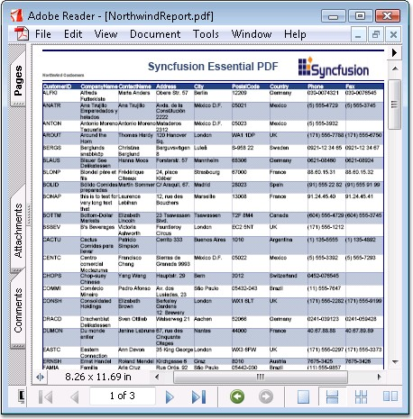

::: {style="DISPLAY: none"}
{#d2h_url_template}{#d2h_package_url style="WIDTH: 0px; DISPLAY: none; HEIGHT: 0px"}
:::

:::: {.d2h_secondary_topic style="PADDING-BOTTOM: 10pt; MARGIN: 0pt; PADDING-LEFT: 0pt; PADDING-RIGHT: 0pt; PADDING-TOP: 0pt"}
#### Drawing Table {#drawing-table style="tab-stops: 0pt"}

 

Essential PDF provides support for inserting tables into the PDF page. This feature enables the following:

 

[·      ]{style="FONT-FAMILY: Symbol"}Drawing tabular data into the PDF page

[·      ]{style="FONT-FAMILY: Symbol"}Built-in support for importing an ADO.NET DataTable into a table in the PDF page

[]{style="FONT-FAMILY: 'Trebuchet MS','sans-serif'; COLOR: #15428b; FONT-SIZE: 9pt"} 

**PdfLightTable** class represents simple tables that are used for publishing structured data from arrays, data tables or data columns. There are no real cells or rows in these tables, and all the data is taken from the data source by using the **DataSource** property.

[]{style="FONT-FAMILY: 'Trebuchet MS','sans-serif'; COLOR: #15428b; FONT-SIZE: 9pt"} 

::: {style="BORDER-BOTTOM: windowtext 1pt solid; BORDER-LEFT: medium none; PADDING-BOTTOM: 1pt; MARGIN-TOP: 9pt; PADDING-LEFT: 0pt; PADDING-RIGHT: 0pt; MARGIN-BOTTOM: 9pt; BORDER-TOP: windowtext 1pt solid; BORDER-RIGHT: medium none; PADDING-TOP: 1pt"}
{border="0"}Note: You must add the Syncfusion.Pdf.Tables namespace to work with Tables.
:::

 

The following code example illustrates how to create and format tables.

 

+----------------------------------------------------------------------------------------------------------------------------------------------------------------------------------------+
| **[\[C#\]]{style="FONT-FAMILY: 'Courier New'; COLOR: black"}**                                                                                                                         |
|                                                                                                                                                                                        |
| []{style="FONT-FAMILY: 'Courier New'; COLOR: black"}                                                                                                                                   |
|                                                                                                                                                                                        |
| [//Create Pdf table.]{style="FONT-FAMILY: 'Courier New'; COLOR: green"}                                                                                                                |
|                                                                                                                                                                                        |
| [PdfLightTable]{style="FONT-FAMILY: 'Courier New'; COLOR: teal"}[ table = [new]{style="COLOR: blue"} [PdfLightTable]{style="COLOR: teal"}();]{style="FONT-FAMILY: 'Courier New'"}      |
|                                                                                                                                                                                        |
| []{style="FONT-FAMILY: 'Courier New'"}                                                                                                                                                 |
|                                                                                                                                                                                        |
| [//Set Data source.]{style="FONT-FAMILY: 'Courier New'; COLOR: green"}                                                                                                                 |
|                                                                                                                                                                                        |
| [table.DataSource = dataTable;]{style="FONT-FAMILY: 'Courier New'"}                                                                                                                    |
|                                                                                                                                                                                        |
| []{style="FONT-FAMILY: 'Courier New'"}                                                                                                                                                 |
|                                                                                                                                                                                        |
| [//Set table alternate row style.]{style="FONT-FAMILY: 'Courier New'; COLOR: green"}                                                                                                   |
|                                                                                                                                                                                        |
| [table.Style.AlternateStyle = altStyle;]{style="FONT-FAMILY: 'Courier New'"}                                                                                                           |
|                                                                                                                                                                                        |
| []{style="FONT-FAMILY: 'Courier New'"}                                                                                                                                                 |
|                                                                                                                                                                                        |
| [//Set header row style.      ]{style="FONT-FAMILY: 'Courier New'; COLOR: green"}                                                                                                      |
|                                                                                                                                                                                        |
| [table.Style.HeaderStyle = headerStyle;]{style="FONT-FAMILY: 'Courier New'"}                                                                                                           |
|                                                                                                                                                                                        |
| []{style="FONT-FAMILY: 'Courier New'"}                                                                                                                                                 |
|                                                                                                                                                                                        |
| [//Show the header row.]{style="FONT-FAMILY: 'Courier New'; COLOR: green"}                                                                                                             |
|                                                                                                                                                                                        |
| [table.Style.ShowHeader = [true]{style="COLOR: blue"};]{style="FONT-FAMILY: 'Courier New'"}                                                                                            |
|                                                                                                                                                                                        |
| []{style="FONT-FAMILY: 'Courier New'"}                                                                                                                                                 |
|                                                                                                                                                                                        |
| [//Repeat header in all the pages.]{style="FONT-FAMILY: 'Courier New'; COLOR: green"}                                                                                                  |
|                                                                                                                                                                                        |
| [table.Style.RepeatHeader = [true]{style="COLOR: blue"};]{style="FONT-FAMILY: 'Courier New'"}                                                                                          |
|                                                                                                                                                                                        |
| []{style="FONT-FAMILY: 'Courier New'"}                                                                                                                                                 |
|                                                                                                                                                                                        |
| [//Set header data from column caption.]{style="FONT-FAMILY: 'Courier New'; COLOR: green"}                                                                                             |
|                                                                                                                                                                                        |
| [table.Style.HeaderSource = [PdfHeaderSource]{style="COLOR: teal"}.ColumnCaptions;]{style="FONT-FAMILY: 'Courier New'"}                                                                |
|                                                                                                                                                                                        |
| []{style="FONT-FAMILY: 'Courier New'"}                                                                                                                                                 |
|                                                                                                                                                                                        |
| [//Set layout properties.]{style="FONT-FAMILY: 'Courier New'; COLOR: green"}                                                                                                           |
|                                                                                                                                                                                        |
| [PdfLayoutFormat]{style="FONT-FAMILY: 'Courier New'; COLOR: teal"}[ format = [new]{style="COLOR: blue"} [PdfLayoutFormat]{style="COLOR: teal"}();]{style="FONT-FAMILY: 'Courier New'"} |
|                                                                                                                                                                                        |
| [format.Break = [PdfLayoutBreakType]{style="COLOR: teal"}.FitElement;]{style="FONT-FAMILY: 'Courier New'"}                                                                             |
|                                                                                                                                                                                        |
| [format.Layout = [PdfLayoutType]{style="COLOR: teal"}.Paginate;]{style="FONT-FAMILY: 'Courier New'"}                                                                                   |
|                                                                                                                                                                                        |
| []{style="FONT-FAMILY: 'Courier New'"}                                                                                                                                                 |
|                                                                                                                                                                                        |
| [//Draw table.]{style="FONT-FAMILY: 'Courier New'; COLOR: green"}                                                                                                                      |
|                                                                                                                                                                                        |
| [table.Draw(page, [PointF]{style="COLOR: teal"}.Empty, format);]{style="FONT-FAMILY: 'Courier New'"}                                                                                   |
+----------------------------------------------------------------------------------------------------------------------------------------------------------------------------------------+

[]{style="FONT-FAMILY: 'Trebuchet MS','sans-serif'; COLOR: #15428b; FONT-SIZE: 9pt"} 

+----------------------------------------------------------------------------------------------------------------------------------------------------------------------------------------------+
| **[\[]{style="FONT-FAMILY: 'Courier New'; COLOR: black"}[VB.NET[\]]{style="COLOR: black"}]{style="FONT-FAMILY: 'Courier New'"}**                                                             |
|                                                                                                                                                                                              |
| []{style="FONT-FAMILY: 'Courier New'; COLOR: black"}                                                                                                                                         |
|                                                                                                                                                                                              |
| [\'Create Pdf table.]{style="FONT-FAMILY: 'Courier New'; COLOR: green"}                                                                                                                      |
|                                                                                                                                                                                              |
| [Dim]{style="FONT-FAMILY: 'Courier New'; COLOR: blue"}[ table [As]{style="COLOR: blue"} PdfLightTable = [New]{style="COLOR: blue"} PdfLightTable()]{style="FONT-FAMILY: 'Courier New'"}      |
|                                                                                                                                                                                              |
| []{style="FONT-FAMILY: 'Courier New'"}                                                                                                                                                       |
|                                                                                                                                                                                              |
| [\'Set Data source.]{style="FONT-FAMILY: 'Courier New'; COLOR: green"}                                                                                                                       |
|                                                                                                                                                                                              |
| [ table.DataSource = dataTable]{style="FONT-FAMILY: 'Courier New'"}                                                                                                                          |
|                                                                                                                                                                                              |
| []{style="FONT-FAMILY: 'Courier New'"}                                                                                                                                                       |
|                                                                                                                                                                                              |
| [\'Set table alternate row style.]{style="FONT-FAMILY: 'Courier New'; COLOR: green"}                                                                                                         |
|                                                                                                                                                                                              |
| [table.Style.AlternateStyle = altStyle]{style="FONT-FAMILY: 'Courier New'"}                                                                                                                  |
|                                                                                                                                                                                              |
| []{style="FONT-FAMILY: 'Courier New'"}                                                                                                                                                       |
|                                                                                                                                                                                              |
| [\'Set header row style.        ]{style="FONT-FAMILY: 'Courier New'; COLOR: green"}                                                                                                          |
|                                                                                                                                                                                              |
| [table.Style.HeaderStyle = headerStyle]{style="FONT-FAMILY: 'Courier New'"}                                                                                                                  |
|                                                                                                                                                                                              |
| []{style="FONT-FAMILY: 'Courier New'"}                                                                                                                                                       |
|                                                                                                                                                                                              |
| [\'Show the header row.]{style="FONT-FAMILY: 'Courier New'; COLOR: green"}                                                                                                                   |
|                                                                                                                                                                                              |
| [table.Style.ShowHeader = [True]{style="COLOR: blue"}]{style="FONT-FAMILY: 'Courier New'"}                                                                                                   |
|                                                                                                                                                                                              |
| []{style="FONT-FAMILY: 'Courier New'; COLOR: blue"}                                                                                                                                          |
|                                                                                                                                                                                              |
| [\'Repeat header in all the pages.]{style="FONT-FAMILY: 'Courier New'; COLOR: green"}                                                                                                        |
|                                                                                                                                                                                              |
| [table.Style.RepeatHeader = [True]{style="COLOR: blue"}]{style="FONT-FAMILY: 'Courier New'"}                                                                                                 |
|                                                                                                                                                                                              |
| []{style="FONT-FAMILY: 'Courier New'; COLOR: blue"}                                                                                                                                          |
|                                                                                                                                                                                              |
| [\'Set header data from column caption.]{style="FONT-FAMILY: 'Courier New'; COLOR: green"}                                                                                                   |
|                                                                                                                                                                                              |
| [table.Style.HeaderSource = PdfHeaderSource.ColumnCaptions]{style="FONT-FAMILY: 'Courier New'"}                                                                                              |
|                                                                                                                                                                                              |
| []{style="FONT-FAMILY: 'Courier New'"}                                                                                                                                                       |
|                                                                                                                                                                                              |
| [\'Set layout properties.]{style="FONT-FAMILY: 'Courier New'; COLOR: green"}                                                                                                                 |
|                                                                                                                                                                                              |
| [Dim]{style="FONT-FAMILY: 'Courier New'; COLOR: blue"}[ format [As]{style="COLOR: blue"} PdfLayoutFormat = [New]{style="COLOR: blue"} PdfLayoutFormat()]{style="FONT-FAMILY: 'Courier New'"} |
|                                                                                                                                                                                              |
| [format.Break = PdfLayoutBreakType.FitElement]{style="FONT-FAMILY: 'Courier New'"}                                                                                                           |
|                                                                                                                                                                                              |
| [format.Layout = PdfLayoutType.Paginate]{style="FONT-FAMILY: 'Courier New'"}                                                                                                                 |
|                                                                                                                                                                                              |
| []{style="FONT-FAMILY: 'Courier New'"}                                                                                                                                                       |
|                                                                                                                                                                                              |
| [\'Draw table.]{style="FONT-FAMILY: 'Courier New'; COLOR: green"}                                                                                                                            |
|                                                                                                                                                                                              |
| [table.Draw(page, PointF.Empty,format)]{style="FONT-FAMILY: 'Courier New'"}                                                                                                                  |
+----------------------------------------------------------------------------------------------------------------------------------------------------------------------------------------------+

[]{style="FONT-FAMILY: 'Trebuchet MS','sans-serif'; COLOR: #15428b; FONT-SIZE: 9pt"} 

{border="0"}

Figure 44: Drawing Table in the PDF page

 

 

[]{#related-topics}
::::
