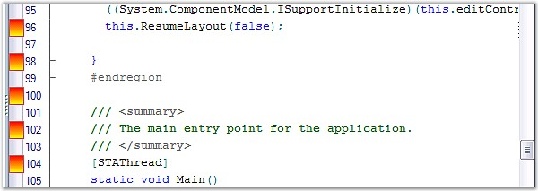

::: {style="DISPLAY: none"}
{#d2h_url_template}{#d2h_package_url style="WIDTH: 0px; DISPLAY: none; HEIGHT: 0px"}
:::

:::: {.d2h_secondary_topic style="PADDING-BOTTOM: 10pt; MARGIN: 0pt; PADDING-LEFT: 0pt; PADDING-RIGHT: 0pt; PADDING-TOP: 0pt"}
#### DrawLineMark Event {#drawlinemark-event style="tab-stops: 0pt"}

 

This event occurs when a custom line mark should be drawn.

 

The event handler receives an argument of type **DrawLineMarkEventArgs**. The following DrawLineMarkEventArgs members provide information specific to this event.

 

::: {align="center"}
  -------------------------------------------------------------------------------------------------------- -------------------------------------------------------------------------------------------------------------------------------------------------
  Member                                                                                                   Description
  [[CustomDraw]{style="COLOR: windowtext; TEXT-DECORATION: none; text-underline: none"}]{.UGHyperlink}     [[If set to True, user handles drawing of the bookmark.]{style="COLOR: windowtext; TEXT-DECORATION: none; text-underline: none"}]{.UGHyperlink}
  [[Graphics]{style="COLOR: windowtext; TEXT-DECORATION: none; text-underline: none"}]{.UGHyperlink}       [[Graphics object.]{style="COLOR: windowtext; TEXT-DECORATION: none; text-underline: none"}]{.UGHyperlink}
  [[MarkRect]{style="COLOR: windowtext; TEXT-DECORATION: none; text-underline: none"}]{.UGHyperlink}       [[Rectangle where line mark should be drawn.]{style="COLOR: windowtext; TEXT-DECORATION: none; text-underline: none"}]{.UGHyperlink}
  [[PhysicalLine]{style="COLOR: windowtext; TEXT-DECORATION: none; text-underline: none"}]{.UGHyperlink}   [[Virtual line number.]{style="COLOR: windowtext; TEXT-DECORATION: none; text-underline: none"}]{.UGHyperlink}
  [[VirtualLine]{style="COLOR: windowtext; TEXT-DECORATION: none; text-underline: none"}]{.UGHyperlink}    [[Physical line number.]{style="COLOR: windowtext; TEXT-DECORATION: none; text-underline: none"}]{.UGHyperlink}
  -------------------------------------------------------------------------------------------------------- -------------------------------------------------------------------------------------------------------------------------------------------------
:::

[]{style="FONT-FAMILY: 'Trebuchet MS','sans-serif'; COLOR: #15428b; FONT-SIZE: 9pt"} 

+----------------------------------------------------------------------------------------------------------------------------------------------------------------------------------------------------------------------------------------------------------------------------+
| **[\[C#\]]{style="FONT-FAMILY: 'Courier New'; COLOR: black"}**                                                                                                                                                                                                             |
|                                                                                                                                                                                                                                                                            |
| []{style="FONT-FAMILY: 'Courier New'; COLOR: black"}                                                                                                                                                                                                                       |
|                                                                                                                                                                                                                                                                            |
| [private]{style="FONT-FAMILY: 'Courier New'; COLOR: blue"}[ [void]{style="COLOR: blue"} editControl1_DrawLineMark([object]{style="COLOR: blue"} sender, Syncfusion.Windows.Forms.Edit.[DrawLineMarkEventArgs]{style="COLOR: teal"} e)]{style="FONT-FAMILY: 'Courier New'"} |
|                                                                                                                                                                                                                                                                            |
| [{]{style="FONT-FAMILY: 'Courier New'"}                                                                                                                                                                                                                                    |
|                                                                                                                                                                                                                                                                            |
| [if]{style="FONT-FAMILY: 'Courier New'; COLOR: blue"}[( e.VirtualLine % 2 == 0 )]{style="FONT-FAMILY: 'Courier New'"}                                                                                                                                                      |
|                                                                                                                                                                                                                                                                            |
| [{]{style="FONT-FAMILY: 'Courier New'"}                                                                                                                                                                                                                                    |
|                                                                                                                                                                                                                                                                            |
| [Brush]{style="FONT-FAMILY: 'Courier New'; COLOR: teal"}[ brush = [new]{style="COLOR: blue"} LinearGradientBrush(e.MarkRect, [Color]{style="COLOR: teal"}.Red, [Color]{style="COLOR: teal"}.Yellow, LinearGradientMode.Vertical);]{style="FONT-FAMILY: 'Courier New'"}     |
|                                                                                                                                                                                                                                                                            |
| [e.Graphics.FillRectangle(brush, e.MarkRect);]{style="FONT-FAMILY: 'Courier New'"}                                                                                                                                                                                         |
|                                                                                                                                                                                                                                                                            |
| [e.Graphics.DrawRectangle([Pens]{style="COLOR: teal"}.IndianRed, e.MarkRect);]{style="FONT-FAMILY: 'Courier New'"}                                                                                                                                                         |
|                                                                                                                                                                                                                                                                            |
| [} ]{style="FONT-FAMILY: 'Courier New'"}                                                                                                                                                                                                                                   |
|                                                                                                                                                                                                                                                                            |
| [}]{style="FONT-FAMILY: 'Courier New'"}                                                                                                                                                                                                                                    |
+----------------------------------------------------------------------------------------------------------------------------------------------------------------------------------------------------------------------------------------------------------------------------+

[]{style="FONT-FAMILY: 'Trebuchet MS','sans-serif'; COLOR: #15428b; FONT-SIZE: 9pt"} 

+------------------------------------------------------------------------------------------------------------------------------------------------------------------------------------------------------------------------------------------------------------------------------------------------------------------------------------------------------------------+
| **[\[VB.NET\]]{style="FONT-FAMILY: 'Courier New'; COLOR: black"}**                                                                                                                                                                                                                                                                                               |
|                                                                                                                                                                                                                                                                                                                                                                  |
| []{style="FONT-FAMILY: 'Courier New'; COLOR: black"}                                                                                                                                                                                                                                                                                                             |
|                                                                                                                                                                                                                                                                                                                                                                  |
| [Private]{style="FONT-FAMILY: 'Courier New'; COLOR: blue"}[ [Sub]{style="COLOR: blue"} editControl1_DrawLineMark([ByVal]{style="COLOR: blue"} sender [As]{style="COLOR: blue"} [Object]{style="COLOR: blue"}, [ByVal]{style="COLOR: blue"} e [As]{style="COLOR: blue"} Syncfusion.Windows.Forms.Edit.DrawLineMarkEventArgs)]{style="FONT-FAMILY: 'Courier New'"} |
|                                                                                                                                                                                                                                                                                                                                                                  |
| [If]{style="FONT-FAMILY: 'Courier New'; COLOR: blue"}[ e.VirtualLine [Mod]{style="COLOR: blue"} 2 = 0 [Then]{style="COLOR: blue"}]{style="FONT-FAMILY: 'Courier New'"}                                                                                                                                                                                           |
|                                                                                                                                                                                                                                                                                                                                                                  |
| [Dim]{style="FONT-FAMILY: 'Courier New'; COLOR: blue"}[ brush [As]{style="COLOR: blue"} Brush = [New]{style="COLOR: blue"} Drawing2D.LinearGradientBrush(e.MarkRect, Color.Red, Color.Yellow, LinearGradientMode.Vertical)]{style="FONT-FAMILY: 'Courier New'"}                                                                                                  |
|                                                                                                                                                                                                                                                                                                                                                                  |
| [e.Graphics.FillRectangle(brush, e.MarkRect)]{style="FONT-FAMILY: 'Courier New'"}                                                                                                                                                                                                                                                                                |
|                                                                                                                                                                                                                                                                                                                                                                  |
| [e.Graphics.DrawRectangle(Pens.IndianRed, e.MarkRect)]{style="FONT-FAMILY: 'Courier New'"}                                                                                                                                                                                                                                                                       |
|                                                                                                                                                                                                                                                                                                                                                                  |
| [End]{style="FONT-FAMILY: 'Courier New'; COLOR: blue"}[ [If]{style="COLOR: blue"}]{style="FONT-FAMILY: 'Courier New'"}                                                                                                                                                                                                                                           |
|                                                                                                                                                                                                                                                                                                                                                                  |
| [End]{style="FONT-FAMILY: 'Courier New'; COLOR: blue"}[ [Sub]{style="COLOR: blue"}]{style="FONT-FAMILY: 'Courier New'"}                                                                                                                                                                                                                                          |
+------------------------------------------------------------------------------------------------------------------------------------------------------------------------------------------------------------------------------------------------------------------------------------------------------------------------------------------------------------------+

[]{style="FONT-FAMILY: 'Trebuchet MS','sans-serif'; COLOR: #15428b; FONT-SIZE: 9pt"} 

{border="0"}

Figure 82: Custom Indicators in the Indicator Margin

[]{#p143} 

[]{#related-topics}
::::
