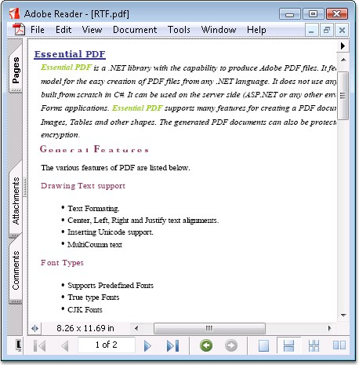

::: {style="DISPLAY: none"}
{#d2h_url_template}{#d2h_package_url style="WIDTH: 0px; DISPLAY: none; HEIGHT: 0px"}
:::

::: {.d2h_secondary_topic style="PADDING-BOTTOM: 10pt; MARGIN: 0pt; PADDING-LEFT: 0pt; PADDING-RIGHT: 0pt; PADDING-TOP: 0pt"}
##### Draw Rich text {#draw-rich-text style="tab-stops: 0pt"}

 

RTF (Rich Text Format) is a standard specification for the formatting of documents. They are ASCII files with special commands to indicate formatting information such as margins and fonts.

 

Essential PDF supports drawing an RTF text into a PDF document by converting it as a bitmap or metafile image.

 

[·      ]{style="FONT-FAMILY: Symbol"}Converting RTF text into a bitmap file, provides improved performance

[·      ]{style="FONT-FAMILY: Symbol"}Converting RTF text into a metafile image provides high resolution and searchable text.

 

The following code illustrates how to draw an RTF text into bitmap and metafile formats.

 

+--------------------------------------------------------------------------------------------------------------------------------------------------------------------------------------------------------------------------------------------------------------------+
| **[\[C#\]]{style="FONT-FAMILY: 'Courier New'; COLOR: black"}**                                                                                                                                                                                                     |
|                                                                                                                                                                                                                                                                    |
| []{style="FONT-FAMILY: 'Courier New'; COLOR: black"}                                                                                                                                                                                                               |
|                                                                                                                                                                                                                                                                    |
| [//Draw RTF as metafile]{style="FONT-FAMILY: 'Courier New'; COLOR: green"}                                                                                                                                                                                         |
|                                                                                                                                                                                                                                                                    |
| [PdfMetafile]{style="FONT-FAMILY: 'Courier New'; COLOR: teal"}[ metafile = ( [PdfMetafile]{style="COLOR: teal"} )[PdfImage]{style="COLOR: teal"}.FromRtf( text, bounds.Width, [PdfImageType]{style="COLOR: teal"}.Metafile );]{style="FONT-FAMILY: 'Courier New'"} |
|                                                                                                                                                                                                                                                                    |
| [PdfMetafileLayoutFormat]{style="FONT-FAMILY: 'Courier New'; COLOR: teal"}[ format = [new]{style="COLOR: blue"} [PdfMetafileLayoutFormat]{style="COLOR: teal"}();]{style="FONT-FAMILY: 'Courier New'"}                                                             |
|                                                                                                                                                                                                                                                                    |
| []{style="FONT-FAMILY: 'Courier New'"}                                                                                                                                                                                                                             |
|                                                                                                                                                                                                                                                                    |
| [//Allow pagination without any breaks at page breaks.]{style="FONT-FAMILY: 'Courier New'; COLOR: green"}                                                                                                                                                          |
|                                                                                                                                                                                                                                                                    |
| [format.SplitTextLines = [false]{style="COLOR: blue"};]{style="FONT-FAMILY: 'Courier New'"}                                                                                                                                                                        |
|                                                                                                                                                                                                                                                                    |
| []{style="FONT-FAMILY: 'Courier New'"}                                                                                                                                                                                                                             |
|                                                                                                                                                                                                                                                                    |
| [//Draw the image.]{style="FONT-FAMILY: 'Courier New'; COLOR: green"}                                                                                                                                                                                              |
|                                                                                                                                                                                                                                                                    |
| [metafile.Draw( page, 0, 0, format );]{style="FONT-FAMILY: 'Courier New'"}                                                                                                                                                                                         |
|                                                                                                                                                                                                                                                                    |
| []{style="FONT-FAMILY: 'Courier New'"}                                                                                                                                                                                                                             |
|                                                                                                                                                                                                                                                                    |
| [//Draw RTF as Bitmap]{style="FONT-FAMILY: 'Courier New'; COLOR: green"}                                                                                                                                                                                           |
|                                                                                                                                                                                                                                                                    |
| [bitmap = [PdfImage]{style="COLOR: teal"}.FromRtf( text, bounds.Width, [PdfImageType]{style="COLOR: teal"}.Bitmap);]{style="FONT-FAMILY: 'Courier New'"}                                                                                                           |
|                                                                                                                                                                                                                                                                    |
| [bitmap.Draw(page, 0, 0, format)]{style="FONT-FAMILY: 'Courier New'"}                                                                                                                                                                                              |
+--------------------------------------------------------------------------------------------------------------------------------------------------------------------------------------------------------------------------------------------------------------------+

[]{style="FONT-FAMILY: 'Trebuchet MS','sans-serif'; COLOR: #15428b; FONT-SIZE: 9pt"} 

+------------------------------------------------------------------------------------------------------------------------------------------------------------------------------------------------------------------------------------------------------+
| **[\[]{style="FONT-FAMILY: 'Courier New'; COLOR: black"}[VB.NET[\]]{style="COLOR: black"}]{style="FONT-FAMILY: 'Courier New'"}**                                                                                                                     |
|                                                                                                                                                                                                                                                      |
| []{style="FONT-FAMILY: 'Courier New'; COLOR: black"}                                                                                                                                                                                                 |
|                                                                                                                                                                                                                                                      |
| [\'Convert it as metafile image.]{style="FONT-FAMILY: 'Courier New'; COLOR: green"}                                                                                                                                                                  |
|                                                                                                                                                                                                                                                      |
| [Dim]{style="FONT-FAMILY: 'Courier New'; COLOR: blue"}[ metafile [As]{style="COLOR: blue"} PdfMetafile = [CType]{style="COLOR: blue"}(PdfImage.FromRtf(text, bounds.Width, PdfImageType.Metafile), PdfMetafile)]{style="FONT-FAMILY: 'Courier New'"} |
|                                                                                                                                                                                                                                                      |
| [Dim]{style="FONT-FAMILY: 'Courier New'; COLOR: blue"}[ format [As]{style="COLOR: blue"} PdfMetafileLayoutFormat = [New]{style="COLOR: blue"} PdfMetafileLayoutFormat()]{style="FONT-FAMILY: 'Courier New'"}                                         |
|                                                                                                                                                                                                                                                      |
| []{style="FONT-FAMILY: 'Courier New'"}                                                                                                                                                                                                               |
|                                                                                                                                                                                                                                                      |
| [\'Allow the text to flow multiple pages without any breaks.]{style="FONT-FAMILY: 'Courier New'; COLOR: green"}                                                                                                                                      |
|                                                                                                                                                                                                                                                      |
| [format.SplitTextLines = [False]{style="COLOR: blue"}]{style="FONT-FAMILY: 'Courier New'"}                                                                                                                                                           |
|                                                                                                                                                                                                                                                      |
| []{style="FONT-FAMILY: 'Courier New'; COLOR: blue"}                                                                                                                                                                                                  |
|                                                                                                                                                                                                                                                      |
| [\'Draw the image.]{style="FONT-FAMILY: 'Courier New'; COLOR: green"}                                                                                                                                                                                |
|                                                                                                                                                                                                                                                      |
| [metafile.Draw(page, 0, 0, format)]{style="FONT-FAMILY: 'Courier New'"}                                                                                                                                                                              |
|                                                                                                                                                                                                                                                      |
| []{style="FONT-FAMILY: 'Courier New'"}                                                                                                                                                                                                               |
|                                                                                                                                                                                                                                                      |
| [\'Draw RTF as Bitmap]{style="FONT-FAMILY: 'Courier New'; COLOR: green"}                                                                                                                                                                             |
|                                                                                                                                                                                                                                                      |
| [Dim]{style="FONT-FAMILY: 'Courier New'; COLOR: blue"}[ bitmap [As]{style="COLOR: blue"} PdfImage = PdfImage.FromRtf(text, bounds.Width, PdfImageType.Bitmap)]{style="FONT-FAMILY: 'Courier New'"}                                                   |
|                                                                                                                                                                                                                                                      |
| [bitmap.Draw(page, 0, 0, format)]{style="FONT-FAMILY: 'Courier New'"}                                                                                                                                                                                |
+------------------------------------------------------------------------------------------------------------------------------------------------------------------------------------------------------------------------------------------------------+

[]{style="FONT-FAMILY: 'Trebuchet MS','sans-serif'; COLOR: #15428b; FONT-SIZE: 9pt"} 

{border="0"}

Figure 36: RTF Support

[]{#p71} 

 

[]{#related-topics}
:::
