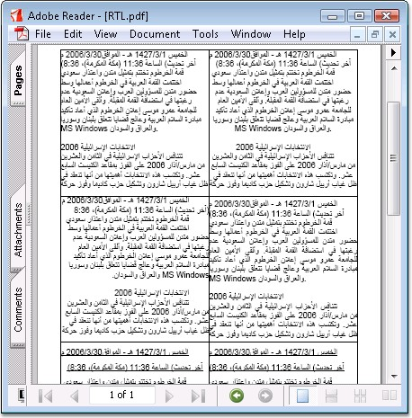

::: {style="DISPLAY: none"}
{#d2h_url_template}{#d2h_package_url style="WIDTH: 0px; DISPLAY: none; HEIGHT: 0px"}
:::

::: {.d2h_secondary_topic style="PADDING-BOTTOM: 10pt; MARGIN: 0pt; PADDING-LEFT: 0pt; PADDING-RIGHT: 0pt; PADDING-TOP: 0pt"}
##### Draw Right-To-Left Text {#draw-right-to-left-text style="tab-stops: 0pt"}

 

Essential PDF provides support for drawing RTL languages into the PDF document.

 

Middle eastern languages such as Hebrew and Arabic are written predominantly from right-to-left. Numbers are written with the most significant digit left-most, just as in European or other left-to-right text. Languages written in left-to-right scripts are often mixed; hence the complete document is bidirectional in nature; a mix of both right-to-left (RTL) and left-to-right (LTR) writing. Text written in the Hebrew and Arabic languages are often referred to as bidirectional or \"bidi\" in short.

 

+------------------------------------------------------------------------------------------------------------------------------------------------------------------------------------------------------------+
| **[\[C#\]]{style="FONT-FAMILY: 'Courier New'; COLOR: black"}**                                                                                                                                             |
|                                                                                                                                                                                                            |
| []{style="FONT-FAMILY: 'Courier New'; COLOR: black"}                                                                                                                                                       |
|                                                                                                                                                                                                            |
| [//Set the font with unicode option]{style="FONT-FAMILY: 'Courier New'; COLOR: green"}                                                                                                                     |
|                                                                                                                                                                                                            |
| [Font]{style="FONT-FAMILY: 'Courier New'; COLOR: teal"}[ f = [new]{style="COLOR: blue"} [Font]{style="COLOR: teal"}([\"Arial\"]{style="COLOR: maroon"}, 14);]{style="FONT-FAMILY: 'Courier New'"}          |
|                                                                                                                                                                                                            |
| [PdfFont]{style="FONT-FAMILY: 'Courier New'; COLOR: teal"}[ font = [new]{style="COLOR: blue"} [PdfTrueTypeFont]{style="COLOR: teal"}(f, [true]{style="COLOR: blue"});]{style="FONT-FAMILY: 'Courier New'"} |
|                                                                                                                                                                                                            |
| []{style="FONT-FAMILY: 'Courier New'"}                                                                                                                                                                     |
|                                                                                                                                                                                                            |
| [//Set the format for string]{style="FONT-FAMILY: 'Courier New'; COLOR: green"}                                                                                                                            |
|                                                                                                                                                                                                            |
| [PdfStringFormat]{style="FONT-FAMILY: 'Courier New'; COLOR: teal"}[ format = [new]{style="COLOR: blue"} [PdfStringFormat]{style="COLOR: teal"}();]{style="FONT-FAMILY: 'Courier New'"}                     |
|                                                                                                                                                                                                            |
| []{style="FONT-FAMILY: 'Courier New'"}                                                                                                                                                                     |
|                                                                                                                                                                                                            |
| [//Set the format as RTL type]{style="FONT-FAMILY: 'Courier New'; COLOR: green"}                                                                                                                           |
|                                                                                                                                                                                                            |
| [format.RightToLeft = [true]{style="COLOR: blue"};]{style="FONT-FAMILY: 'Courier New'"}                                                                                                                    |
|                                                                                                                                                                                                            |
| []{style="FONT-FAMILY: 'Courier New'"}                                                                                                                                                                     |
|                                                                                                                                                                                                            |
| [//Set the alignment]{style="FONT-FAMILY: 'Courier New'; COLOR: green"}                                                                                                                                    |
|                                                                                                                                                                                                            |
| [format.Alignment = [PdfTextAlignment]{style="COLOR: teal"}.Right;]{style="FONT-FAMILY: 'Courier New'"}                                                                                                    |
|                                                                                                                                                                                                            |
| []{style="FONT-FAMILY: 'Courier New'"}                                                                                                                                                                     |
|                                                                                                                                                                                                            |
| [//Draw the RTL text]{style="FONT-FAMILY: 'Courier New'; COLOR: green"}                                                                                                                                    |
|                                                                                                                                                                                                            |
| [page.Graphics.DrawString(text, font, brush, rect, format);]{style="FONT-FAMILY: 'Courier New'"}                                                                                                           |
+------------------------------------------------------------------------------------------------------------------------------------------------------------------------------------------------------------+

[]{style="FONT-FAMILY: 'Trebuchet MS','sans-serif'; COLOR: #15428b; FONT-SIZE: 9pt"} 

+------------------------------------------------------------------------------------------------------------------------------------------------------------------------------------------------------------------+
| **[\[]{style="FONT-FAMILY: 'Courier New'; COLOR: black"}[VB.NET[\]]{style="COLOR: black"}]{style="FONT-FAMILY: 'Courier New'"}**                                                                                 |
|                                                                                                                                                                                                                  |
| []{style="FONT-FAMILY: 'Courier New'; COLOR: black"}                                                                                                                                                             |
|                                                                                                                                                                                                                  |
| [\'Set the font with unicode option]{style="FONT-FAMILY: 'Courier New'; COLOR: green"}                                                                                                                           |
|                                                                                                                                                                                                                  |
| [Dim]{style="FONT-FAMILY: 'Courier New'; COLOR: blue"}[ f [As]{style="COLOR: blue"} Font = [New]{style="COLOR: blue"} Font([\"Arial\"]{style="COLOR: maroon"}, 14)]{style="FONT-FAMILY: 'Courier New'"}          |
|                                                                                                                                                                                                                  |
| [Dim]{style="FONT-FAMILY: 'Courier New'; COLOR: blue"}[ font [As]{style="COLOR: blue"} PdfFont = [New]{style="COLOR: blue"} PdfTrueTypeFont(f, [True]{style="COLOR: blue"})]{style="FONT-FAMILY: 'Courier New'"} |
|                                                                                                                                                                                                                  |
| []{style="FONT-FAMILY: 'Courier New'"}                                                                                                                                                                           |
|                                                                                                                                                                                                                  |
| [\'Set the format for string]{style="FONT-FAMILY: 'Courier New'; COLOR: green"}                                                                                                                                  |
|                                                                                                                                                                                                                  |
| [Dim]{style="FONT-FAMILY: 'Courier New'; COLOR: blue"}[ format [As]{style="COLOR: blue"} PdfStringFormat = [New]{style="COLOR: blue"} PdfStringFormat()]{style="FONT-FAMILY: 'Courier New'"}                     |
|                                                                                                                                                                                                                  |
| []{style="FONT-FAMILY: 'Courier New'"}                                                                                                                                                                           |
|                                                                                                                                                                                                                  |
| [\'Set the format as RTL type]{style="FONT-FAMILY: 'Courier New'; COLOR: green"}                                                                                                                                 |
|                                                                                                                                                                                                                  |
| [format.RightToLeft = [True]{style="COLOR: blue"}]{style="FONT-FAMILY: 'Courier New'"}                                                                                                                           |
|                                                                                                                                                                                                                  |
| []{style="FONT-FAMILY: 'Courier New'; COLOR: blue"}                                                                                                                                                              |
|                                                                                                                                                                                                                  |
| [\'Set the alignment]{style="FONT-FAMILY: 'Courier New'; COLOR: green"}                                                                                                                                          |
|                                                                                                                                                                                                                  |
| [format.Alignment = PdfTextAlignment.Right]{style="FONT-FAMILY: 'Courier New'"}                                                                                                                                  |
|                                                                                                                                                                                                                  |
| []{style="FONT-FAMILY: 'Courier New'"}                                                                                                                                                                           |
|                                                                                                                                                                                                                  |
| [\'Draw the RTL text]{style="FONT-FAMILY: 'Courier New'; COLOR: green"}                                                                                                                                          |
|                                                                                                                                                                                                                  |
| [page.Graphics.DrawString(text, font, brush, rect, format)]{style="FONT-FAMILY: 'Courier New'"}                                                                                                                  |
+------------------------------------------------------------------------------------------------------------------------------------------------------------------------------------------------------------------+

[]{style="FONT-FAMILY: 'Trebuchet MS','sans-serif'; COLOR: #15428b; FONT-SIZE: 9pt"} 

{border="0"}

Figure 37: PDF with RTL Support

 

 

[]{#related-topics}
:::
