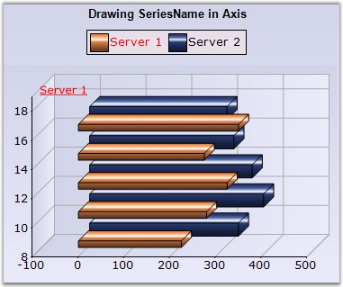

::: {style="DISPLAY: none"}
{#d2h_url_template}{#d2h_package_url style="WIDTH: 0px; DISPLAY: none; HEIGHT: 0px"}
:::

:::: {.d2h_secondary_topic style="PADDING-BOTTOM: 10pt; MARGIN: 0pt; PADDING-LEFT: 0pt; PADDING-RIGHT: 0pt; PADDING-TOP: 0pt"}
#### DrawSeriesNameInDepth {#drawseriesnameindepth style="tab-stops: 0pt"}

**[]{style="FONT-FAMILY: 'Trebuchet MS','sans-serif'"}** 

This indicates whether to draw series name at opposed position to origin, along x-axis.

[]{style="FONT-FAMILY: 'Trebuchet MS','sans-serif'; FONT-SIZE: 9pt"} 

::: {align="center"}
+---------------------------------------+---------------------------------------+
| **[]{style="FONT-FAMILY: 'Trebuchet MS','sans-serif'; FONT-SIZE: 9pt"}**      |
|                                                                               |
| Details                                                                       |
+---------------------------------------+---------------------------------------+
| Possible Values                       | True or False                         |
+---------------------------------------+---------------------------------------+
| Default Value                         | False                                 |
+---------------------------------------+---------------------------------------+
| 2D / 3D Limitations                   | 3D Only                               |
+---------------------------------------+---------------------------------------+
| Applies to Chart Element              | All series                            |
+---------------------------------------+---------------------------------------+
| Applies to Chart Types                | All chart types                       |
+---------------------------------------+---------------------------------------+
:::

**[]{style="FONT-FAMILY: 'Trebuchet MS','sans-serif'; FONT-SIZE: 9pt"}** 

Here is some sample code.

[]{style="FONT-FAMILY: 'Trebuchet MS','sans-serif'; FONT-SIZE: 9pt"} 

+------------------------------------------------------------------------------------------------------------------------------------------------------------------------------------------------+
| **[\[C#\]]{style="FONT-FAMILY: 'Courier New'; COLOR: black"}**                                                                                                                                 |
|                                                                                                                                                                                                |
| **[]{style="FONT-FAMILY: 'Courier New'; COLOR: black"}**                                                                                                                                       |
|                                                                                                                                                                                                |
| [// Specified 3D View]{style="FONT-FAMILY: 'Courier New'; COLOR: green"}                                                                                                                       |
|                                                                                                                                                                                                |
| [this]{style="FONT-FAMILY: 'Courier New'; COLOR: blue"}[.ChartWebControl1.Series3D = [true]{style="COLOR: blue"};]{style="FONT-FAMILY: 'Courier New'"}                                         |
|                                                                                                                                                                                                |
| [// Setting Text Format]{style="FONT-FAMILY: 'Courier New'; COLOR: green"}                                                                                                                     |
|                                                                                                                                                                                                |
| [this]{style="FONT-FAMILY: 'Courier New'; COLOR: blue"}[.ChartWebControl1.Series\[0\].Style.Font.FontStyle = [FontStyle]{style="COLOR: teal"}.Underline;]{style="FONT-FAMILY: 'Courier New'"}  |
|                                                                                                                                                                                                |
| [this]{style="FONT-FAMILY: 'Courier New'; COLOR: blue"}[.ChartWebControl1.Series\[0\].Style.TextColor = [Color]{style="COLOR: teal"}.Black;]{style="FONT-FAMILY: 'Courier New'"}               |
|                                                                                                                                                                                                |
| [this]{style="FONT-FAMILY: 'Courier New'; COLOR: blue"}[.ChartWebControl1.Series\[0\].Style.Font.Size = 7;]{style="FONT-FAMILY: 'Courier New'"}                                                |
|                                                                                                                                                                                                |
| [this]{style="FONT-FAMILY: 'Courier New'; COLOR: blue"}[.ChartWebControl1.Series\[0\].Style.Font.Facename = [\"Times New Roman\"]{style="COLOR: maroon"};]{style="FONT-FAMILY: 'Courier New'"} |
|                                                                                                                                                                                                |
| [// Set SeriesNameDepth as True]{style="FONT-FAMILY: 'Courier New'; COLOR: green"}                                                                                                             |
|                                                                                                                                                                                                |
| [this]{style="FONT-FAMILY: 'Courier New'; COLOR: blue"}[.ChartWebControl1.Series\[0\].DrawSeriesNameInDepth = [true]{style="COLOR: blue"};]{style="FONT-FAMILY: 'Courier New'"}                |
+------------------------------------------------------------------------------------------------------------------------------------------------------------------------------------------------+

[]{style="FONT-FAMILY: 'Trebuchet MS','sans-serif'; FONT-SIZE: 9pt"} 

+----------------------------------------------------------------------------------------------------------------------------------------------------------------------------------------------------+
| **[\[VB.NET\]]{style="FONT-FAMILY: 'Courier New'; COLOR: black"}**                                                                                                                                 |
|                                                                                                                                                                                                    |
| **[]{style="FONT-FAMILY: 'Courier New'; COLOR: black"}**                                                                                                                                           |
|                                                                                                                                                                                                    |
| [\' Specified 3D View]{style="FONT-FAMILY: 'Courier New'; COLOR: green"}                                                                                                                           |
|                                                                                                                                                                                                    |
| [Me]{style="FONT-FAMILY: 'Courier New'; COLOR: blue"}[.ChartWebControl1.Series3D = [True]{style="COLOR: blue"}]{style="FONT-FAMILY: 'Courier New'"}                                                |
|                                                                                                                                                                                                    |
| [\' Setting Text Format]{style="FONT-FAMILY: 'Courier New'; COLOR: green"}                                                                                                                         |
|                                                                                                                                                                                                    |
| [Me]{style="FONT-FAMILY: 'Courier New'; COLOR: blue"}[.ChartWebControl1.Series(0).Style.Font.FontStyle = [FontStyle]{style="COLOR: teal"}.Underline]{style="FONT-FAMILY: 'Courier New'"}           |
|                                                                                                                                                                                                    |
| [Me]{style="FONT-FAMILY: 'Courier New'; COLOR: blue"}[.ChartWebControl1.Series(0).Style.TextColor = [Color]{style="COLOR: teal"}[.]{style="COLOR: blue"}Black]{style="FONT-FAMILY: 'Courier New'"} |
|                                                                                                                                                                                                    |
| [Me]{style="FONT-FAMILY: 'Courier New'; COLOR: blue"}[.ChartWebControl1.Series(0).Style.Font.Size = 7]{style="FONT-FAMILY: 'Courier New'"}                                                         |
|                                                                                                                                                                                                    |
| [Me]{style="FONT-FAMILY: 'Courier New'; COLOR: blue"}[.ChartWebControl1.Series(0).Style.Font.Facename = [\"Times New Roman\"]{style="COLOR: maroon"}]{style="FONT-FAMILY: 'Courier New'"}          |
|                                                                                                                                                                                                    |
| [\' Set SeriesNameDepth as True]{style="FONT-FAMILY: 'Courier New'; COLOR: green"}                                                                                                                 |
|                                                                                                                                                                                                    |
| [Me]{style="FONT-FAMILY: 'Courier New'; COLOR: blue"}[.ChartWebControl1.Series(0).DrawSeriesNameInDepth = [True]{style="COLOR: blue"}]{style="FONT-FAMILY: 'Courier New'"}                         |
+----------------------------------------------------------------------------------------------------------------------------------------------------------------------------------------------------+

**[]{style="FONT-FAMILY: 'Trebuchet MS','sans-serif'; FONT-SIZE: 9pt"}** 

{border="0"}

**[]{style="FONT-FAMILY: 'Trebuchet MS','sans-serif'; FONT-SIZE: 9pt"}** 

Figure 116: DrawSeriesNameInDepth in BarChart

**[]{style="FONT-FAMILY: 'Courier New'; COLOR: black; FONT-SIZE: 9pt"}** 

See Also

[]{style="FONT-FAMILY: 'Trebuchet MS','sans-serif'; FONT-SIZE: 9pt"} 

[Chart Types]{.UGHyperlink}[]{.UGHyperlink}

[]{#p95} 

[]{#related-topics}
::::
