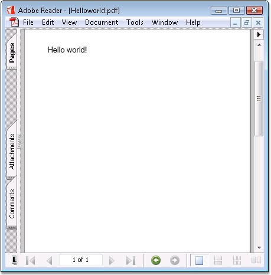

::: {style="DISPLAY: none"}
{#d2h_url_template}{#d2h_package_url style="WIDTH: 0px; DISPLAY: none; HEIGHT: 0px"}
:::

::: {.d2h_secondary_topic style="PADDING-BOTTOM: 10pt; MARGIN: 0pt; PADDING-LEFT: 0pt; PADDING-RIGHT: 0pt; PADDING-TOP: 0pt"}
##### Draw Simple text {#draw-simple-text style="tab-stops: 0pt"}

 

Drawing Text in a PDF document is made simpler and similar to .NET GDI. This section demonstrates how a string is drawn in a PDF page by using Essential PDF.

 

The process is very similar to drawing any other object on the PDF page. The string is drawn by using the **DrawString** method of the **Graphics** class. You also need to specify the font and brush with which you want the string to be drawn.

 

+--------------------------------------------------------------------------------------------------------------------------------------------------------------------------------------------------------------------------------------+
| **[\[C#\]]{style="FONT-FAMILY: 'Courier New'; COLOR: black"}**                                                                                                                                                                       |
|                                                                                                                                                                                                                                      |
| []{style="FONT-FAMILY: 'Courier New'; COLOR: black"}                                                                                                                                                                                 |
|                                                                                                                                                                                                                                      |
| [//Creates a new PDF document.]{style="FONT-FAMILY: 'Courier New'; COLOR: green"}                                                                                                                                                    |
|                                                                                                                                                                                                                                      |
| [PdfDocument doc = [new]{style="COLOR: blue"} PdfDocument();]{style="FONT-FAMILY: 'Courier New'"}                                                                                                                                    |
|                                                                                                                                                                                                                                      |
| []{style="FONT-FAMILY: 'Courier New'"}                                                                                                                                                                                               |
|                                                                                                                                                                                                                                      |
| [//Adds a page to the document.]{style="FONT-FAMILY: 'Courier New'; COLOR: green"}                                                                                                                                                   |
|                                                                                                                                                                                                                                      |
| [PdfPage page = doc.Pages.Add();]{style="FONT-FAMILY: 'Courier New'"}                                                                                                                                                                |
|                                                                                                                                                                                                                                      |
| []{style="FONT-FAMILY: 'Courier New'"}                                                                                                                                                                                               |
|                                                                                                                                                                                                                                      |
| [//Creates Pdf graphics for the page]{style="FONT-FAMILY: 'Courier New'; COLOR: green"}                                                                                                                                              |
|                                                                                                                                                                                                                                      |
| [PdfGraphics]{style="FONT-FAMILY: 'Courier New'; COLOR: teal"}[ g = page.Graphics;]{style="FONT-FAMILY: 'Courier New'"}                                                                                                              |
|                                                                                                                                                                                                                                      |
| []{style="FONT-FAMILY: 'Courier New'"}                                                                                                                                                                                               |
|                                                                                                                                                                                                                                      |
| [//Creates a solid brush.]{style="FONT-FAMILY: 'Courier New'; COLOR: green"}                                                                                                                                                         |
|                                                                                                                                                                                                                                      |
| [PdfBrush]{style="FONT-FAMILY: 'Courier New'; COLOR: teal"}[ brush = [new]{style="COLOR: blue"} [PdfSolidBrush]{style="COLOR: teal"}([Color]{style="COLOR: teal"}.Black);]{style="FONT-FAMILY: 'Courier New'"}                       |
|                                                                                                                                                                                                                                      |
| []{style="FONT-FAMILY: 'Courier New'"}                                                                                                                                                                                               |
|                                                                                                                                                                                                                                      |
| [//Sets the font.]{style="FONT-FAMILY: 'Courier New'; COLOR: green"}                                                                                                                                                                 |
|                                                                                                                                                                                                                                      |
| [PdfFont]{style="FONT-FAMILY: 'Courier New'; COLOR: teal"}[ font = [new]{style="COLOR: blue"} [PdfStandardFont]{style="COLOR: teal"}([PdfFontFamily]{style="COLOR: teal"}.Helvetica, fontSize);]{style="FONT-FAMILY: 'Courier New'"} |
|                                                                                                                                                                                                                                      |
| []{style="FONT-FAMILY: 'Courier New'"}                                                                                                                                                                                               |
|                                                                                                                                                                                                                                      |
| [//Draws the text.]{style="FONT-FAMILY: 'Courier New'; COLOR: green"}                                                                                                                                                                |
|                                                                                                                                                                                                                                      |
| [g.DrawString([\"Hello world!\"]{style="COLOR: maroon"}, font, brush, [new]{style="COLOR: blue"} [PointF]{style="COLOR: teal"}(20, 20));]{style="FONT-FAMILY: 'Courier New'"}                                                        |
|                                                                                                                                                                                                                                      |
| []{style="FONT-FAMILY: 'Courier New'"}                                                                                                                                                                                               |
|                                                                                                                                                                                                                                      |
| [//Saves the document.]{style="FONT-FAMILY: 'Courier New'; COLOR: green"}                                                                                                                                                            |
|                                                                                                                                                                                                                                      |
| [doc.Save([\"Sample.pdf\"]{style="COLOR: maroon"});]{style="FONT-FAMILY: 'Courier New'"}                                                                                                                                             |
+--------------------------------------------------------------------------------------------------------------------------------------------------------------------------------------------------------------------------------------+

[]{style="FONT-FAMILY: 'Trebuchet MS','sans-serif'; COLOR: #15428b; FONT-SIZE: 9pt"} 

+---------------------------------------------------------------------------------------------------------------------------------------------------------------------------------------------------------------------+
| **[\[]{style="FONT-FAMILY: 'Courier New'; COLOR: black"}[VB.NET[\]]{style="COLOR: black"}]{style="FONT-FAMILY: 'Courier New'"}**                                                                                    |
|                                                                                                                                                                                                                     |
| []{style="FONT-FAMILY: 'Courier New'; COLOR: black"}                                                                                                                                                                |
|                                                                                                                                                                                                                     |
| [\'Creates a new PDF document.]{style="FONT-FAMILY: 'Courier New'; COLOR: green"}                                                                                                                                   |
|                                                                                                                                                                                                                     |
| [Dim]{style="FONT-FAMILY: 'Courier New'; COLOR: blue"}[ doc [As]{style="COLOR: blue"} PdfDocument = [New]{style="COLOR: blue"} PdfDocument()]{style="FONT-FAMILY: 'Courier New'"}                                   |
|                                                                                                                                                                                                                     |
| []{style="FONT-FAMILY: 'Courier New'"}                                                                                                                                                                              |
|                                                                                                                                                                                                                     |
| [\'Adds a page to the document.]{style="FONT-FAMILY: 'Courier New'; COLOR: green"}                                                                                                                                  |
|                                                                                                                                                                                                                     |
| [Dim]{style="FONT-FAMILY: 'Courier New'; COLOR: blue"}[ page [As]{style="COLOR: blue"} PdfPage = doc.Pages.Add()]{style="FONT-FAMILY: 'Courier New'"}                                                               |
|                                                                                                                                                                                                                     |
| []{style="FONT-FAMILY: 'Courier New'"}                                                                                                                                                                              |
|                                                                                                                                                                                                                     |
| [\'Creates Pdf graphics for the page]{style="FONT-FAMILY: 'Courier New'; COLOR: green"}                                                                                                                             |
|                                                                                                                                                                                                                     |
| [Dim]{style="FONT-FAMILY: 'Courier New'; COLOR: blue"}[ g [As]{style="COLOR: blue"} PdfGraphics = page.Graphics]{style="FONT-FAMILY: 'Courier New'"}                                                                |
|                                                                                                                                                                                                                     |
| []{style="FONT-FAMILY: 'Courier New'"}                                                                                                                                                                              |
|                                                                                                                                                                                                                     |
| [\'Creates a solid brush]{style="FONT-FAMILY: 'Courier New'; COLOR: green"}                                                                                                                                         |
|                                                                                                                                                                                                                     |
| [Dim]{style="FONT-FAMILY: 'Courier New'; COLOR: blue"}[ brush [As]{style="COLOR: blue"} PdfBrush = [New]{style="COLOR: blue"} PdfSolidBrush(Color.Black)]{style="FONT-FAMILY: 'Courier New'"}                       |
|                                                                                                                                                                                                                     |
| []{style="FONT-FAMILY: 'Courier New'"}                                                                                                                                                                              |
|                                                                                                                                                                                                                     |
| [\'Sets the font]{style="FONT-FAMILY: 'Courier New'; COLOR: green"}                                                                                                                                                 |
|                                                                                                                                                                                                                     |
| [Dim]{style="FONT-FAMILY: 'Courier New'; COLOR: blue"}[ font [As]{style="COLOR: blue"} PdfFont = [New]{style="COLOR: blue"} PdfStandardFont(PdfFontFamily.Helvetica, fontSize)]{style="FONT-FAMILY: 'Courier New'"} |
|                                                                                                                                                                                                                     |
| []{style="FONT-FAMILY: 'Courier New'"}                                                                                                                                                                              |
|                                                                                                                                                                                                                     |
| [\'Draws the text]{style="FONT-FAMILY: 'Courier New'; COLOR: green"}                                                                                                                                                |
|                                                                                                                                                                                                                     |
| [g.DrawString([\"Hello world!\"]{style="COLOR: maroon"}, font, brush,[new]{style="COLOR: blue"} PointF(20,20))]{style="FONT-FAMILY: 'Courier New'"}                                                                 |
|                                                                                                                                                                                                                     |
| []{style="FONT-FAMILY: 'Courier New'"}                                                                                                                                                                              |
|                                                                                                                                                                                                                     |
| [\'Saves the document.]{style="FONT-FAMILY: 'Courier New'; COLOR: green"}                                                                                                                                           |
|                                                                                                                                                                                                                     |
| [doc.Save([\"Sample.pdf\"]{style="COLOR: maroon"})]{style="FONT-FAMILY: 'Courier New'"}                                                                                                                             |
+---------------------------------------------------------------------------------------------------------------------------------------------------------------------------------------------------------------------+

[]{style="FONT-FAMILY: 'Trebuchet MS','sans-serif'; COLOR: #15428b; FONT-SIZE: 9pt"} 

{border="0"}

Figure 34: Simple Text

 

 

 

[]{#related-topics}
:::
