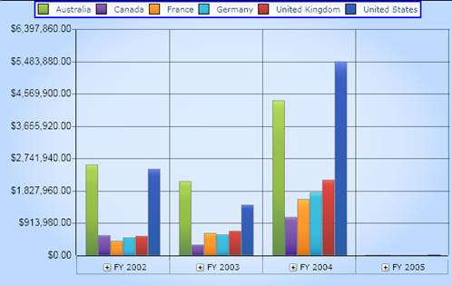
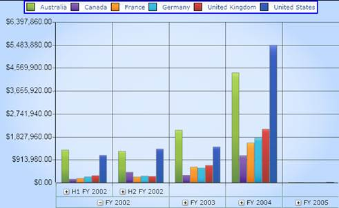

::: {style="DISPLAY: none"}
{#d2h_url_template}{#d2h_package_url style="WIDTH: 0px; DISPLAY: none; HEIGHT: 0px"}
:::

::::: {#nsbanner .d2h_main_nsbanner style="BORDER-BOTTOM: #999999 1px solid; POSITION: relative; PADDING-BOTTOM: 0px; BACKGROUND-COLOR: transparent; PADDING-LEFT: 0px; PADDING-RIGHT: 0px; DISPLAY: none; BORDER-TOP: #999999 1px solid; PADDING-TOP: 0px; LEFT: 0px"}
:::: {#TitleRow .d2h_main_titlerow style="PADDING-BOTTOM: 4px; BACKGROUND-COLOR: transparent; PADDING-LEFT: 22px; WIDTH: 100%; PADDING-RIGHT: 10px; DISPLAY: none; PADDING-TOP: 4px"}
::: {#ienav .d2h_main_ienav style="DISPLAY: none"}
{#D2HPrevious .D2HPreviousEnabled}  {#D2HNext .D2HNextEnabled}
:::
::::
:::::

:::: {#nstext .d2h_main_nstext style="PADDING-BOTTOM: 10px; BACKGROUND-COLOR: transparent; PADDING-LEFT: 22px; PADDING-RIGHT: 10px; HEIGHT: 100%; OVERFLOW: auto; PADDING-TOP: 5px" hasuserbackground="true" valign="bottom"}
::: {#d2h_breadcrumbs .d2h_breadcrumbs}
[Essential Studio User Guide Documentation](ms-xhelp:///?Id=12457748-09e3-4d74-a240-8e049cedf030){.d2h_breadcrumbsNormal}[ \> ]{.d2h_breadcrumbsLinkSeparator}[Business Intelligence Edition](ms-xhelp:///?Id=fdf33dd8-62b2-47b9-ad7b-fc50e590bca5){.d2h_breadcrumbsNormal}[ \> ]{.d2h_breadcrumbsLinkSeparator}[Essential BI Silverlight](ms-xhelp:///?Id=c006b39c-6aa2-4637-b7de-3e7b6cb3f9f9){.d2h_breadcrumbsNormal}[ \> ]{.d2h_breadcrumbsLinkSeparator}[Essential BI Chart]{.d2h_breadcrumbsContentsOnly}[ \> ]{.d2h_breadcrumbsLinkSeparator}[Concepts and Features](ms-xhelp:///?Id=372b5b83-fed0-46d4-831c-b84fe8c18abb){.d2h_breadcrumbsNormal}
:::

## Drill Down Support {#drill-down-support style="tab-stops: 0pt"}

[]{style="FONT-FAMILY: 'Calibri','sans-serif'; COLOR: black"} 

OLAP Chart for Silverlight can load multilevel data that can be displayed in detail by using the drill-up or drill-down feature so data can be visualized in each level of a hierarchy.

The code snippet displayed below provides data to render a chart and is added at the time of page load.

 

The code snippet is displayed below:

[]{style="FONT-FAMILY: 'Trebuchet MS','sans-serif'; COLOR: #15428b; FONT-SIZE: 9pt"} 

+------------------------------------------------------------------------------------------------------------------------------------------------------------------------------------+
| **[\[C#\]]{style="FONT-FAMILY: 'Courier New'"}**                                                                                                                                   |
|                                                                                                                                                                                    |
| []{style="FONT-FAMILY: 'Courier New'"}                                                                                                                                             |
|                                                                                                                                                                                    |
| [OlapReport olapReport = [new]{style="COLOR: blue"} OlapReport();]{style="FONT-FAMILY: 'Courier New'"}                                                                             |
|                                                                                                                                                                                    |
| [olapReport.CurrentCubeName = [\"Adventure Works\"]{style="COLOR: #a31515"};]{style="FONT-FAMILY: 'Courier New'"}                                                                  |
|                                                                                                                                                                                    |
| []{style="FONT-FAMILY: 'Courier New'"}                                                                                                                                             |
|                                                                                                                                                                                    |
| [DimensionElement dimensionElementColumn = [new]{style="COLOR: blue"} DimensionElement();]{style="FONT-FAMILY: 'Courier New'"}                                                     |
|                                                                                                                                                                                    |
| [//Specifying the Name for the Dimension Element]{style="FONT-FAMILY: 'Courier New'; COLOR: green"}                                                                                |
|                                                                                                                                                                                    |
| [dimensionElementColumn.Name = [\"Customer\"]{style="COLOR: #a31515"};]{style="FONT-FAMILY: 'Courier New'"}                                                                        |
|                                                                                                                                                                                    |
| [dimensionElementColumn.AddLevel(\"Customer Geography\", \"Country\");]{style="FONT-FAMILY: 'Courier New'"}                                                                        |
|                                                                                                                                                                                    |
| []{style="FONT-FAMILY: 'Courier New'"}                                                                                                                                             |
|                                                                                                                                                                                    |
| [MeasureElements measureElementColumn = [new]{style="COLOR: blue"} MeasureElements();]{style="FONT-FAMILY: 'Courier New'"}                                                         |
|                                                                                                                                                                                    |
| [measureElementColumn.Elements.Add([new]{style="COLOR: blue"} MeasureElement { Name = [\"Internet Sales Amount\"]{style="COLOR: #a31515"} });]{style="FONT-FAMILY: 'Courier New'"} |
|                                                                                                                                                                                    |
| []{style="FONT-FAMILY: 'Courier New'"}                                                                                                                                             |
|                                                                                                                                                                                    |
| [DimensionElement dimensionElementRow = [new]{style="COLOR: blue"} DimensionElement();]{style="FONT-FAMILY: 'Courier New'"}                                                        |
|                                                                                                                                                                                    |
| [//Specifying the Dimension Name]{style="FONT-FAMILY: 'Courier New'; COLOR: green"}                                                                                                |
|                                                                                                                                                                                    |
| [dimensionElementRow.Name = [\"Date\"]{style="COLOR: #a31515"};]{style="FONT-FAMILY: 'Courier New'"}                                                                               |
|                                                                                                                                                                                    |
| []{style="FONT-FAMILY: 'Courier New'"}                                                                                                                                             |
|                                                                                                                                                                                    |
| [//Adding the level Elemnet along with the Hierarchy Name]{style="FONT-FAMILY: 'Courier New'; COLOR: green"}                                                                       |
|                                                                                                                                                                                    |
| [dimensionElementRow.AddLevel([\"Fiscal\"]{style="COLOR: #a31515"}, [\"Fiscal Year\"]{style="COLOR: #a31515"});]{style="FONT-FAMILY: 'Courier New'"}                               |
|                                                                                                                                                                                    |
| []{style="FONT-FAMILY: 'Courier New'"}                                                                                                                                             |
|                                                                                                                                                                                    |
| [///]{style="FONT-FAMILY: 'Courier New'; COLOR: gray"}[Adding Measure Element]{style="FONT-FAMILY: 'Courier New'; COLOR: green"}                                                   |
|                                                                                                                                                                                    |
| [olapReport.CategoricalElements.Add(measureElementColumn);]{style="FONT-FAMILY: 'Courier New'"}                                                                                    |
|                                                                                                                                                                                    |
| [///]{style="FONT-FAMILY: 'Courier New'; COLOR: gray"}[Adding Column Members]{style="FONT-FAMILY: 'Courier New'; COLOR: green"}                                                    |
|                                                                                                                                                                                    |
| [olapReport.CategoricalElements.Add(dimensionElementColumn);]{style="FONT-FAMILY: 'Courier New'"}                                                                                  |
|                                                                                                                                                                                    |
| [///]{style="FONT-FAMILY: 'Courier New'; COLOR: gray"}[Adding Row Members]{style="FONT-FAMILY: 'Courier New'; COLOR: green"}                                                       |
|                                                                                                                                                                                    |
| [olapReport.SeriesElements.Add(dimensionElementRow);]{style="FONT-FAMILY: 'Courier New'"}                                                                                          |
|                                                                                                                                                                                    |
| []{style="FONT-FAMILY: 'Courier New'"}                                                                                                                                             |
|                                                                                                                                                                                    |
| [return]{style="FONT-FAMILY: 'Courier New'; COLOR: blue"}[ olapReport;]{style="FONT-FAMILY: 'Courier New'"}                                                                        |
+------------------------------------------------------------------------------------------------------------------------------------------------------------------------------------+

[]{style="FONT-FAMILY: 'Trebuchet MS','sans-serif'; COLOR: #15428b; FONT-SIZE: 9pt"} 

+----------------------------------------------------------------------------------------------------------------------------------------------------------------------------------------------------------------+
| **[\[VB\]]{style="FONT-FAMILY: 'Courier New'"}**                                                                                                                                                               |
|                                                                                                                                                                                                                |
| []{style="FONT-FAMILY: 'Courier New'"}                                                                                                                                                                         |
|                                                                                                                                                                                                                |
| [Dim]{style="FONT-FAMILY: 'Courier New'; COLOR: blue"}[ olapReport [As]{style="COLOR: blue"} OlapReport = [New]{style="COLOR: blue"} OlapReport()]{style="FONT-FAMILY: 'Courier New'"}                         |
|                                                                                                                                                                                                                |
| [olapReport.CurrentCubeName = \"Adventure Works\"]{style="FONT-FAMILY: 'Courier New'"}                                                                                                                         |
|                                                                                                                                                                                                                |
| []{style="FONT-FAMILY: 'Courier New'"}                                                                                                                                                                         |
|                                                                                                                                                                                                                |
| [Dim]{style="FONT-FAMILY: 'Courier New'; COLOR: blue"}[ dimensionElementColumn [As]{style="COLOR: blue"} DimensionElement = [New]{style="COLOR: blue"} DimensionElement()]{style="FONT-FAMILY: 'Courier New'"} |
|                                                                                                                                                                                                                |
| [\'Specifying the Name for the Dimension Element]{style="FONT-FAMILY: 'Courier New'; COLOR: green"}                                                                                                            |
|                                                                                                                                                                                                                |
| [dimensionElementColumn.Name = \"Customer\"]{style="FONT-FAMILY: 'Courier New'"}                                                                                                                               |
|                                                                                                                                                                                                                |
| [dimensionElementColumn.AddLevel(\"Customer Geography\", \"Country\")]{style="FONT-FAMILY: 'Courier New'"}                                                                                                     |
|                                                                                                                                                                                                                |
| []{style="FONT-FAMILY: 'Courier New'"}                                                                                                                                                                         |
|                                                                                                                                                                                                                |
| [Dim]{style="FONT-FAMILY: 'Courier New'; COLOR: blue"}[ measureElementColumn [As]{style="COLOR: blue"} MeasureElements = [New]{style="COLOR: blue"} MeasureElements()]{style="FONT-FAMILY: 'Courier New'"}     |
|                                                                                                                                                                                                                |
| [measureElementColumn.Elements.Add([New]{style="COLOR: blue"} MeasureElement [With]{style="COLOR: blue"} {.Name = \"Internet Sales Amount\"})]{style="FONT-FAMILY: 'Courier New'"}                             |
|                                                                                                                                                                                                                |
| []{style="FONT-FAMILY: 'Courier New'"}                                                                                                                                                                         |
|                                                                                                                                                                                                                |
| [Dim]{style="FONT-FAMILY: 'Courier New'; COLOR: blue"}[ dimensionElementRow [As]{style="COLOR: blue"} DimensionElement = [New]{style="COLOR: blue"} DimensionElement()]{style="FONT-FAMILY: 'Courier New'"}    |
|                                                                                                                                                                                                                |
| [\'Specifying the Dimension Name]{style="FONT-FAMILY: 'Courier New'; COLOR: green"}                                                                                                                            |
|                                                                                                                                                                                                                |
| [dimensionElementRow.Name = \"Date\"]{style="FONT-FAMILY: 'Courier New'"}                                                                                                                                      |
|                                                                                                                                                                                                                |
| []{style="FONT-FAMILY: 'Courier New'"}                                                                                                                                                                         |
|                                                                                                                                                                                                                |
| [\'Adding the level Element along with the Hierarchy Name]{style="FONT-FAMILY: 'Courier New'; COLOR: green"}                                                                                                   |
|                                                                                                                                                                                                                |
| [dimensionElementRow.AddLevel(\"Fiscal\", \"Fiscal Year\")]{style="FONT-FAMILY: 'Courier New'"}                                                                                                                |
|                                                                                                                                                                                                                |
| []{style="FONT-FAMILY: 'Courier New'"}                                                                                                                                                                         |
|                                                                                                                                                                                                                |
| [\'\'\'Adding Measure Element]{style="FONT-FAMILY: 'Courier New'; COLOR: green"}                                                                                                                               |
|                                                                                                                                                                                                                |
| [olapReport.CategoricalElements.Add(measureElementColumn)]{style="FONT-FAMILY: 'Courier New'"}                                                                                                                 |
|                                                                                                                                                                                                                |
| [\'\'\'Adding Column Members]{style="FONT-FAMILY: 'Courier New'; COLOR: green"}                                                                                                                                |
|                                                                                                                                                                                                                |
| [olapReport.CategoricalElements.Add(dimensionElementColumn)]{style="FONT-FAMILY: 'Courier New'"}                                                                                                               |
|                                                                                                                                                                                                                |
| [\'\'\'Adding Row Members]{style="FONT-FAMILY: 'Courier New'; COLOR: green"}                                                                                                                                   |
|                                                                                                                                                                                                                |
| [olapReport.SeriesElements.Add(dimensionElementRow)]{style="FONT-FAMILY: 'Courier New'"}                                                                                                                       |
|                                                                                                                                                                                                                |
| []{style="FONT-FAMILY: 'Courier New'"}                                                                                                                                                                         |
|                                                                                                                                                                                                                |
| [Return]{style="FONT-FAMILY: 'Courier New'; COLOR: blue"}[ olapReport]{style="FONT-FAMILY: 'Courier New'"}                                                                                                     |
+----------------------------------------------------------------------------------------------------------------------------------------------------------------------------------------------------------------+

[]{style="FONT-FAMILY: 'Trebuchet MS','sans-serif'; COLOR: #15428b; FONT-SIZE: 9pt"} 

The following screenshots show the column charts with the above settings:

 

a)   Before drill down.

 

[]{style="FONT-FAMILY: 'Calibri','sans-serif'; COLOR: black"} 

{border="0"}

 

Figure 38: Before Drill Down

 

b)   After drill down

[]{style="FONT-FAMILY: 'Calibri','sans-serif'; COLOR: black"} 

{border="0"}

 

Figure 39: After Drill Down

***[]{style="FONT-FAMILY: 'Calibri','sans-serif'; COLOR: black"}*** 

Sample Location

A sample demo is available at the following location:

[]{style="FONT-FAMILY: 'Trebuchet MS','sans-serif'; COLOR: #15428b; FONT-SIZE: 9pt"} 

..\\Syncfusion\\\<Version Number\>\\BI\\Silverlight\\Syncfusion.OlapChart.Silverlight.Samples\\Syncfusion.OlapChart.Silverlight.Samples\\Samples\\Creating Reports

 

[]{#related-topics}
::::
