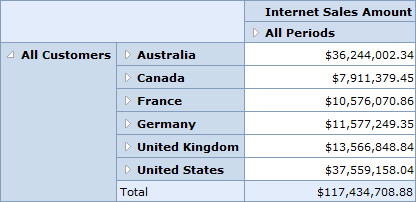

::: {style="DISPLAY: none"}
{#d2h_url_template}{#d2h_package_url style="WIDTH: 0px; DISPLAY: none; HEIGHT: 0px"}
:::

::::: {#nsbanner .d2h_main_nsbanner style="BORDER-BOTTOM: #999999 1px solid; POSITION: relative; PADDING-BOTTOM: 0px; BACKGROUND-COLOR: transparent; PADDING-LEFT: 0px; PADDING-RIGHT: 0px; DISPLAY: none; BORDER-TOP: #999999 1px solid; PADDING-TOP: 0px; LEFT: 0px"}
:::: {#TitleRow .d2h_main_titlerow style="PADDING-BOTTOM: 4px; BACKGROUND-COLOR: transparent; PADDING-LEFT: 22px; WIDTH: 100%; PADDING-RIGHT: 10px; DISPLAY: none; PADDING-TOP: 4px"}
::: {#ienav .d2h_main_ienav style="DISPLAY: none"}
{#D2HPrevious .D2HPreviousEnabled}  {#D2HNext .D2HNextEnabled}
:::
::::
:::::

:::: {#nstext .d2h_main_nstext style="PADDING-BOTTOM: 10px; BACKGROUND-COLOR: transparent; PADDING-LEFT: 22px; PADDING-RIGHT: 10px; HEIGHT: 100%; OVERFLOW: auto; PADDING-TOP: 5px" hasuserbackground="true" valign="bottom"}
### Drill from All Level {#drill-from-all-level style="tab-stops: 0pt"}

This feature enables you to display the "All" level type member across the rows and columns in the OlapGrid. This member behaves as a parent to other members in its hierarchy by controlling their visibility through an expander.

 

Properties

Table 12: Property Table

::: {align="center"}
  ------------------ ------------------------------------------------------------------------ ------------- -----------
  Property           Description                                                              Type          Data Type
  ShowLevelTypeAll   Specifies whether members with level type as All has to be displayed.    Server side   Boolean
  ------------------ ------------------------------------------------------------------------ ------------- -----------
:::

[]{style="FONT-FAMILY: 'Calibri','sans-serif'; COLOR: black"} 

Displaying \"All\" Level Type Member

To display the "All" level type member, set the **ShowLevelTypeAll** property to **true**. By default this is set to **false**.

 

+-----------------------------------------------------------------------------------------------------------------------------------------------------------------------------------------------------------------------------------------------------+
| **[\[C#\]]{style="FONT-FAMILY: 'Courier New'"}**                                                                                                                                                                                                    |
|                                                                                                                                                                                                                                                     |
| [OlapDataManager]{style="FONT-FAMILY: 'Courier New'; COLOR: #2b91af"}[ DataManager = [new]{style="COLOR: blue"} [OlapDataManager]{style="COLOR: #2b91af"}() { ShowLevelTypeAll = [true]{style="COLOR: blue"}};]{style="FONT-FAMILY: 'Courier New'"} |
+-----------------------------------------------------------------------------------------------------------------------------------------------------------------------------------------------------------------------------------------------------+

 

+-----------------------------------------------------------------------------------------------------------------------------------------------------------------------------------------------------------------------------------------------------+
| **[\[VB\]]{style="FONT-FAMILY: 'Courier New'"}**                                                                                                                                                                                                    |
|                                                                                                                                                                                                                                                     |
| [OlapDataManager]{style="FONT-FAMILY: 'Courier New'; COLOR: #2b91af"}[ DataManager = [New]{style="COLOR: blue"} [OlapDataManager]{style="COLOR: #2b91af"}() { ShowLevelTypeAll = [True]{style="COLOR: blue"} }]{style="FONT-FAMILY: 'Courier New'"} |
+-----------------------------------------------------------------------------------------------------------------------------------------------------------------------------------------------------------------------------------------------------+

 

{border="0"}

Figure 20: Member with "All" Level Type Displayed

 

Sample Link

A demo of this feature is available in the following location:

**Windows XP:**

*..\\Syncfusion\\EssentialStudio\\\<Versionnumber\>\\BI\\Web\\OlapGrid.Web\\Samples\\3.5\\Defining Reports\\Reports In Code*

**Windows 7/Vista:**

*C:\\Users\\\<UserName\>\\AppData\\Local\\Syncfusion\\EssentialStudio\\x.x.x.x\\BI\\Web\\OlapGrid.Web\\Samples\\3.5\\Defining Reports\\Reports In Code[]{style="COLOR: #c00000"}*

**[]{style="COLOR: #e36c0a"}** 

[]{#related-topics}
::::
