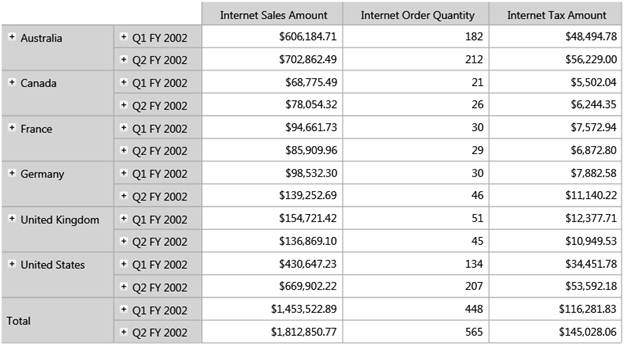

::: {style="DISPLAY: none"}
{#d2h_url_template}{#d2h_package_url style="WIDTH: 0px; DISPLAY: none; HEIGHT: 0px"}
:::

::::: {#nsbanner .d2h_main_nsbanner style="BORDER-BOTTOM: #999999 1px solid; POSITION: relative; PADDING-BOTTOM: 0px; BACKGROUND-COLOR: transparent; PADDING-LEFT: 0px; PADDING-RIGHT: 0px; DISPLAY: none; BORDER-TOP: #999999 1px solid; PADDING-TOP: 0px; LEFT: 0px"}
:::: {#TitleRow .d2h_main_titlerow style="PADDING-BOTTOM: 4px; BACKGROUND-COLOR: transparent; PADDING-LEFT: 22px; WIDTH: 100%; PADDING-RIGHT: 10px; DISPLAY: none; PADDING-TOP: 4px"}
::: {#ienav .d2h_main_ienav style="DISPLAY: none"}
{#D2HPrevious .D2HPreviousEnabled}  {#D2HNext .D2HNextEnabled}
:::
::::
:::::

:::::::: {#nstext .d2h_main_nstext style="PADDING-BOTTOM: 10px; BACKGROUND-COLOR: transparent; PADDING-LEFT: 22px; PADDING-RIGHT: 10px; HEIGHT: 100%; OVERFLOW: auto; PADDING-TOP: 5px" hasuserbackground="true" valign="bottom"}
::: {#d2h_breadcrumbs .d2h_breadcrumbs}
[Essential Studio User Guide Documentation](ms-xhelp:///?Id=12457748-09e3-4d74-a240-8e049cedf030){.d2h_breadcrumbsNormal}[ \> ]{.d2h_breadcrumbsLinkSeparator}[Business Intelligence Edition](ms-xhelp:///?Id=fdf33dd8-62b2-47b9-ad7b-fc50e590bca5){.d2h_breadcrumbsNormal}[ \> ]{.d2h_breadcrumbsLinkSeparator}[Essential BI Silverlight](ms-xhelp:///?Id=c006b39c-6aa2-4637-b7de-3e7b6cb3f9f9){.d2h_breadcrumbsNormal}[ \> ]{.d2h_breadcrumbsLinkSeparator}[Essential BI Grid]{.d2h_breadcrumbsContentsOnly}[ \> ]{.d2h_breadcrumbsLinkSeparator}[Concepts and Features](ms-xhelp:///?Id=6e49680f-da51-4b1f-9043-47e40b9c0684){.d2h_breadcrumbsNormal}
:::

## Drill Replace {#drill-replace style="tab-stops: 0pt"}

OlapGrid for Silverlight supports Drill Replace feature in which, the control would tend to display only the immediate child members and ancestors on drill-down and drill-up respectively.

::: {style="BORDER-BOTTOM: windowtext 1pt solid; BORDER-LEFT: medium none; PADDING-BOTTOM: 1pt; MARGIN-TOP: 9pt; PADDING-LEFT: 0pt; PADDING-RIGHT: 0pt; MARGIN-BOTTOM: 9pt; BORDER-TOP: windowtext 1pt solid; BORDER-RIGHT: medium none; PADDING-TOP: 1pt"}
 

{border="0"}Note: In order to drill-down, the expander button is clicked whereas, to drill-up the user needs to hold the shift key and click on the header text (column or row header text).
:::

 

Property

::: {align="center"}
+-------------------------+-----------------------------------------------------------------------+-------------+-------------+----------------+
| Property                | Description                                                           | Type        | Data Type   | Reference Link |
+-------------------------+-----------------------------------------------------------------------+-------------+-------------+----------------+
| OlapReport.DrillReplace | This property would turn on the Drill Replace feature of the control. |             | Boolean     | \-             |
|                         |                                                                       |             |             |                |
|                         |                                                                       | CLR         |             |                |
+-------------------------+-----------------------------------------------------------------------+-------------+-------------+----------------+
:::

 

Adding Drill Replace to an Application

Adding Drill Replace feature to the application is described in the following code snippet:

 

+-------------------------------------------------------------------------------------------------------------------+
| [\[C#\]]{style="FONT-FAMILY: 'Courier New'"}                                                                      |
|                                                                                                                   |
| []{style="FONT-FAMILY: 'Courier New'"}                                                                            |
|                                                                                                                   |
| [// Enabling Drill Replace]{style="FONT-FAMILY: 'Courier New'; COLOR: green"}                                     |
|                                                                                                                   |
| [m_olapDataManager.CurrentReport.DrillReplace = [true]{style="COLOR: blue"};]{style="FONT-FAMILY: 'Courier New'"} |
|                                                                                                                   |
| []{style="FONT-FAMILY: 'Courier New'"}                                                                            |
+-------------------------------------------------------------------------------------------------------------------+

 

+------------------------------------------------------------------------------------------------------------------+
| [\[VB\]]{style="FONT-FAMILY: 'Courier New'"}                                                                     |
|                                                                                                                  |
| []{style="FONT-FAMILY: 'Courier New'"}                                                                           |
|                                                                                                                  |
| [// Enabling Drill Replace]{style="FONT-FAMILY: 'Courier New'; COLOR: green"}                                    |
|                                                                                                                  |
| [m_olapDataManager.CurrentReport.DrillReplace = [True]{style="COLOR: blue"}]{style="FONT-FAMILY: 'Courier New'"} |
|                                                                                                                  |
| []{style="FONT-FAMILY: 'Courier New'; COLOR: blue"}                                                              |
+------------------------------------------------------------------------------------------------------------------+

 

{border="0"}

Figure 13: Drill Replace:

 

::: {style="BORDER-BOTTOM: windowtext 1pt solid; BORDER-LEFT: medium none; PADDING-BOTTOM: 1pt; MARGIN-TOP: 9pt; PADDING-LEFT: 0pt; PADDING-RIGHT: 0pt; MARGIN-BOTTOM: 9pt; BORDER-TOP: windowtext 1pt solid; BORDER-RIGHT: medium none; PADDING-TOP: 1pt"}
{border="0"}For drill-down click the expander symbol and for drill-up hold the shift key and click row header text (Ex: Shift key + left click on text \"Q1 FY 2002\" to get back you to \"H1 FY 2002\")
:::

 

Sample Link

A sample is available at the following locations:

**[]{style="FONT-FAMILY: 'Calibri','sans-serif'; FONT-SIZE: 11pt"}** 

**[Windows XP:]{style="FONT-FAMILY: 'Calibri','sans-serif'; FONT-SIZE: 11pt"}**

*..\\Syncfusion\\EssentialStudio\\\<Versionnumber\>\\BI\\Silverlight\\Syncfusion.OlapGrid.Silverlight.Samples\\Syncfusion.OlapGrid.Silverlight.Samples\\Samples\\DrillReplaceDemo*

 

**Windows 7/Vista:**

** ***C:\\Users\\\<User Name\>\\AppData\\Local\\Syncfusion\\EssentialStudio\\x.x.x.x\\BI\\Silverlight\\Syncfusion.OlapGrid.Silverlight.Samples\\Syncfusion.OlapGrid.Silverlight.Samples\\Samples\\DrillReplaceDemo*

 

::: {style="BORDER-BOTTOM: windowtext 1pt solid; BORDER-LEFT: medium none; PADDING-BOTTOM: 1pt; MARGIN-TOP: 9pt; PADDING-LEFT: 0pt; PADDING-RIGHT: 0pt; MARGIN-BOTTOM: 9pt; BORDER-TOP: windowtext 1pt solid; BORDER-RIGHT: medium none; PADDING-TOP: 1pt"}
{border="0"}Note: x.x.x.x refers to the current version of Essential Studio.
:::

***[]{style="FONT-SIZE: 9pt"}*** 

1.   Navigate to the project location and open the sample project.

2.   Run the sample to view the desired output.

 

[]{#related-topics}
::::::::
