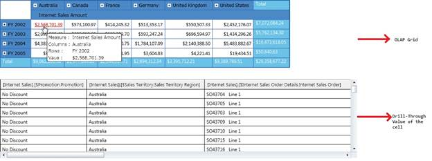

::: {style="DISPLAY: none"}
{#d2h_url_template}{#d2h_package_url style="WIDTH: 0px; DISPLAY: none; HEIGHT: 0px"}
:::

::::: {#nsbanner .d2h_main_nsbanner style="BORDER-BOTTOM: #999999 1px solid; POSITION: relative; PADDING-BOTTOM: 0px; BACKGROUND-COLOR: transparent; PADDING-LEFT: 0px; PADDING-RIGHT: 0px; DISPLAY: none; BORDER-TOP: #999999 1px solid; PADDING-TOP: 0px; LEFT: 0px"}
:::: {#TitleRow .d2h_main_titlerow style="PADDING-BOTTOM: 4px; BACKGROUND-COLOR: transparent; PADDING-LEFT: 22px; WIDTH: 100%; PADDING-RIGHT: 10px; DISPLAY: none; PADDING-TOP: 4px"}
::: {#ienav .d2h_main_ienav style="DISPLAY: none"}
{#D2HPrevious .D2HPreviousEnabled}  {#D2HNext .D2HNextEnabled}
:::
::::
:::::

::::: {#nstext .d2h_main_nstext style="PADDING-BOTTOM: 10px; BACKGROUND-COLOR: transparent; PADDING-LEFT: 22px; PADDING-RIGHT: 10px; HEIGHT: 100%; OVERFLOW: auto; PADDING-TOP: 5px" hasuserbackground="true" valign="bottom"}
::: {#d2h_breadcrumbs .d2h_breadcrumbs}
[Essential Studio User Guide Documentation](ms-xhelp:///?Id=12457748-09e3-4d74-a240-8e049cedf030){.d2h_breadcrumbsNormal}[ \> ]{.d2h_breadcrumbsLinkSeparator}[Business Intelligence Edition](ms-xhelp:///?Id=fdf33dd8-62b2-47b9-ad7b-fc50e590bca5){.d2h_breadcrumbsNormal}[ \> ]{.d2h_breadcrumbsLinkSeparator}[Essential BI Silverlight](ms-xhelp:///?Id=c006b39c-6aa2-4637-b7de-3e7b6cb3f9f9){.d2h_breadcrumbsNormal}[ \> ]{.d2h_breadcrumbsLinkSeparator}[Essential BI Grid]{.d2h_breadcrumbsContentsOnly}[ \> ]{.d2h_breadcrumbsLinkSeparator}[Concepts and Features](ms-xhelp:///?Id=6e49680f-da51-4b1f-9043-47e40b9c0684){.d2h_breadcrumbsNormal}
:::

## Drill-Through {#drill-through style="tab-stops: 0pt"}

 

OlapGrid for Silverlight supports Drill-through feature which enables the user to drill through any value and see the fact data which formed the value.

 

Use Case Scenarios

Drill-through is an important functionality, which is really helpful in situations where the user would like to see the fact data which results in the given value.

 

Method

*[Table ]{style="LINE-HEIGHT: 115%; COLOR: black; FONT-SIZE: 9pt"}[8]{style="LINE-HEIGHT: 115%; COLOR: black; FONT-SIZE: 9pt"}[: Method/s Table]{style="LINE-HEIGHT: 115%; COLOR: black; FONT-SIZE: 9pt"}*

::: {align="center"}
+-----------+------------------------------------------------------------------------------------------------------------------------------------------------------+---------------------+-----------+-------------+-----------------+
| Method    | Description                                                                                                                                          | Parameters          | Type      | Return Type | Reference links |
+-----------+------------------------------------------------------------------------------------------------------------------------------------------------------+---------------------+-----------+-------------+-----------------+
| Execute   | This method should be called to get the result set of Drill -through operation.                                                                      |  (\<string\> query) | **-**     | void        | \-              |
|           |                                                                                                                                                      |                     |           |             |                 |
|           | This should be called in the LinkLabel click event.                                                                                                  |                     |           |             |                 |
|           |                                                                                                                                                      |                     |           |             |                 |
|           | When this method is invoked by passing the drill through query, then it initiates an Async Callback and gets the result set which has the fact data. |                     |           |             |                 |
+===========+======================================================================================================================================================+=====================+===========+=============+=================+
:::

 

 

Adding Drill Through to an Application

Adding Drill-through functionality to an application is described in the following steps:

1.   Enabling the Hyperlink for Value cells for OlapGrid.

2.   Tagging and Using LinkClick Event.

a)   Get the CellDescriptor

b)   Form Drill-through query

c)   Execute the Query

d)   Tag the CellSetChanged event of the OlapDataManager

3.   Binding the data source to GridDataControl.

 

Enabling the Hyperlink for Value cells for OlapGrid

To enable the hyperlink for the Value Cells for OlapGird, use the following code snippet inside the OlapGrid's loaded event.

 

+-------------------------------------------------------------------------------------------------------------------------------------------------------------------------------+
| [\[C#\]]{style="FONT-FAMILY: 'Courier New'"}                                                                                                                                  |
|                                                                                                                                                                               |
| []{style="FONT-FAMILY: 'Courier New'"}                                                                                                                                        |
|                                                                                                                                                                               |
| [        [void]{style="COLOR: blue"} olapGrid_Loaded([object]{style="COLOR: blue"} sender, [RoutedEventArgs ]{style="COLOR: #2b91af"}e)]{style="FONT-FAMILY: 'Courier New'"}  |
|                                                                                                                                                                               |
| [        {]{style="FONT-FAMILY: 'Courier New'"}                                                                                                                               |
|                                                                                                                                                                               |
| [                      // Enabling Hyperlink]{style="FONT-FAMILY: 'Courier New'; COLOR: green"}[]{style="FONT-FAMILY: 'Courier New'"}                                         |
|                                                                                                                                                                               |
| [            [this]{style="COLOR: blue"}.olapGrid.InternalGrid.ValueCellStyle.IsHyperlinkCell = [true]{style="COLOR: blue"};            ]{style="FONT-FAMILY: 'Courier New'"} |
|                                                                                                                                                                               |
| [        }]{style="FONT-FAMILY: 'Courier New'"}                                                                                                                               |
|                                                                                                                                                                               |
| []{style="FONT-FAMILY: 'Courier New'"}                                                                                                                                        |
+-------------------------------------------------------------------------------------------------------------------------------------------------------------------------------+

 

+----------------------------------------------------------------------------------------------------------------------------------------------------------------------------------------------------------------------------------------------------------------------------------------------+
| [\[VB\]]{style="FONT-FAMILY: 'Courier New'"}                                                                                                                                                                                                                                                 |
|                                                                                                                                                                                                                                                                                              |
| []{style="FONT-FAMILY: 'Courier New'"}                                                                                                                                                                                                                                                       |
|                                                                                                                                                                                                                                                                                              |
| [      [Private]{style="COLOR: blue"} [Sub]{style="COLOR: blue"} olapGrid_Loaded([ByVal]{style="COLOR: blue"} sender [As]{style="COLOR: blue"} [Object]{style="COLOR: blue"}, [ByVal]{style="COLOR: blue"} e [As]{style="COLOR: blue"} RoutedEventArgs)]{style="FONT-FAMILY: 'Courier New'"} |
|                                                                                                                                                                                                                                                                                              |
| [            [\' Enabling Hyperlink]{style="COLOR: green"}]{style="FONT-FAMILY: 'Courier New'"}                                                                                                                                                                                              |
|                                                                                                                                                                                                                                                                                              |
| [            [Me]{style="COLOR: blue"}.olapGrid.InternalGrid.ValueCellStyle.IsHyperlinkCell = [True]{style="COLOR: blue"}]{style="FONT-FAMILY: 'Courier New'"}                                                                                                                               |
|                                                                                                                                                                                                                                                                                              |
| [      [End]{style="COLOR: blue"} [Sub]{style="COLOR: blue"}]{style="FONT-FAMILY: 'Courier New'"}                                                                                                                                                                                            |
|                                                                                                                                                                                                                                                                                              |
| []{style="FONT-FAMILY: 'Courier New'; COLOR: blue"}                                                                                                                                                                                                                                          |
+----------------------------------------------------------------------------------------------------------------------------------------------------------------------------------------------------------------------------------------------------------------------------------------------+

 

Tagging and Using LinkClick Event

We need to tag the OlapGrid's LinkClick event, which occurs when the cell has hyperlink enabled.

In order to initiate the Drill-through operation, we need to tag the LinkClick event, in the LinkClick event, the LinkLabelEventArgs will contain a CellDescriptor, which will have the necessary information to form the query. As a first step, we have to make a call to PivotEngine's GetCellData method passing this CellDescriptor, which will return us the CellData.

We can use the CellData to identify the selected(Clicked) cell by using the ColumnInfo, RowInfo and Measure. We have to form the drill-through query one such shown in the following code snippet and pass it on to the OlapDataManager's "Execute" method. This method will initiate an Async operation which will hit the OlapCube or OlapServer for getting the fact table details.   

 

+--------------------------------------------------------------------------------------------------------------------------------------------------------------------------------------------------------------------------------------------------------------------------------------------------------------------------------------------------------------------------------------------+
| [\[C#\]]{style="FONT-FAMILY: 'Courier New'"}                                                                                                                                                                                                                                                                                                                                               |
|                                                                                                                                                                                                                                                                                                                                                                                            |
| []{style="FONT-FAMILY: 'Courier New'"}                                                                                                                                                                                                                                                                                                                                                     |
|                                                                                                                                                                                                                                                                                                                                                                                            |
| [private]{style="FONT-FAMILY: 'Courier New'; COLOR: blue"}[ [void]{style="COLOR: blue"} olapGrid_LinkClick([object]{style="COLOR: blue"} sender, Syncfusion.Silverlight.Grid.Olap.[LinkLabelEventArgs]{style="COLOR: #2b91af"} e)]{style="FONT-FAMILY: 'Courier New'"}                                                                                                                     |
|                                                                                                                                                                                                                                                                                                                                                                                            |
| [        {]{style="FONT-FAMILY: 'Courier New'"}                                                                                                                                                                                                                                                                                                                                            |
|                                                                                                                                                                                                                                                                                                                                                                                            |
| [            [// Getting Cell descriptor.]{style="COLOR: green"}]{style="FONT-FAMILY: 'Courier New'"}                                                                                                                                                                                                                                                                                      |
|                                                                                                                                                                                                                                                                                                                                                                                            |
| [            [var]{style="COLOR: blue"} cellData = [this]{style="COLOR: blue"}.olapGrid.OlapDataManager.PivotEngine.GetCellData(e.CellDescriptor);]{style="FONT-FAMILY: 'Courier New'"}                                                                                                                                                                                                    |
|                                                                                                                                                                                                                                                                                                                                                                                            |
| []{style="FONT-FAMILY: 'Courier New'"}                                                                                                                                                                                                                                                                                                                                                     |
|                                                                                                                                                                                                                                                                                                                                                                                            |
| [            [// Forming query using details from cell descriptor. If Categorical or series axis contains more than one elements, the ColumnInfo or RowInfo should be iterated and included in the query separated by comma.]{style="COLOR: green"}]{style="FONT-FAMILY: 'Courier New'"}                                                                                                   |
|                                                                                                                                                                                                                                                                                                                                                                                            |
| [            [var]{style="COLOR: blue"} query = [\"drillthrough Select { \"]{style="COLOR: #a31515"} + cellData.ColumnInfo\[0\].UniqueName + [\"} on 0, \"]{style="COLOR: #a31515"} + cellData.RowInfo\[0\].UniqueName + [\" on 1 from \[Adventure Works\] Where \[\"]{style="COLOR: #a31515"} + cellData.Measure + [\"\]\"]{style="COLOR: #a31515"};]{style="FONT-FAMILY: 'Courier New'"} |
|                                                                                                                                                                                                                                                                                                                                                                                            |
| []{style="FONT-FAMILY: 'Courier New'"}                                                                                                                                                                                                                                                                                                                                                     |
|                                                                                                                                                                                                                                                                                                                                                                                            |
| [            [// Executing the drill-through operation.]{style="COLOR: green"}]{style="FONT-FAMILY: 'Courier New'"}                                                                                                                                                                                                                                                                        |
|                                                                                                                                                                                                                                                                                                                                                                                            |
| [            olapDataManager.Execute(query);]{style="FONT-FAMILY: 'Courier New'"}                                                                                                                                                                                                                                                                                                          |
|                                                                                                                                                                                                                                                                                                                                                                                            |
| []{style="FONT-FAMILY: 'Courier New'"}                                                                                                                                                                                                                                                                                                                                                     |
|                                                                                                                                                                                                                                                                                                                                                                                            |
| [            [// Tagging the Data Manager\'s Cell Changed Event.]{style="COLOR: green"}]{style="FONT-FAMILY: 'Courier New'"}                                                                                                                                                                                                                                                               |
|                                                                                                                                                                                                                                                                                                                                                                                            |
| [            [this]{style="COLOR: blue"}.olapDataManager.CellSetChanged += [new]{style="COLOR: blue"} [CellSetChangedEventHandler]{style="COLOR: #2b91af"}(olapDataManager_CellSetChanged);]{style="FONT-FAMILY: 'Courier New'"}                                                                                                                                                           |
|                                                                                                                                                                                                                                                                                                                                                                                            |
| [        }]{style="FONT-FAMILY: 'Courier New'"}                                                                                                                                                                                                                                                                                                                                            |
|                                                                                                                                                                                                                                                                                                                                                                                            |
| []{style="FONT-FAMILY: 'Courier New'"}                                                                                                                                                                                                                                                                                                                                                     |
+--------------------------------------------------------------------------------------------------------------------------------------------------------------------------------------------------------------------------------------------------------------------------------------------------------------------------------------------------------------------------------------------+

 

+-----------------------------------------------------------------------------------------------------------------------------------------------------------------------------------------------------------------------------------------------------------------------------------------------------------------------------------------------------------+
| [\[VB\]]{style="FONT-FAMILY: 'Courier New'"}                                                                                                                                                                                                                                                                                                              |
|                                                                                                                                                                                                                                                                                                                                                           |
| []{style="FONT-FAMILY: 'Courier New'"}                                                                                                                                                                                                                                                                                                                    |
|                                                                                                                                                                                                                                                                                                                                                           |
| [Private]{style="FONT-FAMILY: 'Courier New'; COLOR: blue"}[ [Sub]{style="COLOR: blue"} olapGrid_LinkClick([ByVal]{style="COLOR: blue"} sender [As]{style="COLOR: blue"} [Object]{style="COLOR: blue"}, [ByVal]{style="COLOR: blue"} e [As]{style="COLOR: blue"} Syncfusion.Silverlight.Grid.Olap.LinkLabelEventArgs)]{style="FONT-FAMILY: 'Courier New'"} |
|                                                                                                                                                                                                                                                                                                                                                           |
| [      [\' Getting Cell descriptor.]{style="COLOR: green"}]{style="FONT-FAMILY: 'Courier New'"}                                                                                                                                                                                                                                                           |
|                                                                                                                                                                                                                                                                                                                                                           |
| [        [Dim]{style="COLOR: blue"} cellData = [Me]{style="COLOR: blue"}.olapGrid.OlapDataManager.PivotEngine.GetCellData(e.CellDescriptor)]{style="FONT-FAMILY: 'Courier New'"}                                                                                                                                                                          |
|                                                                                                                                                                                                                                                                                                                                                           |
| []{style="FONT-FAMILY: 'Courier New'"}                                                                                                                                                                                                                                                                                                                    |
|                                                                                                                                                                                                                                                                                                                                                           |
| [        [\' Forming query using details from cell descriptor. If Categorical or series axis contains more than one elements, the ColumnInfo or RowInfo should be iterated and included in the query separated by comma.]{style="COLOR: green"}]{style="FONT-FAMILY: 'Courier New'"}                                                                      |
|                                                                                                                                                                                                                                                                                                                                                           |
| [        [Dim]{style="COLOR: blue"} query = \"drillthrough Select { \" & cellData.ColumnInfo(0).UniqueName & \"} on 0, \" & cellData.RowInfo(0).UniqueName & \" on 1 from \[Adventure Works\] Where \[\" & cellData.Measure & \"\]\"]{style="FONT-FAMILY: 'Courier New'"}                                                                                 |
|                                                                                                                                                                                                                                                                                                                                                           |
| []{style="FONT-FAMILY: 'Courier New'"}                                                                                                                                                                                                                                                                                                                    |
|                                                                                                                                                                                                                                                                                                                                                           |
| [        [\' Executing the drill-through operation.]{style="COLOR: green"}]{style="FONT-FAMILY: 'Courier New'"}                                                                                                                                                                                                                                           |
|                                                                                                                                                                                                                                                                                                                                                           |
| [        olapDataManager.Execute(query)]{style="FONT-FAMILY: 'Courier New'"}                                                                                                                                                                                                                                                                              |
|                                                                                                                                                                                                                                                                                                                                                           |
| []{style="FONT-FAMILY: 'Courier New'"}                                                                                                                                                                                                                                                                                                                    |
|                                                                                                                                                                                                                                                                                                                                                           |
| [        [\' Tagging the Data Manager\'s Cell Changed Event.]{style="COLOR: green"}]{style="FONT-FAMILY: 'Courier New'"}                                                                                                                                                                                                                                  |
|                                                                                                                                                                                                                                                                                                                                                           |
| [        [AddHandler]{style="COLOR: blue"} olapDataManager.CellSetChanged, [AddressOf]{style="COLOR: blue"} olapDataManager_CellSetChanged]{style="FONT-FAMILY: 'Courier New'"}                                                                                                                                                                           |
|                                                                                                                                                                                                                                                                                                                                                           |
| [End]{style="FONT-FAMILY: 'Courier New'; COLOR: blue"}[ [Sub]{style="COLOR: blue"}]{style="FONT-FAMILY: 'Courier New'"}                                                                                                                                                                                                                                   |
|                                                                                                                                                                                                                                                                                                                                                           |
| []{style="FONT-FAMILY: 'Courier New'; COLOR: blue"}                                                                                                                                                                                                                                                                                                       |
+-----------------------------------------------------------------------------------------------------------------------------------------------------------------------------------------------------------------------------------------------------------------------------------------------------------------------------------------------------------+

 

Binding the DataSource

Once the Async operation is completed, the CellSetChanged event will be fired providing a ResultSet ,a collection of ExpandoObject which contains the fact table. Since, Syncfusion DataGrid supports dynamic collection binding support, bind this to the GridDataControl's ItemsSource property as shown in the following code snippet:

 

+-----------------------------------------------------------------------------------------------------------------------------------------------------------------------------------------------------+
| [\[C#\]]{style="FONT-FAMILY: 'Courier New'"}                                                                                                                                                        |
|                                                                                                                                                                                                     |
| []{style="FONT-FAMILY: 'Courier New'"}                                                                                                                                                              |
|                                                                                                                                                                                                     |
| [        [void]{style="COLOR: blue"} olapDataManager_CellSetChanged([object]{style="COLOR: blue"} sender, [CellSetChangedEventArgs]{style="COLOR: #2b91af"} e)]{style="FONT-FAMILY: 'Courier New'"} |
|                                                                                                                                                                                                     |
| [        {]{style="FONT-FAMILY: 'Courier New'"}                                                                                                                                                     |
|                                                                                                                                                                                                     |
| [            [this]{style="COLOR: blue"}.dataGrid1.ItemsSource = e.ResultSet;]{style="FONT-FAMILY: 'Courier New'"}                                                                                  |
|                                                                                                                                                                                                     |
| [        }]{style="FONT-FAMILY: 'Courier New'"}                                                                                                                                                     |
|                                                                                                                                                                                                     |
| []{style="FONT-FAMILY: 'Courier New'"}                                                                                                                                                              |
+-----------------------------------------------------------------------------------------------------------------------------------------------------------------------------------------------------+

 

+---------------------------------------------------------------------------------------------------------------------------------------------------------------------------------------------------------------------------------------------------------------------------------------------------------------------+
| [\[VB\]]{style="FONT-FAMILY: 'Courier New'"}                                                                                                                                                                                                                                                                        |
|                                                                                                                                                                                                                                                                                                                     |
| []{style="FONT-FAMILY: 'Courier New'"}                                                                                                                                                                                                                                                                              |
|                                                                                                                                                                                                                                                                                                                     |
| [      [Private]{style="COLOR: blue"} [Sub]{style="COLOR: blue"} olapDataManager_CellSetChanged([ByVal]{style="COLOR: blue"} sender [As]{style="COLOR: blue"} [Object]{style="COLOR: blue"}, [ByVal]{style="COLOR: blue"} e [As]{style="COLOR: blue"} CellSetChangedEventArgs)]{style="FONT-FAMILY: 'Courier New'"} |
|                                                                                                                                                                                                                                                                                                                     |
| [            [Me]{style="COLOR: blue"}.dataGrid1.ItemsSource = e.ResultSet]{style="FONT-FAMILY: 'Courier New'"}                                                                                                                                                                                                     |
|                                                                                                                                                                                                                                                                                                                     |
| [      [End]{style="COLOR: blue"} [Sub]{style="COLOR: blue"}]{style="FONT-FAMILY: 'Courier New'"}                                                                                                                                                                                                                   |
|                                                                                                                                                                                                                                                                                                                     |
| []{style="FONT-FAMILY: 'Courier New'; COLOR: blue"}                                                                                                                                                                                                                                                                 |
+---------------------------------------------------------------------------------------------------------------------------------------------------------------------------------------------------------------------------------------------------------------------------------------------------------------------+

 

{border="0"}

Figure 14: A Simple OlapGrid and it\'s Drill-Through data

 

Sample Link

A sample demo is available at the following link:

 

1.   Open the Syncfusion Dashboard

2.   Select **Business Intelligence**

3.   Click the **Silverlight** drop-down list and select **Explore Samples**

4.   Navigate to **OlapGrid.Silverlight**-\> **Drill-Through**[]{style="FONT-FAMILY: 'Calibri','sans-serif'; FONT-SIZE: 11pt"}

Before submitting this content to the documentation team, make sure Fields 1-4 and Field 7 have been filled out. Do not delete this page.

[]{#related-topics}
:::::
