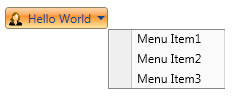
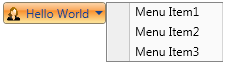
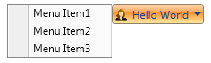

::: {style="DISPLAY: none"}
{#d2h_url_template}{#d2h_package_url style="WIDTH: 0px; DISPLAY: none; HEIGHT: 0px"}
:::

::: {.d2h_secondary_topic style="PADDING-BOTTOM: 10pt; MARGIN: 0pt; PADDING-LEFT: 0pt; PADDING-RIGHT: 0pt; PADDING-TOP: 0pt"}
#### Drop Direction {#drop-direction style="tab-stops: 0pt"}

The DropDown Direction can be changed using the property DropDirection. The DropDirection Enum takes the following values:

[·      ]{style="FONT-FAMILY: Symbol"}Left

[·      ]{style="FONT-FAMILY: Symbol"}Right

[·      ]{style="FONT-FAMILY: Symbol"}BottomLeft

[·      ]{style="FONT-FAMILY: Symbol"}BottomRight

[·      ]{style="FONT-FAMILY: Symbol"}TopLeft

[·      ]{style="FONT-FAMILY: Symbol"}TopRight

 

The default value is BottomLeft.

The DropDirection property can be set as follows:

To set BottomLeft DropDirection

+------------------------------------------------------------------------------------------------------------------------------------------------------------------------------------------------------------------------------------------------------------------------------------------------------------------------------------------------------------------------------------------------------------------------+
| [ **\[XAML\]**]{style="FONT-FAMILY: 'Courier New'"}                                                                                                                                                                                                                                                                                                                                                                    |
|                                                                                                                                                                                                                                                                                                                                                                                                                        |
| [\<]{style="FONT-FAMILY: 'Courier New'; COLOR: blue"}[sync]{style="FONT-FAMILY: 'Courier New'; COLOR: #a31515"}[:]{style="FONT-FAMILY: 'Courier New'; COLOR: blue"}[DropDownButtonAdv ]{style="FONT-FAMILY: 'Courier New'; COLOR: #a31515"}[ DropDirection]{style="FONT-FAMILY: 'Courier New'; COLOR: red"}[=\"BottomLeft\"/\>]{style="FONT-FAMILY: 'Courier New'; COLOR: blue"}[]{style="FONT-FAMILY: 'Courier New'"} |
+------------------------------------------------------------------------------------------------------------------------------------------------------------------------------------------------------------------------------------------------------------------------------------------------------------------------------------------------------------------------------------------------------------------------+

 

{border="0"}

Figure 463: BottomLeft Drop Direction

To set BottomRight Drop Direction

+-------------------------------------------------------------------------------------------------------------------------------------------------------------------------------------------------------------------------------------------------------------------------------------------------------------------------------------------------------------------------------------------------------------------------+
| [ **\[XAML\]**]{style="FONT-FAMILY: 'Courier New'"}                                                                                                                                                                                                                                                                                                                                                                     |
|                                                                                                                                                                                                                                                                                                                                                                                                                         |
| [\<]{style="FONT-FAMILY: 'Courier New'; COLOR: blue"}[sync]{style="FONT-FAMILY: 'Courier New'; COLOR: #a31515"}[:]{style="FONT-FAMILY: 'Courier New'; COLOR: blue"}[DropDownButtonAdv ]{style="FONT-FAMILY: 'Courier New'; COLOR: #a31515"}[ DropDirection]{style="FONT-FAMILY: 'Courier New'; COLOR: red"}[=\"BottomRight\"/\>]{style="FONT-FAMILY: 'Courier New'; COLOR: blue"}[]{style="FONT-FAMILY: 'Courier New'"} |
+-------------------------------------------------------------------------------------------------------------------------------------------------------------------------------------------------------------------------------------------------------------------------------------------------------------------------------------------------------------------------------------------------------------------------+

 

 

{border="0"}

Figure 464: BottomRight Drop Direction

 

To set Right Drop Direction

+-------------------------------------------------------------------------------------------------------------------------------------------------------------------------------------------------------------------------------------------------------------------------------------------------------------------------------------------------------------------------------------------------------------------+
| [ **\[XAML\]**]{style="FONT-FAMILY: 'Courier New'"}                                                                                                                                                                                                                                                                                                                                                               |
|                                                                                                                                                                                                                                                                                                                                                                                                                   |
| [\<]{style="FONT-FAMILY: 'Courier New'; COLOR: blue"}[sync]{style="FONT-FAMILY: 'Courier New'; COLOR: #a31515"}[:]{style="FONT-FAMILY: 'Courier New'; COLOR: blue"}[DropDownButtonAdv ]{style="FONT-FAMILY: 'Courier New'; COLOR: #a31515"}[ DropDirection]{style="FONT-FAMILY: 'Courier New'; COLOR: red"}[=\"Right\"/\>]{style="FONT-FAMILY: 'Courier New'; COLOR: blue"}[]{style="FONT-FAMILY: 'Courier New'"} |
+-------------------------------------------------------------------------------------------------------------------------------------------------------------------------------------------------------------------------------------------------------------------------------------------------------------------------------------------------------------------------------------------------------------------+

 

{border="0"}

Figure 465: Right Drop Direction

To set Left Drop Direction

+------------------------------------------------------------------------------------------------------------------------------------------------------------------------------------------------------------------------------------------------------------------------------------------------------------------------------------------------------------------------------------------------------------------+
| [ **\[XAML\]**]{style="FONT-FAMILY: 'Courier New'"}                                                                                                                                                                                                                                                                                                                                                              |
|                                                                                                                                                                                                                                                                                                                                                                                                                  |
| [\<]{style="FONT-FAMILY: 'Courier New'; COLOR: blue"}[sync]{style="FONT-FAMILY: 'Courier New'; COLOR: #a31515"}[:]{style="FONT-FAMILY: 'Courier New'; COLOR: blue"}[DropDownButtonAdv ]{style="FONT-FAMILY: 'Courier New'; COLOR: #a31515"}[ DropDirection]{style="FONT-FAMILY: 'Courier New'; COLOR: red"}[=\"Left\"/\>]{style="FONT-FAMILY: 'Courier New'; COLOR: blue"}[]{style="FONT-FAMILY: 'Courier New'"} |
+------------------------------------------------------------------------------------------------------------------------------------------------------------------------------------------------------------------------------------------------------------------------------------------------------------------------------------------------------------------------------------------------------------------+

 

{border="0"}

Figure 466: Left Drop Direction

 

[]{#related-topics}
:::
