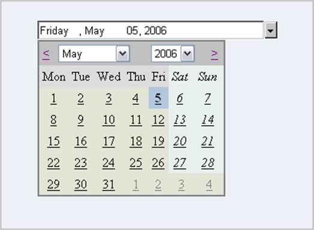

::: {style="DISPLAY: none"}
{#d2h_url_template}{#d2h_package_url style="WIDTH: 0px; DISPLAY: none; HEIGHT: 0px"}
:::

::: {.d2h_secondary_topic style="PADDING-BOTTOM: 10pt; MARGIN: 0pt; PADDING-LEFT: 0pt; PADDING-RIGHT: 0pt; PADDING-TOP: 0pt"}
#### DropDownCalendarControl {#dropdowncalendarcontrol style="tab-stops: 0pt"}

 

The DropDownCalendarControl displays a month calendar from which users can select dates.

 

{border="0"}

Figure 51

 

Features

 

[·      ]{style="FONT-FAMILY: Symbol"}Supports setting of minimum and maximum values.

[·      ]{style="FONT-FAMILY: Symbol"}Supports Data Binding with a datasource.

[·      ]{style="FONT-FAMILY: Symbol"}Uses globalization features of .NET platform to provide locale-specific formatting.

[·      ]{style="FONT-FAMILY: Symbol"}The control can be hosted in Safari browser too.

[]{#p62} 

More:

[ ]{#related-topics}

[{border="0" align="absMiddle"}Creating DropDownCalendarControl](ms-xhelp:///?Id=b79ebcc9-0715-47ce-9225-3cc13a48faca){style="TEXT-DECORATION: none"}

[{border="0" align="absMiddle"}Concepts and Features](ms-xhelp:///?Id=8141cb59-be58-45a7-b4b6-134fb7b2c698){style="TEXT-DECORATION: none"}

[{border="0" align="absMiddle"}Events](ms-xhelp:///?Id=405df1ae-426e-4029-a428-f28a901ba17c){style="TEXT-DECORATION: none"}
:::
