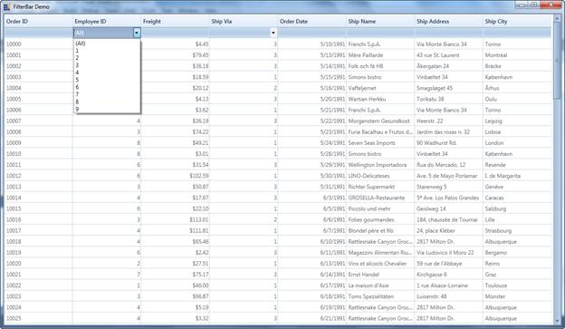
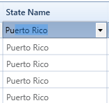

::: {style="DISPLAY: none"}
{#d2h_url_template}{#d2h_package_url style="WIDTH: 0px; DISPLAY: none; HEIGHT: 0px"}
:::

:::: {.d2h_secondary_topic style="PADDING-BOTTOM: 10pt; MARGIN: 0pt; PADDING-LEFT: 0pt; PADDING-RIGHT: 0pt; PADDING-TOP: 0pt"}
##### Dropdown FilterBar {#dropdown-filterbar style="tab-stops: 0pt"}

Dropdown FilterBar feature is similar to Text Box Filter instead of entering the key word the dropdown button can be used to filter the items.

To filter items using Dropdown Filter

The Dropdown button is used to filter the required items. We have to set the FilterBarStyle to change the FilterBar cell type.

 

::: {style="BORDER-BOTTOM: windowtext 1pt solid; BORDER-LEFT: windowtext 1pt solid; PADDING-BOTTOM: 1pt; MARGIN-TOP: 0pt; PADDING-LEFT: 4pt; PADDING-RIGHT: 4pt; MARGIN-BOTTOM: 0pt; BACKGROUND: #f0f0f0; BORDER-TOP: windowtext 1pt solid; BORDER-RIGHT: windowtext 1pt solid; PADDING-TOP: 1pt"}
[\<]{style="FONT-FAMILY: Consolas; COLOR: blue"}[syncfusion]{style="FONT-FAMILY: Consolas; COLOR: #a31515"}[:]{style="FONT-FAMILY: Consolas; COLOR: blue"}[GridDataVisibleColumn]{style="FONT-FAMILY: Consolas; COLOR: #a31515"}[ MappingName]{style="FONT-FAMILY: Consolas; COLOR: red"}[=\"EmployeeID\"]{style="FONT-FAMILY: Consolas; COLOR: blue"}[ HeaderText]{style="FONT-FAMILY: Consolas; COLOR: red"}[=\"Employee ID\"\>]{style="FONT-FAMILY: Consolas; COLOR: blue"}[]{style="FONT-FAMILY: Consolas; COLOR: black"}

[     ]{style="FONT-FAMILY: Consolas; COLOR: #a31515"}[\<]{style="FONT-FAMILY: Consolas; COLOR: blue"}[syncfusion]{style="FONT-FAMILY: Consolas; COLOR: #a31515"}[:]{style="FONT-FAMILY: Consolas; COLOR: blue"}[GridDataVisibleColumn.ColumnStyle]{style="FONT-FAMILY: Consolas; COLOR: #a31515"}[\>]{style="FONT-FAMILY: Consolas; COLOR: blue"}

[\<]{style="FONT-FAMILY: Consolas; COLOR: blue"}[syncfusion]{style="FONT-FAMILY: Consolas; COLOR: #a31515"}[:]{style="FONT-FAMILY: Consolas; COLOR: blue"}[GridDataColumnStyle]{style="FONT-FAMILY: Consolas; COLOR: #a31515"}[ CellType]{style="FONT-FAMILY: Consolas; COLOR: red"}[=\"IntegerEdit        \"]{style="FONT-FAMILY: Consolas; COLOR: blue"}[ HorizontalAlignment]{style="FONT-FAMILY: Consolas; COLOR: red"}[=\"Right\"\>]{style="FONT-FAMILY: Consolas; COLOR: blue"}[]{style="FONT-FAMILY: Consolas; COLOR: black"}

[                  ]{style="FONT-FAMILY: Consolas; COLOR: #a31515"}[\</]{style="FONT-FAMILY: Consolas; COLOR: blue"}[syncfusion]{style="FONT-FAMILY: Consolas; COLOR: #a31515"}[:]{style="FONT-FAMILY: Consolas; COLOR: blue"}[GridDataColumnStyle]{style="FONT-FAMILY: Consolas; COLOR: #a31515"}[\>]{style="FONT-FAMILY: Consolas; COLOR: blue"}[]{style="FONT-FAMILY: Consolas; COLOR: black"}

[                  ]{style="FONT-FAMILY: Consolas; COLOR: #a31515"}[\</]{style="FONT-FAMILY: Consolas; COLOR: blue"}[syncfusion]{style="FONT-FAMILY: Consolas; COLOR: #a31515"}[:]{style="FONT-FAMILY: Consolas; COLOR: blue"}[GridDataVisibleColumn.ColumnStyle]{style="FONT-FAMILY: Consolas; COLOR: #a31515"}[\>]{style="FONT-FAMILY: Consolas; COLOR: blue"}[]{style="FONT-FAMILY: Consolas; COLOR: black"}

[                       ]{style="FONT-FAMILY: Consolas; COLOR: #a31515"}[\<]{style="FONT-FAMILY: Consolas; COLOR: blue"}[syncfusion]{style="FONT-FAMILY: Consolas; COLOR: #a31515"}[:]{style="FONT-FAMILY: Consolas; COLOR: blue"}[GridDataVisibleColumn.FilterBarStyle]{style="FONT-FAMILY: Consolas; COLOR: #a31515"}[\>]{style="FONT-FAMILY: Consolas; COLOR: blue"}[]{style="FONT-FAMILY: Consolas; COLOR: black"}

[                           ]{style="FONT-FAMILY: Consolas; COLOR: #a31515"}[\<]{style="FONT-FAMILY: Consolas; COLOR: blue"}[syncfusion]{style="FONT-FAMILY: Consolas; COLOR: #a31515"}[:]{style="FONT-FAMILY: Consolas; COLOR: blue"}[GridDataFilterBarStyle]{style="FONT-FAMILY: Consolas; COLOR: #a31515"}[ CellType]{style="FONT-FAMILY: Consolas; COLOR: red"}[=\"ComboBox\" /\>]{style="FONT-FAMILY: Consolas; COLOR: blue"}[]{style="FONT-FAMILY: Consolas; COLOR: black"}

[                       ]{style="FONT-FAMILY: Consolas; COLOR: #a31515"}[\</]{style="FONT-FAMILY: Consolas; COLOR: blue"}[syncfusion]{style="FONT-FAMILY: Consolas; COLOR: #a31515"}[:]{style="FONT-FAMILY: Consolas; COLOR: blue"}[GridDataVisibleColumn.FilterBarStyle]{style="FONT-FAMILY: Consolas; COLOR: #a31515"}[\>]{style="FONT-FAMILY: Consolas; COLOR: blue"}[]{style="FONT-FAMILY: Consolas; COLOR: black"}

[ ]{style="FONT-FAMILY: Consolas; COLOR: #a31515"}[\</]{style="FONT-FAMILY: Consolas; COLOR: blue"}[syncfusion]{style="FONT-FAMILY: Consolas; COLOR: #a31515"}[:]{style="FONT-FAMILY: Consolas; COLOR: blue"}[GridDataVisibleColumn]{style="FONT-FAMILY: Consolas; COLOR: #a31515"}[\>]{style="FONT-FAMILY: Consolas; COLOR: blue"}[]{style="FONT-FAMILY: Consolas; COLOR: black"}
:::

 

 

 

{border="0"}

Figure 177: Dropdown FilterBar

Properties, Methods and Events tables

Properties

+----------------+--------------------------------------------------------------------------------------------+-------------+------------------------+-----------------+
| Property       | Description                                                                                | Type        | Data Type              | Reference links |
+----------------+--------------------------------------------------------------------------------------------+-------------+------------------------+-----------------+
| CellType       | Used to select ComboBox or TextBox                                                         | Dependency  | Enum                   | NA              |
+----------------+--------------------------------------------------------------------------------------------+-------------+------------------------+-----------------+
| ItemsSource    | Used to bind the external item source                                                      | Dependency  | Object                 | NA              |
+----------------+--------------------------------------------------------------------------------------------+-------------+------------------------+-----------------+
| DisplayMember  | This decides which member should be displayed.                                             | Dependency  | String                 | NA              |
+----------------+--------------------------------------------------------------------------------------------+-------------+------------------------+-----------------+
| ValueMember    | Based on the value the items will be filtered.                                             | Dependency  | String                 | NA              |
+----------------+--------------------------------------------------------------------------------------------+-------------+------------------------+-----------------+
| FilterBarStyle | This property used to set the style of the filterbar for the corresponding visible column. | Dependency  | GridDataFilterBarStyle | NA              |
|                |                                                                                            |             |                        |                 |
|                |                                                                                            |             |                        |                 |
+----------------+--------------------------------------------------------------------------------------------+-------------+------------------------+-----------------+

 

To Edit items in Dropdown list

{border="0"}

Figure 178: Editable Dropdown filter bar

The behavior is similar to Auto-complete combo box.

Property

+-----------------------------------------------------------------------------+------------------------------------------------------------------------------------------------------------------------------------------------------------------------------------------------------------------------------------------------------------------------------------------------+-----------------------------------------------------------------------------+--------------------------------------------------------------------+--------------------------------------------------------------------+
| Method                                                                      | Description                                                                                                                                                                                                                                                                                    | Parameters                                                                  | Return Type                                                        | Reference links                                                    |
+-----------------------------------------------------------------------------+------------------------------------------------------------------------------------------------------------------------------------------------------------------------------------------------------------------------------------------------------------------------------------------------+-----------------------------------------------------------------------------+--------------------------------------------------------------------+--------------------------------------------------------------------+
| **IsEditable[]{style="FONT-FAMILY: 'Calibri','sans-serif'; COLOR: black"}** |  Combine an editable text field and provide users the additional option of typing an item and predict a word or phrase that the user wants to type in the associated text box without the user actually typing it completely.**[]{style="FONT-FAMILY: 'Calibri','sans-serif'; COLOR: black"}** | Dependency**[]{style="FONT-FAMILY: 'Calibri','sans-serif'; COLOR: black"}** | Boolean                                                            | **[]{style="FONT-FAMILY: 'Calibri','sans-serif'; COLOR: black"}**  |
|                                                                             |                                                                                                                                                                                                                                                                                                |                                                                             |                                                                    |                                                                    |
|                                                                             |                                                                                                                                                                                                                                                                                                |                                                                             | **[]{style="FONT-FAMILY: 'Calibri','sans-serif'; COLOR: black"}**  |                                                                    |
+-----------------------------------------------------------------------------+------------------------------------------------------------------------------------------------------------------------------------------------------------------------------------------------------------------------------------------------------------------------------------------------+-----------------------------------------------------------------------------+--------------------------------------------------------------------+--------------------------------------------------------------------+

[]{#related-topics}
::::
