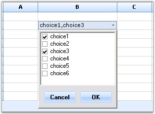

::: {style="DISPLAY: none"}
{#d2h_url_template}{#d2h_package_url style="WIDTH: 0px; DISPLAY: none; HEIGHT: 0px"}
:::

::: {.d2h_secondary_topic style="PADDING-BOTTOM: 10pt; MARGIN: 0pt; PADDING-LEFT: 0pt; PADDING-RIGHT: 0pt; PADDING-TOP: 0pt"}
##### Drop-Down Form and User Control Cell {#drop-down-form-and-user-control-cell style="tab-stops: 0pt"}

[]{style="FONT-FAMILY: 'Trebuchet MS','sans-serif'; COLOR: #15428b; FONT-SIZE: 9pt"} 

A custom control cell that displays a drop-down form or a user control in a grid cell can be created.

 

You can create:

[]{style="FONT-FAMILY: 'Trebuchet MS','sans-serif'; COLOR: #15428b; FONT-SIZE: 9pt"} 

[·      ]{style="FONT-FAMILY: Symbol"}A drop-down form in a grid cell by deriving **GridStaticCellModel**/**GridStaticCellRenderer** classes.

[·      ]{style="FONT-FAMILY: Symbol"}Adrop-down User control in a grid cell by deriving **GridDropDownCellModel**/**GridDropDownCellRender** classes.

[]{style="FONT-FAMILY: 'Trebuchet MS','sans-serif'; COLOR: #15428b; FONT-SIZE: 9pt"} 

The actions mentioned can be performed by using the following code example.

[]{style="FONT-FAMILY: 'Trebuchet MS','sans-serif'; COLOR: #15428b; FONT-SIZE: 9pt"} 

1.   Using C#

[]{style="FONT-FAMILY: 'Trebuchet MS','sans-serif'; COLOR: #15428b; FONT-SIZE: 9pt"} 

+----------------------------------------------------------------------------------------------------------------------------------------------------------------------------------------------------------------------------------------------------------------------------------------------------------------------------+
| **[\[C#\]]{style="FONT-FAMILY: 'Courier New'; COLOR: black"}**                                                                                                                                                                                                                                                             |
|                                                                                                                                                                                                                                                                                                                            |
| []{style="FONT-FAMILY: 'Courier New'; COLOR: black"}                                                                                                                                                                                                                                                                       |
|                                                                                                                                                                                                                                                                                                                            |
| [// Register your custom cell type.]{style="FONT-FAMILY: 'Courier New'; COLOR: green"}                                                                                                                                                                                                                                     |
|                                                                                                                                                                                                                                                                                                                            |
| [this]{style="FONT-FAMILY: 'Courier New'; COLOR: blue"}[.gridControl1.CellModels.Add([\"DropDownForm\"]{style="COLOR: #a31515"}, [new]{style="COLOR: blue"} DropDownFormCellModel([this]{style="COLOR: blue"}.gridControl1.Model, [new]{style="COLOR: blue"} DropDownForm()));]{style="FONT-FAMILY: 'Courier New'"}        |
|                                                                                                                                                                                                                                                                                                                            |
| []{style="FONT-FAMILY: 'Courier New'; COLOR: green"}                                                                                                                                                                                                                                                                       |
|                                                                                                                                                                                                                                                                                                                            |
| [// Set the style.CellType for the cells.]{style="FONT-FAMILY: 'Courier New'; COLOR: green"}                                                                                                                                                                                                                               |
|                                                                                                                                                                                                                                                                                                                            |
| [this]{style="FONT-FAMILY: 'Courier New'; COLOR: blue"}[.gridControl1\[2, 2\].CellType = [\"DropDownForm\"]{style="COLOR: #a31515"};]{style="FONT-FAMILY: 'Courier New'"}                                                                                                                                                  |
|                                                                                                                                                                                                                                                                                                                            |
| []{style="FONT-FAMILY: 'Courier New'; COLOR: green"}                                                                                                                                                                                                                                                                       |
|                                                                                                                                                                                                                                                                                                                            |
| [// Register your custom cell type.]{style="FONT-FAMILY: 'Courier New'; COLOR: green"}                                                                                                                                                                                                                                     |
|                                                                                                                                                                                                                                                                                                                            |
| [this]{style="FONT-FAMILY: 'Courier New'; COLOR: blue"}[.gridControl1.CellModels.Add([\"DropDownUserControl\"]{style="COLOR: #a31515"}, [new]{style="COLOR: blue"} DropDownUserCellModel([this]{style="COLOR: blue"}.gridControl1.Model, [new]{style="COLOR: blue"} DropDownUser()));]{style="FONT-FAMILY: 'Courier New'"} |
|                                                                                                                                                                                                                                                                                                                            |
| []{style="FONT-FAMILY: 'Courier New'"}                                                                                                                                                                                                                                                                                     |
|                                                                                                                                                                                                                                                                                                                            |
| [// Set the style.CellType for the cells.]{style="FONT-FAMILY: 'Courier New'; COLOR: green"}                                                                                                                                                                                                                               |
|                                                                                                                                                                                                                                                                                                                            |
| [this]{style="FONT-FAMILY: 'Courier New'; COLOR: blue"}[.gridControl1\[6, 2\].CellType = [\"DropDownUserControl\"]{style="COLOR: #a31515"};]{style="FONT-FAMILY: 'Courier New'"}                                                                                                                                           |
+----------------------------------------------------------------------------------------------------------------------------------------------------------------------------------------------------------------------------------------------------------------------------------------------------------------------------+

[]{style="FONT-FAMILY: 'Trebuchet MS','sans-serif'; COLOR: #15428b; FONT-SIZE: 9pt"} 

2.   Using VB.NET

[]{style="FONT-FAMILY: 'Trebuchet MS','sans-serif'; COLOR: #15428b; FONT-SIZE: 9pt"} 

+-----------------------------------------------------------------------------------------------------------------------------------------------------------------------------------------------------------------------------------------------------------------------------------------------------------------------+
| **[\[VB.NET\]]{style="FONT-FAMILY: 'Courier New'; COLOR: black"}**                                                                                                                                                                                                                                                    |
|                                                                                                                                                                                                                                                                                                                       |
| []{style="FONT-FAMILY: 'Courier New'; COLOR: black"}                                                                                                                                                                                                                                                                  |
|                                                                                                                                                                                                                                                                                                                       |
| [\' Register your custom cell type.]{style="FONT-FAMILY: 'Courier New'; COLOR: green"}                                                                                                                                                                                                                                |
|                                                                                                                                                                                                                                                                                                                       |
| [Me]{style="FONT-FAMILY: 'Courier New'; COLOR: blue"}[.gridControl1.CellModels.Add([\"DropDownForm\"]{style="COLOR: #a31515"}, [New]{style="COLOR: blue"} DropDownFormCellModel([Me]{style="COLOR: blue"}.gridControl1.Model, [New]{style="COLOR: blue"} DropDownForm()))]{style="FONT-FAMILY: 'Courier New'"}        |
|                                                                                                                                                                                                                                                                                                                       |
| []{style="FONT-FAMILY: 'Courier New'; COLOR: green"}                                                                                                                                                                                                                                                                  |
|                                                                                                                                                                                                                                                                                                                       |
| [\' Set the style.CellType for the cells.]{style="FONT-FAMILY: 'Courier New'; COLOR: green"}                                                                                                                                                                                                                          |
|                                                                                                                                                                                                                                                                                                                       |
| [Me]{style="FONT-FAMILY: 'Courier New'; COLOR: blue"}[.gridControl1(2, 2).CellType = [\"DropDownForm\"]{style="COLOR: #a31515"}]{style="FONT-FAMILY: 'Courier New'"}                                                                                                                                                  |
|                                                                                                                                                                                                                                                                                                                       |
| []{style="FONT-FAMILY: 'Courier New'; COLOR: green"}                                                                                                                                                                                                                                                                  |
|                                                                                                                                                                                                                                                                                                                       |
| [\' Register your custom cell type.]{style="FONT-FAMILY: 'Courier New'; COLOR: green"}                                                                                                                                                                                                                                |
|                                                                                                                                                                                                                                                                                                                       |
| [Me]{style="FONT-FAMILY: 'Courier New'; COLOR: blue"}[.gridControl1.CellModels.Add([\"DropDownUserControl\"]{style="COLOR: #a31515"}, [New]{style="COLOR: blue"} DropDownUserCellModel([Me]{style="COLOR: blue"}.gridControl1.Model, [New]{style="COLOR: blue"} DropDownUser()))]{style="FONT-FAMILY: 'Courier New'"} |
|                                                                                                                                                                                                                                                                                                                       |
| []{style="FONT-FAMILY: 'Courier New'"}                                                                                                                                                                                                                                                                                |
|                                                                                                                                                                                                                                                                                                                       |
| [\' Set the style.CellType for the cells.]{style="FONT-FAMILY: 'Courier New'; COLOR: green"}                                                                                                                                                                                                                          |
|                                                                                                                                                                                                                                                                                                                       |
| [Me]{style="FONT-FAMILY: 'Courier New'; COLOR: blue"}[.gridControl1(6, 2).CellType = [\"DropDownUserControl\"]{style="COLOR: #a31515"}]{style="FONT-FAMILY: 'Courier New'"}                                                                                                                                           |
+-----------------------------------------------------------------------------------------------------------------------------------------------------------------------------------------------------------------------------------------------------------------------------------------------------------------------+

[]{style="FONT-FAMILY: 'Trebuchet MS','sans-serif'; COLOR: #15428b; FONT-SIZE: 9pt"} 

{border="0"}

[]{style="FONT-FAMILY: 'Trebuchet MS','sans-serif'; COLOR: #15428b; FONT-SIZE: 9pt"} 

*[Figure ]{style="FONT-SIZE: 9pt"}[117]{style="FONT-SIZE: 9pt"}[: Drop-Down Grid Form]{style="FONT-SIZE: 9pt"}*

 

[]{#p106} 

 

[]{#related-topics}
:::
