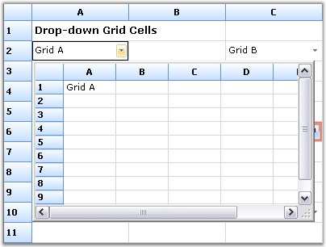

::: {style="DISPLAY: none"}
{#d2h_url_template}{#d2h_package_url style="WIDTH: 0px; DISPLAY: none; HEIGHT: 0px"}
:::

::: {.d2h_secondary_topic style="PADDING-BOTTOM: 10pt; MARGIN: 0pt; PADDING-LEFT: 0pt; PADDING-RIGHT: 0pt; PADDING-TOP: 0pt"}
##### Drop-Down Grid Cell {#drop-down-grid-cell style="tab-stops: 0pt"}

[]{style="FONT-FAMILY: 'Trebuchet MS','sans-serif'; COLOR: #15428b; FONT-SIZE: 9pt"} 

Essential Grid has flexible support for displaying drop-down grids in cells. It uses a custom cell derived from the **GridDropDownGridCellModel**/**GridDropDownGridCellRenderer** classes to display a drop-down grid. The GridDropDownGridCellModel gets an instance of the GridControlBase, and displays it through the GridDropDownGridCellRenderer.

 

The actions mentioned can be performed by using the following code examples.

[]{style="FONT-FAMILY: 'Trebuchet MS','sans-serif'; COLOR: #15428b; FONT-SIZE: 9pt"} 

1.   Using C#

[]{style="FONT-FAMILY: 'Trebuchet MS','sans-serif'; COLOR: #15428b; FONT-SIZE: 9pt"} 

+--------------------------------------------------------------------------------------------------------------------------------------------------------------------------------------------------------------------------------------------------------+
| **[\[C#\]]{style="FONT-FAMILY: 'Courier New'; COLOR: black"}**                                                                                                                                                                                         |
|                                                                                                                                                                                                                                                        |
| []{style="FONT-FAMILY: 'Courier New'; COLOR: black"}                                                                                                                                                                                                   |
|                                                                                                                                                                                                                                                        |
| [// Create and register drop-down grid cells.]{style="FONT-FAMILY: 'Courier New'; COLOR: green"}                                                                                                                                                       |
|                                                                                                                                                                                                                                                        |
| [DropDownGridCellModel]{style="FONT-FAMILY: 'Courier New'; COLOR: #2b91af"}[ aModel = [new]{style="COLOR: blue"} [DropDownGridCellModel]{style="COLOR: #2b91af"}([this]{style="COLOR: blue"}.gridControl1.Model);]{style="FONT-FAMILY: 'Courier New'"} |
|                                                                                                                                                                                                                                                        |
| [aModel.EmbeddedGrid = GridA;]{style="FONT-FAMILY: 'Courier New'"}                                                                                                                                                                                     |
|                                                                                                                                                                                                                                                        |
| [gridControl1.CellModels.Add([\"GridADropCell\"]{style="COLOR: #a31515"}, aModel);]{style="FONT-FAMILY: 'Courier New'"}                                                                                                                                |
|                                                                                                                                                                                                                                                        |
| []{style="FONT-FAMILY: 'Courier New'; COLOR: green"}                                                                                                                                                                                                   |
|                                                                                                                                                                                                                                                        |
| [// Set the drop-downs in the cell.]{style="FONT-FAMILY: 'Courier New'; COLOR: green"}                                                                                                                                                                 |
|                                                                                                                                                                                                                                                        |
| [this]{style="FONT-FAMILY: 'Courier New'; COLOR: blue"}[.gridControl1\[rowIndex,1\].Text = [\"Grid A\"]{style="COLOR: #a31515"};              ]{style="FONT-FAMILY: 'Courier New'"}                                                                    |
|                                                                                                                                                                                                                                                        |
| [this]{style="FONT-FAMILY: 'Courier New'; COLOR: blue"}[.gridControl1\[rowIndex,1\].CellType = [\"GridADropCell\"]{style="COLOR: #a31515"};]{style="FONT-FAMILY: 'Courier New'"}                                                                       |
+--------------------------------------------------------------------------------------------------------------------------------------------------------------------------------------------------------------------------------------------------------+

[]{style="FONT-FAMILY: 'Trebuchet MS','sans-serif'; COLOR: #15428b; FONT-SIZE: 9pt"} 

2.   Using VB.NET

[]{style="FONT-FAMILY: 'Trebuchet MS','sans-serif'; COLOR: #15428b; FONT-SIZE: 9pt"} 

+------------------------------------------------------------------------------------------------------------------------------------------------------------------------------------------------------------------------------------------------------+
| **[\[VB.NET\]]{style="FONT-FAMILY: 'Courier New'; COLOR: black"}**                                                                                                                                                                                   |
|                                                                                                                                                                                                                                                      |
| []{style="FONT-FAMILY: 'Courier New'; COLOR: black"}                                                                                                                                                                                                 |
|                                                                                                                                                                                                                                                      |
| [\' Create and register drop-down grid cells.]{style="FONT-FAMILY: 'Courier New'; COLOR: green"}                                                                                                                                                     |
|                                                                                                                                                                                                                                                      |
| [Dim]{style="FONT-FAMILY: 'Courier New'; COLOR: blue"}[ aModel [As]{style="COLOR: blue"} DropDownGridCellModel = [New]{style="COLOR: blue"} DropDownGridCellModel([Me]{style="COLOR: blue"}.gridControl1.Model)]{style="FONT-FAMILY: 'Courier New'"} |
|                                                                                                                                                                                                                                                      |
| [aModel.EmbeddedGrid = GridA]{style="FONT-FAMILY: 'Courier New'"}                                                                                                                                                                                    |
|                                                                                                                                                                                                                                                      |
| [gridControl1.CellModels.Add([\"GridADropCell\"]{style="COLOR: #a31515"}, aModel)]{style="FONT-FAMILY: 'Courier New'"}                                                                                                                               |
|                                                                                                                                                                                                                                                      |
| []{style="FONT-FAMILY: 'Courier New'; COLOR: green"}                                                                                                                                                                                                 |
|                                                                                                                                                                                                                                                      |
| [\' Set the drop-downs in the cell.]{style="FONT-FAMILY: 'Courier New'; COLOR: green"}                                                                                                                                                               |
|                                                                                                                                                                                                                                                      |
| [Me]{style="FONT-FAMILY: 'Courier New'; COLOR: blue"}[.gridControl1(rowIndex,1).Text = [\"Grid A\"]{style="COLOR: #a31515"}]{style="FONT-FAMILY: 'Courier New'"}                                                                                     |
|                                                                                                                                                                                                                                                      |
| [Me]{style="FONT-FAMILY: 'Courier New'; COLOR: blue"}[.gridControl1(rowIndex,1).CellType = [\"GridADropCell\"]{style="COLOR: #a31515"}]{style="FONT-FAMILY: 'Courier New'"}                                                                          |
+------------------------------------------------------------------------------------------------------------------------------------------------------------------------------------------------------------------------------------------------------+

[]{style="FONT-FAMILY: 'Trebuchet MS','sans-serif'; COLOR: #15428b; FONT-SIZE: 9pt"} 

{border="0"}

[]{style="FONT-FAMILY: 'Trebuchet MS','sans-serif'; COLOR: #15428b; FONT-SIZE: 9pt"} 

*[Figure ]{style="FONT-SIZE: 9pt"}[116]{style="FONT-SIZE: 9pt"}[: Drop-Down Grid Cell]{style="FONT-SIZE: 9pt"}*

 

[]{#p105} 

 

[]{#related-topics}
:::
